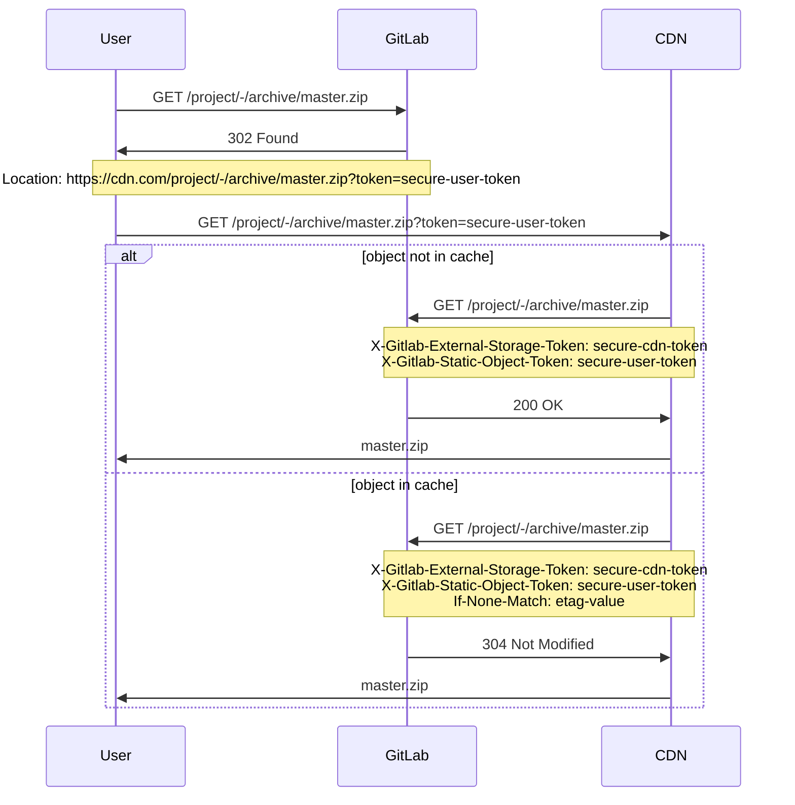

# Static objects external storage

> [Introduced](https://gitlab.com/gitlab-org/gitlab-ce/merge_requests/31025) in GitLab 12.3.

GitLab can be configured to serve repository static objects (for example, archives) from an external
storage, such as a CDN.

## Configuring

To configure external storage for static objects:

1. Navigate to **Admin Area > Settings > Repository**.
1. Expand the **Repository static objects** section.
1. Enter the base URL and an arbitrary token.

The token is required to distinguish requests coming from the external storage, so users don't
circumvent the external storage and go for the application directly. The token is expected to be
set in the `X-Gitlab-External-Storage-Token` header in requests originating from the external
storage.

## Serving private static objects

GitLab will append a user-specific token for static object URLs that belong to private projects,
so an external storage can be authenticated on behalf of the user. When processing requests originating
from the external storage, GitLab will look for the token in the `token` query parameter or in
the `X-Gitlab-Static-Object-Token` header to check the user's ability to access the requested object.

## Requests flow example

The following example shows a sequence of requests and responses between the user,
GitLab, and the CDN:

