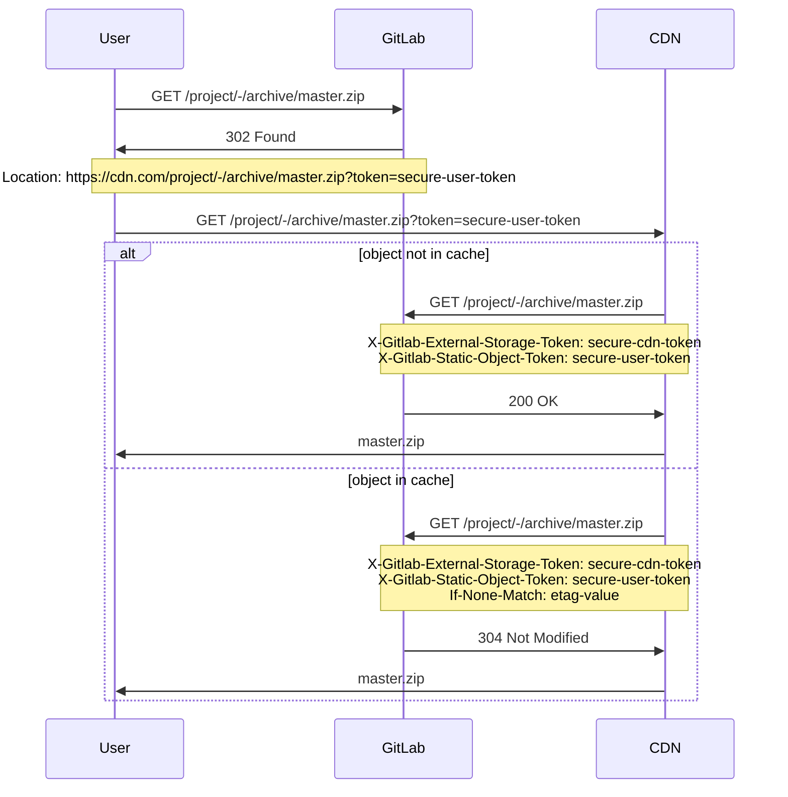

# External storage for static objects **(FREE)**

> [Introduced](https://gitlab.com/gitlab-org/gitlab-foss/-/merge_requests/31025) in GitLab 12.3.

Configure GitLab to serve repository static objects (such as archives or raw blobs) from external
storage such as a content delivery network (CDN).

## Configure external storage

To configure external storage for static objects:

1. On the top bar, select **Menu >** **{admin}** **Admin**.
1. In the left sidebar, select **Settings > Repository**.
1. Expand the **External storage for repository static objects** section.
1. Enter the base URL and an arbitrary token. When you [set up external storage](#set-up-external-storage),
   use a script that sets these values as `ORIGIN_HOSTNAME` and `STORAGE_TOKEN`.
1. Select **Save changes**.

The token is required to distinguish requests coming from the external storage, so users don't
circumvent the external storage and access the application directly. GitLab expects
this token to be set in the `X-Gitlab-External-Storage-Token` header in requests
originating from the external storage.

## Serving private static objects

GitLab appends a user-specific token for static object URLs belonging to private projects so
external storage can be authenticated on the user's behalf.

When processing requests originating
from the external storage, GitLab checks the following to confirm the user may access the requested
object:

- The `token` query parameter.
- The `X-Gitlab-Static-Object-Token` header.

## Requests flow example

The following example shows a sequence of requests and responses between:

- The user.
- GitLab.
- The content delivery network.



## Set up external storage

While this procedure uses [Cloudflare Workers](https://workers.cloudflare.com) for external storage,
other CDNs or Function as a Service (FaaS) systems should work using the same principles.

1. Choose a Cloudflare Worker domain if you haven't done so already.
1. In the following script, set the following values for the first two constants:

   - `ORIGIN_HOSTNAME`: the hostname of your GitLab installation.
   - `STORAGE_TOKEN`: any arbitrary secure token. You can get a token by running
     `pwgen -cn1 64` on a UNIX machine. Save this token for the Admin Area, as
     described in the [configuring](#configure-external-storage) section.

     ```javascript
     const ORIGIN_HOSTNAME = 'gitlab.installation.com' // FIXME: SET CORRECT VALUE
     const STORAGE_TOKEN = 'very-secure-token' // FIXME: SET CORRECT VALUE
     const CACHE_PRIVATE_OBJECTS = false

     const CORS_HEADERS = {
       'Access-Control-Allow-Origin': '*',
       'Access-Control-Allow-Methods': 'GET, HEAD, OPTIONS',
       'Access-Control-Allow-Headers': 'X-Csrf-Token, X-Requested-With',
     }

     self.addEventListener('fetch', event => event.respondWith(handle(event)))

     async function handle(event) {
       try {
         let response = await verifyAndHandle(event);

         // responses returned from cache are immutable, so we recreate them
         // to set CORS headers
         response = new Response(response.body, response)
         response.headers.set('Access-Control-Allow-Origin', '*')

         return response
       } catch (e) {
         return new Response('An error occurred!', {status: e.statusCode || 500})
       }
     }

     async function verifyAndHandle(event) {
       if (!validRequest(event.request)) {
         return new Response(null, {status: 400})
       }

       if (event.request.method === 'OPTIONS') {
         return handleOptions(event.request)
       }

       return handleRequest(event)
     }

     function handleOptions(request) {
       // Make sure the necessary headers are present
       // for this to be a valid pre-flight request
       if (
         request.headers.get('Origin') !== null &&
         request.headers.get('Access-Control-Request-Method') !== null &&
         request.headers.get('Access-Control-Request-Headers') !== null
       ) {
         // Handle CORS pre-flight request
         return new Response(null, {
           headers: CORS_HEADERS,
         })
       } else {
         // Handle standard OPTIONS request
         return new Response(null, {
           headers: {
             Allow: 'GET, HEAD, OPTIONS',
           },
         })
       }
     }

     async function handleRequest(event) {
       let cache = caches.default
       let url = new URL(event.request.url)
       let static_object_token = url.searchParams.get('token')
       let headers = new Headers(event.request.headers)

       url.host = ORIGIN_HOSTNAME
       url = normalizeQuery(url)

       headers.set('X-Gitlab-External-Storage-Token', STORAGE_TOKEN)
       if (static_object_token !== null) {
         headers.set('X-Gitlab-Static-Object-Token', static_object_token)
       }

       let request = new Request(url, { headers: headers })
       let cached_response = await cache.match(request)
       let is_conditional_header_set = headers.has('If-None-Match')

       if (cached_response) {
         return cached_response
       }

       // We don't want to override If-None-Match that is set on the original request
       if (cached_response && !is_conditional_header_set) {
         headers.set('If-None-Match', cached_response.headers.get('ETag'))
       }

       let response = await fetch(request, {
         headers: headers,
         redirect: 'manual'
       })

       if (response.status == 304) {
         if (is_conditional_header_set) {
           return response
         } else {
           return cached_response
         }
       } else if (response.ok) {
         response = new Response(response.body, response)

         // cache.put will never cache any response with a Set-Cookie header
         response.headers.delete('Set-Cookie')

         if (CACHE_PRIVATE_OBJECTS) {
           response.headers.delete('Cache-Control')
         }

         event.waitUntil(cache.put(request, response.clone()))
       }

       return response
     }

     function normalizeQuery(url) {
       let searchParams = url.searchParams
       url = new URL(url.toString().split('?')[0])

       if (url.pathname.includes('/raw/')) {
         let inline = searchParams.get('inline')

         if (inline == 'false' || inline == 'true') {
           url.searchParams.set('inline', inline)
         }
       } else if (url.pathname.includes('/-/archive/')) {
         let append_sha = searchParams.get('append_sha')
         let path = searchParams.get('path')

         if (append_sha == 'false' || append_sha == 'true') {
           url.searchParams.set('append_sha', append_sha)
         }
         if (path) {
           url.searchParams.set('path', path)
         }
       }

       return url
     }

     function validRequest(request) {
       let url = new URL(request.url)
       let path = url.pathname

       if (/^(.+)(\/raw\/|\/-\/archive\/)/.test(path)) {
         return true
       }

       return false
     }
     ```

1. Create a new worker with this script.
1. Copy your values for `ORIGIN_HOSTNAME` and `STORAGE_TOKEN`.
   Use those values [to configure external storage for static objects](#configure-external-storage).
