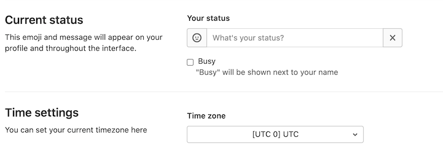

# Changing your time zone **(FREE SELF)**

The global time zone configuration parameter can be changed in `config/gitlab.yml`:

```plaintext
# time_zone: 'UTC'
```

Uncomment and customize if you want to change the default time zone of the GitLab application.

## Viewing available timezones

To see all available time zones, run `bundle exec rake time:zones:all`.

For Omnibus installations, run `gitlab-rake time:zones:all`.

NOTE:
This Rake task does not list timezones in TZInfo format required by Omnibus GitLab during a reconfigure: [#27209](https://gitlab.com/gitlab-org/gitlab/-/issues/27209).

## Changing time zone in Omnibus installations

GitLab defaults its time zone to UTC. It has a global timezone configuration parameter in `/etc/gitlab/gitlab.rb`.

To obtain a list of timezones, log in to your GitLab application server and run a command that generates a list of timezones in TZInfo format for the server. For example, install `timedatectl` and run `timedatectl list-timezones`.

To update, add the timezone that best applies to your location. For example:

```ruby
gitlab_rails['time_zone'] = 'America/New_York'
```

After adding the configuration parameter, reconfigure and restart your GitLab instance:

```shell
gitlab-ctl reconfigure
gitlab-ctl restart
```

## Changing time zone per user

To allow users to change the time zone in their profile, the feature flag `user_time_settings` should be enabled:

1. [Start a Rails console session](operations/rails_console.md).
1. Enable the feature flag:

   ```ruby
   Feature.enable(:user_time_settings)
   ```

1. You should now be able to see the timezone dropdown in the users' **Settings > Profile** page.

   
