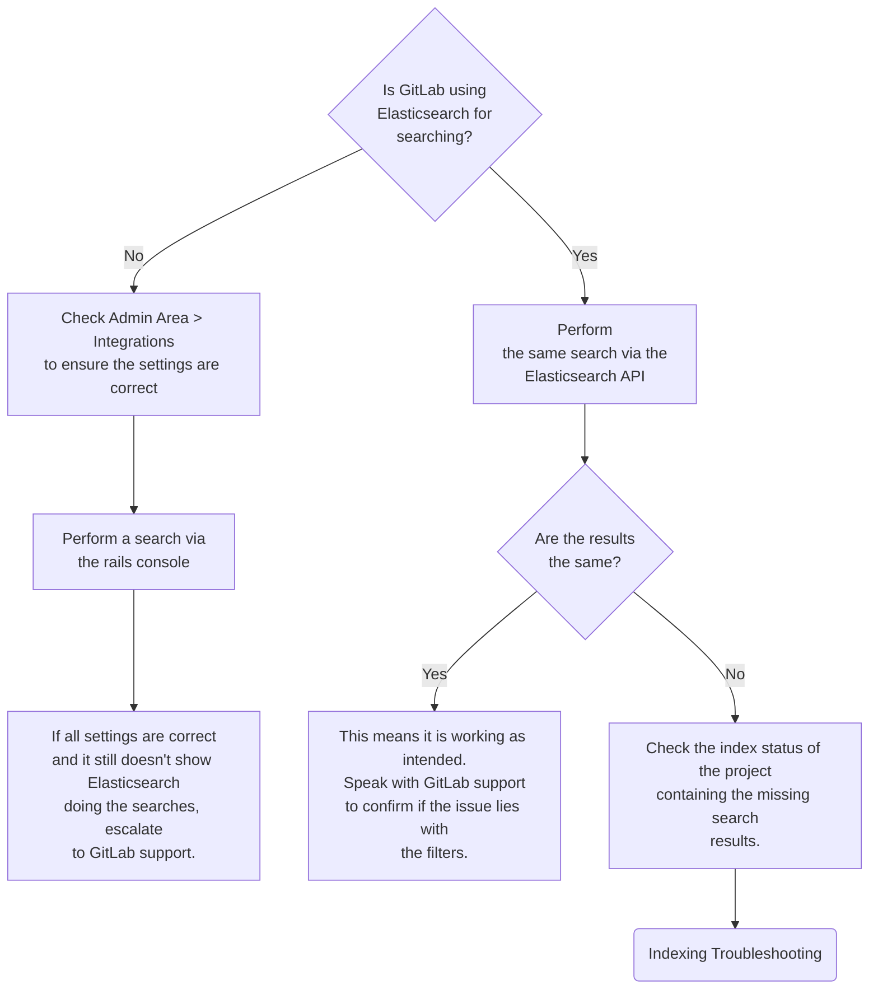
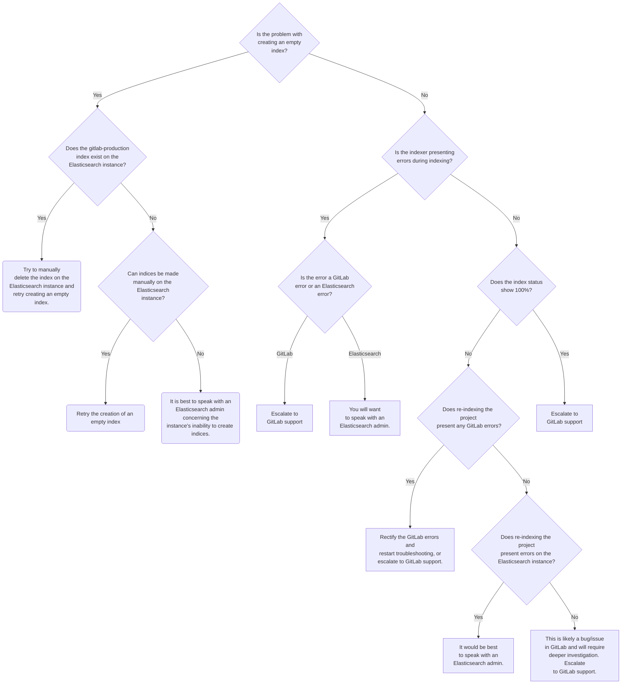
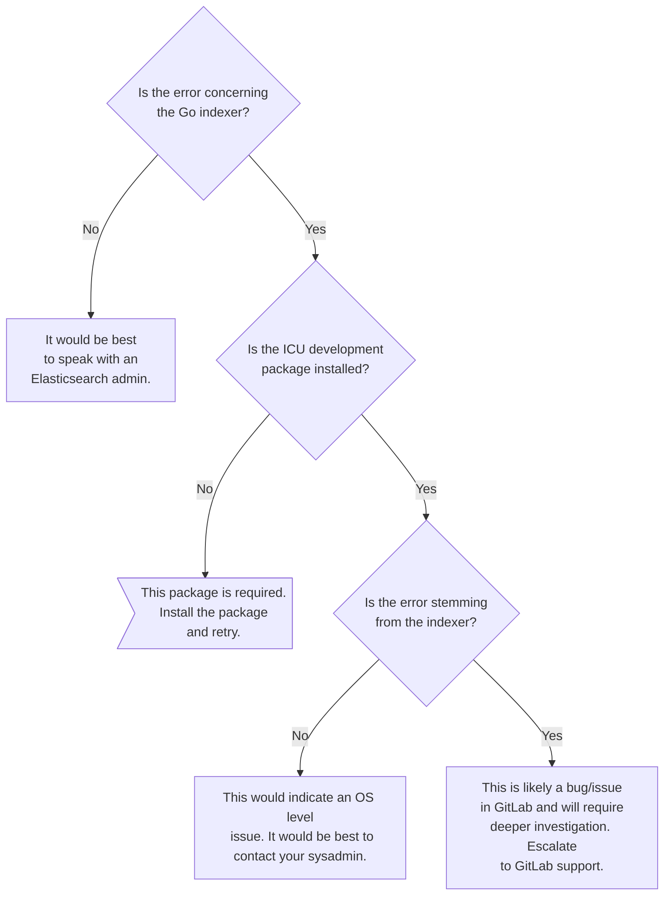
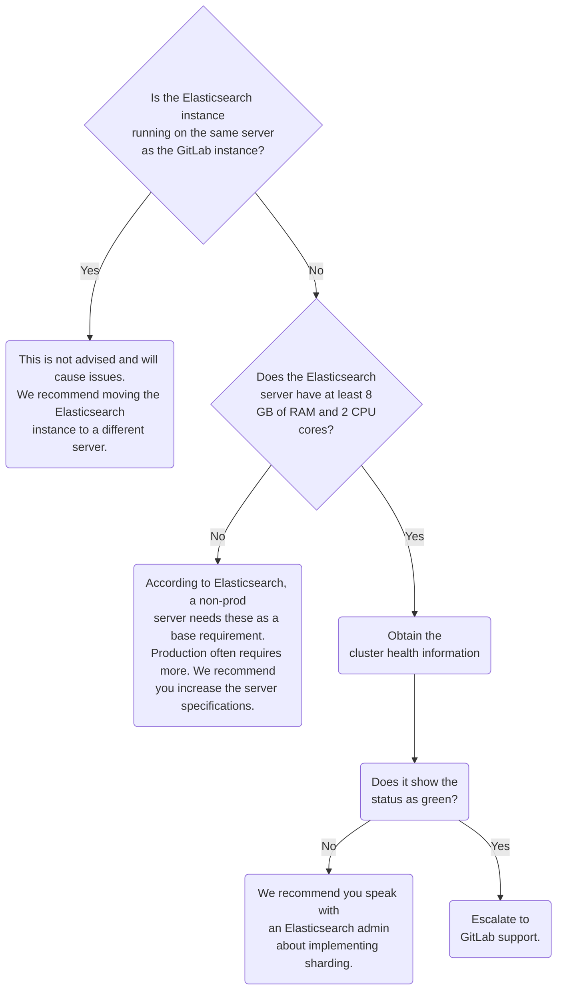

# Troubleshooting Elasticsearch

Troubleshooting Elasticsearch requires:

- Knowledge of common terms.
- Establishing within which category the problem fits.

## Common terminology

- **Lucene**: A full-text search library written in Java.
- **Near Realtime (NRT)**: Refers to the slight latency from the time to index a
  document to the time when it becomes searchable.
- **Cluster**: A collection of one or more nodes that work together to hold all
  the data, providing indexing and search capabilities.
- **Node**: A single server that works as part of a cluster.
- **Index**: A collection of documents that have somewhat similar characteristics.
- **Document**: A basic unit of information that can be indexed.
- **Shards**: Fully-functional and independent subdivisions of indices. Each shard is actually
  a Lucene index.
- **Replicas**: Failover mechanisms that duplicate indices.

## Troubleshooting workflows

The type of problem will determine what steps to take. The possible troubleshooting workflows are for:

- Search results.
- Indexing.
- Integration.
- Performance.

### Search Results workflow

The following workflow is for Elasticsearch search results issues:



### Indexing workflow

The following workflow is for Elasticsearch indexing issues:



### Integration workflow

The following workflow is for Elasticsearch integration issues:



### Performance workflow

The following workflow is for Elasticsearch performance issues:



## Troubleshooting walkthrough

Most Elasticsearch troubleshooting can be broken down into 4 categories:

- [Troubleshooting search results](#troubleshooting-search-results)
- [Troubleshooting indexing](#troubleshooting-indexing)
- [Troubleshooting integration](#troubleshooting-integration)
- [Troubleshooting performance](#troubleshooting-performance)

Generally speaking, if it does not fall into those four categories, it is either:

- Something GitLab support needs to look into.
- Not a true Elasticsearch issue.

Exercise caution. Issues that appear to be Elasticsearch problems can be OS-level issues.

### Troubleshooting search results

Troubleshooting search result issues is rather straight forward on Elasticsearch.

The first step is to confirm GitLab is using Elasticsearch for the search function.
To do this:

1. Confirm the integration is enabled in **Admin Area > Settings > Integrations**.
1. Confirm searches utilize Elasticsearch by accessing the rails console
   (`sudo gitlab-rails console`) and running the following commands:

   ```rails
   u = User.find_by_email('email_of_user_doing_search')
   s = SearchService.new(u, {:search => 'search_term'})
   pp s.search_objects.class.name
   ```

The output from the last command is the key here. If it shows:

- `ActiveRecord::Relation`, **it is not** using Elasticsearch.
- `Kaminari::PaginatableArray`, **it is** using Elasticsearch.

| Not using Elasticsearch  | Using Elasticsearch          |
|--------------------------|------------------------------|
| `ActiveRecord::Relation` | `Kaminari::PaginatableArray` |

If all the settings look correct and it is still not using Elasticsearch for the search function, it is best to escalate to GitLab support. This could be a bug/issue.

Moving past that, it is best to attempt the same search using the [Elasticsearch Search API](https://www.elastic.co/guide/en/elasticsearch/reference/current/search-search.html) and compare the results from what you see in GitLab.

If the results:

- Sync up, then there is not a technical "issue" per se. Instead, it might be a problem
  with the Elasticsearch filters we are using. This can be complicated, so it is best to
  escalate to GitLab support to check these and guide you on the potential on whether or
  not a feature request is needed.
- Do not match up, this indicates a problem with the documents generated from the
  project. It is best to re-index that project and proceed with
  [Troubleshooting indexing](#troubleshooting-indexing).

### Troubleshooting indexing

Troubleshooting indexing issues can be tricky. It can pretty quickly go to either GitLab
support or your Elasticsearch admin.

The best place to start is to determine if the issue is with creating an empty index.
If it is, check on the Elasticsearch side to determine if the `gitlab-production` (the
name for the GitLab index) exists. If it exists, manually delete it on the Elasticsearch
side and attempt to recreate it from the
[`create_empty_index`](../../integration/elasticsearch.md#gitlab-elasticsearch-rake-tasks)
rake task.

If you still encounter issues, try creating an index manually on the Elasticsearch
instance. The details of the index aren't important here, as we want to test if indices
can be made. If the indices:

- Cannot be made, speak with your Elasticsearch admin.
- Can be made, Escalate this to GitLab support.

If the issue is not with creating an empty index, the next step is to check for errors
during the indexing of projects. If errors do occur, they will either stem from the indexing:

- On the GitLab side. You need to rectify those. If they are not
  something you are familiar with, contact GitLab support for guidance.
- Within the Elasticsearch instance itself. See if the error is [documented and has a fix](../../integration/elasticsearch.md#troubleshooting). If not, speak with your Elasticsearch admin.

If the indexing process does not present errors, you will want to check the status of the indexed projects. You can do this via the following rake tasks:

- [`sudo gitlab-rake gitlab:elastic:index_projects_status`](../../integration/elasticsearch.md#gitlab-elasticsearch-rake-tasks) (shows the overall status)
- [`sudo gitlab-rake gitlab:elastic:projects_not_indexed`](../../integration/elasticsearch.md#gitlab-elasticsearch-rake-tasks) (shows specific projects that are not indexed)

If:

- Everything is showing at 100%, escalate to GitLab support. This could be a potential
  bug/issue.
- You do see something not at 100%, attempt to reindex that project. To do this,
  run `sudo gitlab-rake gitlab:elastic:index_projects ID_FROM=<project ID> ID_TO=<project ID>`.

If reindexing the project shows:

- Errors on the GitLab side, escalate those to GitLab support.
- Elasticsearch errors or doesn't present any errors at all, reach out to your
  Elasticsearch admin to check the instance.

### Troubleshooting integration

Troubleshooting integration tends to be pretty straight forward, as there really isn't
much to "integrate" here.

If the issue is:

- With the Go indexer, check if the ICU development package is installed.
  This is a required package so make sure you install it.
  Go indexer was a beta indexer which can be optionally turned on/off, but in 12.3 it reached stable status and is now the default.
- Not concerning the Go indexer, it is almost always an
  Elasticsearch-side issue. This means you should reach out to your Elasticsearch admin
  regarding the error(s) you are seeing. If you are unsure here, it never hurts to reach
  out to GitLab support.

Beyond that, you will want to review the error. If it is:

- Specifically from the indexer, this could be a bug/issue and should be escalated to
  GitLab support.
- An OS issue, you will want to reach out to your systems administrator.

### Troubleshooting performance

Troubleshooting performance can be difficult on Elasticsearch. There is a ton of tuning
that *can* be done, but the majority of this falls on shoulders of a skilled
Elasticsearch administrator.

Generally speaking, ensure:

- The Elasticsearch server **is not** running on the same node as GitLab.
- The Elasticsearch server have enough RAM and CPU cores.
- That sharding **is** being used.

Going into some more detail here, if Elasticsearch is running on the same server as GitLab, resource contention is **very** likely to occur. Ideally, Elasticsearch, which requires ample resources, should be running on its own server (maybe coupled with logstash and kibana).

When it comes to Elasticsearch, RAM is the key resource. Elasticsearch themselves recommend:

- **At least** 8 GB of RAM for a non-production instance.
- **At least** 16 GB of RAM for a production instance.
- Ideally, 64 GB of RAM.

For CPU, Elasticsearch recommends at least 2 CPU cores, but Elasticsearch states common
setups use up to 8 cores. For more details on server specs, check out
[Elasticsearch's hardware guide](https://www.elastic.co/guide/en/elasticsearch/guide/current/hardware.html).

Beyond the obvious, sharding comes into play. Sharding is a core part of Elasticsearch.
It allows for horizontal scaling of indices, which is helpful when you are dealing with
a large amount of data.

With the way GitLab does indexing, there is a **huge** amount of documents being
indexed. By utilizing sharding, you can speed up Elasticsearch's ability to locate
data, since each shard is a Lucene index.

If you are not using sharding, you are likely to hit issues when you start using
Elasticsearch in a production environment.

Keep in mind that an index with only one shard has **no scale factor** and will
likely encounter issues when called upon with some frequency.

If you need to know how many shards, read
[Elasticsearch's documentation on capacity planning](https://www.elastic.co/guide/en/elasticsearch/guide/2.x/capacity-planning.html),
as the answer is not straight forward.

The easiest way to determine if sharding is in use is to check the output of the
[Elasticsearch Health API](https://www.elastic.co/guide/en/elasticsearch/reference/current/cluster-health.html):

- Red means the cluster is down.
- Yellow means it is up with no sharding/replication.
- Green means it is healthy (up, sharding, replicating).

For production use, it should always be green.

Beyond these steps, you get into some of the more complicated things to check,
such as merges and caching. These can get complicated and it takes some time to
learn them, so it is best to escalate/pair with an Elasticsearch expert if you need to
dig further into these.

Feel free to reach out to GitLab support, but this is likely to be something a skilled
Elasticsearch admin has more experience with.

## Common issues

All common issues [should be documented](../../integration/elasticsearch.md#troubleshooting). If not,
feel free to update that page with issues you encounter and solutions.

## Replication

Setting up Elasticsearch isn't too bad, but it can be a bit finnicky and time consuming.

The easiest method is to spin up a docker container with the required version and
bind ports 9200/9300 so it can be used.

The following is an example of running a docker container of Elasticsearch v7.2.0:

```bash
docker pull docker.elastic.co/elasticsearch/elasticsearch:7.2.0
docker run -p 9200:9200 -p 9300:9300 -e "discovery.type=single-node" docker.elastic.co/elasticsearch/elasticsearch:7.2.0
```

From here, you can:

- Grab the IP of the docker container (use `docker inspect <container_id>`)
- Use `<IP.add.re.ss:9200>` to communicate with it.

This is a quick method to test out Elasticsearch, but by no means is this a
production solution.
