# Troubleshooting Group SAML and SCIM **(SILVER ONLY)**

These are notes and screenshots regarding Group SAML and SCIM that the GitLab Support Team sometimes uses while troubleshooting, but which do not fit into the official documentation. GitLab is making this public, so that anyone can make use of the Support team’s collected knowledge.

Please refer to GitLab's [Group SAML](../../user/group/saml_sso/index.md) docs for information on the feature and how to set it up.

When troubleshooting a SAML configuration, GitLab team members will frequently start with the [SAML troubleshooting section](../../user/group/saml_sso/index.md#troubleshooting).

They may then set up a test configuration of the desired identity provider. We include example screenshots in this section.

## SAML and SCIM screenshots

This section includes relevant screenshots of the following example configurations of [Group SAML](../../user/group/saml_sso/index.md) and [Group SCIM](../../user/group/saml_sso/scim_setup.md):

- [Azure Active Directory](#azure-active-directory)
- [OneLogin](#onelogin)

CAUTION: **Caution:**
These screenshots are updated only as needed by GitLab Support. They are **not** official documentation.

If you are currently having an issue with GitLab, you may want to check your [support options](https://about.gitlab.com/support/).

## Azure Active Directory

Basic SAML app configuration:

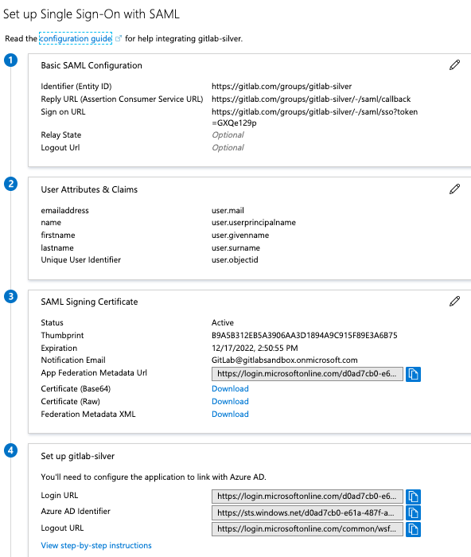

User claims and attributes:

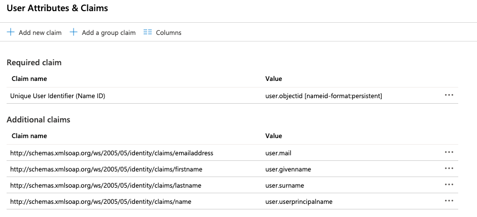

SCIM mapping:

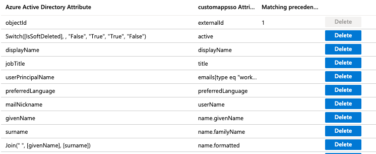

## Okta

Basic SAML app configuration:

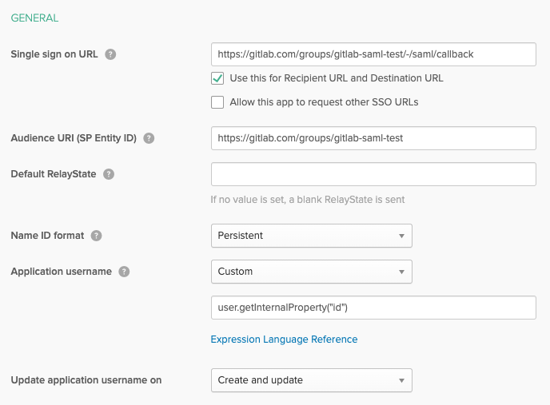

User claims and attributes:

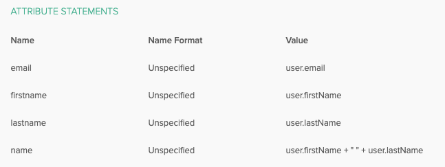

Advanced SAML app settings (defaults):

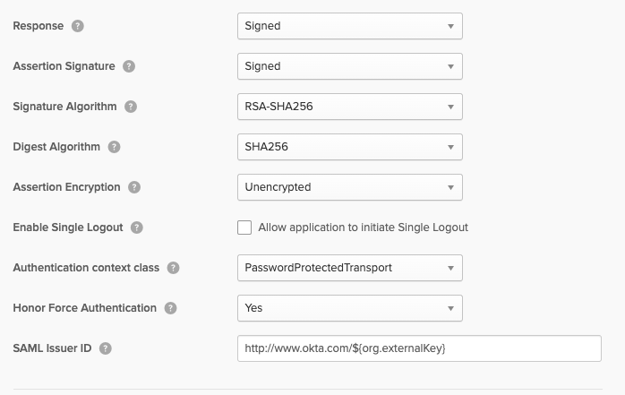

IdP Links and Certificate:

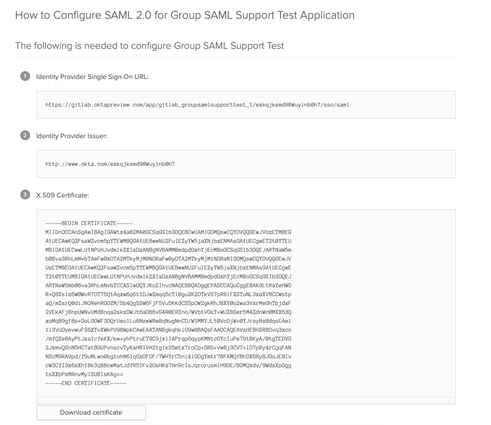

## OneLogin

Application details:

Parameters:

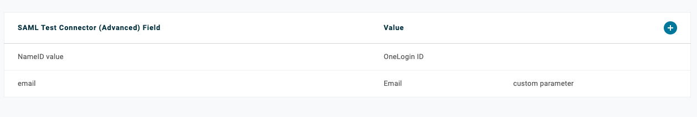

Adding a user:

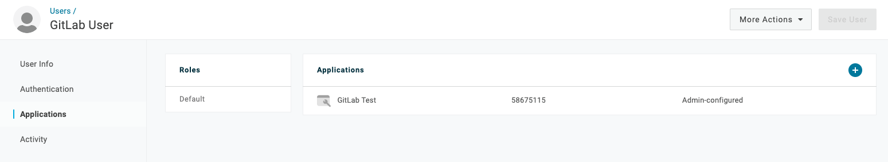

SSO settings:

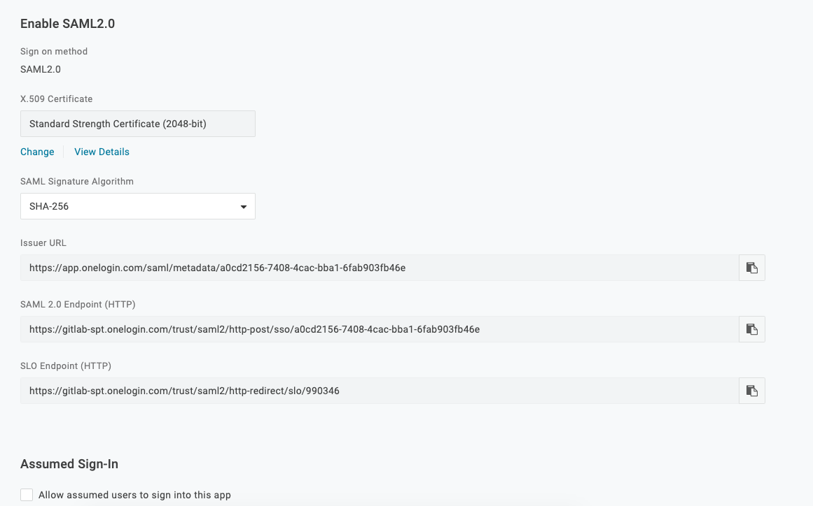

## ADFS

Setup SAML SSO URL:

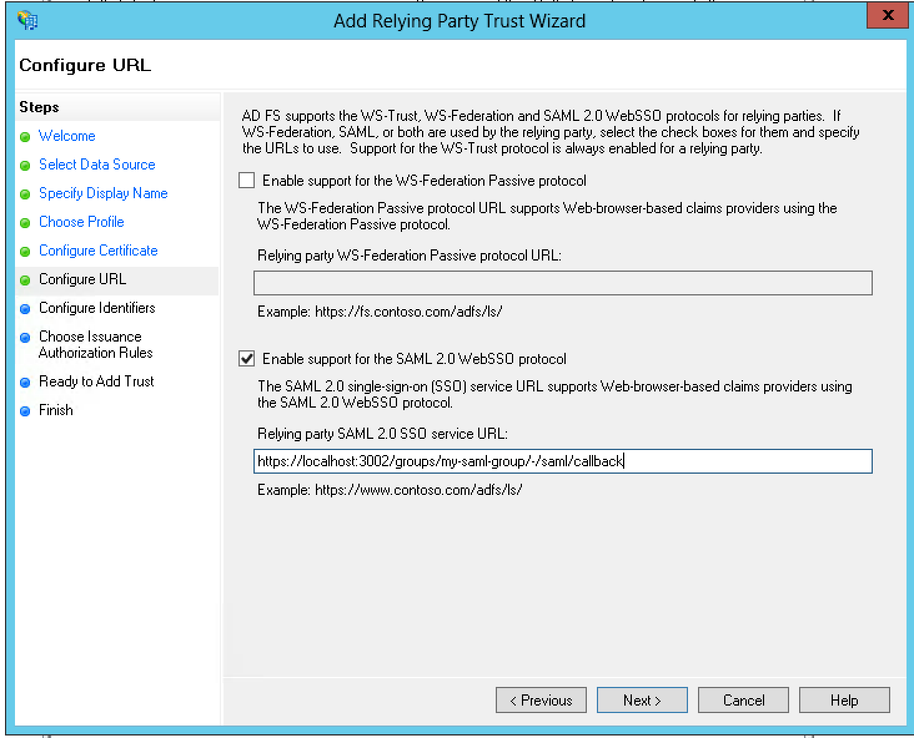

Configure Assertions:

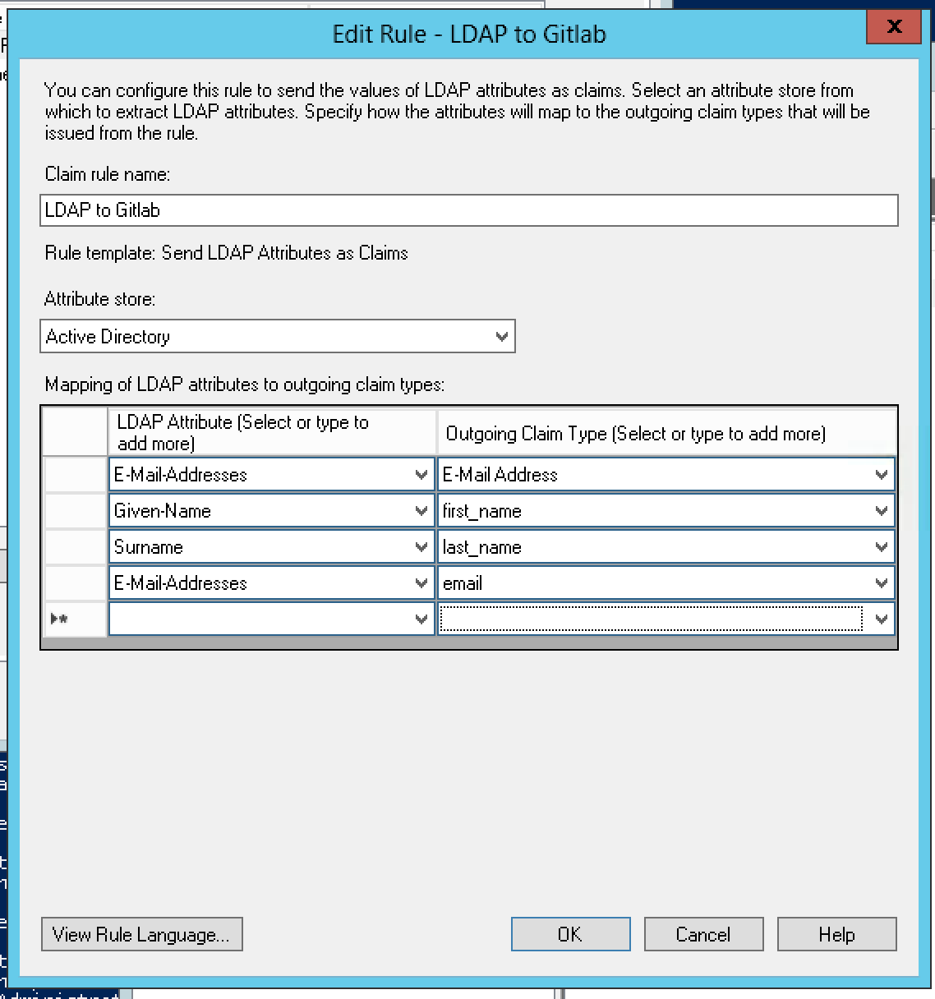

Configure NameID:

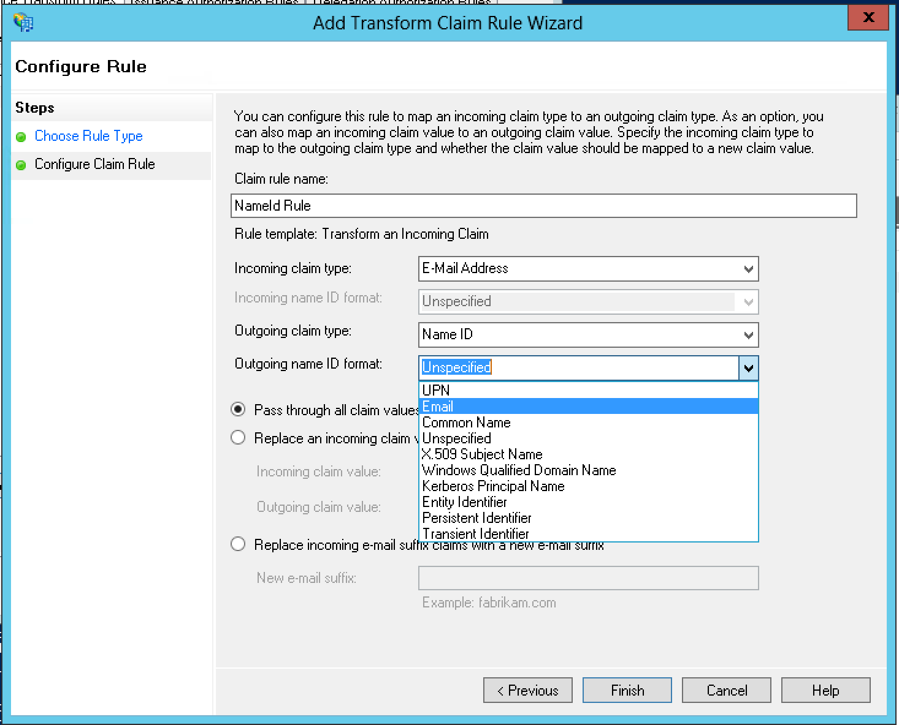

Determine Certificate Fingerprint:

| Via UI | Via Shell |
|--------|-----------|
| 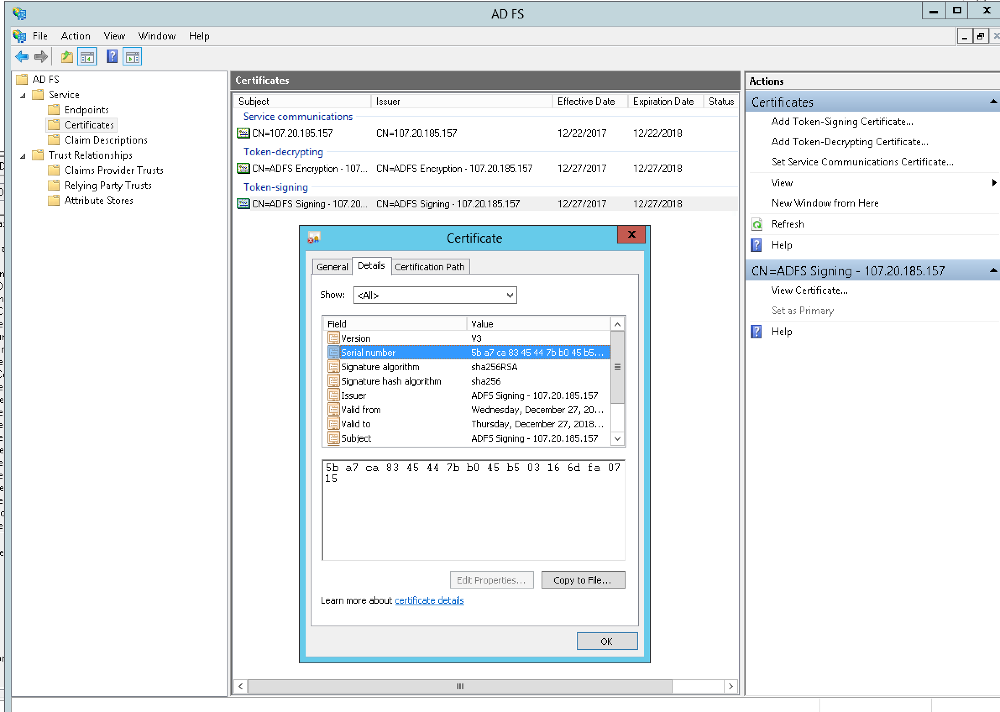 | 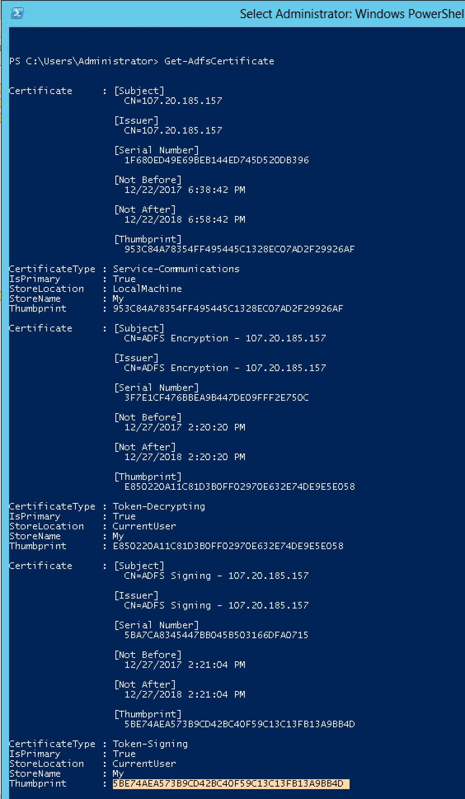 |
