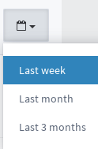
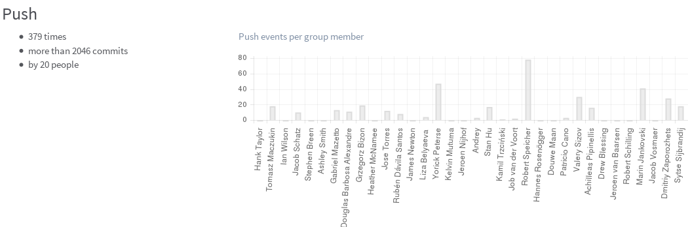
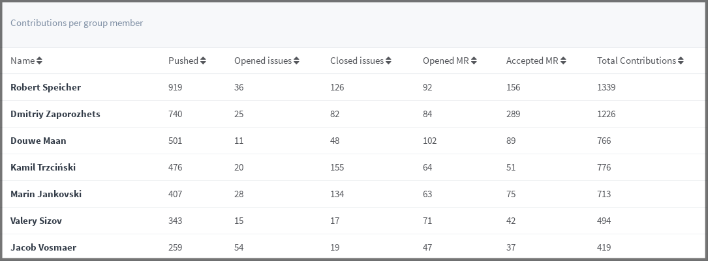

# Contribution Analytics (EE only)

_**Note:** This feature was introduced in GitLab EE 8.3._

With contribution analytics you can have an overview for the activity of
issues, merge requests and push events of your organization and its members.

The analytics page is located at **Group > Contribution Analytics**
under the URL `/groups/<groupname>/analytics`.

The time period on which the analytics depend on, is spanned in three sections:
last week, last month and last three months. You can choose which one to
display by using the dropdown calendar menu in the upper right corner.

---

There are three main bar graphs that are deducted from the number of
contributions per group member. These contributions include push events, merge
requests and closed issues. Hovering on each bar you can see the number of
events for a specific member.

Below is an example of the push events of the
[gitlab-org](https://gitlab.com/groups/gitlab-org/analytics) group.

---

Apart from the bar graphs you can also see the contributions per group member
which are depicted in a table that can be sorted by:

* Member name
* Number of pushed events
* Number of opened issues
* Number of closed issues
* Number of opened MRs
* Number of accepted MRs
* Number of total contributions

