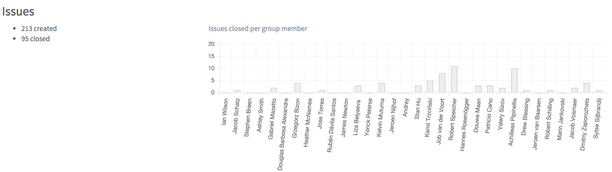

# Contribution Analytics (EE only)

In order to make it easy to see how and where are active in your projects,
we’re building contribution analytics for GitLab Enterprise Edition.

In GitLab 8.3, you can now quickly get an overview of activity of a group by going to **Group -> Contribution Analytics** at `/groups/groupname/analytics`.

