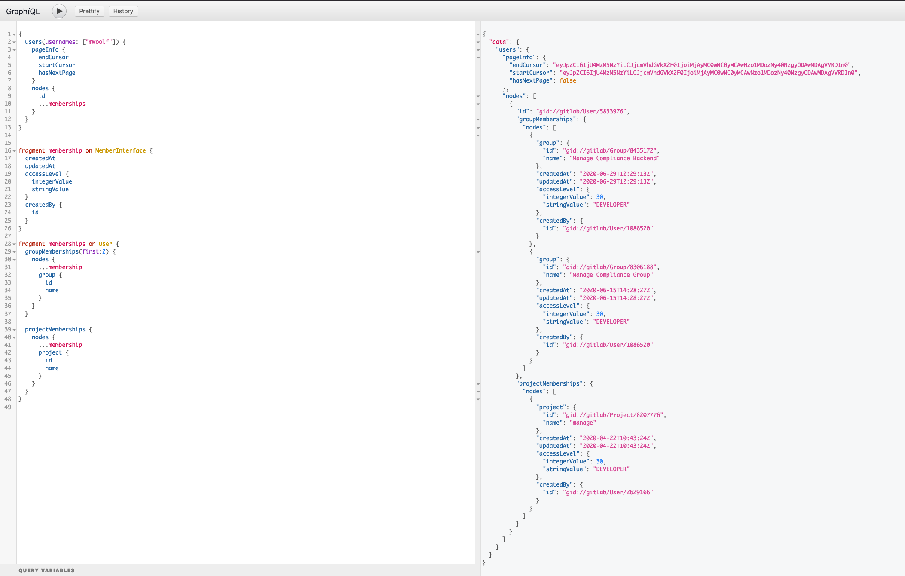

# Set up an Audit Report with GraphQL

This page describes how you can use the GraphiQL explorer to set up an audit report
for a specific subset of users.

You can run the same query directly via a HTTP endpoint, using `cURL`. For more information, see our
guidance on getting started from the [command line](getting_started.md#command-line).

The [example users query](#set-up-the-graphiql-explorer) looks for a subset of users in
a GitLab instance either by username or
[Global ID](../../development/api_graphql_styleguide.md#global-ids).
The query includes:

- [`pageInfo`](#pageinfo)
- [`nodes`](#nodes)

## pageInfo

This contains the data needed to implement pagination. GitLab uses cursor-based
[pagination](getting_started.md#pagination). For more information, see
[Pagination](https://graphql.org/learn/pagination/) in the GraphQL documentation.

## nodes

In a GraphQL query, `nodes` is used to represent a collection of [`nodes` on a graph](https://en.wikipedia.org/wiki/Vertex_(graph_theory)).
In this case, the collection of nodes is a collection of `User` objects. For each one,
we output:

- Their user's `id`.
- The `membership` fragment, which represents a Project or Group membership belonging
  to that user. Outputting a fragment is denoted with the `...memberships` notation.

The GitLab GraphQL API is extensive and a large amount of data for a wide variety of entities can be output.
See the official [reference documentation](reference/index.md) for the most up-to-date information.

## Set up the GraphiQL explorer

This procedure presents a substantive example that you can copy and paste into GraphiQL
explorer. GraphiQL explorer is available for:

- GitLab.com users at [https://gitlab.com/-/graphql-explorer](https://gitlab.com/-/graphql-explorer).
- Self-managed users at `https://gitlab.example.com/-/graphql-explorer`.

1. Copy the following code excerpt:

   ```graphql
   {
     users(usernames: ["user1", "user2", "user3"]) {
       pageInfo {
         endCursor
         startCursor
         hasNextPage
       }
       nodes {
         id
         ...memberships
       }
     }
   }

   fragment membership on MemberInterface {
     createdAt
     updatedAt
     accessLevel {
       integerValue
       stringValue
     }
     createdBy {
       id
     }
   }

   fragment memberships on User {
     groupMemberships {
       nodes {
         ...membership
         group {
           id
           name
         }
       }
     }

     projectMemberships {
       nodes {
         ...membership
         project {
           id
           name
         }
       }
     }
   }
   ```

1. Open the [GraphiQL explorer tool](https://gitlab.com/-/graphql-explorer).
1. Paste the `query` listed above into the left window of your GraphiQL explorer tool.
1. Click Play to get the result shown here:



NOTE:
[The GraphQL API returns a GlobalID, rather than a standard ID.](getting_started.md#queries-and-mutations) It also expects a GlobalID as an input rather than
a single integer.

This GraphQL query returns the groups and projects that the user has been *explicitly* made a member of.
Since the GraphiQL explorer uses the session token to authorize access to resources,
the output is limited to the projects and groups accessible to the currently signed-in user.

If you've signed in as an instance administrator, you would have access to all records, regardless of ownership.

For more information on:

- GraphQL specific entities, such as Fragments and Interfaces, see the official
  [GraphQL documentation](https://graphql.org/learn/).
- Individual attributes, see the [GraphQL API Resources](reference/index.md).
