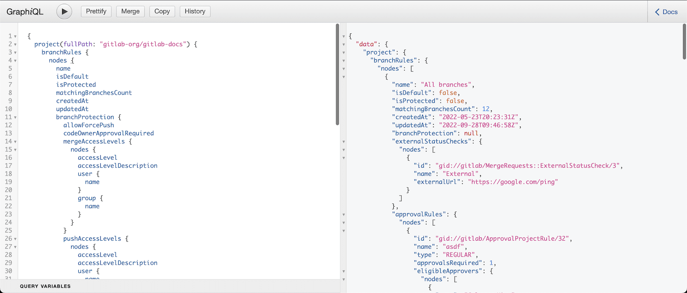

# List branch rules for a project

DETAILS:
**Tier:** Free, Premium, Ultimate
**Offering:** GitLab.com, Self-managed, GitLab Dedicated

> - [Introduced](https://gitlab.com/gitlab-org/gitlab/-/merge_requests/106954) in GitLab 15.8.

This guide demonstrates how to use [GraphiQL explorer](getting_started.md#graphiql)
to query for branch rules in a given project.

The [example query](#set-up-the-graphiql-explorer) looks for a project in a
GitLab instance either by its full path for example `gitlab-org/gitlab-docs`.
In the query we request all configured branch rules for a project.

NOTE:
You can run the same query directly via a HTTP endpoint, using `cURL`. For more
information, see our guidance on getting started from the
[command line](getting_started.md#command-line).

## Set up the GraphiQL explorer

This procedure presents a substantive example that you can copy and paste into your own
instance of the [GraphiQL explorer](https://gitlab.com/-/graphql-explorer):

1. Copy the following code excerpt:

   ```graphql
   query {
     project(fullPath: "gitlab-org/gitlab-docs") {
       branchRules {
         nodes {
           name
           isDefault
           isProtected
           matchingBranchesCount
           createdAt
           updatedAt
           branchProtection {
             allowForcePush
             codeOwnerApprovalRequired
             mergeAccessLevels {
               nodes {
                 accessLevel
                 accessLevelDescription
                 user {
                   name
                 }
                 group {
                   name
                 }
               }
             }
             pushAccessLevels {
               nodes {
                 accessLevel
                 accessLevelDescription
                 user {
                   name
                 }
                 group {
                   name
                 }
               }
             }
             unprotectAccessLevels {
               nodes {
                 accessLevel
                 accessLevelDescription
                 user {
                   name
                 }
                 group {
                   name
                 }
               }
             }
           }
           externalStatusChecks {
             nodes {
               id
               name
               externalUrl
             }
           }
           approvalRules {
             nodes {
               id
               name
               type
               approvalsRequired
               eligibleApprovers {
                 nodes {
                   name
                 }
               }
             }
           }
         }
       }
     }
   }
   ```

1. Open the [GraphiQL explorer tool](https://gitlab.com/-/graphql-explorer).
1. Paste the `query` listed above into the left window of your GraphiQL explorer tool.
1. Select **Play** to get this result:

   

If no branch rules are displayed, it may be because:

- No branch rules are configured.
- Your role doesn't have permission to view branch rules. Administrators have access to all records.

## Run the query in the GDK

Instead of requesting access, it may be easier for you to run the query in the
[GitLab Development Kit (GDK)](https://gitlab.com/gitlab-org/gitlab-development-kit).

1. Sign in as the default admin, `root`, with the credentials from
   [the GDK documentation](https://gitlab.com/gitlab-org/gitlab-development-kit/-/blob/main/doc/gdk_commands.md#get-the-login-credentials).
1. Ensure you have some branch rules configured for the `flightjs/Flight` project.
1. Replace the full path in the query:

   ```graphql
   query {
     project(fullPath: "flightjs/Flight") {
   ```

1. In your GDK instance, visit the GraphiQL explorer tool: `http://gdk.test:3000/-/graphql-explorer`.
1. Paste the `query` listed above into the left window of your GraphiQL explorer tool.
1. Select **Play** to view the result.

For more information on each field, see the [GraphQL API Resources](reference/index.md).
