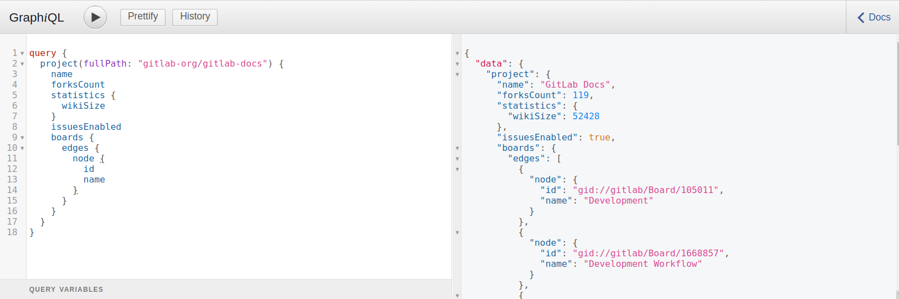

# Identify issue boards with GraphQL **(FREE)**

This page describes how you can use the GraphiQL explorer to identify
existing [issue boards](../../user/project/issue_board.md) in the `gitlab-docs` documentation repository.

## Set up the GraphiQL explorer

This procedure presents a substantive example that you can copy and paste into your own
instance of the [GraphiQL explorer](https://gitlab.com/-/graphql-explorer):

1. Copy the following code excerpt:

   ```graphql
   query {
     project(fullPath: "gitlab-org/gitlab-docs") {
       name
       forksCount
       statistics {
         wikiSize
       }
       issuesEnabled
       boards {
         nodes {
           id
           name
         }
       }
     }
   }
   ```

1. Open the [GraphiQL Explorer](https://gitlab.com/-/graphql-explorer) page.
1. Paste the `query` listed above into the left window of your GraphiQL explorer tool.
1. Click Play to get the result shown here:



If you want to view one of these boards, take one of the numeric identifiers shown in the output. From the screenshot, the first identifier is `105011`. Navigate to the following URL, which includes the identifier:

```markdown
https://gitlab.com/gitlab-org/gitlab-docs/-/boards/105011
```

For more information on each attribute, see the [GraphQL API Resources](reference/index.md).
