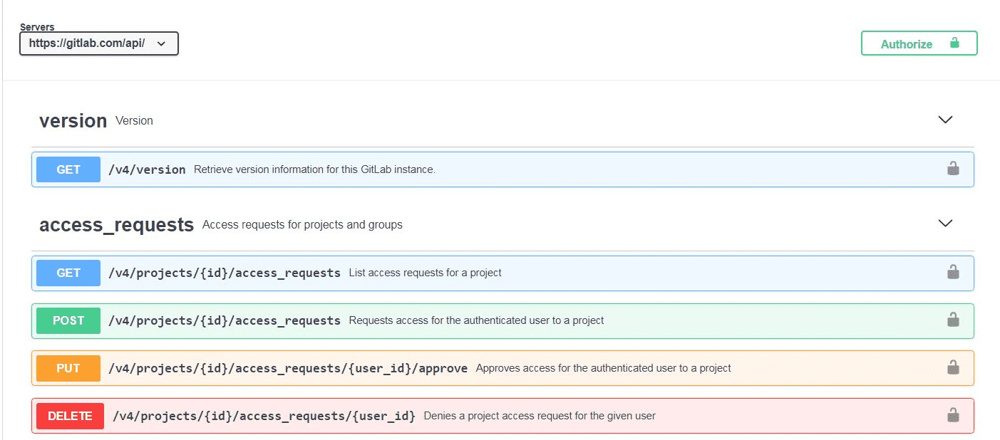

Introduces the interactive documentation tool for the GitLab API.

## About the OpenAPI specification

The [OpenAPI specification](https://swagger.io/specification/) (formerly called Swagger) defines a
standard, language-agnostic interface to RESTful APIs. OpenAPI definition files are written in the
YAML format, which is automatically rendered by the GitLab browser into a more human-readable interface.

For general information about the GitLab APIs, see [API Docs](../_index.md).

## Overview

<!--
The following link is absolute rather than relative because it needs to be viewed through the GitLab
Open API file viewer: https://docs.gitlab.com/ee/user/project/repository/index.html#openapi-viewer.
-->
The [interactive API documentation tool](https://gitlab.com/gitlab-org/gitlab/-/blob/master/doc/api/openapi/openapi.yaml)
allows API testing directly on the GitLab.com website. Only a few of the available endpoints are
documented with the OpenAPI spec, but the current list demonstrates the functionality of the tool.

## Endpoint parameters

When you expand an endpoint listing, you see a description, input parameters (if required),
and example server responses. Some parameters include a default or a list of allowed values.

## Starting an interactive session

A [personal access token](../../user/profile/personal_access_tokens.md) (PAT) is one way to
start an interactive session. To do this, select **Authorize** from the main page, and a
dialog box prompts you to enter your PAT, which is valid for the current web session.

To test the endpoint, first select **Try it out** on the endpoint definition page. Input the parameters
as required, then select **Execute**. In the following example, we executed a request for the `version`
endpoint (no parameters required). The tool shows the `curl` command and URL of the request, followed
by the server responses that are returned. You can create new responses by editing the relevant parameters
and then select **Execute** once again.

## Vision

The API code is the single source of truth, and the API documentation should be tightly coupled to its implementation. The OpenAPI specification provides a standardized and comprehensive way to document APIs. It should be the go-to format for documenting the GitLab REST API. This will result in more accurate, reliable, and user-friendly documentation that enhances the overall experience of using the GitLab REST API.

To achieve this it should be a requirement to update the OpenAPI specification with every API code change. By doing so, we ensure that the documentation is always up-to-date and accurate, reducing the risk of confusion as well as errors for our users.

The OpenAPI documentation should be autogenerated from the API code, so that it is easy to keep it up to date and accurate. This will save time and effort for our documentation team.

You can follow the current progress of this vision in the [Document the REST API in OpenAPI V2 epic](https://gitlab.com/groups/gitlab-org/-/epics/8926).
