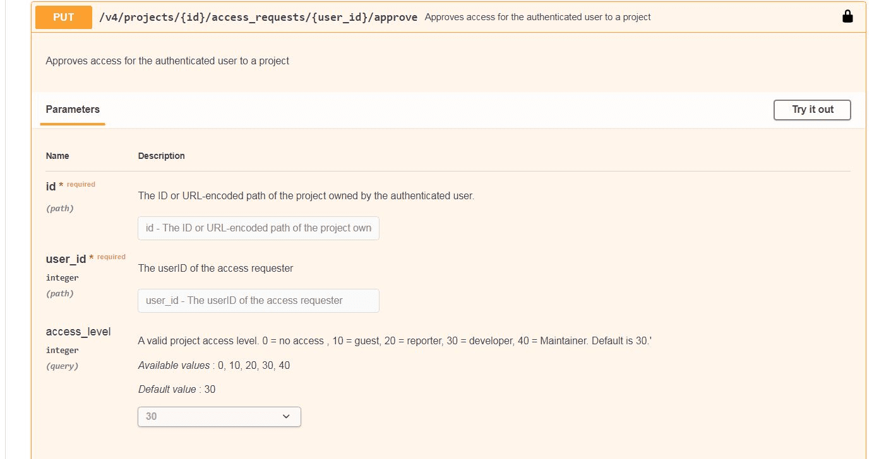
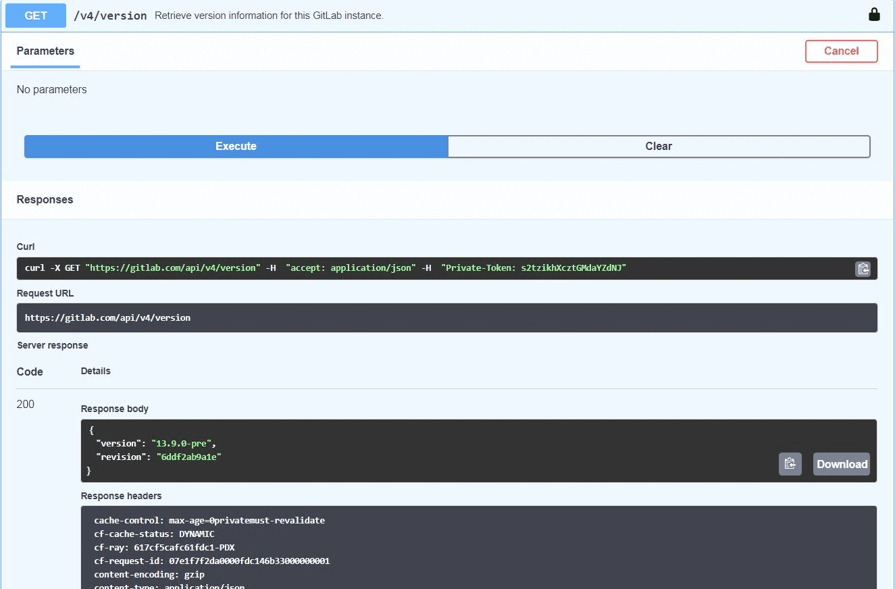

# Interactive API documentation

Introduces the interactive documentation tool for the GitLab API.

## About the OpenAPI specification

The [OpenAPI specification](https://swagger.io/specification/) (formerly called Swagger) defines a
standard, language-agnostic interface to RESTful APIs. OpenAPI definition files are written in the
YAML format, which is automatically rendered by the GitLab browser into a more human-readable interface.

For general information about the GitLab APIs, see [API Docs](../index.md).

## Overview

<!--
The following link is absolute rather than relative because it needs to be viewed through the GitLab
Open API file viewer: https://docs.gitlab.com/ee/user/project/repository/index.html#openapi-viewer.
-->
The [interactive API documentation tool](https://gitlab.com/gitlab-org/gitlab/-/blob/master/doc/api/openapi/openapi.yaml)
allows API testing directly on the GitLab.com website. Only a few of the available endpoints are
documented with the OpenAPI spec, but the current list demonstrates the functionality of the tool.

## Endpoint parameters

When you expand an endpoint listing, you see a description, input parameters (if required),
and example server responses. Some parameters include a default or a list of allowed values.

## Starting an interactive session

A [Personal access token](../../user/profile/personal_access_tokens.md) (PAT) is one way to
start an interactive session. To do this, select **Authorize** from the main page, and a
dialog box prompts you to enter your PAT, which is valid for the current web session.

To test the endpoint, first select **Try it out** on the endpoint definition page. Input the parameters
as required, then select **Execute**. In the following example, we executed a request for the `version`
endpoint (no parameters required). The tool shows the `curl` command and URL of the request, followed
by the server responses that are returned. You can create new responses by editing the relevant parameters
and then select **Execute** once again.

