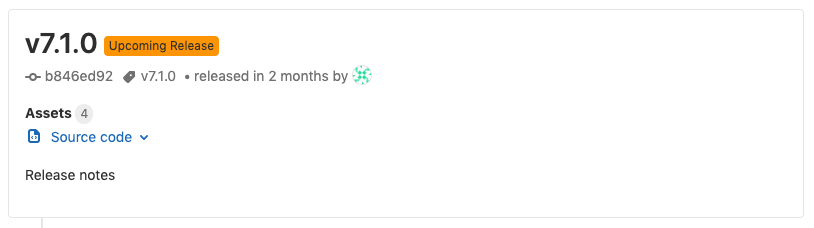

# Releases API

> - [Introduced](https://gitlab.com/gitlab-org/gitlab-foss/issues/41766) in GitLab 11.7.
> - Using this API you can manipulate GitLab's [Release](../../user/project/releases/index.md) entries.
> - For manipulating links as a release asset, see [Release Links API](links.md).
> - Release Evidences were [introduced](https://gitlab.com/gitlab-org/gitlab/issues/26019) in GitLab 12.5.

## List Releases

Paginated list of Releases, sorted by `released_at`.

```
GET /projects/:id/releases
```

| Attribute     | Type           | Required | Description                                                                         |
| ------------- | -------------- | -------- | ----------------------------------------------------------------------------------- |
| `id`          | integer/string | yes      | The ID or [URL-encoded path of the project](../README.md#namespaced-path-encoding). |

Example request:

```sh
curl --header "PRIVATE-TOKEN: gDybLx3yrUK_HLp3qPjS" "https://gitlab.example.com/api/v4/projects/24/releases"
```

Example response:

```json
[
   {
      "tag_name":"v0.2",
      "description":"## CHANGELOG\r\n\r\n- Escape label and milestone titles to prevent XSS in GFM autocomplete. !2740\r\n- Prevent private snippets from being embeddable.\r\n- Add subresources removal to member destroy service.",
      "name":"Awesome app v0.2 beta",
      "description_html":"\u003ch2 dir=\"auto\"\u003e\n\u003ca id=\"user-content-changelog\" class=\"anchor\" href=\"#changelog\" aria-hidden=\"true\"\u003e\u003c/a\u003eCHANGELOG\u003c/h2\u003e\n\u003cul dir=\"auto\"\u003e\n\u003cli\u003eEscape label and milestone titles to prevent XSS in GFM autocomplete. !2740\u003c/li\u003e\n\u003cli\u003ePrevent private snippets from being embeddable.\u003c/li\u003e\n\u003cli\u003eAdd subresources removal to member destroy service.\u003c/li\u003e\n\u003c/ul\u003e",
      "created_at":"2019-01-03T01:56:19.539Z",
      "released_at":"2019-01-03T01:56:19.539Z",
      "author":{
         "id":1,
         "name":"Administrator",
         "username":"root",
         "state":"active",
         "avatar_url":"https://www.gravatar.com/avatar/e64c7d89f26bd1972efa854d13d7dd61?s=80\u0026d=identicon",
         "web_url":"https://gitlab.example.com/root"
      },
      "commit":{
         "id":"079e90101242458910cccd35eab0e211dfc359c0",
         "short_id":"079e9010",
         "title":"Update README.md",
         "created_at":"2019-01-03T01:55:38.000Z",
         "parent_ids":[
            "f8d3d94cbd347e924aa7b715845e439d00e80ca4"
         ],
         "message":"Update README.md",
         "author_name":"Administrator",
         "author_email":"admin@example.com",
         "authored_date":"2019-01-03T01:55:38.000Z",
         "committer_name":"Administrator",
         "committer_email":"admin@example.com",
         "committed_date":"2019-01-03T01:55:38.000Z"
      },
      "milestones": [
         {
            "id":51,
            "iid":1,
            "project_id":24,
            "title":"v1.0-rc",
            "description":"Voluptate fugiat possimus quis quod aliquam expedita.",
            "state":"closed",
            "created_at":"2019-07-12T19:45:44.256Z",
            "updated_at":"2019-07-12T19:45:44.256Z",
            "due_date":"2019-08-16T11:00:00.256Z",
            "start_date":"2019-07-30T12:00:00.256Z",
            "web_url":"https://gitlab.example.com/root/awesome-app/-/milestones/1"
         },
         {
            "id":52,
            "iid":2,
            "project_id":24,
            "title":"v1.0",
            "description":"Voluptate fugiat possimus quis quod aliquam expedita.",
            "state":"closed",
            "created_at":"2019-07-16T14:00:12.256Z",
            "updated_at":"2019-07-16T14:00:12.256Z",
            "due_date":"2019-08-16T11:00:00.256Z",
            "start_date":"2019-07-30T12:00:00.256Z",
            "web_url":"https://gitlab.example.com/root/awesome-app/-/milestones/2"
         }
      ],
      "commit_path":"/root/awesome-app/commit/588440f66559714280628a4f9799f0c4eb880a4a",
      "tag_path":"/root/awesome-app/-/tags/v0.11.1",
      "evidence_sha":"760d6cdfb0879c3ffedec13af470e0f71cf52c6cde4d",
      "assets":{
         "count":6,
         "sources":[
            {
               "format":"zip",
               "url":"https://gitlab.example.com/root/awesome-app/-/archive/v0.2/awesome-app-v0.2.zip"
            },
            {
               "format":"tar.gz",
               "url":"https://gitlab.example.com/root/awesome-app/-/archive/v0.2/awesome-app-v0.2.tar.gz"
            },
            {
               "format":"tar.bz2",
               "url":"https://gitlab.example.com/root/awesome-app/-/archive/v0.2/awesome-app-v0.2.tar.bz2"
            },
            {
               "format":"tar",
               "url":"https://gitlab.example.com/root/awesome-app/-/archive/v0.2/awesome-app-v0.2.tar"
            }
         ],
         "links":[
            {
               "id":2,
               "name":"awesome-v0.2.msi",
               "url":"http://192.168.10.15:3000/msi",
               "external":true
            },
            {
               "id":1,
               "name":"awesome-v0.2.dmg",
               "url":"http://192.168.10.15:3000",
               "external":true
            }
         ],
         "evidence_file_path":"https://gitlab.example.com/root/awesome-app/-/releases/v0.2/evidence.json"
      },
   },
   {
      "tag_name":"v0.1",
      "description":"## CHANGELOG\r\n\r\n-Remove limit of 100 when searching repository code. !8671\r\n- Show error message when attempting to reopen an MR and there is an open MR for the same branch. !16447 (Akos Gyimesi)\r\n- Fix a bug where internal email pattern wasn't respected. !22516",
      "name":"Awesome app v0.1 alpha",
      "description_html":"\u003ch2 dir=\"auto\"\u003e\n\u003ca id=\"user-content-changelog\" class=\"anchor\" href=\"#changelog\" aria-hidden=\"true\"\u003e\u003c/a\u003eCHANGELOG\u003c/h2\u003e\n\u003cul dir=\"auto\"\u003e\n\u003cli\u003eRemove limit of 100 when searching repository code. !8671\u003c/li\u003e\n\u003cli\u003eShow error message when attempting to reopen an MR and there is an open MR for the same branch. !16447 (Akos Gyimesi)\u003c/li\u003e\n\u003cli\u003eFix a bug where internal email pattern wasn't respected. !22516\u003c/li\u003e\n\u003c/ul\u003e",
      "created_at":"2019-01-03T01:55:18.203Z",
      "released_at":"2019-01-03T01:55:18.203Z",
      "author":{
         "id":1,
         "name":"Administrator",
         "username":"root",
         "state":"active",
         "avatar_url":"https://www.gravatar.com/avatar/e64c7d89f26bd1972efa854d13d7dd61?s=80\u0026d=identicon",
         "web_url":"https://gitlab.example.com/root"
      },
      "commit":{
         "id":"f8d3d94cbd347e924aa7b715845e439d00e80ca4",
         "short_id":"f8d3d94c",
         "title":"Initial commit",
         "created_at":"2019-01-03T01:53:28.000Z",
         "parent_ids":[

         ],
         "message":"Initial commit",
         "author_name":"Administrator",
         "author_email":"admin@example.com",
         "authored_date":"2019-01-03T01:53:28.000Z",
         "committer_name":"Administrator",
         "committer_email":"admin@example.com",
         "committed_date":"2019-01-03T01:53:28.000Z"
      },
      "evidence_sha":"760d6cdfb0879c3ffedec13af470e0f71cf52c6cde4d",
      "assets":{
         "count":4,
         "sources":[
            {
               "format":"zip",
               "url":"https://gitlab.example.com/root/awesome-app/-/archive/v0.1/awesome-app-v0.1.zip"
            },
            {
               "format":"tar.gz",
               "url":"https://gitlab.example.com/root/awesome-app/-/archive/v0.1/awesome-app-v0.1.tar.gz"
            },
            {
               "format":"tar.bz2",
               "url":"https://gitlab.example.com/root/awesome-app/-/archive/v0.1/awesome-app-v0.1.tar.bz2"
            },
            {
               "format":"tar",
               "url":"https://gitlab.example.com/root/awesome-app/-/archive/v0.1/awesome-app-v0.1.tar"
            }
         ],
         "links":[

         ],
         "evidence_file_path":"https://gitlab.example.com/root/awesome-app/-/releases/v0.1/evidence.json"
      },
   }
]
```

## Get a Release by a tag name

Get a Release for the given tag.

```
GET /projects/:id/releases/:tag_name
```

| Attribute     | Type           | Required | Description                                                                         |
| ------------- | -------------- | -------- | ----------------------------------------------------------------------------------- |
| `id`          | integer/string | yes      | The ID or [URL-encoded path of the project](../README.md#namespaced-path-encoding). |
| `tag_name`    | string         | yes      | The tag where the release will be created from.                                     |

Example request:

```sh
curl --header "PRIVATE-TOKEN: gDybLx3yrUK_HLp3qPjS" "https://gitlab.example.com/api/v4/projects/24/releases/v0.1"
```

Example response:

```json
{
   "tag_name":"v0.1",
   "description":"## CHANGELOG\r\n\r\n- Remove limit of 100 when searching repository code. !8671\r\n- Show error message when attempting to reopen an MR and there is an open MR for the same branch. !16447 (Akos Gyimesi)\r\n- Fix a bug where internal email pattern wasn't respected. !22516",
   "name":"Awesome app v0.1 alpha",
   "description_html":"\u003ch2 dir=\"auto\"\u003e\n\u003ca id=\"user-content-changelog\" class=\"anchor\" href=\"#changelog\" aria-hidden=\"true\"\u003e\u003c/a\u003eCHANGELOG\u003c/h2\u003e\n\u003cul dir=\"auto\"\u003e\n\u003cli\u003eRemove limit of 100 when searching repository code. !8671\u003c/li\u003e\n\u003cli\u003eShow error message when attempting to reopen an MR and there is an open MR for the same branch. !16447 (Akos Gyimesi)\u003c/li\u003e\n\u003cli\u003eFix a bug where internal email pattern wasn't respected. !22516\u003c/li\u003e\n\u003c/ul\u003e",
   "created_at":"2019-01-03T01:55:18.203Z",
   "released_at":"2019-01-03T01:55:18.203Z",
   "author":{
      "id":1,
      "name":"Administrator",
      "username":"root",
      "state":"active",
      "avatar_url":"https://www.gravatar.com/avatar/e64c7d89f26bd1972efa854d13d7dd61?s=80\u0026d=identicon",
      "web_url":"https://gitlab.example.com/root"
   },
   "commit":{
      "id":"f8d3d94cbd347e924aa7b715845e439d00e80ca4",
      "short_id":"f8d3d94c",
      "title":"Initial commit",
      "created_at":"2019-01-03T01:53:28.000Z",
      "parent_ids":[

      ],
      "message":"Initial commit",
      "author_name":"Administrator",
      "author_email":"admin@example.com",
      "authored_date":"2019-01-03T01:53:28.000Z",
      "committer_name":"Administrator",
      "committer_email":"admin@example.com",
      "committed_date":"2019-01-03T01:53:28.000Z"
   },
   "milestones": [
       {
         "id":51,
         "iid":1,
         "project_id":24,
         "title":"v1.0-rc",
         "description":"Voluptate fugiat possimus quis quod aliquam expedita.",
         "state":"closed",
         "created_at":"2019-07-12T19:45:44.256Z",
         "updated_at":"2019-07-12T19:45:44.256Z",
         "due_date":"2019-08-16T11:00:00.256Z",
         "start_date":"2019-07-30T12:00:00.256Z",
         "web_url":"https://gitlab.example.com/root/awesome-app/-/milestones/1"
       },
       {
         "id":52,
         "iid":2,
         "project_id":24,
         "title":"v1.0",
         "description":"Voluptate fugiat possimus quis quod aliquam expedita.",
         "state":"closed",
         "created_at":"2019-07-16T14:00:12.256Z",
         "updated_at":"2019-07-16T14:00:12.256Z",
         "due_date":"2019-08-16T11:00:00.256Z",
         "start_date":"2019-07-30T12:00:00.256Z",
         "web_url":"https://gitlab.example.com/root/awesome-app/-/milestones/2"
       }
   ],
   "commit_path":"/root/awesome-app/commit/588440f66559714280628a4f9799f0c4eb880a4a",
   "tag_path":"/root/awesome-app/-/tags/v0.11.1",
   "evidence_sha":"760d6cdfb0879c3ffedec13af470e0f71cf52c6cde4d",
   "assets":{
      "count":5,
      "sources":[
         {
            "format":"zip",
            "url":"https://gitlab.example.com/root/awesome-app/-/archive/v0.1/awesome-app-v0.1.zip"
         },
         {
            "format":"tar.gz",
            "url":"https://gitlab.example.com/root/awesome-app/-/archive/v0.1/awesome-app-v0.1.tar.gz"
         },
         {
            "format":"tar.bz2",
            "url":"https://gitlab.example.com/root/awesome-app/-/archive/v0.1/awesome-app-v0.1.tar.bz2"
         },
         {
            "format":"tar",
            "url":"https://gitlab.example.com/root/awesome-app/-/archive/v0.1/awesome-app-v0.1.tar"
         }
      ],
      "links":[

      ],
      "evidence_url":"https://gitlab.example.com/root/awesome-app/-/releases/v0.1/evidence.json"
   },
}
```

## Create a release

Create a Release. You need push access to the repository to create a Release.

```
POST /projects/:id/releases
```

| Attribute          | Type            | Required                    | Description                                                                                                                      |
| -------------------| --------------- | --------                    | -------------------------------------------------------------------------------------------------------------------------------- |
| `id`               | integer/string  | yes                         | The ID or [URL-encoded path of the project](../README.md#namespaced-path-encoding).                                              |
| `name`             | string          | no                          | The release name.                                                                                                                |
| `tag_name`         | string          | yes                         | The tag where the release will be created from.                                                                                  |
| `description`      | string          | yes                         | The description of the release. You can use [Markdown](../../user/markdown.md).                                                  |
| `ref`              | string          | yes, if `tag_name` doesn't exist | If `tag_name` doesn't exist, the release will be created from `ref`. It can be a commit SHA, another tag name, or a branch name. |
| `milestones`       | array of string | no                          | The title of each milestone the release is associated with.                                                                      |
| `assets:links`     | array of hash   | no                          | An array of assets links.                                                                                                        |
| `assets:links:name`| string          | required by: `assets:links` | The name of the link.                                                                                                            |
| `assets:links:url` | string          | required by: `assets:links` | The url of the link.                                                                                                             |
| `released_at`      | datetime        | no                          | The date when the release will be/was ready. Defaults to the current time. Expected in ISO 8601 format (`2019-03-15T08:00:00Z`). |

Example request:

```sh
curl --header 'Content-Type: application/json' --header "PRIVATE-TOKEN: gDybLx3yrUK_HLp3qPjS" \
     --data '{ "name": "New release", "tag_name": "v0.3", "description": "Super nice release", "milestones": ["v1.0", "v1.0-rc"], "assets": { "links": [{ "name": "hoge", "url": "https://google.com" }] } }' \
     --request POST https://gitlab.example.com/api/v4/projects/24/releases
```

Example response:

```json
{
   "tag_name":"v0.3",
   "description":"Super nice release",
   "name":"New release",
   "description_html":"\u003cp dir=\"auto\"\u003eSuper nice release\u003c/p\u003e",
   "created_at":"2019-01-03T02:22:45.118Z",
   "released_at":"2019-01-03T02:22:45.118Z",
   "author":{
      "id":1,
      "name":"Administrator",
      "username":"root",
      "state":"active",
      "avatar_url":"https://www.gravatar.com/avatar/e64c7d89f26bd1972efa854d13d7dd61?s=80\u0026d=identicon",
      "web_url":"https://gitlab.example.com/root"
   },
   "commit":{
      "id":"079e90101242458910cccd35eab0e211dfc359c0",
      "short_id":"079e9010",
      "title":"Update README.md",
      "created_at":"2019-01-03T01:55:38.000Z",
      "parent_ids":[
         "f8d3d94cbd347e924aa7b715845e439d00e80ca4"
      ],
      "message":"Update README.md",
      "author_name":"Administrator",
      "author_email":"admin@example.com",
      "authored_date":"2019-01-03T01:55:38.000Z",
      "committer_name":"Administrator",
      "committer_email":"admin@example.com",
      "committed_date":"2019-01-03T01:55:38.000Z"
   },
   "milestones": [
       {
         "id":51,
         "iid":1,
         "project_id":24,
         "title":"v1.0-rc",
         "description":"Voluptate fugiat possimus quis quod aliquam expedita.",
         "state":"closed",
         "created_at":"2019-07-12T19:45:44.256Z",
         "updated_at":"2019-07-12T19:45:44.256Z",
         "due_date":"2019-08-16T11:00:00.256Z",
         "start_date":"2019-07-30T12:00:00.256Z",
         "web_url":"https://gitlab.example.com/root/awesome-app/-/milestones/1"
       },
       {
         "id":52,
         "iid":2,
         "project_id":24,
         "title":"v1.0",
         "description":"Voluptate fugiat possimus quis quod aliquam expedita.",
         "state":"closed",
         "created_at":"2019-07-16T14:00:12.256Z",
         "updated_at":"2019-07-16T14:00:12.256Z",
         "due_date":"2019-08-16T11:00:00.256Z",
         "start_date":"2019-07-30T12:00:00.256Z",
         "web_url":"https://gitlab.example.com/root/awesome-app/-/milestones/2"
       }
   ],
   "commit_path":"/root/awesome-app/commit/588440f66559714280628a4f9799f0c4eb880a4a",
   "tag_path":"/root/awesome-app/-/tags/v0.11.1",
   "evidence_sha":"760d6cdfb0879c3ffedec13af470e0f71cf52c6cde4d",
   "assets":{
      "count":5,
      "sources":[
         {
            "format":"zip",
            "url":"https://gitlab.example.com/root/awesome-app/-/archive/v0.3/awesome-app-v0.3.zip"
         },
         {
            "format":"tar.gz",
            "url":"https://gitlab.example.com/root/awesome-app/-/archive/v0.3/awesome-app-v0.3.tar.gz"
         },
         {
            "format":"tar.bz2",
            "url":"https://gitlab.example.com/root/awesome-app/-/archive/v0.3/awesome-app-v0.3.tar.bz2"
         },
         {
            "format":"tar",
            "url":"https://gitlab.example.com/root/awesome-app/-/archive/v0.3/awesome-app-v0.3.tar"
         }
      ],
      "links":[
         {
            "id":3,
            "name":"hoge",
            "url":"https://google.com",
            "external":true
         }
      ],
      "evidence_file_path":"https://gitlab.example.com/root/awesome-app/-/releases/v0.3/evidence.json"
   },
}
```

## Update a release

Update a Release.

```
PUT /projects/:id/releases/:tag_name
```

| Attribute     | Type            | Required | Description                                                                                                 |
| ------------- | --------------- | -------- | ----------------------------------------------------------------------------------------------------------- |
| `id`          | integer/string  | yes      | The ID or [URL-encoded path of the project](../README.md#namespaced-path-encoding).                         |
| `tag_name`    | string          | yes      | The tag where the release will be created from.                                                             |
| `name`        | string          | no       | The release name.                                                                                           |
| `description` | string          | no       | The description of the release. You can use [Markdown](../../user/markdown.md).                             |
| `milestones`  | array of string | no       | The title of each milestone to associate with the release (`[]` to remove all milestones from the release). |
| `released_at` | datetime        | no       | The date when the release will be/was ready. Expected in ISO 8601 format (`2019-03-15T08:00:00Z`).          |

Example request:

```sh
curl --header 'Content-Type: application/json' --request PUT --data '{"name": "new name", "milestones": ["v1.2"]}' --header "PRIVATE-TOKEN: gDybLx3yrUK_HLp3qPjS" "https://gitlab.example.com/api/v4/projects/24/releases/v0.1"
```

Example response:

```json
{
   "tag_name":"v0.1",
   "description":"## CHANGELOG\r\n\r\n- Remove limit of 100 when searching repository code. !8671\r\n- Show error message when attempting to reopen an MR and there is an open MR for the same branch. !16447 (Akos Gyimesi)\r\n- Fix a bug where internal email pattern wasn't respected. !22516",
   "name":"new name",
   "description_html":"\u003ch2 dir=\"auto\"\u003e\n\u003ca id=\"user-content-changelog\" class=\"anchor\" href=\"#changelog\" aria-hidden=\"true\"\u003e\u003c/a\u003eCHANGELOG\u003c/h2\u003e\n\u003cul dir=\"auto\"\u003e\n\u003cli\u003eRemove limit of 100 when searching repository code. !8671\u003c/li\u003e\n\u003cli\u003eShow error message when attempting to reopen an MR and there is an open MR for the same branch. !16447 (Akos Gyimesi)\u003c/li\u003e\n\u003cli\u003eFix a bug where internal email pattern wasn't respected. !22516\u003c/li\u003e\n\u003c/ul\u003e",
   "created_at":"2019-01-03T01:55:18.203Z",
   "released_at":"2019-01-03T01:55:18.203Z",
   "author":{
      "id":1,
      "name":"Administrator",
      "username":"root",
      "state":"active",
      "avatar_url":"https://www.gravatar.com/avatar/e64c7d89f26bd1972efa854d13d7dd61?s=80\u0026d=identicon",
      "web_url":"https://gitlab.example.com/root"
   },
   "commit":{
      "id":"f8d3d94cbd347e924aa7b715845e439d00e80ca4",
      "short_id":"f8d3d94c",
      "title":"Initial commit",
      "created_at":"2019-01-03T01:53:28.000Z",
      "parent_ids":[

      ],
      "message":"Initial commit",
      "author_name":"Administrator",
      "author_email":"admin@example.com",
      "authored_date":"2019-01-03T01:53:28.000Z",
      "committer_name":"Administrator",
      "committer_email":"admin@example.com",
      "committed_date":"2019-01-03T01:53:28.000Z"
   },
   "milestones": [
      {
         "id":53,
         "iid":3,
         "project_id":24,
         "title":"v1.0",
         "description":"Voluptate fugiat possimus quis quod aliquam expedita.",
         "state":"active",
         "created_at":"2019-09-01T13:00:00.256Z",
         "updated_at":"2019-09-01T13:00:00.256Z",
         "due_date":"2019-09-20T13:00:00.256Z",
         "start_date":"2019-09-05T12:00:00.256Z",
         "web_url":"https://gitlab.example.com/root/awesome-app/-/milestones/3"
      }
   ],
   "commit_path":"/root/awesome-app/commit/588440f66559714280628a4f9799f0c4eb880a4a",
   "tag_path":"/root/awesome-app/-/tags/v0.11.1",
   "evidence_sha":"760d6cdfb0879c3ffedec13af470e0f71cf52c6cde4d",
   "assets":{
      "count":4,
      "sources":[
         {
            "format":"zip",
            "url":"https://gitlab.example.com/root/awesome-app/-/archive/v0.1/awesome-app-v0.1.zip"
         },
         {
            "format":"tar.gz",
            "url":"https://gitlab.example.com/root/awesome-app/-/archive/v0.1/awesome-app-v0.1.tar.gz"
         },
         {
            "format":"tar.bz2",
            "url":"https://gitlab.example.com/root/awesome-app/-/archive/v0.1/awesome-app-v0.1.tar.bz2"
         },
         {
            "format":"tar",
            "url":"https://gitlab.example.com/root/awesome-app/-/archive/v0.1/awesome-app-v0.1.tar"
         }
      ],
      "links":[

      ],
      "evidence_file_path":"https://gitlab.example.com/root/awesome-app/-/releases/v0.1/evidence.json"
   },
}
```

## Delete a Release

Delete a Release. Deleting a Release will not delete the associated tag.

```
DELETE /projects/:id/releases/:tag_name
```

| Attribute     | Type           | Required | Description                                                                         |
| ------------- | -------------- | -------- | ----------------------------------------------------------------------------------- |
| `id`          | integer/string | yes      | The ID or [URL-encoded path of the project](../README.md#namespaced-path-encoding). |
| `tag_name`    | string         | yes      | The tag where the release will be created from.                                     |

Example request:

```sh
curl --request DELETE --header "PRIVATE-TOKEN: gDybLx3yrUK_HLp3qPjS" "https://gitlab.example.com/api/v4/projects/24/releases/v0.1"
```

Example response:

```json
{
   "tag_name":"v0.1",
   "description":"## CHANGELOG\r\n\r\n- Remove limit of 100 when searching repository code. !8671\r\n- Show error message when attempting to reopen an MR and there is an open MR for the same branch. !16447 (Akos Gyimesi)\r\n- Fix a bug where internal email pattern wasn't respected. !22516",
   "name":"new name",
   "description_html":"\u003ch2 dir=\"auto\"\u003e\n\u003ca id=\"user-content-changelog\" class=\"anchor\" href=\"#changelog\" aria-hidden=\"true\"\u003e\u003c/a\u003eCHANGELOG\u003c/h2\u003e\n\u003cul dir=\"auto\"\u003e\n\u003cli\u003eRemove limit of 100 when searching repository code. !8671\u003c/li\u003e\n\u003cli\u003eShow error message when attempting to reopen an MR and there is an open MR for the same branch. !16447 (Akos Gyimesi)\u003c/li\u003e\n\u003cli\u003eFix a bug where internal email pattern wasn't respected. !22516\u003c/li\u003e\n\u003c/ul\u003e",
   "created_at":"2019-01-03T01:55:18.203Z",
   "released_at":"2019-01-03T01:55:18.203Z",
   "author":{
      "id":1,
      "name":"Administrator",
      "username":"root",
      "state":"active",
      "avatar_url":"https://www.gravatar.com/avatar/e64c7d89f26bd1972efa854d13d7dd61?s=80\u0026d=identicon",
      "web_url":"https://gitlab.example.com/root"
   },
   "commit":{
      "id":"f8d3d94cbd347e924aa7b715845e439d00e80ca4",
      "short_id":"f8d3d94c",
      "title":"Initial commit",
      "created_at":"2019-01-03T01:53:28.000Z",
      "parent_ids":[

      ],
      "message":"Initial commit",
      "author_name":"Administrator",
      "author_email":"admin@example.com",
      "authored_date":"2019-01-03T01:53:28.000Z",
      "committer_name":"Administrator",
      "committer_email":"admin@example.com",
      "committed_date":"2019-01-03T01:53:28.000Z"
   },
   "commit_path":"/root/awesome-app/commit/588440f66559714280628a4f9799f0c4eb880a4a",
   "tag_path":"/root/awesome-app/-/tags/v0.11.1",
   "evidence_sha":"760d6cdfb0879c3ffedec13af470e0f71cf52c6cde4d",
   "assets":{
      "count":4,
      "sources":[
         {
            "format":"zip",
            "url":"https://gitlab.example.com/root/awesome-app/-/archive/v0.1/awesome-app-v0.1.zip"
         },
         {
            "format":"tar.gz",
            "url":"https://gitlab.example.com/root/awesome-app/-/archive/v0.1/awesome-app-v0.1.tar.gz"
         },
         {
            "format":"tar.bz2",
            "url":"https://gitlab.example.com/root/awesome-app/-/archive/v0.1/awesome-app-v0.1.tar.bz2"
         },
         {
            "format":"tar",
            "url":"https://gitlab.example.com/root/awesome-app/-/archive/v0.1/awesome-app-v0.1.tar"
         }
      ],
      "links":[

      ],
      "evidence_file_path":"https://gitlab.example.com/root/awesome-app/-/releases/v0.1/evidence.json"
   },
}
```

## Upcoming Releases

> [Introduced](https://gitlab.com/gitlab-org/gitlab-foss/issues/38105) in GitLab 12.1.

A release with a `released_at` attribute set to a future date will be labeled an **Upcoming Release** in the UI:


