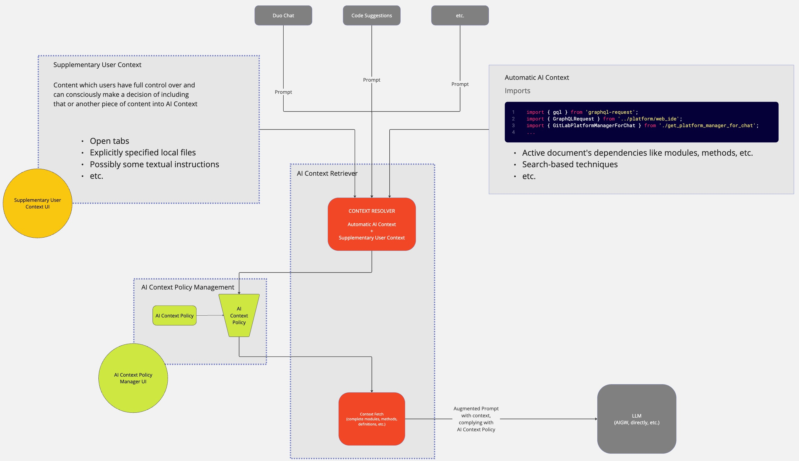
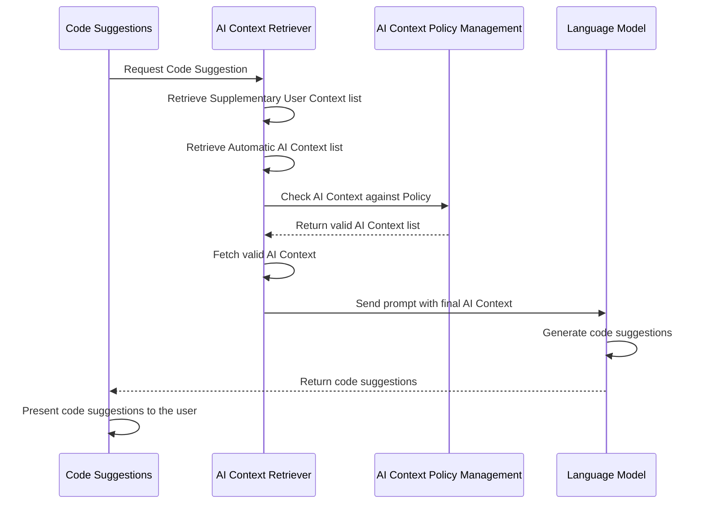

# AI Context Management

## Glossary

- **AI Context**. In the scope of this technical blueprint, the term "AI Context" refers to supplementary information
provided to the AI system alongside the primary prompts.
- **AI Context Policy**. The "AI Context Policy" is a user-defined and user-managed mechanism allowing precise
control over the content that can be sent to the AI as contextual information. In the context of this blueprint, the
_AI Context Policy_ is suggested as a YAML configuration file.
- **AI Context Policy Management**. Within this blueprint, "Management" encompasses the user-driven processes of
creating, modifying, and removing AI Context Policies according to specific requirements and preferences.
- **Automatic AI Context**. _AI Context_, retrieved automatically based on the active document. _*Automatic AI Contex_
can be the active document's dependencies (modules, methods, etc., imported into the active document), some
search-based, or other mechanisms over which the user has limited control.
- **Supplementary User Context**: User-defined _AI Context_, such as open tabs in IDEs, local files, and folders, that the user
provides from their local environment to extend the default _AI Context_.
- **AI Context Retriever**: A backend system capable of:
  - communicating with _AI Context Policy Management_
  - fetching content defined in _Automatic AI Context_ and _Supplementary User Context_ (complete files, definitions,
 methods, etc.), based on the _AI Context Policy Management_
  - correctly augment the user prompt with AI Context before sending it to LLM. Presumably, this part is already
 handled by [AI Gateway](../ai_gateway/index.md).
- **Project Administrator**. In the context of this blueprint, "Project Administrator" means any individual with the
"Edit project settings" permission ("Maintainer" or "Owner" roles, as defined in [Project members permissions](../../../user/permissions.md#project-members-permissions)). 



## Summary

Correct context can dramatically improve the quality of AI responses. This blueprint aims to accommodate AI Context
seamlessly into our offering by architecting a solution that is ready for this additional context coming from different
AI features.

However, we recognize the importance of security and trust, which automatic solutions do not necessarily provide. To
address any concerns users might have about the content fed into the AI Context, this blueprint suggests providing them
with control and customization options. This way, users can adjust the content according to their preferences and have a
clear understanding of what information is being utilized.

This blueprint proposes a system for managing _AI Context_ at the _Project Administrator_ and individual
user levels. Its goal is to allow _Project Administrator_ to set high-level rules for what content can be included as context for AI
prompts while enabling users to specify _Supplementary User Context_ for their prompts. The global _AI Context Policy_ will use a YAML
configuration file format stored in the same Git repository. The suggested format of the YAML configuration files
is discussed below.

## Motivation

Ensuring the AI has the correct context is crucial for generating accurate and relevant code suggestions or responses.
As the adoption of AI-assisted development grows, it's essential to give organizations and users control over what project
content is sent as context to AI models. Some files or directories may contain sensitive information that should not
be shared. At the same time, users may want to provide additional context for their prompts to get more
relevant suggestions. We need a flexible _AI Context_ management system to handle these cases.

### Goals

### For _Project Administrators_

- Allow _Project Administrators_ set the default _AI Context Policy_ to control whether content can or cannot be
automatically included in the _AI Context_ when making requests to LLMs
- Allow _Project Administrators_ to specify exceptions to the default _AI Context Policy_
- Provide a UI to manage the default _AI Context Policy_ and its exceptions list easily

### For users

- Allow to set _Supplementary User Context_ to include as AI context for their prompts
- Provide a UI to manage _Supplementary User Context_ easily

### Non-Goals

- _AI Context Retriever_ architecture - different environments (Web, IDEs) will probably implement their retrievers.
However, the unified public interface of the retrievers should be considered.
- Extremely granular controls like allowing/excluding individual lines of code
- Storing entire file contents from user projects, only paths will be persisted

## Proposal

The proposed architecture consists of 3 main parts:

- _AI Context Retriever_
- _AI Context Policy Management_
- _Supplementary User Context_

There are several different ongoing efforts related to various implementations of _AI Context Retriever_ both
[for Web](https://gitlab.com/groups/gitlab-org/-/epics/14040), and [for IDEs](https://gitlab.com/groups/gitlab-org/editor-extensions/-/epics/55).
Because of that, the architecture for _AI Context Retriever_ is beyond the scope of this blueprint. However, in the
context of this blueprint, it is assumed that:

- _AI Context Retriever_ is capable of automatically retrieving and fetching _Automatic AI Context_ and passing it
on as _AI Context_ to LLM.
- _AI Context Retriever_ can automatically retrieve and fetch _Supplementary User Context_and pass
it on as _AI Context_ to LLM.
- _AI Context Retriever_ implementation can ensure that any content passed as _AI Context_ to a model
adheres to the global _AI Context Policy_.
- _AI Context Retriever_ can trim the _AI Context_ to meet the contextual window requirement for a
specific LLM used for that or another Duo feature.

### _AI Context Policy Management_ proposal

To implement the _AI Context Policy Management_ system, it is proposed to:

- Introduce the YAML file format for configuring global policies 
- In the YAML configuration file, support two `ai_context_policy` types:
  - `block`: blocks all content except for the specified `exclude` paths. Excluded files are allowed. (**Default**)
  - `allow`: allows all content except for the specified `exclude` paths. Excluded files are blocked.
  - `version`: specifies the schema version of the AI context file. Starting with `version: 1`. If omitted treated as the latest version known to the client.
- In the YAML configuration file, support glob patterns to exclude certain paths from the global policy
- Support nested _AI Context Policies_ to provide a more granular control of _AI Context_ in sub-folders. For
example, a policy in `/src/tests` would override a policy in `/src`, which, in its turn, would override a
global _AI Context Policy_ in `/`. 

### _Supplementary User Context_ proposal

To implement the _Supplementary User Context_ system, it is proposed to:

- Introduce user-level UI to specify _Supplementary User Context_ for prompts. A particular implementation of the UI could
differ in different environments (IDEs, Web, etc.), but the actual design of these implementations is beyond the scope of 
this architecture blueprint
- The user-level UI should communicate to the user what is in the _Supplementary User Context_ at any moment.
- The user-level UI should allow the user to edit the contents of the _Supplementary User Context_.

### Optional steps

- Provide UI for _Project Administrators_ to configure global _AI Context Policy_. [Source Editor](../../../development/fe_guide/source_editor.md)
can be used as the editor for this type of YAML file format, similar to the
[Security Policy Editor](../../../user/application_security/policies/index.md#policy-editor).
- Implement a validation mechanism for _AI Context Policies_ to somehow notify the _Project Administrators_ in case
of the invalid format of the YAML configuration file. It could be a job in CI. But to catch possible issues proactively, it is
also advised to introduce the validation step as part of the
[pre-push static analysis](../../../development/contributing/style_guides.md#pre-push-static-analysis-with-lefthook)

## Design and implementation details

- **YAML Configuration File Format**: The proposed YAML configuration file format for defining the global
_AI Context Policy_ is as follows:

  ```yaml
  ai_context_policy: [allow|block]

  exclude:
  - glob/**/pattern
  ```

  The `ai_context_policy` section specifies the current policy for this and all underlying folders in a repo.

  The `exclude` section specifies the exceptions to the `ai_context_policy`. Technically, it's an inversion of the policy.
  For example, if we specify `foo_bar.js` in `exclude`:

  - for the `allow` policy, it means that `foo_bar.js` will be blocked
  - for the `block` policy, it means that `foo_bar.js` will be allowed

- **User-Level UI for _Supplementary User Context_**: The UI for specifying _Supplementary User Context_ for prompts
can be implemented differently depending on the environment (IDEs, Web, etc.). However, the implementation should
ensure users can provide additional context for their prompts. The specified _Supplementary User Context_ for
each user can be stored as:

  - a preference stored in the user profile in GitLab

    - **Pros**: Consistent across devices and environments (Web, IDEs, etc.)
    - **Cons**: Additional work in the monolith, potentially a lot of new read/writes to a database

  - a preference stored in the local IDE/Web storage

    - **Pros**: User-centric, local to user environment
    - **Cons**: Different implementations for different environments (Web, IDEs, etc.), doesn't survive switching
 environment or device

 In both cases, the storage should allow the preference to be associated with a particular repository. Factors
 like data consistency, performance, and implementation complexity should guide the decision on what type of storage
 to use.

- To mitigate potential performance and scalability issues, it would make sense to keep _AI Context Retriever_, and
_AI Context Policy Management_ in the same environment as the feature needing those. It would be
[Language Server](https://gitlab.com/gitlab-org/editor-extensions/gitlab-lsp) for Duo features in IDEs and different
services in the monolith for Duo features on the Web. 

### Data flow

Here's the draft of the data flow demonstrating the role of _AI Context_ using the Code Suggestions feature as an example.



In case the _AI Context Retriever_ fails to fetch any content from the _AI Context_, the prompt is sent with
_AI Context_, which was successfully fetched. In a low-probability case, when _AI Context Retriever_ cannot fetch any content, the prompt should be sent out as-is.

## Alternative solutions

### JSON Configuration Files

- **Pros**: Widely used, easier integration with web technologies.
- **Cons**: Less readable compared to YAML for complex configurations.

### Database-Backed Configuration

- **Pros**: Centralized management, dynamic updates.
- **Cons**: Not version controlled.

### Environment Variables

- **Pros**: Simplifies configuration for deployment and scaling.
- **Cons**: Less suitable for complex configurations.

### Policy as Code (without YAML)

- **Pros**: Better control and auditing with versioned code.
- **Cons**: It requires users to write code and us to invent a language for it.

### Policy in `.ai_ignore` and other Git-like files

- **Pros**: Provides a straightforward approach, identical to the `allow` policy with the list of `exclude` suggested in this blueprint
- **Cons**: Supports only the `allow` policy; the processing of this file type still has to be implemented

Based on these alternatives, the YAML file was chosen as a format for this blueprint because of versioning
in Git, and more versatility compared to the `.ai_ignore` alternative.

## Suggested iterative implementation plan

Please refer to the [Proposal](#proposal) for a detailed explanation of the items in every iteration.

### Iteration 1

- Introduce the global `.ai-context-policy.yaml` YAML configuration file format and schema for this file type
as part of _AI Context Policy Management_.
- _AI Context Retrievers_ introduce support for _Supplementary User Context_.
- Optional: validation mechanism (like CI job and pre-push static analysis) for `.ai-context-policy.yaml`

**Success criteria for the iteration:** Prompts sent from the Code Suggestions feature in IDEs contain
_AI Context_ only with the open IDE tabs, which adhere to the global _AI Context Policy_ in the root of a repository.

### Iteration 2

- In _AI Context Retrievers_ introduce support for _Automatic AI Context_.
- Connect more features to the _AI Context Management_ system.

**Success criteria for the iteration:** Prompts sent from the Code Suggestions feature in IDEs contain _AI Context_
with items of _Automatic AI Context_, which adhere to the global _AI Context Policy_ in the root of a repository.

### Iteration 3

- Connect all Duo features on the Web and in IDEs to _AI Context Retrievers_ and adhere to the global
_AI Context Policy_.

**Success criteria for the iteration:** All Duo features in all environments send _AI Context_ which adheres to the
global _AI Context Policy_

### Iteration 4

- Support nested `.ai-context-policy.yaml` YAML configuration files.

**Success criteria for the iteration:** _AI Context Policy_ placed into the sub-folders of a repository, override
higher-level policies when sending prompts.

### Iteration 5

- User-level UI for _Supplementary User Context_. 

**Success criteria for the iteration:** Users can see and edit the contents of the _Supplementary User Context_ and
the context is shared between all Duo features within the environment (Web, IDEs, etc.)

### Iteration 6

- Optional: UI for configuring the global _AI Context Policy_.

**Success criteria for the iteration:** Users can see and edit the contents of the _AI Context Policies_ in a UI
editor.
