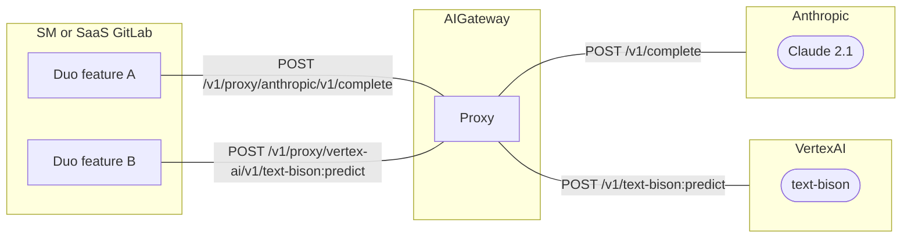

# AI Gateway ADR 002: Exposing proxy endpoints to AI providers

## Summary

AI Gateway exposes [proxy endpoints to AI providers](../index.md#exposing-ai-providers) to let existing client libraries in GitLab-Rails access them.
This is a drop-in replacement that should be used until stage groups move to [a single purpose endpoint](../index.md#single-purpose-endpoints).
We are veering from our ultimate desired architecture in order to bring these features to market for self-managed GitLab instances faster.

## Context

The original iteration of the blueprint suggested to have a single purpose endopint for each AI-powered feature.
There were multiple reasons for this:

- Avoid hard-coding AI-related logic in the GitLab monolith codebase to minimize the time required for customers to adopt our latest features.
- Retain the flexibility to make changes in our product without breaking support for a long-tail of older instances.

In [issue 454543](https://gitlab.com/gitlab-org/gitlab/-/issues/454543), we discussed various
options to enable existing AI features in self-managed GitLab.

## Decision

In the issue we decided to introduce [proxy endpoints to AI providers](../index.md#exposing-ai-providers) so that our Ruby client libraries [`Anthropic::Client`](https://gitlab.com/gitlab-org/gitlab/-/blob/master/ee/lib/gitlab/llm/anthropic/client.rb) and [`VertexAi::Client`](https://gitlab.com/gitlab-org/gitlab/-/blob/master/ee/lib/gitlab/llm/vertex_ai/client.rb) work as-is. The reason is that:

- It's challenging to re-write the existing business logic in Python AI Gateway:
  - Some of the business logic is using dependencies that are only available in GitLab-monolith (e.g. Feature Flag, Caching in Redis).
    This requires us to workaround these implementations, which is error prone.
  - Due to the intensive inheritance in `Gitlab::LLm` namespace, it's hard to extract the actual business logic that are taking an effect.
  - We lack a tool to evaluate whether the quality and functionality of the feature remain consistent before and after changes.
- Duo Chat bacame GA regardless of the existing `POST /v1/chat/agent` endpoint which serves as a proxy endpoint. Technically, this is not a single purpose endpoint yet.

### Technical details

Here is the overview of the request flow:



#### Anthropic

Expose the following HTTP/1.1 endpoint in AI Gateway:

```plaintext
POST /v1/proxy/anthropic/(*path)
```

`path` can be forwarded to the folloinwg endpoints:

- [`/v1/complete`](https://docs.anthropic.com/claude/reference/complete_post)
- [`/v1/messages`](https://docs.anthropic.com/claude/reference/messages_post) (Future iteration)

#### Vertex AI

Expose the following HTTP/1.1 endpoint in AI Gateway:

```plaintext
POST /v1/proxy/vertex-ai/(*path)
```

`path` can be forwarded to the following endpoints:

- [`/v1/{endpoint}:predict`](https://cloud.google.com/vertex-ai/docs/reference/rest/v1/projects.locations.publishers.models/predict)
  - `endpoint` must be one of: `chat-bison`, `code-bison`, `codechat-bison`, `text-bison`, `textembedding-gecko@003`.

#### Common behavior

- Request body is sent to AI providers as-is.
- Request headers are filtered/replaced by AI Gateway accordingly e.g. Allow only `accept`, `content-type`, `anthropic-version` and filter out the rest. `x-api-key` is added.
- Response body is returned to clients as-is.
- Response headers are filtered/replaced by AI Gateway accordingly e.g. Allow only `date`, `content-type`, `transfer-encoding` and filter out the rest.
- Response status is returned to clients as-is.
- HTTP Streaming is supported.
- if unsupported `path` is specified, AI Gateway responds with a 404 Not Found error.

#### Access control

- Clients must send JWT issued by GitLab.com or Customer Dot.
  - This JWT contains `scopes` that indicates the permissions given to the GitLab-instance. This `scopes` will vary per Duo subscription tier.
  - To access these proxy endpoints, `scopes` must **include** one of: `explain_vulnerability`, `resolve_vulnerability`, `generate_description`, `summarize_all_open_notes`, `generate_commit_message`, `summarize_review`, `analyze_ci_job_failure`.
  - Requests that do not meet the specified criteria will result in a 401 Unauthorized Access error.
- Clients must send `X-Gitlab-Feature-Usage` headers in HTTP requests.
  - This `X-Gitlab-Feature-Usage` header indicates the purpose of the API request.
  - To access these proxy endpoints, `X-Gitlab-Feature-Usage` must **be** one of: `explain_vulnerability`, `resolve_vulnerability`, `generate_description`, `summarize_all_open_notes`, `generate_commit_message`, `summarize_review`, `analyze_ci_job_failure`.
  - Requests that do not meet the specified criteria will result in a 401 Unauthorized Access error.
- For logging, we add the value of `X-Gitlab-Feature-Usage` header in access logs in AI Gateway.
- For metrics, we instrument the concurrent requests with `ModelRequestInstrumentator` and input/output tokens with `TextGenModelInstrumentator` in AI Gateway. It should be labled with `X-Gitlab-Instance-Id`, `X-Gitlab-Global-User-Id` and `X-Gitlab-Feature-Usage`.
- For telemetry, we add [Internal Event Tracking](../../../../development/internal_analytics/internal_event_instrumentation/quick_start.md) for each feature in GitLab-Rails.
  Alternatively, we could use the existing snowplow tracker in AI Gateway, which requires additional work for introducing an unified schema.

For futher access control improvement, see [this issue](https://gitlab.com/gitlab-org/gitlab/-/issues/458350).

## Consequences

- Experimental AI features are enabled on self-managed instances.
- Stage groups can start working on improving the business logic of the feature. This proxy work can be worked in parallel.
- Stage groups don't need to rush refactoring business logic in Python AI Gateway for GA release.
  They can take time post-GA.
- We can detect abusers by checking `X-Gitlab-Instance-Id`, `X-Gitlab-Global-User-Id` and `X-Gitlab-Feature-Usage` in logs and metrics.
- We can block abusers by gating the access at Cloud Connector LB (Cloud Flare) or AI Gateway middleware.
