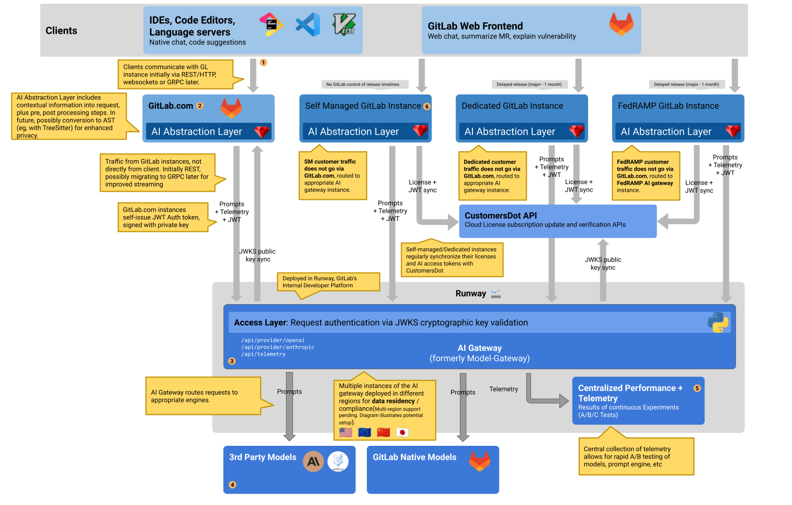

<!-- vale gitlab.FutureTense = NO -->

# AI-gateway

## Summary

The AI-gateway is a standalone-service that will give access to AI
features to all users of GitLab, no matter which instance they are
using: self-managed, dedicated or GitLab.com.

Initially, all AI-gateway deployments will be managed by GitLab (the
organization), and GitLab.com and all GitLab self-managed instances
will use the same gateway. However, in the future we could also deploy
regional gateways, or even customer-specific gateways if the need
arises.

The AI-Gateway is an API-Gateway that takes traffic from clients, in
this case GitLab installations, and directing it to different
services, in this case AI-providers and their models. This North/South
traffic pattern allows us to control what requests go where and to
translate the content of the redirected request where needed.



[Diagram source](https://docs.google.com/drawings/d/1PYl5Q5oWHnQAuxM-Jcw0C3eYoGw8a9w8atFpoLhhEas/edit)

By using a hosted service under the control of GitLab we can ensure
that we provide all GitLab instances with AI features in a scalable
way. It is easier to scale this small stateless service, than scaling
GitLab-rails with it's dependencies (database, Redis).

It allows users of self-managed installations to have access to
features using AI without them having to host their own models or
connect to 3rd party providers.

## Language: Python

The AI-Gateway was originally started as the "model-gateway" that
handled requests from IDEs to provide Code Suggestions. It was written
in Python.

Python is an object oriented language that is familiar enough for
Rubyists to pick up through in the younger codebase that is the
AI-gateway. It also makes it easy for data- and ML-engineers that
already have Python experience to contribute.

## API

### Basic stable API for the AI-gateway

Because the API of the AI-gateway will be consumed by a wide variety
of GitLab instances, it is important that we design a stable, yet
flexible API.

To do this, we can implement an API-endpoint per use-case we
build. This means that the interface between GitLab and the AI-gateway
is one that we build and own. This ensures future scalability,
composability and security.

The API is not versioned, but is backward compatible. See [cross version compatibility](#cross-version-compatibility)
for details. The AI-gateway will support the last 2 major
versions. For example when working on GitLab 17.2, we would support
both GitLab 17 and GitLab 16.

We can add common functionality like rate-limiting, circuit-breakers and
secret redaction at this level of the stack as well as in GitLab-rails.

#### Protocol

The communication between the AI-Gateway service and its clients (including the GitLab Rails application) shall use a JSON-based API.

The AI-Gateway API shall expose single-purpose endpoints responsible for providing access to different AI features. [A later section](#single-purpose-endpoints) of this document provides detailed guidelines for building specific endpoints.

The AI Gateway communication protocol shall only expect a rudimentary envelope that wraps all feature-specific dynamic information. The proposed architecture of the protocol allows the API endpoints to be version agnostic, and the AI-Gateway APIs compatible with multiple versions of GitLab(or other clients that use the gateway through GitLab).

 **This means
that all clients regardless of their versions use the same set of AI-Gateway API feature endpoints. The AI-gateway feature endpoints have to support different client versions, instead of creating multiple feature endpoints per different supported client versions**.

We can however add a version to the path in case we do want to evolve
a certain endpoint. It's not expected that we'll need to do this
often, but having a version in the path keeps the option open. The
benefit of this is that individual GitLab milestone releases will
continue pointing to the endpoint version it was tested against at the
time of release, while allowing us to iterate quickly by introducing
new endpoint versions.

We also considered gRPC as a protocol for communication between
GitLab instances, JSON API, and gRPC differ on these items:

| gRPC                                                                                                                                                                    | REST + JSON                                                                                       |
|-------------------------------------------------------------------------------------------------------------------------------------------------------------------------|---------------------------------------------------------------------------------------------------|
| + Strict protocol definition that is easier to evolve versionless                                                                                                       | - No strict schema, so the implementation needs to take good care of supporting multiple versions |
| + A new Ruby-gRPC server for vscode: likely faster because we can limit dependencies to load ([modular monolith](https://gitlab.com/gitlab-org/gitlab/-/issues/365293)) | - Existing Grape API for vscode: meaning slow boot time and unneeded resources loaded             |
| + Bi-directional streaming                                                                                                                                              | - Straight forward way to stream requests and responses (could still be added)                    |
| - A new Python-gRPC server: we don't have experience running gRPC-Python servers                                                                                        | + Existing Python fastapi server, already running for Code Suggestions to extend                  |
| - Hard to pass on unknown messages from vscode through GitLab to ai-gateway                                                                                             | + Easier support for newer vscode + newer ai-gatway, through old GitLab instance                  |
| - Unknown support for gRPC in other clients (vscode, jetbrains, other editors)                                                                                          | + Support in all external clients                                                                 |
| - Possible protocol mismatch (VSCode --REST--> Rails --gRPC--> AI gateway)                                                                                              | + Same protocol across the stack                                                                  |

**Discussion:** Because we chose REST+JSON in this iteration to port
features that already partially exist does not mean we need to exclude
new features using gRPC or Websockets. For example: Chat features
might be better served by streaming requests and responses. Since we
are suggesting an endpoint per use-case, different features could also
opt for different protocols, as long as we keep cross-version
compatibility in mind.

#### Single purpose endpoints

For features using AI, we prefer building a single purpose endpoint
with a stable API over the [provider API we expose](#exposing-ai-providers)
as a direct proxy.

Some features will have specific endpoints, while others can share
endpoints. For example, Code Suggestions or chat could have their own
endpoint, while several features that summarize issues or merge
requests could use the same endpoint but make the distinction on what
information is provided in the payload.

The end goal is to build an API that exposes AI for building
features without having to touch the AI-gateway. This is analogous to
how we built Gitaly, adding features to Gitaly where it was needed,
and reusing existing endpoints when that was possible. We had some
cost to pay up-front in the case where we needed to implement a new
endpoint (RPC), but pays off in the long run when most of the required
functionality is implemented.

**This does not mean that prompts need to be built inside the
AI-gateway.** But if prompts are part of the payload to a single
purpose endpoint, the payload needs to specify which model they were
built for along with other metadata about the prompts. By doing this,
we can gracefully degrade or otherwise try to support the request if
one of the prompt payloads is no longer supported by the AI
gateway. It allows us to potentially avoid breaking features in older
GitLab installations as the AI landscape changes.

### The AI-Gateway API protocol

It is important to build each single-purpose endpoint, in a version-agnostic way so it can be used by different GitLab instances (and indirectly by external clients). To achieve this goal:

**The AI-Gateway protocol shall rely on a simple JSON envelope wrapping all feature-specific information.** The AI-Gateway protocol can be seen as a transport layer protocol from [the OSI model](https://en.wikipedia.org/wiki/OSI_model) (eg: TCP, UDP) which defines how to transport information between nodes, without being aware of what information is being transported.

The AI-Gateway protocol does not specify which information received by single-purpose endpoint should be processed and in which way. Providing endpoint with the freedom to decide if they will use data coming from each protocol envelope or ignore it.

The AI-Gateway protocol defines each request in the following way:

1. Each single-purpose endpoint shall accept requests containing a single JSON object with a single key: `prompt_components`.
1. The `prompt_components` key shall contain an array of JSON envelopes that are built according to the following rules:

Each JSON envelope contains 3 elements:

1. `type`: A string identifier specifying a type of information that is being presented in the envelopes
  `payload`. The AI-gateway single-purpose endpoint may ignore any types it does not know about.
1. `payload`: The actual information that can be used by the AI-Gateway single-purpose endpoint to send requests to 3rd party AI services providers. The data inside the `payload` element can differ depending on the `type`, and the version of
  the client providing the `payload`. This means that the AI-Gateway
 single-purpose endpoint must consider the structure and the type of data present inside the `payload` optional, and gracefully handle missing or malformed information.
1. `metadata`: This field contains information about a client that built this `prompt_components` envelope. Information from the `metadata` field may, or may not be used by GitLab for
  telemetry. The same as with the `payload` all fields inside the `metadata` shall be considered optional.

The only envelope field that is expected to likely change often is the
`payload` one. There we need to make sure that all fields are
optional and avoid renaming, removing, or repurposing fields.

To document and validate the content of `payload` we can specify their
format using [JSON-schema](https://json-schema.org/).

An example request according to the AI-Gateway component looks as follows:

```json
{
  "prompt_components": [
    {
      "type": "prompt",
      "metadata": {
        "source": "GitLab EE",
        "version": "16.7.0-pre",
      },
      "payload": {
        "content": "...",
        "params": {
          "temperature": 0.2,
          "maxOutputTokens": 1024
        },
        "model": "code-gecko",
        "provider": "vertex-ai"
      }
    },
    {
      "type": "editor_content",
      "metadata": {
        "source": "vscode",
        "version": "1.1.1"
      },
       "payload": {
        "filename": "application.rb",
        "before_cursor": "require 'active_record/railtie'",
        "after_cursor": "\nrequire 'action_controller/railtie'",
        "open_files": [
          {
            "filename": "app/controllers/application_controller.rb",
            "content": "class ApplicationController < ActionController::Base..."
          }
        ]
      }
    }
  ]
}
```

Another example use case includes 2 versions of a prompt passed in the `prompt_components` payload. Where each version is tailored for different 3rd party AI model provider:

```json
{
  prompt_components: [
    {
      "type": "prompt",
      "metadata": {
        "source": "GitLab EE",
        "version": "16.7.0-pre",
      },
      "payload": {
        "content": "You can fetch information about a resource called an issue...",
        "params": {
          "temperature": 0.2,
          "maxOutputTokens": 1024
        },
        "model": "text-bison",
        "provider": "vertex-ai"
      }
    },
    {
      "type": "prompt",
      "metadata": {
        "source": "GitLab EE",
        "version": "16.7.0-pre",
      },
      "payload": {
        "content": "System: You can fetch information about a resource called an issue...\n\nHuman:",
        "params": {
          "temperature": 0.2,
        },
        "model": "claude-2",
        "provider": "anthropic"
      }
    }

  ]
}
```

#### Cross-version compatibility

**When renaming, removing, or repurposing fields inside `payload` is needed, a single-purpose endpoint that uses the affected envelope type must build support for the old versions of
a field in the gateway, and keep them around for at least 2 major
versions of GitLab.**

A good practise that might help support backwards compatibility is to provide building blocks for the prompt inside the `prompt_components` rather then a complete prompt. By moving responsibility of compiling prompt out of building blocks on the AI-Gateway, one can achive more flexibility in terms of prompt adjustments in the future.

#### Example feature: Code Suggestions

For example, a rough Code Suggestions service could look like this:

```plaintext
POST /v3/code/completions
```

```json
{
  "prompt_components": [
    {
      "type": "prompt",
      "metadata": {
        "source": "GitLab EE",
        "version": "16.7.0-pre",
      },
      "payload": {
        "content": "...",
        "params": {
          "temperature": 0.2,
          "maxOutputTokens": 1024
        },
        "model": "code-gecko",
        "provider": "vertex-ai"
      }
    },
    {
      "type": "editor_content",
      "metadata": {
        "source": "vscode",
        "version": "1.1.1"
      },
       "payload": {
        "filename": "application.rb",
        "before_cursor": "require 'active_record/railtie'",
        "after_cursor": "\nrequire 'action_controller/railtie'",
        "open_files": [
          {
            "filename": "app/controllers/application_controller.rb",
            "content": "class ApplicationController < ActionController::Base..."
          }
        ]
      }
    }
  ]
}
```

A response could look like this:

```json
{
  "response": "require 'something/else'",
  "metadata": {
    "identifier": "deadbeef",
    "model": "code-gecko",
    "timestamp": 1688118443
  }
}
```

The `metadata` field contains information that could be used in a
telemetry endpoint on the AI-gateway where we could count
suggestion-acceptance rates among other things.

The way we will receive telemetry for Code Suggestions is being
discussed in [#415745](https://gitlab.com/gitlab-org/gitlab/-/issues/415745).
We will try to come up with an architecture for all AI-related features.

#### Exposing AI providers

A lot of AI functionality has already been built into GitLab-Rails
that currently builds prompts and submits this directly to different
AI providers. At the time of writing, GitLab has API-clients for the
following providers:

- [Anthropic](https://gitlab.com/gitlab-org/gitlab/blob/4344729240496a5018e19a82030d6d4b227e9c79/ee/lib/gitlab/llm/anthropic/client.rb#L6)
- [Vertex](https://gitlab.com/gitlab-org/gitlab/blob/4344729240496a5018e19a82030d6d4b227e9c79/ee/lib/gitlab/llm/vertex_ai/client.rb#L6)
- [OpenAI](https://gitlab.com/gitlab-org/gitlab/blob/4344729240496a5018e19a82030d6d4b227e9c79/ee/lib/gitlab/llm/open_ai/client.rb#L8)

To make these features available to self-managed instances, we should
provide endpoints for each of these that GitLab.com, self-managed or
dedicated installations can use to give these customers to these
features.

In a first iteration we could build endpoints that proxy the request
to the AI provider. This should make it easier to migrate to routing
these requests through the AI-Gateway. As an example, the endpoint for
Anthropic could look like this:

```plaintext
POST /internal/proxy/anthropic/(*endpoint)
```

The `*endpoint` means that the client specifies what is going to be
called, for example `/v1/complete`. The request body is entirely
forwarded to the AI provider. The AI-gateway makes sure the request is
correctly authenticated.

Having the proxy in between GitLab and the AI provider means that we
still have control over what goes through to the AI provider and if
the need arises, we can manipulate or reroute the request to a
different provider. Doing this means that we could keep supporting
the features of older GitLab installations even if the provider's API
changes or we decide not to work with a certain provider anymore.

I think there is value in moving features that use API providers
directly to a feature-specific purpose built API. Doing this means
that we can improve these features as AI providers evolve by changing
the AI-gateway that is under our control. Customers using self-managed
or dedicated installations could then start getting better
AI-supported features without having to upgrade their GitLab instance.

Features that are currently
[experimental](../../../policy/experiment-beta-support.md#experiment)
can use these generic APIs, but we should aim to convert to a single
purpose API endpoint before we make the feature [generally available](../../../policy/experiment-beta-support.md#generally-available-ga)
for self-managed installations. This makes it easier for us to support
features long-term even if the landscape of AI providers change.

The [Experimental REST API](../../../development/ai_features/index.md#experimental-rest-api)
available to GitLab team members should also use this proxy in the
short term. In the longer term, we should provide developers access to
a separate proxy that allows them to use GitLab owned authentication
to several AI providers for experimentation. This will separate the
traffic from developers trying out new things from the fleet that is
serving paying customers.

### API in GitLab instances

This is the API that external clients can consume on their local
GitLab instance. For example VSCode that talks to a self-managed
instance.

These versions could also widely defer: it could be that the VSCode
extension is kept up-to-date by developers. But the GitLab instance
they use for work is kept a minor version behind. So the same
requirements in terms of stability and flexibility apply for the
clients as for the AI gateway.

In a first iteration we could consider keeping the current REST
payloads that the VSCode extension and the Web-IDE send, but direct it
to the appropriate GitLab installation. GitLab-rails can wrap the
payload in an envelope for the AI-gateway without having to interpret
it.

When we do this then the GitLab-instance that receives the request
from the extension doesn't need to understand it to enrich it and pass
it on to the AI-Gateway. GitLab can add information to the
`prompt_components` and pass everything that was already there
straight through to the AI-gateway.

If a request is initiated from another client (for example VSCode),
GitLab-rails needs to forward the entire payload in addition to any
other enhancements and prompts. This is required so we can potentially
support changes from a newer version of the client, traveling through
an outdated GitLab installation to a recent AI-gateway.

**Discussion:** This first iteration is also using a REST+JSON
approach. This is how the VSCode extension is currently communicating
with the model gateway. This means that it's a smaller iteration to go
from that, to wrapping that existing payload into an envelope. With
the added advantage of cross version compatibility. But it does not
mean that future iterations also need to use REST+JSON. As each
feature would have it's own endpoint, the protocol could also be
different.

## Authentication & Authorization

GitLab provides the first layer of authorization: It authenticates
the user and checks if the license allows using the feature the user is
trying to use. This can be done using the authentication, policy and license
checks that are already built into GitLab.

Authenticating the GitLab-instance on the AI-gateway was discussed
in:

- [Issue 177](https://gitlab.com/gitlab-org/modelops/applied-ml/code-suggestions/ai-assist/-/issues/177)
- [Epic 10808](https://gitlab.com/groups/gitlab-org/-/epics/10808)

The specific mechanism by which trust is delegated between end-users, GitLab instances,
and the AI-gateway is covered in the [AI gateway access token validation documentation](../../../development/cloud_connector/code_suggestions_for_sm.md#ai-gateway-access-token-validation).

## Embeddings

Embeddings can be requested for all features in a single endpoint, for
example through a request like this:

```plaintext
POST /internal/embeddings
```

```json
{
  "content": "The lazy fox and the jumping dog",
  "content_type": "issue_title",
  "metadata": {
    "source": "GitLab EE",
    "version": "16.3"
  }
}
```

The `content_type` and properties `content` could in the future be
used to create embeddings from different models based on what is
appropriate.

The response will include the embedding vector besides the used
provider and model. For example:

```json
{
  "response": [0.2, -1, ...],
  "metadata": {
    "identifier": "8badf00d",
    "model": "text-embedding-ada-002",
    "provider": "open_ai",
  }
}
```

When storing the embedding, we should make sure we include the model
and provider data. When embeddings are used to generate a prompt, we
could include that metadata in the payload so we can judge the quality
of the embedding.

## Deployment

Currently, the model-gateway that will become the AI-gateway is being
deployed using from the project repository in
[`gitlab-org/modelops/applied-ml/code-suggestions/ai-assist`](https://gitlab.com/gitlab-org/modelops/applied-ml/code-suggestions/ai-assist).

It is deployed to a Kubernetes cluster in it's own project. There is a
staging environment that is currently used directly by engineers for
testing.

In the future, this will be deloyed using
[Runway](https://gitlab.com/gitlab-com/gl-infra/platform/runway/). At
that time, there will be a production and staging deployment. The
staging deployment can be used for automated QA-runs that will have
the potential to stop a deployment from reaching production.

Further testing strategy is being discussed in
[&10563](https://gitlab.com/groups/gitlab-org/-/epics/10563).

## Alternative solutions

Alternative solutions were discussed in
[applied-ml/code-suggestions/ai-assist#161](https://gitlab.com/gitlab-org/modelops/applied-ml/code-suggestions/ai-assist/-/issues/161#what-are-the-alternatives).
