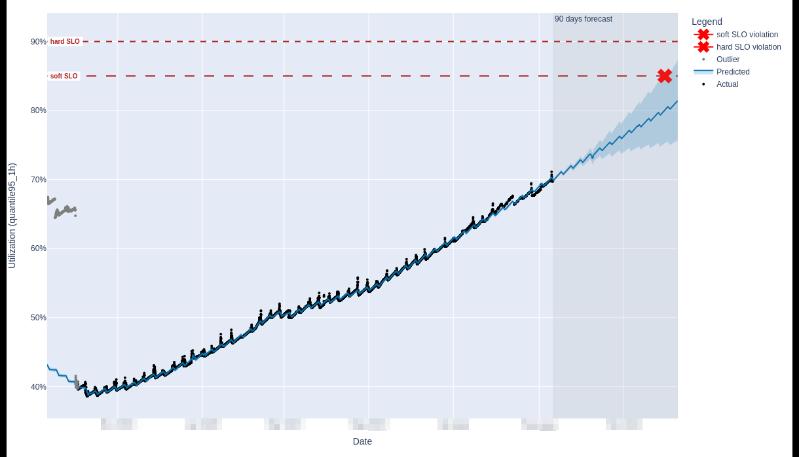
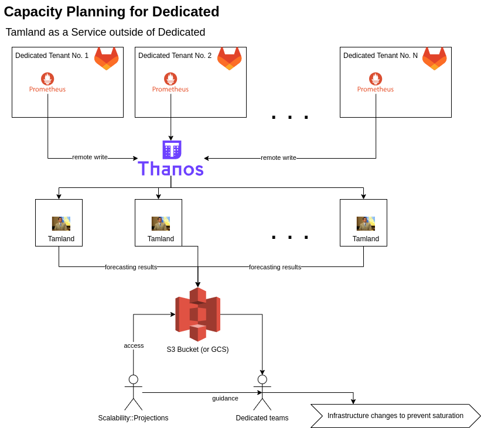

<!-- Blueprints often contain forward-looking statements -->
<!-- vale gitlab.FutureTense = NO -->

# Capacity planning for GitLab Dedicated

## Summary

This document outlines how we plan to set up infrastructure capacity planning for GitLab Dedicated tenant environments, which started as a [FY24-Q3 OKR](https://gitlab.com/gitlab-com/gitlab-OKRs/-/work_items/3507).

We make use of [Tamland](https://gitlab.com/gitlab-com/gl-infra/tamland), a tool we build to provide saturation forecasting insights for GitLab.com infrastructure resources.
We propose to include Tamland as a part of the GitLab Dedicated stack and execute forecasting from within the tenant environments.

Tamland predicts SLO violations and their respective dates, which need to be reviewed and acted upon.
In terms of team organisation, the Dedicated team is proposed to own the tenant-side setup for Tamland and to own the predicted SLO violations, with the help and guidance of the Scalability::Projections team, which drives further development, documentation and overall guidance for capacity planning, including for Dedicated.

With this setup, we aim to turn Tamland into a more generic tool, which can be used in various environments including but not limited to Dedicated tenants.
Long-term, we think of including Tamland in self-managed installations and think of Tamland as a candidate for open source release.

## Motivation

### Background: Capacity planning for GitLab.com

[Tamland](https://gitlab.com/gitlab-com/gl-infra/tamland) is an infrastructure resource forecasting project owned by the [Scalability::Observability](https://about.gitlab.com/handbook/engineering/infrastructure/team/scalability/#scalabilityobservability) group.
It implements [capacity planning](https://about.gitlab.com/handbook/engineering/infrastructure/capacity-planning/) for GitLab.com, which is a [controlled activity covered by SOC 2](https://gitlab.com/gitlab-com/gl-security/security-assurance/security-compliance-commercial-and-dedicated/observation-management/-/issues/604).
As of today, it is used exclusively for GitLab.com to predict upcoming SLO violations across hundreds of monitored infrastructure components.

Tamland produces a [report](https://gitlab-com.gitlab.io/gl-infra/tamland/intro.html) (hosted on GitLab Pages) containing forecast plots, information around predicted violations and other information around the components monitored.
Any predicted SLO violation result in a capacity warning issue being created in the [issue tracker for capacity planning](https://gitlab.com/gitlab-com/gl-infra/capacity-planning/-/boards/2816983) on GitLab.com.

At present, Tamland is quite tailor made and specific for GitLab.com:

1. GitLab.com specific parameters and assumptions are built into Tamland
1. We execute Tamland from a single CI project, exclusively for GitLab.com

[Turning Tamland into a tool](https://gitlab.com/groups/gitlab-com/gl-infra/-/epics/1106) we can use more generically and making it independent of GitLab.com specifics is subject of ongoing work.

For illustration, we can see a saturation forecast plot below for the `disk_space` resource for a PostgreSQL service called `patroni-ci`.
Within the 90 days forecast horizon, we predict a violation of the `soft` SLO (set at 85% saturation) and this resulted in the creation of a [capacity planning issue](https://gitlab.com/gitlab-com/gl-infra/capacity-planning/-/issues/1219) for further review and potential actions.
At present, the Scalability::Projections group reviews those issues and engages with the respective DRI for the service in question to remedy a saturation concern.

For GitLab.com capacity planning, we operate Tamland from a scheduled CI pipeline with access to the central Thanos, which provides saturation and utilization metrics for GitLab.com.
The CI pipeline produces the desired report, exposes it on GitLab Pages and also creates capacity planning issues.
Scalability::Projections runs a capacity planning triage rotation which entails reviewing and prioritizing any open issues and their respective saturation concerns.

### Problem Statement

With the number of [GitLab Dedicated](https://about.gitlab.com/dedicated/) deployments increasing, we need to establish capacity planning processes for Dedicated tenants.
This is going to help us notice any pending resource constraints soon enough to be able to upgrade the infrastructure for a given tenant before the resource saturates and causes an incident.

Each Dedicated tenant is an isolated GitLab environment, with a full set of metrics monitored.
These metrics are standardized in the [metrics catalog](https://gitlab.com/gitlab-com/runbooks/-/blob/master/reference-architectures/get-hybrid/src/gitlab-metrics-config.libsonnet?ref_type=heads) and on top of these, we have defined saturation metrics along with respective SLOs.

In order to provide capacity planning and forecasts for saturation metrics for each tenant, we'd like to get Tamland set up for GitLab Dedicated.

While Tamland is developed by the Scalability::Projections and this team also owns the capacity planning process for GitLab.com, they don't have access to any of the Dedicated infrastructure as we have strong isolation implemented for Dedicated environments.
As such, the technical design choices are going to affect how those teams interact and vice versa. We include this consideration into this documentation as we think the organisational aspect is a crucial part of it.

### Key questions

1. How does Tamland access Prometheus data for each tenant?
1. Where does Tamland execute and how do we scale that?
1. Where do we store resulting forecasting data?
1. How do we consume the forecasts?

### Goals: Iteration 0

1. Tamland is flexible enough to forecast saturation events for a Dedicated tenant and for GitLab.com separately
1. Forecasting is executed at least weekly, for each Dedicated tenant
1. Tamland's output is forecasting data only (plots, SLO violation dates, etc. - no report, no issue management - see below)
1. Tamland stores the output data in a S3 bucket for further inspection

#### Non-goals

##### Reporting

As of today, it's not quite clear yet how we'd like to consume forecasting data across tenants.
In contrast to GitLab.com, we generate forecasts across a potentially large number of tenants.
At this point, we suspect that we're more interested in an aggregate report across tenants rather than individual, very detailed saturation forecasts.
As such, this is subject to refinement in a further iteration once we have the underlying data available and gathered practical insight in how we consume this information.

##### Issue management

While each predicted SLO violation results in the creation of a GitLab issue, this may not be the right mode of raising awareness for Dedicated.
Similar to the reporting side, this is subject to further discussion once we have data to look at.

##### Customizing forecasting models

Forecasting models can and should be tuned and informed with domain knowledge to produce accurate forecasts.
This information is a part of the Tamland manifest.
In the first iteration, we don't support per-tenant customization, but this can be added later.

## Proposed Design for Dedicated: A part of the Dedicated stack

Dedicated environments are fully isolated and run their own Prometheus instance to capture metrics, including saturation metrics.
Tamland will run from each individual Dedicated tenant environment, consume metrics from Prometheus and store the resulting data in S3.
From there, we consume forecast data and act on it.

### Storage for output and cache

Any data Tamland relies on is stored in a S3 bucket.
We use one bucket per tenant to clearly separate data between tenants.

1. Resulting forecast data and other outputs
1. Tamland's internal cache for Prometheus metrics data

There is no need for a persistent state across Tamland runs aside from the S3 bucket.

### Benefits of executing inside tenant environments

Each Tamland run for a single environment (tenant) can take a few hours to execute.
With the number of tenants expected to increase significantly, we need to consider scaling the execution environment for Tamland.

In this design, Tamland becomes a part of the Dedicated stack and a component of the individual tenant environment.
As such, scaling the execution environment for Tamland is solved by design, because tenant forecasts execute inherently parallel in their respective environments.

### Distribution model: Docker

Tamland is released as a Docker image, see [Tamland's README](https://gitlab.com/gitlab-com/gl-infra/tamland/-/blob/main/README.md) for further details.

### Tamland manifest

The manifest contains information about which saturation metrics to forecast on (see this [manifest example](https://gitlab.com/gitlab-com/gl-infra/tamland/-/blob/62854e1afbc2ed3160a55a738ea587e0cf7f994f/saturation.json) for GitLab.com).
This will be generated from the metrics catalog and will be the same for all tenants for starters.

In order to generate the manifest from the metrics catalog, we setup dedicated GitLab project `tamland-dedicated`.
On a regular basis, a scheduled pipeline grabs the metrics catalog, generates the JSON manifest from it and commits this to the project.

On the Dedicated tenants, we download the latest version of the committed JSON manifest from `tamland-dedicated` and use this as input to execute Tamland.

### Acting on forecast insights

When Tamland forecast data is available for a tenant, the Dedicated teams consume this data and act on it accordingly.
The Scalability::Observability group is going to support and guide this process to get started and help interpret data, along with implementing Tamland features required to streamline this process for Dedicated in further iterations.

## Alternative Solution

### Tamland as a Service (not chosen)

An alternative design, we don't consider an option at this point, is to setup Tamland as a Service and run it fully **outside** of tenant environments.

In this design, a central Prometheus/Thanos instance is needed to provide the metrics data for Tamland.
Dedicated tenants use remote-write to push their Prometheus data to the central Thanos instance.

Tamland is set up to run on a regular basis and consume metrics data from the single Thanos instance.
It stores its results and cache in S3, similar to the other design.

In order to execute forecasts regularly, we need to provide an execution environment to run Tamland in.
With an increasing number of tenants, we'd need to scale up resources for this cluster.

This design **has not been chosen** because of both technical and organisational concerns:

1. Our central Thanos instance currently doesn't have metrics data for Dedicated tenants as of the start of FY24Q3.
1. Extra work required to set up scalable execution environment.
1. Thanos is considered a bottleneck as it provides data for all tenants and this poses a risk of overloading it when we execute the forecasting for a high number of tenants.
1. We strive to build out Tamland into a tool of more general use. We expect a better outcome in terms of design, documentation and process efficiency by building it as a tool for other teams to use and not offering it as a service. In the long run, we might be able to integrate Tamland (as a tool) inside self-managed environments or publish Tamland as an open source forecasting tool. This would not be feasible if we were hosting it as a service.
