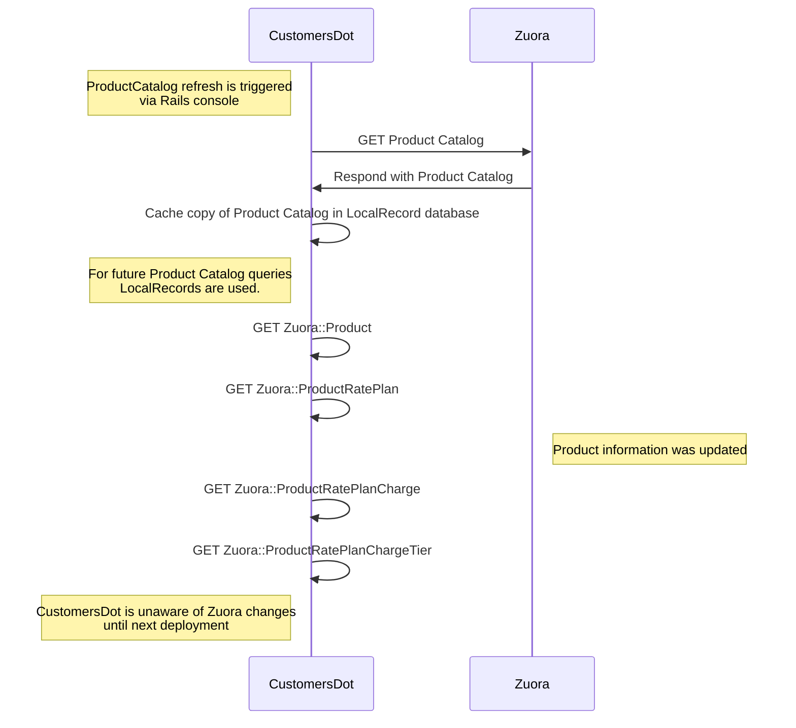
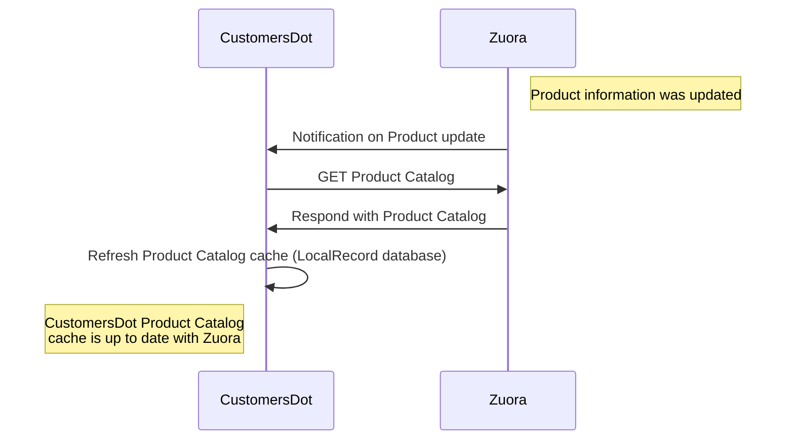
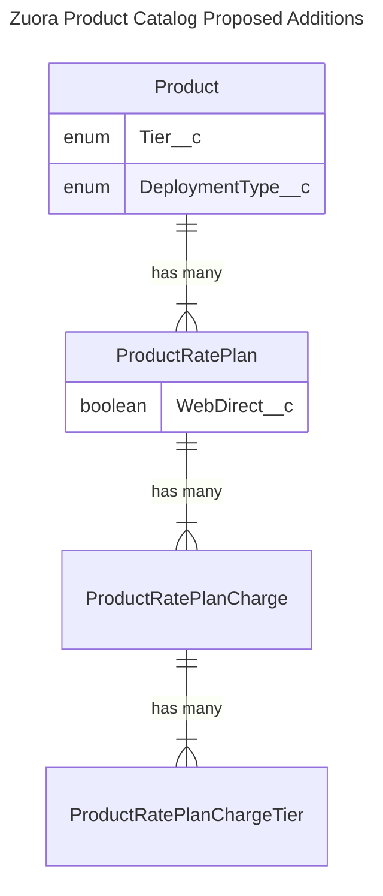

# Automate CustomersDot Plan management

## Summary

The [GitLab Customers Portal](https://customers.gitlab.com/) is an independent application, distinct from the GitLab product, designed to empower GitLab customers in managing their accounts, subscriptions, and conducting tasks such as renewing and purchasing additional seats. More information about the Customers Portal can be found in [the GitLab docs](../../../subscriptions/customers_portal.md). Internally, the application is known as [CustomersDot](https://gitlab.com/gitlab-org/customers-gitlab-com) (also known as CDot).

GitLab uses [Zuora's platform](https://handbook.gitlab.com/handbook/business-technology/enterprise-applications/guides/zuora/) as the SSoT for all product-related information. The [Zuora Product Catalog](https://knowledgecenter.zuora.com/Get_Started/Zuora_quick_start_tutorials/B_Billing/A_The_Zuora_Product_Catalog) represents the full list of revenue-making products and services that are sellable, or have been sold by GitLab, which is core knowledge for CustomersDot decision making. CustomersDot currently has a local cache of the Zuora Product Catalog via the [IronBank](https://github.com/zendesk/iron_bank) gem and [its LocalRecord extension](https://gitlab.com/gitlab-org/customers-gitlab-com/blob/45f5dedbb4fa803d19827472214ea0b5b0ce1861/lib/gem_extensions/iron_bank/local_records.rb#L1).

CustomersDot uses `Plan` as a wrapper class for easy access to all the details about a Plan in the Product Catalog. Given the name, price, minimum quantity and other details of the Plan are spread around the `Zuora::ProductRatePlan`, `Zuora::ProductRatePlanCharge` and `Zuora::ProductRatePlanChargeTier` objects, traditional access of these details can be cumbersome. This class is very useful because it saves us the need to query for all these details. On the other hand this class helps with the classification of `Zuora::ProductRatePlan`s based on their tier, deployment type, and other criteria to be used across the app.

CustomersDot's cached Product Catalog is currently synced manually and requires a restart of CustomersDot to be fully refreshed due to limitations in the `Plan` class. Every time a new Product, Product Rate Plan or Product Rate Plan Charge are updated or added to the Zuora Product Catalog, an additional manual effort is required to add it to the `Plan` class and configure it.

The main goal for this design document is to improve the architecture and maintainability of the `Plan` model within CustomersDot. When the Product Catalog is updated in Zuora, it automatically reflects in CustomersDot without requiring app restarts, code changes, or manual intervention.

## Motivation

Current Zuora Product Catalog updates are not automatically picked up by CustomersDot for a couple of reasons:

- CustomersDot's cached Product Catalog sync requires a manual intervention via Rails console and a full refresh requires a server restart due to `Plan` heavily relying on constants and class variables for its `Zuora::ProductRatePlan` classification.
- Every time a new Product / SKU is added to the Zuora Product Catalog, even if the cache previously described is refreshed, it requires code changes in CustomersDot to make it available. This is due to the current strategy the `Plan` class uses for classification consisting of assigning the `Zuora::ProductRatePlan` ids to constants and then manually forming groups of ids to represent different categories like all plans in the Ultimate tier or all the add-ons available for self procurement for GitLab.com and then uses those categories for decision-making during execution.

As the codebase and number of product grows this manual intervention becomes more expensive.

### Goals

The main goals are:

- Make sure the CustomersDot cached Product Catalog is in sync with Zuora at any point in time.
- Automate the Plan management in CustomersDot so it will require no manual intervention for basic Product Catalog updates in Zuora. For example, if a new Product / SKU is added, if a RatePlanCharge is updated, or if a Product is discontinued. For this we need to step away from hardcoding product rate plan ids within CustomersDot and transfer the classification knowledge to the ProductCatalog (by adding CustomersDot metadata to it in the form of custom fields) to be able to resolve these sets dynamically from the `LocalRecord`s on demand.

## Proposal

CustomersDot currently [has a local cache](https://gitlab.com/gitlab-org/customers-gitlab-com/-/merge_requests/1762) of the Zuora's Product Catalog via the [IronBank](https://github.com/zendesk/iron_bank) gem and [its LocalRecord extension](https://gitlab.com/gitlab-org/customers-gitlab-com/blob/45f5dedbb4fa803d19827472214ea0b5b0ce1861/lib/gem_extensions/iron_bank/local_records.rb#L1).

At the moment we refresh this cache manually when we are notified that a new change exists in Zuora that is of interest for CustomersDot:



### Iteration 1

Keep Product Catalog in sync with Zuora so at any point in time:



### Iteration 2

Transfer CustomersDot's classification knowledge to the Zuora Product Catalog (by adding CustomersDot metadata to it in the form of custom fields) to be able to resolve `ProductRatePlan`s directly from the `LocalRecord`s on demand.

We are proposing to add these custom fields to the Product Catalog:



### Iteration 3

Use Zuora custom metadata (introduced in iteration 2) to resolve `ProductRatePlan`s directly from the Zuora Product Catalog, and remove the `Plan` constants that are preventing the full cache refresh.

## Design and implementation details

### Iteration 1

**(Iteration 1) Product Catalog is in sync with Zuora**

- Cron job to refresh the Product Catalog every day as a first iteration and add immediate value.
- Create a Finance Systems issue to request:
  - New custom event for when custom fields are updated for records from the Zuora Product Catalog.
      | Base object               | Custom event name                      |
      | ------------------------- | -------------------------------------- |
      | Product                   | CatalogProductUpdate                   |
      | ProductRatePlan           | CatalogProductRatePlanUpdate           |
      | ProductRatePlanCharge     | CatalogProductRatePlanChargeUpdate     |
      | ProductRatePlanChargeTier | CatalogProductRatePlanChargeTierUpdate |
  - New callout under the `Billing` component for when records from the Zuora Product Catalog are added, deleted or updated.
- Create a new controller in CustomersDot based on `ActionController::Metal` to not include redundant middlewares, callbacks, additional Rails stuff and make this controller as fast as possible.

  ```ruby
  module Zuora
    class WebHooksController < ActionController::Metal
      feature_category :platform

      def create
        # Step 1. Validate and save an incoming webhook payload into the database
        # Step 2. Kick of the SyncProductCatalogJob
        head :ok
      end
    end
  end
  ```

Ensure a debouncing strategy for `SyncProductCatalogJob` in case we get too many Product Catalog update notifications in a short period of time. Initially we can delay its execution for 5 minutes and ensure no new job is enqueued if one is already in the queue.

**(Iteration 2) Transfer CustomersDot's classification knowledge to the Zuora Product Catalog**

_All these changes require a Finance Systems issue._

- Review existing field `Zuora::Product#category` to make sure it is properly set for all Products. Possible values: `[null, "Base Products", "Add On Services", "Miscellaneous Products"]`.
- Add new custom field `Zuora::ProductRatePlan#web_direct` to be a `boolean`
  - true: the plan is available for self service
  - false: the plan is not available for self service
- Add new custom field `Product#tier` to be an `enum` (multiselect). Possible values: `[premium, ultimate, starter, bronze, silver, gold, free, null]`
- Add new custom field `Product#deployment_type` to be an `enum` (multiselect). Possible values: `[self_managed, dedicated, gitlab_dot_com]`

For each added field: the value in Zuora has to be aligned with CustomersDot classification given by `Zuora::ProductRatePlan` ids current grouping in the `Plan` class.

NOTE:
There is a [current effort](https://gitlab.com/gitlab-com/business-technology/enterprise-apps/intake/-/issues/44) to add some of these fields to Zuora so we might be able to reuse these. If we are reusing these we need to double check that the value in Zuora and CustomersDot classification are aligned
for each.

**(Iteration 3) Use this Zuora custom metadata to resolve `ProductRatePlan`s directly from the Zuora Catalog**

- Create scopes to fetch `Zuora::Product`s and `Zuora::ProductRatePlan`s based on the metadata introduced in Iteration 2. Possible scopes:
  - `self_managed`
  - `dedicated`
  - `gitlab_dot_com`
  - `base_products`
  - `add_ons`
  - `web_direct`
  - `sales_assisted`
  - `ultimate`
  - `premium`
  - `active` (based on the effective start / end dates)
- Replace the usage of `Plan` constants that represent a collection of records that meet a given classification by a call to a method that loads the same collection from LocalRecords using the implemented scopes e.g. `ALL_ULTIMATE_SM_PLANS` can be replaced with `Zuora::Product.self_managed.ultimate.flat_map(&:product_rate_plans).map(&:id)`. This step can be done in iteration until all constants are replaced. Depending on how complex each iteration is we can decide if a feature flag is required or not.
