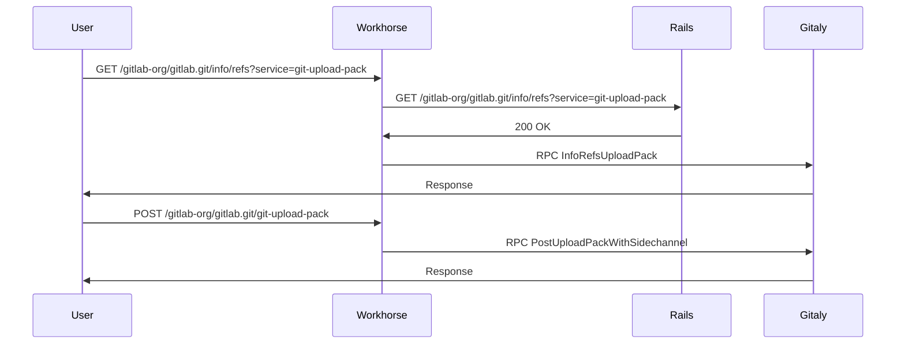
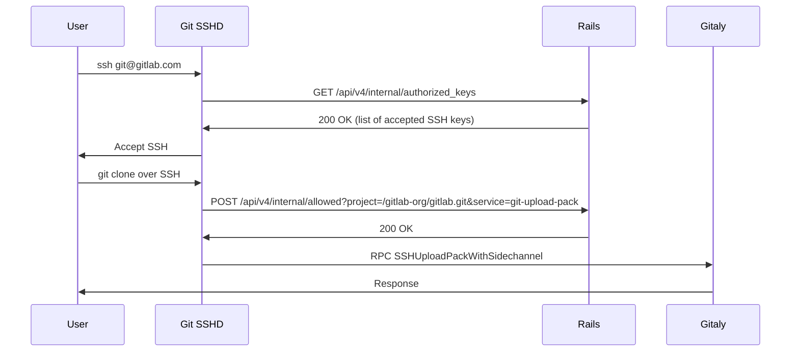
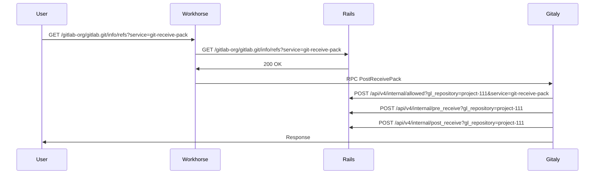
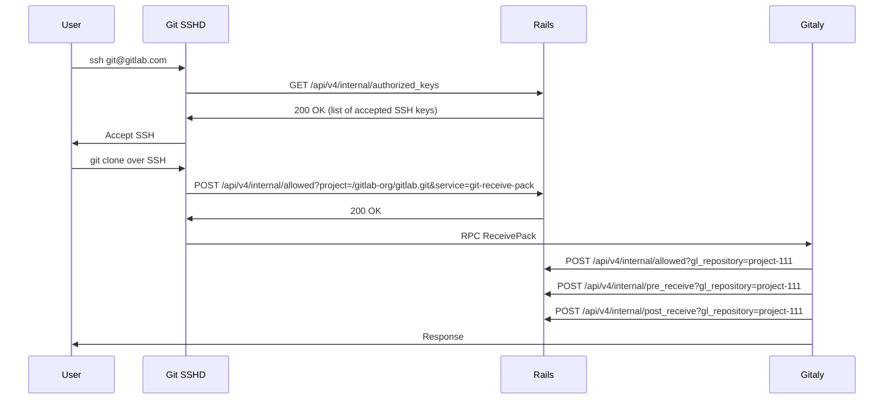
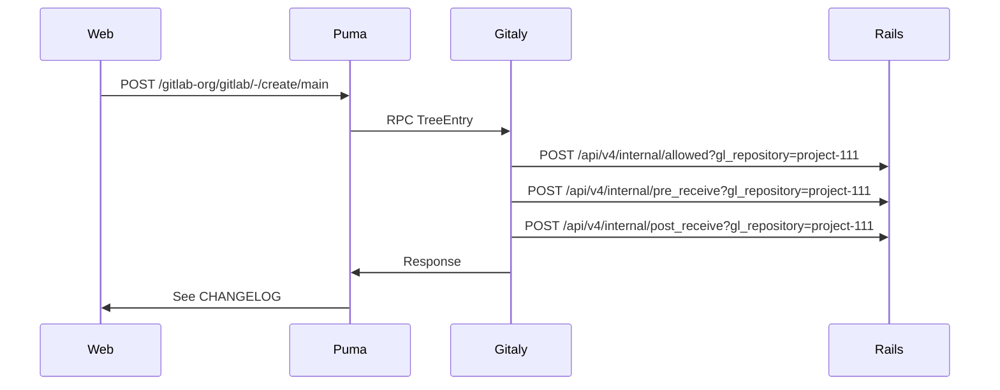

<!-- vale gitlab.FutureTense = NO -->

This document is a work-in-progress and represents a very early state of the
Cells design. Significant aspects are not documented, though we expect to add
them in the future. This is one possible architecture for Cells, and we intend to
contrast this with alternatives before deciding which approach to implement.
This documentation will be kept even if we decide not to implement this so that
we can document the reasons for not choosing this approach.

# Cells: Git Access

This document describes impact of Cells architecture on all Git access (over HTTPS and SSH)
patterns providing explanation of how potentially those features should be changed
to work well with Cells.

## 1. Definition

Git access is done through out the application. It can be an operation performed by the system
(read Git repository) or by user (create a new file via Web IDE, `git clone` or `git push` via command line).

The Cells architecture defines that all Git repositories will be local to the Cell,
so no repository could be shared with another Cell.

The Cells architecture will require that any Git operation done can only be handled by a Cell holding
the data. It means that any operation either via Web interface, API, or GraphQL needs to be routed
to the correct Cell. It means that any `git clone` or `git push` operation can only be performed
in a context of a Cell.

## 2. Data flow

The are various operations performed today by the GitLab on a Git repository. This describes
the data flow how they behave today to better represent the impact.

It appears that Git access does require changes only to a few endpoints that are scoped to project.
There appear to be different types of repositories:

- Project: assigned to Group
- Wiki: additional repository assigned to Project
- Design: similar to Wiki, additional repository assigned to Project
- Snippet: creates a virtual project to hold repository, likely tied to the User

### 2.1. Git clone over HTTPS

Execution of: `git clone` over HTTPS

### 2.2. Git clone over SSH

Execution of: `git clone` over SSH

### 2.3. Git push over HTTPS

Execution of: `git push` over HTTPS

### 2.4. Git push over SSHD

Execution of: `git clone` over SSH

### 2.5. Create commit via Web

Execution of `Add CHANGELOG` to repository:

## 3. Proposal

The Cells stateless router proposal requires that any ambiguous path (that is not routable)
will be made to be routable. It means that at least the following paths will have to be updated
do introduce a routable entity (project, group, or organization).

Change:

- `/api/v4/internal/allowed` => `/api/v4/internal/projects/<gl_repository>/allowed`
- `/api/v4/internal/pre_receive` => `/api/v4/internal/projects/<gl_repository>/pre_receive`
- `/api/v4/internal/post_receive` => `/api/v4/internal/projects/<gl_repository>/post_receive`
- `/api/v4/internal/lfs_authenticate` => `/api/v4/internal/projects/<gl_repository>/lfs_authenticate`

Where:

- `gl_repository` can be `project-1111` (`Gitlab::GlRepository`)
- `gl_repository` in some cases might be a full path to repository as executed by GitLab Shell (`/gitlab-org/gitlab.git`)

## 4. Evaluation

Supporting Git repositories if a Cell can access only its own repositories does not appear to be complex.

The one major complication is supporting snippets, but this likely falls in the same category as for the approach
to support user's personal namespaces.

## 4.1. Pros

1. The API used for supporting HTTPS/SSH and Hooks are well defined and can easily be made routable.

## 4.2. Cons

1. The sharing of repositories objects is limited to the given Cell and Gitaly node.
1. The across-Cells forks are likely impossible to be supported (discover: how this work today across different Gitaly node).
