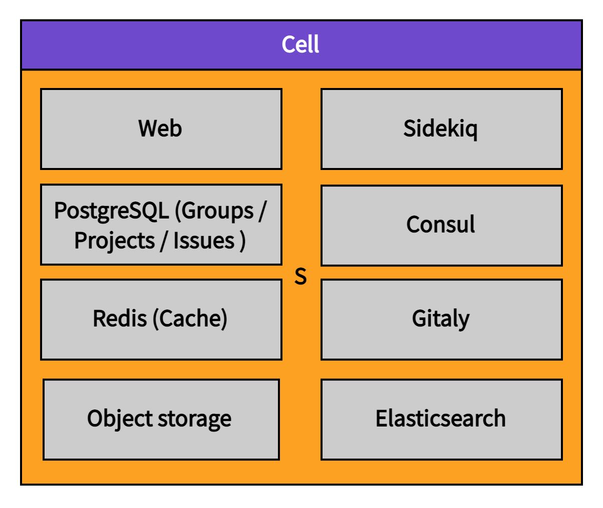
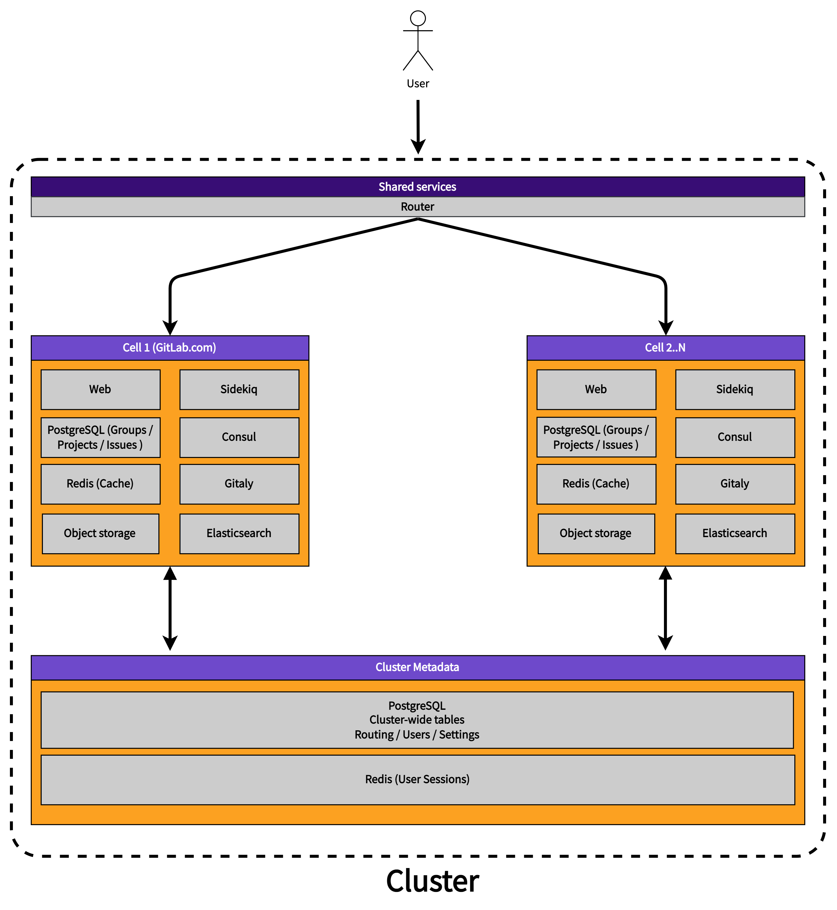
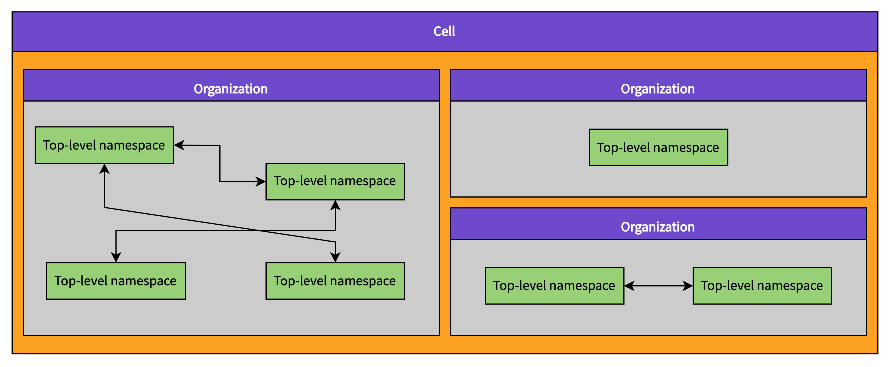
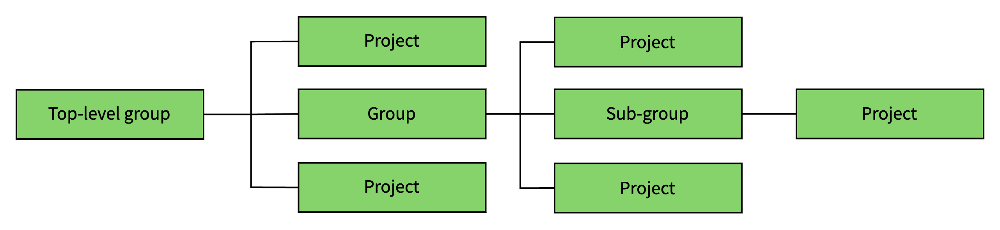

# Cells: Glossary

We use the following terms to describe components and properties of the Cells architecture.

## Cell

> Pod was renamed to Cell in <https://gitlab.com/gitlab-com/www-gitlab-com/-/merge_requests/121163>

A Cell is a set of infrastructure components that contains multiple top-level groups that belong to different organizations. The components include both datastores (PostgreSQL, Redis etc.) and stateless services (web etc.). The infrastructure components provided within a Cell are shared among organizations and their top-level groups but not shared with other Cells. This isolation of infrastructure components means that Cells are independent from each other.

### Cell properties

- Each cell is independent from the others
- Infrastructure components are shared by organizations and their top-level groups within a Cell
- More Cells can be provisioned to provide horizontal scalability
- A failing Cell does not lead to failure of other Cells
- Noisy neighbor effects are limited to within a Cell
- Cells are not visible to organizations; it is an implementation detail
- Cells may be located in different geographical regions (for example, EU, US, JP, UK)

Discouraged synonyms: GitLab instance, cluster, shard

## Cluster

A cluster is a collection of Cells.

### Cluster properties

- A cluster holds cluster-wide metadata, for example Users, Routes, Settings.

Discouraged synonyms: whale

## Organizations

GitLab references [Organizations in the initial set up](../../../topics/set_up_organization.md) and users can add a (free text) organization to their profile. There is no Organization entity established in the GitLab codebase.

As part of delivering Cells, we propose the introduction of an `organization` entity. Organizations would represent billable entities or customers.

Organizations are a known concept, present for example in [AWS](https://docs.aws.amazon.com/whitepapers/latest/organizing-your-aws-environment/core-concepts.html) and [GCP](https://cloud.google.com/resource-manager/docs/cloud-platform-resource-hierarchy#organizations).

Organizations work under the following assumptions:

1. Users care about what happens within their organizations.
1. Features need to work within an organization.
1. Only few features need to work across organizations.
1. Users understand that the majority of pages they view are only scoped to a single organization at a time.
1. Organizations are located on a single cell.

### Organization properties

- Top-level groups belong to organizations
- Organizations are isolated from each other by default meaning that cross-group features will only work for group that exist within a single organization
- User namespaces must not belong to an organization

Discouraged synonyms: Billable entities, customers

## Top-Level group

Top-level group is the name given to the top most group of all other groups. Groups and projects are nested underneath the top-level group.

Example:

`https://gitlab.com/gitlab-org/gitlab/`:

- `gitlab-org` is a `top-level group`; the root for all groups and projects of an organization
- `gitlab` is a `project`; a project of the organization.

The top-level group has served as the defacto Organization entity. With the creation of Organization, top-level groups will be [nested underneath Organizations](https://gitlab.com/gitlab-org/gitlab/-/issues/394796).

Over time there won't be a distinction between a top-level group and a group. All features that make Top-level groups different from groups will move to Organization.

Discouraged synonyms: Root-level namespace

### Top-level group properties

- Top-level groups belonging to an organization are located on the same Cell
- Top-level groups can interact with other top-level groups that belong to the same organization

## Users

Users are available globally and not restricted to a single Cell. Users belong to a single organization, but can participate in many organizations through group and project membership with varying permissions. Inside organizations, users can create multiple top-level groups. User activity is not limited to a single organization but their contributions (for example TODOs) are only aggregated within an organization. This avoids the need for aggregating across cells.

### User properties

- Users are shared globally across all Cells
- Users can create multiple top-level groups
- Users can be a member of multiple top-level groups
- Users belong to one organization. See [!395736](https://gitlab.com/gitlab-org/gitlab/-/issues/395736)
- Users can be members of groups and projects in different organizations
- Users can administer organizations
- User activity is aggregated in an organization
- Every user has one personal namespace
