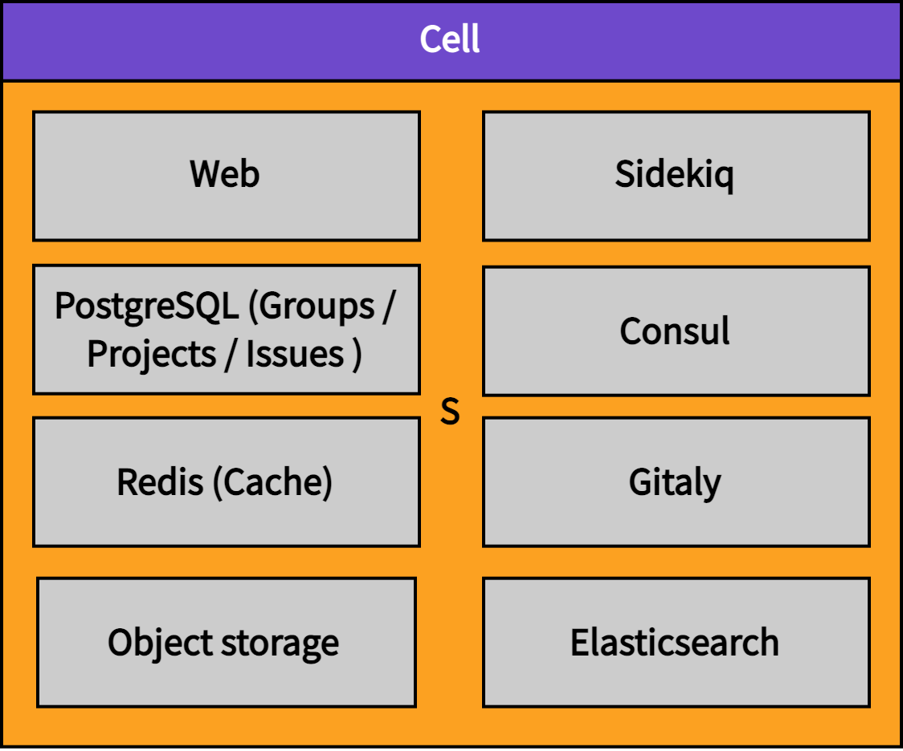
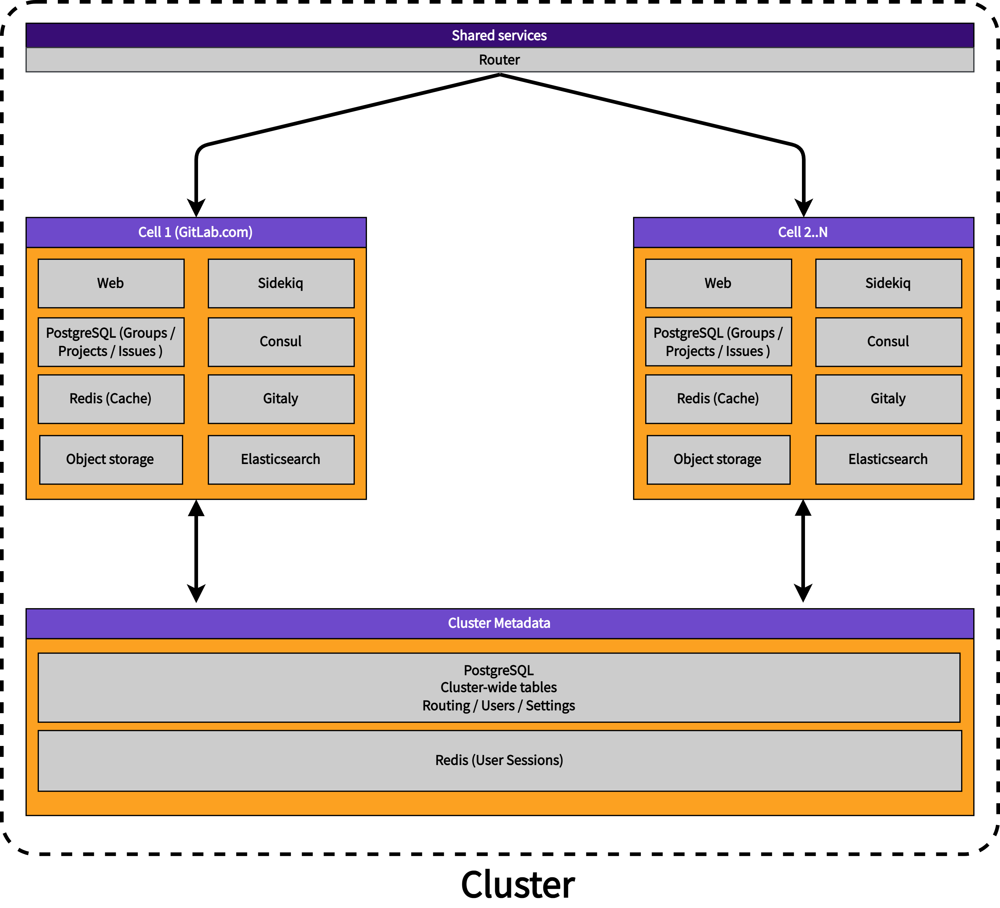
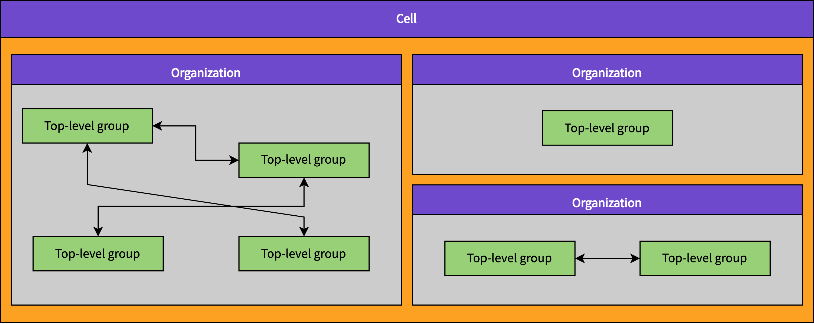
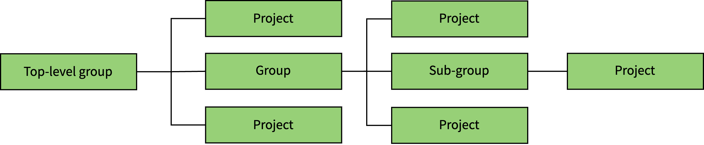

# Cells: Goals

## Goals

### Scalability

The main goal of this new shared-infrastructure architecture is to provide additional scalability for our SaaS Platform.
GitLab.com is largely monolithic and we have estimated (internally) that the current architecture has scalability limitations,
particularly for the [PostgreSQL database](https://gitlab-com.gitlab.io/gl-infra/tamland/patroni.html), and
[Redis](https://gitlab-com.gitlab.io/gl-infra/tamland/redis.html) non-horizontally scalable resources,
even when database partitioning and decomposition are taken into account.

Cells provide a horizontally scalable solution because additional Cells can be created based on demand. Cells can be provisioned and tuned as needed for optimal scalability.

### Increased availability

A major challenge for shared-infrastructure architectures is a lack of isolation between top-level Groups.
This can lead to noisy neighbor effects.
An organization's behavior inside a top-level Group can impact all other organizations.
This is highly undesirable.
Cells provide isolation at the Cell level.
A group of Organizations is fully isolated from other Organizations located on a different Cell.
This minimizes noisy neighbor effects while still benefiting from the cost-efficiency of a shared infrastructure.

Additionally, Cells provide a way to implement disaster recovery capabilities.
Entire Cells may be replicated to read-only standbys with automatic failover capabilities.

### A consistent experience

Organizations should have the same user experience on our SaaS platform as they do on a self-managed GitLab instance.

### Regions

GitLab.com is only hosted within the United States of America.
Organizations located in other regions have voiced demand for local SaaS offerings.
Cells provide a path towards [GitLab Regions](https://gitlab.com/groups/gitlab-org/-/epics/6037) because Cells may be deployed within different geographies.
Depending on which of an organization's data is located outside a Cell, this may solve data residency and compliance problems.

### Market segment

At this moment, GitLab.com has "social network"-like capabilities that may not fit well into a more isolated Organization model.
Removing those features, however, poses some challenges:

1. How will existing `gitlab-org` contributors contribute to the namespace?
1. How do we move existing top-level Groups into the new model (effectively breaking their social features)?

We should evaluate if the small to medium business and mid-market segment is interested in these features, or if not having them is acceptable in most cases.

### Self-managed

For reasons of consistency, it is expected that self-managed instances will
adopt the cells architecture as well. To expand, self-managed instances can
continue with just a single Cell while supporting the option of adding additional
Cells. Organizations, and possible User decomposition will also be adopted for
self-managed instances.

## Requirements

| Type        | Requirement                                       | Severity |
| ----------- | ------------------------------------------------- | -------- |
| Product     | Aggregation of cluster-wide data                  | Medium   |
| Product     | All Cells are under a single GitLab.com domain    | High     |
| Product     | User can interact with many Cells                 | Medium   |
| Product     | Minimal impact on contributor workflows           | High     |
| Product     | On-premise like experience                        | Medium   |
| Product     | Minimize breaking changes                         | High     |
| Product     | Enables support for Regions                       | Low      |
| Product     | Limit impact on self-managed customers            | Low      |
| Operational | Provides 10x headroom                             | High     |
| Operational | Provides 100x headroom                            | Medium   |
| Operational | Improve Service Availability                      | High     |
| Operational | Cost per user similar or lower to GitLab.com      | Medium   |
| Operational | Unified way of deploying Cells                    | Medium   |
| Operational | Cells running in mixed deployments                | High     |
| Operational | High resilience to a single Cell failure          | High     |
| Operational | Small Cells                                       | Medium   |
| Migration   | Robust rollback and disaster recovery scenarios   | High     |
| Migration   | Scale existing GitLab.com database                | High     |
| Migration   | Re-balancing of Cells                             | Low      |
| Migration   | Customer can migrate from GitLab.com to Dedicated | Low      |
| Development | Easy usage in development environment             | Medium   |

### Aggregation of cluster-wide data

The architecture should provide a way to present the cluster of Cells in a single view.
This might mean to:

- Aggregate user To-Dos from different Organizations
- Perform cluster-wide searches of public Projects, or published source code

### All Cells are under a single GitLab.com domain

General users should be unaware of the presence of Cells.
Cells would only be visible to instance administrators.
Users using Organizations on another Cell or us migrating Organizations
between Cells should be an operational detail that does not require
any user intervention or is not visible to the user.

### User can interact with many Cells

Usage of many accounts to interact with different Organizations
that might be on different Cells is strongly discouraged.
The need to use many accounts will reduce adoption and put a barrier
on users wanting to contribute to open-source Projects.

In the future, users could have Organization specific settings,
depending on the specific customer expectations.
For instance, users might be shown with different display names in different Organizations.

Users should not be required to use different SSH keys to access different
Organizations due to the complexity of managing many SSH keys by the user.

### Minimal impact on contributor workflows

GitLab.com has a number of open-source and open-core projects (including [`gitlab-org/gitlab`](https://gitlab.com/gitlab-org/gitlab)).
Cells should not make it harder to contribute to public Projects.
Learning new ways to contribute is likely to hinder the adoption of Cells.
The introduced architecture should focus on changing the existing workflows in the most minimal way.

### On-premise like experience

Currently on-premise has numerous advantages compared to our SaaS offering.
On-premise allows to control all aspects of a GitLab installation, including but not limited to: managing users, access controls, or instance-wide settings.

The difference between SaaS and on-premise is problematic for our customers,
and us as it results in a different user experience.

### Minimize breaking changes

The introduction of Cells will imply changes in the supported GitLab.com workflows.
Cells might affect how people use GitLab, as long as it provides a compelling user experience story.
It is desired that each change introduced provides either operational value or user value, ideally both.

Any Cells architecture should focus on not introducing breaking changes,
or if introducing them provide a long window to support the change.
The introduction of breaking changes will reduce the adoption rate
and effectiveness of Cells and make rollout of the architecture more risky.

It is important to distinguish between different severity of breaking changes:

- Required: migration to a new architecture by design introduces a breaking change.
  In such a case a customer has to use a new workflow, new API, or new endpoints right away
  and is required to adapt to all changes at once. The customer has limited options to roll back.

- Optional: migration to a new architecture does not enforce introducing breaking changes.
  In such a case a customer can slowly adapt to introduced changes: a new workflow, new API,
  or new endpoints, but retaining major aspects of the system to work as before.
  The customer has a way to roll back to a previous known working state.

### Enables support for Regions

Support for Regions should enable us to run GitLab in different availability zones,
or completely different data centers.

This includes, but is not limited to allowing users to create Organizations in Europe, the US West or US East,
and GitLab Inc. to use different cloud infrastructure providers (Google Cloud, AWS) to serve customers.

Cells enable existing customers running Organizations to move their Organization between different deployment regions/data centers that are supported by GitLab on GitLab.com.

### Limit impact on self-managed customers (Omnibus/CNG)

The introduction of Cells should not impact small installations.
Cells should not require running additional components by self-managed customers
unless they are interested in Cells that will increase resource requirements.

### Provides 10x headroom

The Cells architecture must provide at least 10x headroom. As such our architecture must be suitable to run 10 Cells. We do not need to initially solve for the complexities that might come with running more than 10 Cells.

### Provides 100x headroom

The Cells architecture should be able to run more than 10 Cells.

### Improve Service Availability

The Cells architecture should allow us to provide better SLA for some customers
by putting them on specific Cells of the cluster:

- Cells have to reduce the impact of noisy neighbors, such as legitimate usage caused by a spiky workload.
- Cells have to reduce the impact caused by abuse, for instance CI being used for cryptocurrency mining.

### Cost per user similar or lower to GitLab.com

The current GitLab.com architecture is rather cost-effective.
The introduction of Cells will result in more infrastructure components
due to data distribution:

- The proposed Cells architecture should evaluate the cost of running additional Cells with respect
  to the achieved infrastructure component isolation. In some cases it might be beneficial to reuse
  infrastructure components to reduce the running cost of Cells.
- The proposed Cells architecture should ensure a high degree of multi-tenancy on Cells.
- The proposed Cells architecture could enable a way to balance the Cells load long term.

### Unified way of deploying Cells

The proposed Cells architecture anticipates a need to run 100 Cells and more in a cluster.
This becomes operational overhead. It is strongly desired for the Cells architecture
to reuse existing infrastructure tooling as much as possible for: deployment, monitoring,
logging, disaster recovery, and customer support.

### Cells running in mixed deployments

It is strongly required for the Cells architecture to run different versions of applications across the cluster. The purpose is to provide staged deployments allowing to test changes on part of the cluster, and to update part of the cluster less frequently.

This also indicates that Cells should be able to work with different versions of the underlying
infrastructure components: PostgreSQL version, Redis version, Gitaly version, Elasticsearch version.

Usage of different versions within a Cell has to have no effect on other Cells.

### High resilience to a single Cell failure

Unavailability of a single Cell should not result in other Cells being unable to function properly:

- Intra-cluster communication between Cells should be resilient to single Cell failure.
- Intra-cluster communication should limit its dependence on data stored in other Cells.
- Cluster-shared data should provide an anti-corruption layer to prevent a single Cell from causing a cluster-wide outage.
- Cells should be monitored and their availability status should be accessible to all other Cells.
- Cluster-wide data aggregation should take the availability status of each Cell into account.
- The loss of cell-local data (groups and projects) does only affect ability to access data located on this cell.

### Small Cells

The Cells architecture should provide a cost effective way to run small Cells.
Running small Cells allows to achieve superior quality in terms of latency or performance
due to processing a significantly smaller data set and allowing significant single-node vertical scaling.

The ability to run small Cells could result in reduced complexity of individual Cell deployment:

- Prefer single-node vertical scaling as a first technique for increasing capacity (increase CPU count, available memory).
- Reduce amount of data stored within a Cell to reduce time-to-recovery in case of outages.
- Less data results in faster database migrations, improved latency, and superior user-facing performance.

### Robust rollback and disaster recovery scenarios

Rollout of the Cells architecture is a fundamental change to how GitLab.com will operate.
This will involve introducing a number of new components, and distributing data horizontally across
different Cells.

We anticipate that something will go wrong at some point. Each deployment phase of the Cells architecture needs to provide a way to roll back to a prior working state. This includes any user-facing changes, as well as any infrastructure deployed components.

### Scale existing GitLab.com database

The existing GitLab.com database will continue to grow while we deploy Cells.
The Cells architecture should provide a way to increase Cell 1 (existing GitLab.com)
capacity as soon as possible.

### Re-balancing of Cells

It is expected that data distribution on Cells will become uneven at some point.

The problem of re-balancing Cells is rather complex, but at some scale it might
provide a positive ROI compared to the running cost of imbalanced Cells.

This might involve understanding how to selectively migrate customer data between
Cells onto already existing Cells.

### Customer can migrate from GitLab.com to Dedicated

Cells will enforce an architecture with more isolation. However, it is expected
that some customers would like to move from SaaS GitLab.com to GitLab Dedicated.

This implies being able to selectively migrate data from the GitLab.com cluster to Dedicated.
This could be achieved by:

- Migrating a customer to a Dedicated Cell on the GitLab.com cluster.
- Disconnecting a Cell from the GitLab.com cluster into its own standalone Dedicated Cell.

### Easy usage in development environment

The Cells architecture should be easy to run locally by developers as needed to be able to:

- Implement cluster-wide features.
- Model Cells not being available.

## Non-Goals

The following objectives are not part of this document. At some point they
were considered, but dismissed as creating distraction from the goals and requirements documented above.

### Federation between distinct GitLab instances

The Cells architecture is meant to provide trusted intra-cluster communication
with some set of data being shared. Federation is meant to solve the problem
of data flow between two completely distinct and external instances.

### Usage of cloud managed services

Cells should not interfere with other efforts to move towards using more managed services in the cloud.

### Cells should replace canary deployments

When we have Cells we won't need to run canary deployments anymore as we can roll out changes to single Cells at a time.
Our main benefit of canary deployments today is that we can roll out code changes to internal users first.
With Cells, we will have internal users on a specific Cell, which can be deployed first.

Additionally Cells may solve some issues with canaries today, for example not having a way to upgrade Sidekiq code for a subset of users.

## Glossary

| Term                                | Description                                                                                                                                 | Discouraged Terms                          |
| ----------------------------------- | ------------------------------------------------------------------------------------------------------------------------------------------- | ------------------------------------------ |
| [Cell](#cell)                       | A Cell is a set of infrastructure components that contains multiple top-level Groups that belong to different Organizations.                | GitLab instance, cluster, shard, Pod       |
| [Cluster](#cluster)                 | A cluster is a collection of Cells.                                                                                                         | Whale, GitLab Dedicated instance, instance |
| [Organizations](#organizations)     | An Organization is the umbrella for one or multiple top-level Groups.                                                                       | Billable entities, customers               |
| [Top-Level Group](#top-level-group) | Top-level Group is the name given to the top-most Group of all other Groups. Groups and Projects are nested underneath the top-level Group. | Root-level namespace                       |
| [Users](#users)                     | An account containing its own personal namespace associated with an email.                                                                  | Customer                                   |

### Cell

> - Pod was renamed to Cell in <https://gitlab.com/gitlab-com/www-gitlab-com/-/merge_requests/121163>

A Cell is a set of infrastructure components that contains multiple top-level Groups that belong to different Organizations. The components include both data stores (PostgreSQL, Redis, etc.) and stateless services (web, etc.). The infrastructure components provided within a Cell are shared among Organizations and their top-level Groups, but are not shared with other Cells. This isolation of infrastructure components means that Cells are independent from each other.

- Each Cell is independent from other Cells
- Infrastructure components are shared by Organizations and their top-level Groups within a Cell
- More Cells can be provisioned to provide horizontal scalability
- A failing Cell does not lead to failure of other Cells
- Noisy neighbor effects are limited to within a Cell
- Cells are not visible to Organizations - they are an implementation detail
- Cells may be located in different geographical regions (for example: EU, US, JP, UK)
- A GitLab Dedicated instance can join the cluster, and become a Cell

Discouraged synonyms: GitLab instance, cluster, shard, Pod

### Cluster

A cluster is a collection of Cells.

- A cluster holds cluster-wide metadata, for example: Users, Routes, Settings.

Discouraged synonyms: Whale, GitLab Dedicated instance, instance

### Organizations

An Organization is the umbrella for one or multiple top-level Groups. Organizations are isolated from each other by default meaning that cross-namespace features will only work for namespaces that exist in a single Organization.

See the [Organization blueprint](../../blueprints/organization/index.md).

Organizations are a known concept, present for example in [AWS](https://docs.aws.amazon.com/whitepapers/latest/organizing-your-aws-environment/core-concepts.html) and [GCP](https://cloud.google.com/resource-manager/docs/cloud-platform-resource-hierarchy#organizations).

Organizations work under the following assumptions:

1. Users care about what happens within their Organization.
1. Features need to work within an Organization.
1. Only few features need to work across Organizations.
1. Users understand that the majority of pages they view are only scoped to a single Organization at a time.
1. Organizations are located on a single Cell.

Properties:

- Top-level Groups belong to Organizations.
- Organizations are isolated from each other by default, meaning that cross-Group features will only work for Groups that exist within a single Organization.
- Personal namespaces must not belong to an Organization.

Discouraged synonyms: Billable entities, customers

### Top-level Group

Example:

`https://gitlab.com/gitlab-org/gitlab/`:

- `gitlab-org` is a `top-level group`; the root for all Groups and Projects of an Organization
- `gitlab` is a `project`; a Project of the Organization.

The top-level Group has served as the de facto Organization entity. With the creation of Organizations, top-level Groups will be [nested underneath Organizations](https://gitlab.com/gitlab-org/gitlab/-/issues/394796).

Over time, there won't be a distinction between a top-level Group and a Group. All features that make top-level Groups different from Groups will move to the Organization.

- Top-level Groups belonging to the same Organization are located on the same Cell.
- Top-level Groups can interact with other top-level Groups that belong to the same Organization.

Discouraged synonyms: Root-level namespace

### Users

Users are available globally and not restricted to a single Cell. Users belong to a single Organization, but can participate in many Organizations through Group and Project membership with varying permissions. Inside Organizations, users can create multiple top-level Groups. User activity is not limited to a single Organization but their contributions (for example To-Dos) are only aggregated within an Organization. This avoids the need for aggregating across Cells.

- Users are shared globally across all Cells.
- Users can create multiple top-level Groups.
- Users can be members of multiple top-level Groups.
- Users belong to one Organization. See [!395736](https://gitlab.com/gitlab-org/gitlab/-/issues/395736).
- Users can be members of Groups and Projects in different Organizations.
- Users can administer Organizations.
- User activity is aggregated in an Organization.
- Every user has one personal namespace.
