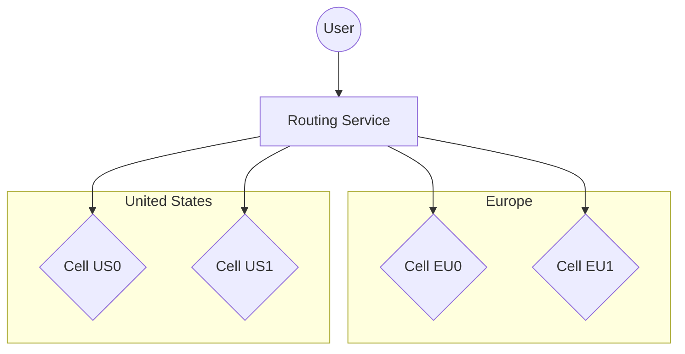
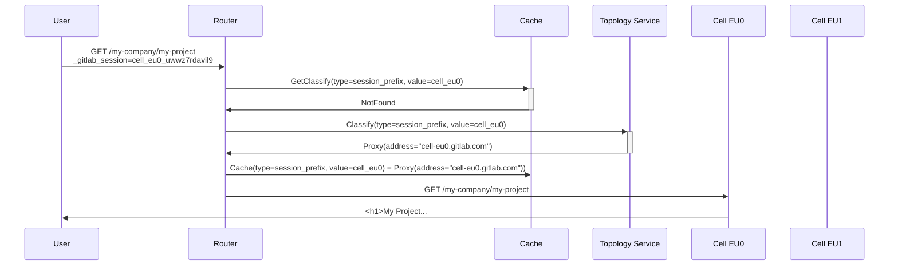
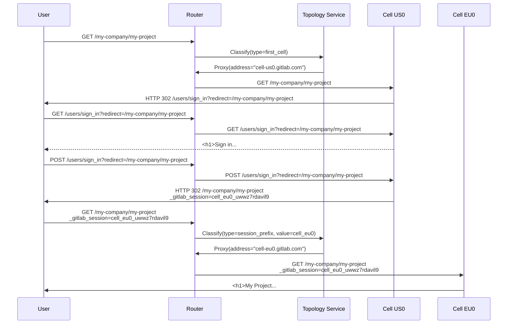
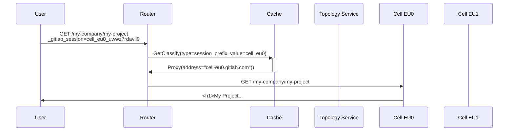

# Cells: HTTP Routing Service

This document describes design goals and architecture of Routing Service
used by Cells. To better understand where the Routing Service fits
into architecture take a look at [Infrastructure Architecture](infrastructure/index.md#architecture).

## Goals

The routing layer is meant to offer a consistent user experience where all Cells are presented under a single domain (for example, `gitlab.com`), instead of having to go to separate domains.

The user will be able to use `https://gitlab.com` to access Cell-enabled GitLab.
Depending on the URL access, it will be transparently proxied to the correct Cell that can serve this particular information.
For example:

- All requests going to `https://gitlab.com/users/sign_in` are randomly distributed to all Cells.
- All requests going to `https://gitlab.com/gitlab-org/gitlab/-/tree/master` are always directed to Cell 5, for example.
- All requests going to `https://gitlab.com/my-username/my-project` are always directed to Cell 1.

1. **Technology.**

    We decide what technology the routing service is written in.
    The choice is dependent on the best performing language, and the expected way and place of deployment of the routing layer.
    If it is required to make the service multi-cloud it might be required to deploy it to the CDN provider.
    Then the service needs to be written using a technology compatible with the CDN provider.

    [ADR 001](decisions/001_routing_technology.md)

1. **Cell discovery.**

    The routing service needs to be able to discover and monitor the health of all Cells.

1. **User can use single domain to interact with many Cells.**

    The routing service will intelligently route all requests to Cells based on the resource being
    accessed versus the Cell containing the data.

1. **Router endpoints classification.**

    The stateless routing service will fetch and cache information about endpoints from one of the Cells.
    We need to implement a protocol that will allow us to accurately describe the incoming request (its fingerprint), so it can be classified by one of the Cells, and the results of that can be cached.
    We also need to implement a mechanism for negative cache and cache eviction.

1. **GraphQL and other ambiguous endpoints.**

    Most endpoints have a unique classification key: the Organization, which directly or indirectly (via a Group or Project) can be used to classify endpoints.
    Some endpoints are ambiguous in their usage (they don't encode the classification key), or the classification key is stored deep in the payload.
    In these cases, we need to decide how to handle endpoints like `/api/graphql`.

1. **Small.**

    The Routing Service is configuration-driven and rules-driven, and does not implement any business logic.
    The maximum size of the project source code in initial phase is 1_000 lines without tests.
    The reason for the hard limit is to make the Routing Service to not have any special logic,
    and could be rewritten into any technology in a matter of a few days.

## Requirements

| Requirement         | Description                                                       | Priority |
| ------------------- | ----------------------------------------------------------------- | -------- |
| Discovery           | needs to be able to discover and monitor the health of all Cells. | high     |
| Security            | only authorized cells can be routed to                            | high     |
| Single domain       | for example GitLab.com                                            | high     |
| Caching             | can cache routing information for performance                     | high     |
| Low latency         | [50 ms of increased latency](#low-latency)                        | high     |
| Path-based          | can make routing decision based on path                           | high     |
| Complexity          | the routing service should be configuration-driven and small      | high     |
| Rolling             | the routing service works with Cells running mixed versions       | high     |
| Feature Flags       | features can be turned on, off, and % rollout                     | high     |
| Progressive Rollout | we can slowly rollout a change                                    | medium   |
| Stateless           | does not need database, Cells provide all routing information     | medium   |
| Secrets-based       | can make routing decision based on secret (for example JWT)       | medium   |
| Observability       | can use existing observability tooling                            | low      |
| Self-managed        | can be eventually used by [self-managed](goals.md#self-managed)   | low      |
| Regional            | can route requests to different [regions](goals.md#regions)       | low      |

### Low Latency

The target latency for routing service **should be less than 50 _ms_**.

Looking at the `urgency: high` request we don't have a lot of headroom on the p50.
Adding an extra 50 _ms_ allows us to still be in or SLO on the p95 level.

There is 3 primary entry points for the application; [`web`](https://gitlab.com/gitlab-com/runbooks/-/blob/5d8248314b343bef15a4c021ac33978525f809e3/services/service-catalog.yml#L492-537), [`api`](https://gitlab.com/gitlab-com/runbooks/-/blob/5d8248314b343bef15a4c021ac33978525f809e3/services/service-catalog.yml#L18-62), and [`git`](https://gitlab.com/gitlab-com/runbooks/-/blob/5d8248314b343bef15a4c021ac33978525f809e3/services/service-catalog.yml#L589-638).
Each service is assigned a Service Level Indicator (SLI) based on latency using the [apdex](https://www.apdex.org/wp-content/uploads/2020/09/ApdexTechnicalSpecificationV11_000.pdf) standard.
The corresponding Service Level Objectives (SLOs) for these SLIs require low latencies for large amount of requests.
It's crucial to ensure that the addition of the routing layer in front of these services does not impact the SLIs.
The routing layer is a proxy for these services, and we lack a comprehensive SLI monitoring system for the entire request flow (including components like the Edge network and Load Balancers) we use the SLIs for `web`, `git`, and `api` as a target.

The main SLI we use is the [rails requests](../../../development/application_slis/rails_request.md).
It has multiple `satisfied` targets (apdex) depending on the [request urgency](../../../development/application_slis/rails_request.md#how-to-adjust-the-urgency):

| Urgency    | Duration in ms |
| ---------- | -------------- |
| `:high`    | 250 _ms_       |
| `:medium`  | 500 _ms_       |
| `:default` | 1000 _ms_      |
| `:low`     | 5000 _ms_      |

#### Analysis

The way we calculate the headroom we have is by using the following:

```math
\mathrm{Headroom}\ {ms} = \mathrm{Satisfied}\ {ms} - \mathrm{Duration}\ {ms}
```

**`web`**:

| Target Duration | Percentile | Headroom  |
| --------------- | ---------- | --------- |
| 5000 _ms_       | p99        | 4000 _ms_ |
| 5000 _ms_       | p95        | 4500 _ms_ |
| 5000 _ms_       | p90        | 4600 _ms_ |
| 5000 _ms_       | p50        | 4900 _ms_ |
| 1000 _ms_       | p99        | 500 _ms_  |
| 1000 _ms_       | p95        | 740 _ms_  |
| 1000 _ms_       | p90        | 840 _ms_  |
| 1000 _ms_       | p50        | 900 _ms_  |
| 500 _ms_        | p99        | 0 _ms_    |
| 500 _ms_        | p95        | 60 _ms_   |
| 500 _ms_        | p90        | 100 _ms_  |
| 500 _ms_        | p50        | 400 _ms_  |
| 250 _ms_        | p99        | 140 _ms_  |
| 250 _ms_        | p95        | 170 _ms_  |
| 250 _ms_        | p90        | 180 _ms_  |
| 250 _ms_        | p50        | 200 _ms_  |

_Analysis was done in <https://gitlab.com/gitlab-org/gitlab/-/issues/432934#note_1667993089>_

**`api`**:

| Target Duration | Percentile | Headroom  |
| --------------- | ---------- | --------- |
| 5000 _ms_       | p99        | 3500 _ms_ |
| 5000 _ms_       | p95        | 4300 _ms_ |
| 5000 _ms_       | p90        | 4600 _ms_ |
| 5000 _ms_       | p50        | 4900 _ms_ |
| 1000 _ms_       | p99        | 440 _ms_  |
| 1000 _ms_       | p95        | 750 _ms_  |
| 1000 _ms_       | p90        | 830 _ms_  |
| 1000 _ms_       | p50        | 950 _ms_  |
| 500 _ms_        | p99        | 450 _ms_  |
| 500 _ms_        | p95        | 480 _ms_  |
| 500 _ms_        | p90        | 490 _ms_  |
| 500 _ms_        | p50        | 490 _ms_  |
| 250 _ms_        | p99        | 90 _ms_   |
| 250 _ms_        | p95        | 170 _ms_  |
| 250 _ms_        | p90        | 210 _ms_  |
| 250 _ms_        | p50        | 230 _ms_  |

_Analysis was done in <https://gitlab.com/gitlab-org/gitlab/-/issues/432934#note_1669995479>_

**`git`**:

| Target Duration | Percentile | Headroom  |
| --------------- | ---------- | --------- |
| 5000 _ms_       | p99        | 3760 _ms_ |
| 5000 _ms_       | p95        | 4280 _ms_ |
| 5000 _ms_       | p90        | 4430 _ms_ |
| 5000 _ms_       | p50        | 4900 _ms_ |
| 1000 _ms_       | p99        | 500 _ms_  |
| 1000 _ms_       | p95        | 750 _ms_  |
| 1000 _ms_       | p90        | 800 _ms_  |
| 1000 _ms_       | p50        | 900 _ms_  |
| 500 _ms_        | p99        | 280 _ms_  |
| 500 _ms_        | p95        | 370 _ms_  |
| 500 _ms_        | p90        | 400 _ms_  |
| 500 _ms_        | p50        | 430 _ms_  |
| 250 _ms_        | p99        | 200 _ms_  |
| 250 _ms_        | p95        | 230 _ms_  |
| 250 _ms_        | p90        | 240 _ms_  |
| 250 _ms_        | p50        | 240 _ms_  |

_Analysis was done in <https://gitlab.com/gitlab-org/gitlab/-/issues/432934#note_1671385680>_

## Non-Goals

Not yet defined.

## Proposal

The Routing Service implements the following design guidelines:

1. Simple:
   - Routing service does not buffer requests.
   - Routing service can only proxy to a single Cell based on request headers.
1. Stateless:
   - Routing service does not have permanent storage.
   - Routing service uses multi-level cache: in-memory, external shared cache.
1. Zero-trust:
   - Routing service signs each request that is being proxied.
   - The trust is established by using JWT token, or mutual authentication scheme.
   - Cells can be available over public internet, as long as they follow the zero-trust model.
1. Configuration-based:
   - Routing service is configured with a static list of Cells.
   - Routing service configuration is applied as part of service deployment.
1. Rule-based:
   - Routing service is deployed with a routing rules gathered from all Cells.
   - Routing service does support rules lists generated by different versions of GitLab.
   - rules allows to match by any criteria: header, content of the header, or route path.
1. Agnostic:
   - Routing service is not aware of high-level concepts like organizations.
   - The classification is done per-specification provided in a rules, to find the classification key.
   - The classification key result is cached.
   - The single classification key cached is used to handle many similar requests.

The following diagram shows how a user request routes through DNS to the Routing Service deployed
as Cloudflare Worker and the router chooses a cell to send the request to.



### Routing rules

Each Cell will publish a precompiled list of routing rules that will be consumed by the Routing Service:

- The routing rules describe how to decode the request, find the classification key, and make the routing decision.
- The routing rules are static and defined ahead of time as part of HTTP Router deployment.
- The routing rules are defined as a JSON document describing in-order a sequence of operation.
- The routing rules might be compiled to application code to provide a way faster execution scheme.

The routing rules JSON structure describes all matchers:

```json
{
    "rules": [
        {
            "cookies": {
                "<cookie_name>": {
                    "match_regex": "<regex_match>"
                },
                "<cookie_name2>": {
                    "match_regex": "<regex_match>"
                }
            },
            "headers": {
                "<header_name>": {
                    "match_regex": "<regex_match>"
                },
                "<header_name2>": {
                    "match_regex": "<regex_match>"
                },
            },
            "path": {
                "match_regex": "<regex_match>"
            },
            "method": ["<list_of_accepted_methods>"],

            "action": "classify",
            "classify": {
                "type": "session_prefix|project_path|...",
                "value": "string_build_from_regex_matchers"
            }
        }
    ]
}
```

Example of the routing rules that makes routing decision based session cookie, and secret:

```json
{
    "rules": [
        {
            "cookies": {
                "_gitlab_session": {
                    "match_regex": "^(?<cell_name>cell.*:)" // accept `_gitlab_session` that are prefixed with `cell1:`
                }
            },
            "action": "classify",
            "classify": {
                "type": "session_prefix",
                "value": "${cell_name}"
            }
        },
        {
            "headers": {
                "GITLAB_TOKEN": {
                    "match_regex": "^(?<cell_name>cell.*:)" // accept `_gitlab_session` that are prefixed with `cell1:`
                }
            },
            "action": "classify",
            "classify": {
                "type": "token_prefix",
                "value": "${cell_name}"
            }
        }
    ]
}
```

Example of the routing rules published by all Cells that makes routing decision based on the path:

```json
{
    "rules": [
        {
            "path": {
                "match_regex": "^/api/v4/projects/(?<project_id_or_path_encoded>[^/]+)(/.*)?$"
            },
            "action": "classify",
            "classify": {
                "type": "project_id_or_path",
                "value": "${project_id_or_path_encoded}"
            }
        }
    ]
}
```

### Classification

The classification is implemented by [the Classify Service of the Topology Service](topology_service.md#classify-service).

- The classification endpoint uses REST (with mTLS) to secure access.
- The classification endpoint returns only cell name to which information should be routed.
- The classification could return other equivalent classification keys to pollute cache for similar requests.
  This is to ensure that all similar requests can be handled quickly without having to classify each time.
- The HTTP Router retries the `classify` call for a reasonable amount of time.
- The classification for a given value is cached regardless of returned response (positive or negative).
  The rejected classification is cached to prevent excessive amount of
  requests for classification keys that are not found.
- The cached response is for time defined by `expiry` and `refresh`.
  - The `expiry` defines when the item is removed from cache unless used.
  - The `refresh` defines when the item needs to be reclassified if used.
  - The refresh is done asynchronously as the request should be served without a delay if they were classified. The refresh is done to ensure that cache is always hot and up-to date.

For the above example:

1. The router sees request to `/api/v4/projects/1000/issues`.
1. It selects the above `rule` for this request, which requests `classify` for `project_id_or_path_encoded`.
1. It decodes `project_id_or_path_encoded` to be `1000`.
1. Checks the cache if there's `project_id_or_path_encoded=1000` associated to any Cell.
1. Sends the request to `/api/v1/classify` (`type=project_id_or_path`, `value=1000`) if no Cells was found in cache.
1. Topology Service responds with the Cell holding the given project, and also all other equivalent classification keys
   for the resource that should be put in the cache.
1. Routing Service caches for the duration specified in configuration, or response.

```json
# POST /api/v1/classify
## Request:
{
    "type": "project_id_or_path",
    "value": 1000
}

## Response:
{
    "action": "proxy",
    "proxy": {
        "address": "cell1.gitlab.com"
    },
    "cache": {
        "refresh": "10 minutes",
        "expiry": "10 minutes"
    },
    "other_classifications": [ // list of all equivalent keys that should be put in the cache
        { "type": "session_prefix", "value": "cell1" },
        { "type": "project_full_path", "value": "gitlab-org/gitlab" },
        { "type": "project_full_path", "value": "gitlab-org/gitlab" },
        { "type": "namespace_full_path", "value": "gitlab-org" }
    ]
}
```

The following code represents a negative response when a classification key was not found:

```json
# POST /api/v4/internal/cells/classify
## Request:
{
    "type": "project_id_or_path",
    "value": 1000
}

## Response:
{
    "action": "reject",
    "reject": {
        "http_status": 404
    },
    "cache": {
        "refresh": "10 minutes",
        "expiry": "10 minutes"
    }
}
```

### Configuration

All configuration will be provided via environment variables:

- HTTP Router will only configure an address to Topology Service
- The mTLS will be used when connecting to Topology Service to authentication / authorization.

### Deployment

There are several phases to fully deploy the HTTP Routing service to GitLab.com.

1. The first phase is to deploy a simple pass-through proxy in front of the webservice (`gitlab.com`).
   1. First, we will utilize [Cloudflare Routes](https://developers.cloudflare.com/workers/configuration/routing/routes/)
      to rollout the worker gradually, without the need to change DNS.
   1. (Maybe optional) The next step is to provision an internal-only DNS for
      the legacy cell (e.g. `cell-1.gprd.int.gitlab.com`).
      We then proxy the HTTP router to this new DNS, and secure this connection
      with a solution like `mTLS`, or Cloudflare Tunnel.
      In order to do this, the HTTP Router will need to be assigned the
      `gitlab.com` DNS record, likely with
      [custom domains](https://developers.cloudflare.com/workers/configuration/routing/custom-domains/).
1. The second phase is to deploy a simple pass-through proxy in front of
   the container registry (`registry.gitlab.com`).
   This will use the same deployment of the HTTP Router for `gitlab.com`.
   1. First, we will utilize [Cloudflare Routes](https://developers.cloudflare.com/workers/configuration/routing/routes/)
      to rollout the worker gradually, without the need to change DNS.
   1. (Maybe optional) The next step is to provision an internal-only DNS for
      the legacy cell (e.g. `cell-1-registry.gprd.int.gitlab.com`).
      We then proxy the HTTP router to this DNS, and secure this connection with
      a solution like `mTLS`, or Cloudflare Tunnel.
      In order to do this, the HTTP Router will need to be assigned the
      `registry.gitlab.com` DNS record, likely with
      [custom domains](https://developers.cloudflare.com/workers/configuration/routing/custom-domains/).
1. The third phase involves multiple cells.
   1. For any new cell the HTTP Router routes to, the cell will have:
      1. An internal-only DNS, like `cell-2.gdrd.int.gitlab.com` that is only
     accessible via the HTTP Router.
      1. A secure, encrypted connection between the HTTP Router and the cell.

## Request flows

1. There are two Cells.
1. `gitlab-org` is a top-level namespace and lives in `Cell US0` in the `GitLab.com Public` organization.
1. `my-company` is a top-level namespace and lives in `Cell EU0` in the `my-organization` organization.

### Router configured to perform the following routing

1. The Cell US0 supports all other public-facing projects.
1. The Cell EU0 configured to generate all secrets and session cookies with a prefix like `cell_eu0_`.
   1. The Personal Access Token is scoped to Organization, and because the Organization is part only of a single Cell,
      the PATs generated are prefixed with Cell identifier.
   1. The Session Cookie encodes Organization in-use, and because the Organization is part only of a single Cell,
      the session cookie generated is prefixed with Cell identifier.
1. The Cell EU0 allows only private organizations, groups, and projects.
1. The Cell US0 is a target Cell for all requests unless explicitly prefixed.

Router rules:

```json
{
    "rules": [
        {
            "cookies": {
                "_gitlab_session": {
                    "regex_match": "^(?<cell_name>cell.*:)"
                }
            },
            "action": "classify",
            "classify": {
                "type": "session_prefix",
                "value": "${cell_name}"
            }
        },
        {
            "headers": {
                "GITLAB_TOKEN": {
                    "regex_match": "^(?<cell_name>cell.*-)"
                }
            },
            "action": "classify",
            "classify": {
                "type": "token_prefix",
                "value": "${cell_name}"
            }
        },
        {
            "action": "classify",
            "classify": {
                "type": "first_cell",
            }
        }
    ]
}
```

#### Goes to `/my-company/my-project` while logged in into Cell EU0

1. Because user switched the Organization to `my-company`, its session cookie is prefixed with `cell_eu0_`.
1. User sends request `/my-company/my-project`, and because the cookie is prefixed with `cell_eu0_` it is directed to Cell EU0.
1. `Cell EU0` returns the correct response.



#### Goes to `/my-company/my-project` while not logged in

1. User visits `/my-company/my-project`, and because it does not have session cookie, the request is forwarded to `Cell US0`.
1. User signs in.
1. GitLab sees that user default organization is `my-company`, so it assigns session cookie with `cell_eu0_` to indicate that
   user is meant to interact with `my-company`.
1. User sends request to `/my-company/my-project` again, now with the session cookie that proxies to `Cell EU0`.
1. `Cell EU0` returns the correct response.

NOTE:
The `cache` is intentionally skipped here to reduce diagram complexity.



#### Goes to `/gitlab-org/gitlab` after last step

User visits `/gitlab-org/gitlab`, and because it does have a session cookie, the request is forwarded to `Cell EU0`.
There is no need to ask Topology Service, since the session cookie is cached.



### Performance and reliability considerations

- It is expected that there will be penalty when learning new classification key. However,
  it is expected that multi-layer cache should provide a very high cache-hit-ratio,
  due to low cardinality of classification key. The classification key would effectively be mapped
  into resource (organization, group, or project), and there's a finite amount of those.

## Alternatives

### Buffering requests

The [Stateless Router using Requests Buffering](rejected/proposal-stateless-router-with-buffering-requests.md)
describes an approach where Cell answers with `X-Gitlab-Cell-Redirect` to redirect request to another Cell:

- This is based on a need to buffer the whole request (headers + body) which is very memory intensive.
- This proposal does not provide an easy way to handle mixed deployment of Cells, where Cells might be running different versions.
- This proposal likely requires caching significantly more information, since it is based on requests, rather than on decoded classification keys.

### Learn request

The [Stateless Router using Routes Learning](rejected/proposal-stateless-router-with-routes-learning.md)
describes an approach similar to the one in this document. Except the route rules and classification
is done in a single go in a form of pre-flight check `/api/v4/internal/cells/learn`:

- This makes the whole routes learning dynamic, and dependent on availability of the Cells.
- This proposal does not provide an easy way to handle mixed deployment of Cells, where Cells might be running different versions.
- This proposal likely requires caching significantly more information, since it is based on requests, rather than on decoded classification keys.

## FAQ

1. How and when will Routing Service compile set of rules?

To be defined.

## Links

- [Cells - Routing: Technology](https://gitlab.com/groups/gitlab-org/-/epics/11002)
- [Classify endpoints](https://gitlab.com/gitlab-org/gitlab/-/issues/430330)
