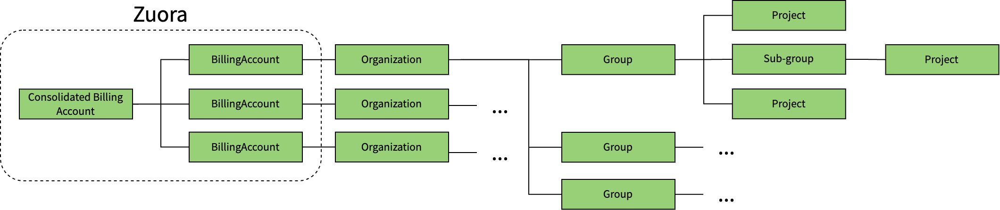

# Cells: Cross-section impact

Cells is a fundamental architecture change that impacts other sections and stages. This section summarizes and links to other groups that may be impacted and highlights potential conflicts that need to be resolved. The Tenant Scale group is not responsible for achieving the goals of other groups but we want to ensure that dependencies are resolved.

## Summary

Based on discussions with other groups the net impact of introducing Cells and a new entity called organizations is mostly neutral. It may slow down development in some areas. We did not discover major blockers for other teams.

1. We need to resolve naming conflicts (proposal is TBD)
1. Cells requires introducing Organizations. Organizations are a new entity **above** top-level groups. Because this is a new entity, it may impact the ability to consolidate settings for Group::Organization and influence their decision on [how to approach introducing a an organization](https://gitlab.com/gitlab-org/gitlab/-/issues/376285#approach-2-organization-is-built-on-top-of-top-level-groups)
1. Organizations may make it slightly easier for Fulfillment to realize their billing plans.

## Impact on Group::Organization

We synced with the Organization PM and Designer ([recording](https://youtu.be/b5Opn9cFWFk)) and discussed the similarities and differences between the Cells and Organization proposal ([presentation](https://docs.google.com/presentation/d/1FsUi22Up15b_tu6p2m-yLML3hCZ3rgrZrmzJAxUsNmU/edit?usp=sharing)).

### Goals of Group::Organization

As defined in the [organization documentation](../../../user/organization/index.md):

1. Create an entity to manage everything you do as a GitLab administrator, including:
   1. Defining and applying settings to all of your groups, subgroups, and projects.
   1. Aggregating data from all your groups, subgroups, and projects.
1. Reach feature parity between SaaS and self-managed installations, with all Admin Area settings moving to groups (?). Hardware controls remain on the instance level.

The [organization roadmap outlines](https://gitlab.com/gitlab-org/gitlab/-/issues/368237#high-level-goals) the current goals in detail.

### Potential conflicts with Cells

- Organization defines a new entity as the primary organizational object for groups and projects.
- We will only introduce one entity
- Group::Organization highlighted the need to further validate the key assumption that users only care about what happens within their organization.

## Impact on Fulfillment

We synced with Fulfillment ([recording](https://youtu.be/FkQF3uF7vTY)) to discuss how Cells would impact them. Fulfillment is supportive of an entity above top-level namespaces. Their perspective is outline in [!5639](https://gitlab.com/gitlab-org/customers-gitlab-com/-/merge_requests/5639/diffs).

### Goals of Fulfillment

- Fulfillment has a longstanding plan to move billing from the top-level namespace to a level above. This would mean that a license applies for an organization and all its top-level namespaces.
- Fulfillment uses Zuora for billing and would like to have a 1-to-1 relationship between an organization and their Zuora entity called BillingAccount. They want to move away from tying a license to a single user.
- If a customer needs multiple organizations, the corresponding BillingAccounts can be rolled up into a consolidated billing account (similar to [AWS consolidated billing](https://docs.aws.amazon.com/awsaccountbilling/latest/aboutv2/consolidated-billing.html))
- Ideally, a self-managed instance has a single Organization by default, which should be enough for most customers.
- Fulfillment prefers only one additional entity.

A rough representation of this is:

### Potential conflicts with Cells

- There are no known conflicts between Fulfillment's plans and Cells
