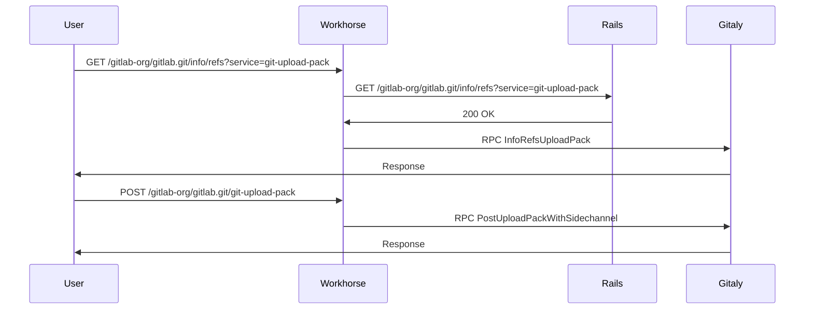
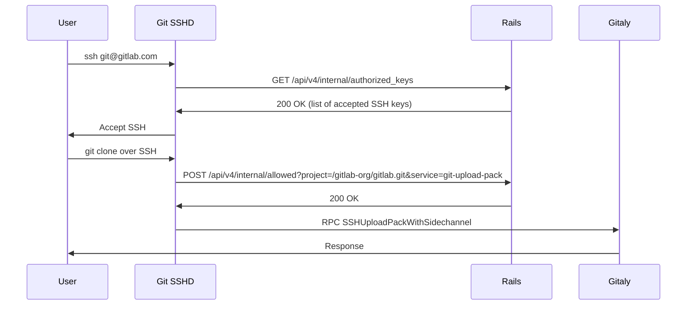
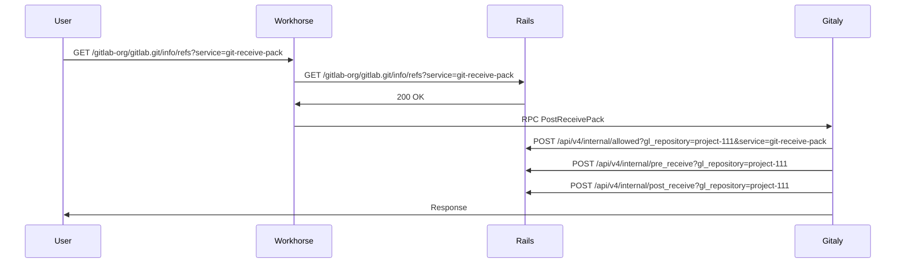
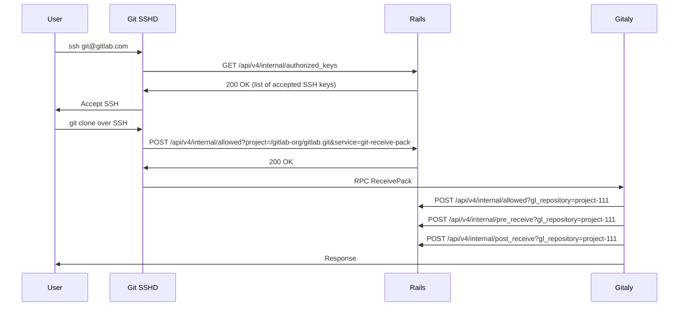
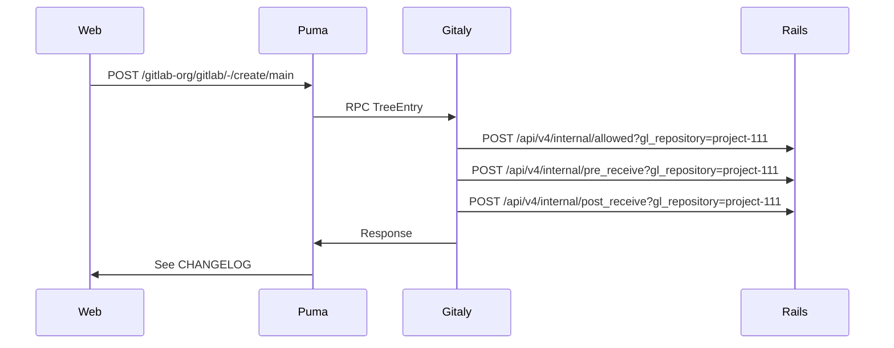

<!-- vale gitlab.FutureTense = NO -->

This document is a work-in-progress and represents a very early state of the Cells design.
Significant aspects are not documented, though we expect to add them in the future.
This is one possible architecture for Cells, and we intend to contrast this with alternatives before deciding which approach to implement.
This documentation will be kept even if we decide not to implement this so that we can document the reasons for not choosing this approach.

# Cells: Git Access

This document describes impact of Cells architecture on all Git access (over HTTPS and SSH) patterns providing explanation of how potentially those features should be changed to work well with Cells.

## 1. Definition

Git access is done throughout the application.
It can be an operation performed by the system (read Git repository) or by a user (create a new file via Web IDE, `git clone` or `git push` via command line).
The Cells architecture defines that all Git repositories will be local to the Cell, so no repository could be shared with another Cell.

The Cells architecture will require that any Git operation can only be handled by a Cell holding the data.
It means that any operation either via Web interface, API, or GraphQL needs to be routed to the correct Cell.
It means that any `git clone` or `git push` operation can only be performed in the context of a Cell.

## 2. Data flow

The are various operations performed today by GitLab on a Git repository.
This describes the data flow how they behave today to better represent the impact.

It appears that Git access does require changes only to a few endpoints that are scoped to a Project.
There appear to be different types of repositories:

- Project: assigned to Group
- Wiki: additional repository assigned to Project
- Design: similar to Wiki, additional repository assigned to Project
- Snippet: creates a virtual Project to hold repository, likely tied to the User

### 2.1. Git clone over HTTPS

Execution of: `git clone` over HTTPS

### 2.2. Git clone over SSH

Execution of: `git clone` over SSH

### 2.3. Git push over HTTPS

Execution of: `git push` over HTTPS

### 2.4. Git push over SSHD

Execution of: `git clone` over SSH

### 2.5. Create commit via Web

Execution of `Add CHANGELOG` to repository:

## 3. Proposal

The Cells stateless router proposal requires that any ambiguous path (that is not routable) will be made routable.
It means that at least the following paths will have to be updated to introduce a routable entity (Project, Group, or Organization).

Change:

- `/api/v4/internal/allowed` => `/api/v4/internal/projects/<gl_repository>/allowed`
- `/api/v4/internal/pre_receive` => `/api/v4/internal/projects/<gl_repository>/pre_receive`
- `/api/v4/internal/post_receive` => `/api/v4/internal/projects/<gl_repository>/post_receive`
- `/api/v4/internal/lfs_authenticate` => `/api/v4/internal/projects/<gl_repository>/lfs_authenticate`

Where:

- `gl_repository` can be `project-1111` (`Gitlab::GlRepository`)
- `gl_repository` in some cases might be a full path to repository as executed by GitLab Shell (`/gitlab-org/gitlab.git`)

## 4. Evaluation

Supporting Git repositories if a Cell can access only its own repositories does not appear to be complex.
The one major complication is supporting snippets, but this likely falls in the same category as for the approach to support a user's Personal Namespace.

### 4.1. Pros

1. The API used for supporting HTTPS/SSH and Hooks are well defined and can easily be made routable.

### 4.2. Cons

1. The sharing of repositories objects is limited to the given Cell and Gitaly node.
1. Cross-Cells forks are likely impossible to be supported (discover: How this works today across different Gitaly node).

## 5. Forking and object pools

One of the biggest struggles that needs to be addressed with the Cells architecture is how to handle forking. At present, Gitaly utilizes object pools to provide deduplication of fork storage. If forks are not created on the same storage node as the upstream repository that is being forked, we end up with significant storage inefficiencies as we will effectively have two complete copies of the repository and we will not be able to utilize object pools to improve performance.

The storage nodes from one Cell cannot talk to the storage nodes of another Cell, making forking across Cells impossible. Therefore, it will be necessary to ensure that forked repositories end up in the same Cell (and on the same Gitaly nodes) as their upstream parent repository. This will also enable Gitaly to continue to utilize object pools to provide storage and performance efficiency.

### 5.1. How this works today

**Single Gitaly storage node**

Currently, for a GitLab instance backed with a single Gitaly storage node, forking works just fine.
Any forks must reside on the same storage node as there is only one, and therefore object deduplication (and object pools) all function as expected.

**Sharded Gitaly storage**

A sharded Gitaly storage is when multiple Gitaly storage nodes are attached to a single instance, and repositories are assigned based on a priority weighting between the nodes.

Since Gitaly knows how to do cross-storage fetches, forking across shards works without issue.

**Gitaly Cluster**

For Gitaly cluster, we recently resolved [the issue](https://gitlab.com/gitlab-org/gitaly/-/issues/5094) of object pools not being created on the same storage nodes as the parent repository. This enables forking to work correctly from an efficiency perspective (can share an object pool) and from an object deduplication perspective (Git can properly deduplicate storage).
