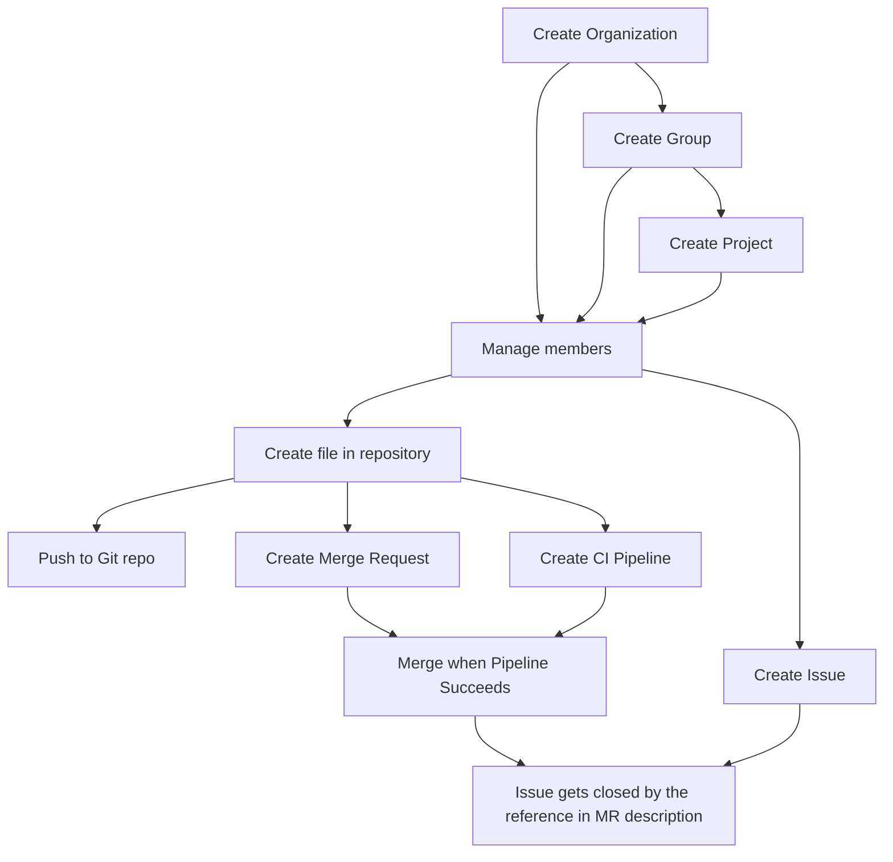

<!-- vale gitlab.FutureTense = NO -->

# Cells

This document is a work-in-progress and represents a very early state of the Cells design. Significant aspects are not documented, though we expect to add them in the future.

Cells is a new architecture for our software as a service platform. This architecture is horizontally scalable, resilient, and provides a more consistent user experience. It may also provide additional features in the future, such as data residency control (regions) and federated features.

For more information about Cells, see also:

## Cells Iterations

- The [Cells 1.0](iterations/cells-1.0.md) target is to deliver a solution
  for new enterprise customers using the SaaS GitLab.com offering.
- The [Cells 1.5](iterations/cells-1.5.md) target is to deliver a migration solution
  for existing enterprise customers using the SaaS GitLab.com offering, built on top of architecture
  of Cells 1.0.
- The [Cells 2.0](iterations/cells-2.0.md) target is to support a public and open source contribution
  model in a cellular architecture.

## Goals

See [Goals, Glossary and Requirements](goals.md).

## Workstreams

We can't ship the entire Cells architecture in one go - it is too large.
Instead, we are defining key workstreams required by the project.
For each workstream, we need to define the effort necessary to make features compliant with Cell 1.0, Cell 1.5, and Cell 2.0, respectively.

It is expected that some objectives will not be completed for General Availability (GA), but will be enough to run Cells in production.

### 1. Data access layer

Before Cells can be run in production we need to prepare the codebase to accept the Cells architecture.
This preparation involves:

- Allowing data sharing between Cells.
- Updating the tooling for discovering cross-Cell data traversal.
- Defining code practices for cross-Cell data traversal.
- Analyzing the data model to define the data affinity.

Under this objective the following steps are expected:

1. **Allow to share cluster-wide data with database-level data access layer.**

    Cells can connect to a database containing shared data. For example: application settings, users, or routing information.

1. **Evaluate the efficiency of database-level access vs. API-oriented access layer.**

    Reconsider the consequences of database-level data access for data migration, resiliency of updates and of interconnected systems when we share only a subset of data.

1. **Cluster-unique identifiers**

    Every object has a unique identifier that can be used to access data across the cluster. The IDs for allocated Projects, issues and any other objects are cluster-unique.

1. **Cluster-wide deletions**

    If entities deleted in Cell 2 are cross-referenced, they are properly deleted or nullified across clusters. We will likely re-use existing [loose foreign keys](../../../development/database/loose_foreign_keys.md) to extend it with cross-Cells data removal.

1. **Data access layer**

    Ensure that a stable data access (versioned) layer is implemented that allows to share cluster-wide data.

1. **Database migration**

    Ensure that migrations can be run independently between Cells, and we safely handle migrations of shared data in a way that does not impact other Cells.

### 2. Workflows

To make Cells viable we require to define and support essential workflows before we can consider the Cells to be of Beta quality.
Workflows are meant to cover the majority of application functionality that makes the product mostly useable, but with some caveats.

The current approach is to define workflows from top to bottom.
The order defines the presumed priority of the items.
This list is not exhaustive as we would be expecting other teams to help and fix their workflows after the initial phase, in which we fix the fundamental ones.

To consider a project ready for the Beta phase, it is expected that all features defined below are supported by Cells.
In the cases listed below, the workflows define a set of tables to be properly attributed to the feature.
In some cases, a table with an ambiguous usage has to be broken down.
For example: `uploads` are used to store user avatars, as well as uploaded attachments for comments.
It would be expected that `uploads` is split into `uploads` (describing Group/Project-level attachments) and `global_uploads` (describing, for example, user avatars).

It is expected that **group::tenant scale** will help other teams to fix their feature set to work with Cells.
The first 2-3 quarters are required to define a general split of data, and build the required tooling and development guidelines.

1. **Instance-wide settings are shared across cluster.**

    The Admin Area section for the most part is shared across a cluster.

1. **User accounts are shared across cluster.** ✓

    The purpose is to make `users` cluster-wide.

1. **User can create Organization.**

    The purpose is to create Organizations that are isolated from each other.

1. **User can create Group.** ✓ ([demo](https://www.youtube.com/watch?v=LUyV0ncfdRs))

    The purpose is to perform a targeted decomposition of `users` and `namespaces`, because `namespaces` will be stored locally in the Cell.

1. **User can create Project.** ✓ ([demo](https://www.youtube.com/watch?v=Z-2W8MfDwuI))

    The purpose is to perform a targeted decomposition of `users` and `projects`, because `projects` will be stored locally in the Cell.

1. **User can create Project with a README file**

    The purpose is to allow `users` to create README files in a project.

1. **User can change profile avatar that is shared in cluster.**

    The purpose is to fix global uploads that are shared in cluster.

1. **User can push to Git repository.**

    The purpose is to ensure that essential joins from the Projects table are properly attributed to be Cell-local, and as a result the Git workflow is supported.

1. **User can run CI pipeline.**

    The purpose is that `ci_pipelines` (like `ci_stages`, `ci_builds`, `ci_job_artifacts`) and adjacent tables are properly attributed to be Cell-local.

1. **User can create issue.**

    The purpose is to ensure that `issues` are properly attributed to be `Cell-local`.

1. **User can create merge request, and merge it after it is green.**

    The purpose is to ensure `merge requests` are properly attributed to be `Cell-local`.

1. **User can manage Group and Project members.**

    The `members` table is properly attributed to be either `Cell-local` or `cluster-wide`.

1. **User can manage instance-wide runners.**

    The purpose is to scope all CI runners to be Cell-local. Instance-wide runners in fact become Cell-local runners. The expectation is to provide a user interface view and manage all runners per Cell, instead of per cluster.

1. **User is part of Organization and can only see information from the Organization.**

    The purpose is to have many Organizations per Cell, but never have a single Organization spanning across many Cells. This is required to ensure that information shown within an Organization is isolated, and does not require fetching information from other Cells.

Some of the following workflows might need to be supported, depending on the group's decision.
This list is not exhaustive of work needed to be done.

1. **User can use all Group-level features.**
1. **User can use all Project-level features.**
1. **User can share Groups with other Groups in an Organization.**
1. **User can create system webhook.**
1. **User can upload and manage packages.**
1. **User can manage security detection features.**
1. **User can manage Kubernetes integration.**
1. TBD

#### Dependencies

We have identified the following dependencies between workflows.

### 3. Routing layer

See [Cells: Routing Service](routing-service.md) for HTTP Routing.

See [Cells: SSH Routing Service](ssh_routing_service.md) for SSH Routing.

### 4. Infrastructure

See [Cell: Infrastructure](infrastructure/index.md).

### 5. Migration

When we reach production and are able to store new Organizations on new Cells, we need to be able to divide big Cells into many smaller ones.

1. **Use GitLab Geo to clone Cells.**

    The purpose is to use GitLab Geo to clone Cells.

1. **Split Cells by cloning them.**

    Once a Cell is cloned we change the routing information for Organizations.
    Organizations will encode a `cell_id`.
    When we update the `cell_id` it will automatically make the given Cell authoritative to handle traffic for the given Organization.

1. **Delete redundant data from previous Cells.**

    Since the Organization is now stored on many Cells, once we change `cell_id` we will have to remove data from all other Cells based on `organization_id`.

## Availability of the feature

We are following the [Support for Experiment, Beta, and Generally Available features](../../../policy/experiment-beta-support.md).

### 1. Experiment

Expectations:

- We can deploy a Cell on staging or another testing environment by using a separate domain (for example `cell2.staging.gitlab.com`) using [infrastucture](#4-infrastructure) tooling.
- User can create Organization, Group and Project, and run some of the [workflows](#2-workflows).
- It is not expected to be able to run a router to serve all requests under a single domain.
- We expect data loss of data stored on additional Cells.
- We expect to tear down and create many new Cells to validate tooling.

### 2. Beta

Expectations:

- We can run many Cells under a single domain (ex. `staging.gitlab.com`).
- All features defined in [workflows](#2-workflows) are supported.
- Not all aspects of the [routing layer](#3-routing-layer) are finalized.
- We expect additional Cells to be stable with minimal data loss.

### 3. GA

Expectations:

- We can run many Cells under a single domain (for example, `staging.gitlab.com`).
- All features of the [routing layer](#3-routing-layer) are supported.
- We don't expect to support any of the [migration](#5-migration) aspects.

### 4. Post GA

Expectations:

- We can [migrate](#5-migration) existing Organizations onto new Cells.

## Technical proposals

The Cells architecture has long lasting implications to data processing, location, scalability and the GitLab architecture.
This section links all different technical proposals that are being evaluated.

- [Routing Service](routing-service.md)
- [Feature Flags](feature_flags.md)

## Impacted features

The Cells architecture will impact many features requiring some of them to be rewritten, or changed significantly.
Below is a list of known affected features with preliminary proposed solutions.

- [Cells: Admin Area](impacted_features/admin-area.md)
- [Cells: Backups](impacted_features/backups.md)
- [Cells: CI/CD Catalog](impacted_features/ci-cd-catalog.md)
- [Cells: CI Runners](impacted_features/ci-runners.md)
- [Cells: Container Registry](impacted_features/container-registry.md)
- [Cells: Contributions: Forks](impacted_features/contributions-forks.md)
- [Cells: Database Sequences](impacted_features/database-sequences.md)
- [Cells: Data Migration](impacted_features/data-migration.md)
- [Cells: Explore](impacted_features/explore.md)
- [Cells: Git Access](impacted_features/git-access.md)
- [Cells: Global Search](impacted_features/global-search.md)
- [Cells: GraphQL](impacted_features/graphql.md)
- [Cells: Organizations](impacted_features/organizations.md)
- [Cells: Personal Access Tokens](impacted_features/personal-access-tokens.md)
- [Cells: Personal Namespaces](impacted_features/personal-namespaces.md)
- [Cells: Secrets](impacted_features/secrets.md)
- [Cells: Snippets](impacted_features/snippets.md)
- [Cells: User Profile](impacted_features/user-profile.md)
- [Cells: Your Work](impacted_features/your-work.md)

### Impacted features: Placeholders

The following list of impacted features only represents placeholders that still require work to estimate the impact of Cells and develop solution proposals.

- [Cells: Agent for Kubernetes](impacted_features/agent-for-kubernetes.md)
- [Cells: Data pipeline ingestion](impacted_features/data-pipeline-ingestion.md)
- [Cells: GitLab Pages](impacted_features/gitlab-pages.md)
- [Cells: Group Transfer](impacted_features/group-transfer.md)
- [Cells: Issues](impacted_features/issues.md)
- [Cells: Merge Requests](impacted_features/merge-requests.md)
- [Cells: Project Transfer](impacted_features/project-transfer.md)
- [Cells: Router Endpoints Classification](impacted_features/router-endpoints-classification.md)
- [Cells: Schema changes (Postgres and Elasticsearch migrations)](impacted_features/schema-changes.md)
- [Cells: Uploads](impacted_features/uploads.md)
- ...

## Frequently Asked Questions

### What's the difference between Cells architecture and GitLab Dedicated?

We've captured individual thoughts and differences between Cells and Dedicated over [here](infrastructure/diff-between-dedicated.md)

The new Cells architecture is meant to scale GitLab.com.
The way to achieve this is by moving Organizations into Cells, but different Organizations can still share server resources, even if the application provides isolation from other Organizations.
But all of them still operate under the existing GitLab SaaS domain name `gitlab.com`.
Also, Cells still share some common data, like `users`, and routing information of Groups and Projects.
For example, no two users can have the same username even if they belong to different Organizations that exist on different Cells.

With the aforementioned differences, [GitLab Dedicated](https://about.gitlab.com/dedicated/) is still offered at higher costs due to the fact that it's provisioned with dedicated server resources for each customer, while Cells use shared resources.
This makes GitLab Dedicated more suited for bigger customers, and GitLab Cells more suitable for small to mid-size companies that are starting on GitLab.com.

On the other hand, GitLab Dedicated is meant to provide a completely isolated GitLab instance for any Organization.
This instance is running on its own custom domain name, and is totally isolated from any other GitLab instance, including GitLab SaaS.
For example, users on GitLab Dedicated don't have to have a different and unique username that was already taken on GitLab.com.

### Can different Cells communicate with each other?

Not directly, our goal is to keep them isolated and only communicate using global services.

### How are Cells provisioned?

The GitLab.com cluster of Cells will use GitLab Dedicated instances.
Once a GitLab Dedicated instance gets provisioned it could join the GitLab.com cluster and become a Cell.
One requirement will be that the GitLab Dedicated instance does not contain any prior data.

To reach shared resources, Cells will use [Private Service Connect](https://cloud.google.com/vpc/docs/private-service-connect).

See also the [design discussion](https://gitlab.com/gitlab-org/gitlab/-/issues/396641).

### What is a Cells topology?

See the [design discussion](https://gitlab.com/gitlab-org/gitlab/-/issues/396641).

### How are users of an Organization routed to the correct Cell?

TBD

### How do users authenticate with Cells and Organizations?

See the [design discussion](https://gitlab.com/gitlab-org/gitlab/-/issues/395736).

### How are Cells rebalanced?

TBD

### How can Cells implement disaster recovery capabilities?

TBD

### How do I decide whether to move my feature to the cluster, Cell or Organization level?

By default, features are required to be scoped to the Organization level. Any deviation from that rule should be validated and approved by Tenant Scale.

The design goals of the Cells architecture describe that [all Cells are under a single domain](goals.md#all-cells-are-under-a-single-gitlabcom-domain) and as such, Cells are invisible to the user:

- Cell-local features should be limited to those related to managing the Cell, but never be a feature where the Cell semantic is exposed to the customer.
- The Cells architecture wants to freely control the distribution of Organization and customer data across Cells without impacting users when data is migrated.

Cluster-wide features are strongly discouraged because:

- They might require storing a substantial amount of data cluster-wide which decreases [scalability headroom](goals.md#provides-100x-headroom).
- They might require implementation of non-trivial [data aggregation](goals.md#aggregation-of-cluster-wide-data) that reduces resilience to [single node failure](goals.md#high-resilience-to-a-single-cell-failure).
- They are harder to build due to the need of being able to run [mixed deployments](goals.md#cells-running-in-mixed-deployments). Cluster-wide features need to take this into account.
- They might affect our ability to provide an [on-premise like experience on GitLab.com](goals.md#on-premise-like-experience).
- Some features that are expected to be cluster-wide might in fact be better implemented using aggregation techniques that use trusted intra-cluster communication using the same user identity.
  For example, user Profile is shared across the cluster.
- The Cells architecture limits what services can be considered cluster-wide.
  Services that might initially be cluster-wide are still expected to be split in the future to achieve full service isolation.
  No feature should be built to depend on such a service (like Elasticsearch).

### Will Cells use the [reference architecture for up to 1000 RPS or 50,000 users](../../../administration/reference_architectures/50k_users.md)?

The infrastructure team will properly size Cells depending on the load.
The Tenant Scale team sees an opportunity to use GitLab Dedicated as a base for Cells deployment.

## Decision log

- [ADR-001: Routing Technology using Cloudflare Workers](decisions/001_routing_technology.md)
- [ADR-002: One GCP Project per Cell](decisions/002_gcp_project_boundary.md)
- [ADR-003: One GKE Cluster per Cell](decisions/003_num_gke_clusters_per_cell.md)

## Links

- [Internal Pods presentation](https://docs.google.com/presentation/d/1x1uIiN8FR9fhL7pzFh9juHOVcSxEY7d2_q4uiKKGD44/edit#slide=id.ge7acbdc97a_0_155)
- [Cells Epic](https://gitlab.com/groups/gitlab-org/-/epics/7582)
- [Database group investigation](https://handbook.gitlab.com/handbook/engineering/infrastructure/core-platform/data_stores/database/doc/root-namespace-sharding/)
- [Shopify Pods architecture](https://shopify.engineering/a-pods-architecture-to-allow-shopify-to-scale)
- [Opstrace architecture](https://gitlab.com/gitlab-org/opstrace/opstrace/-/blob/main/docs/architecture/overview.md)
- [Adding Diagrams to this blueprint](diagrams/index.md)
