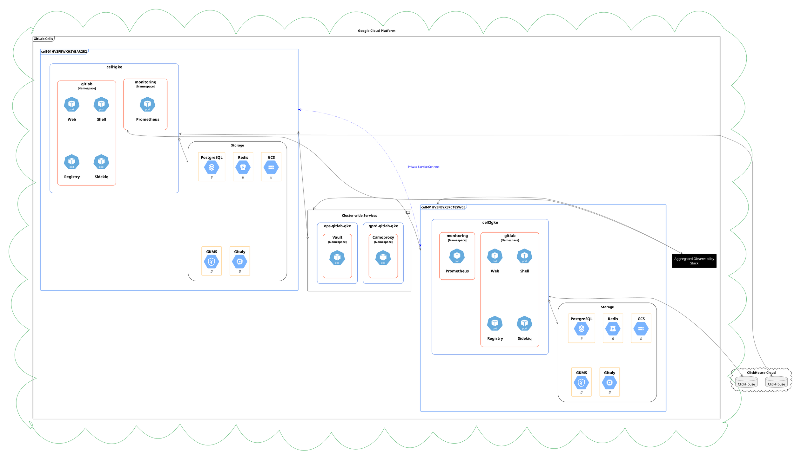
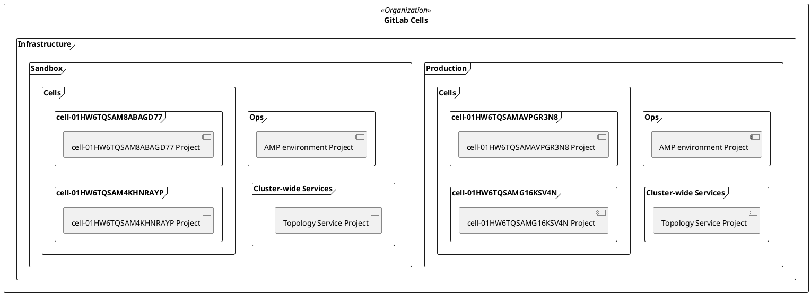
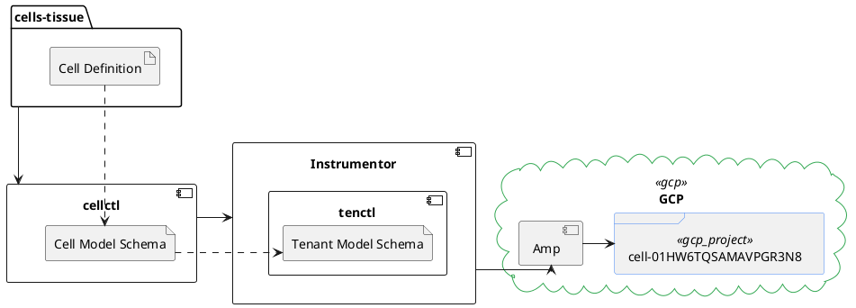
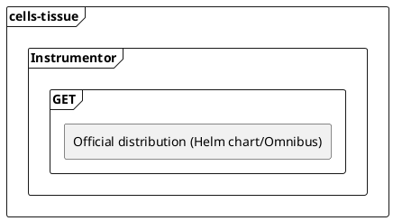
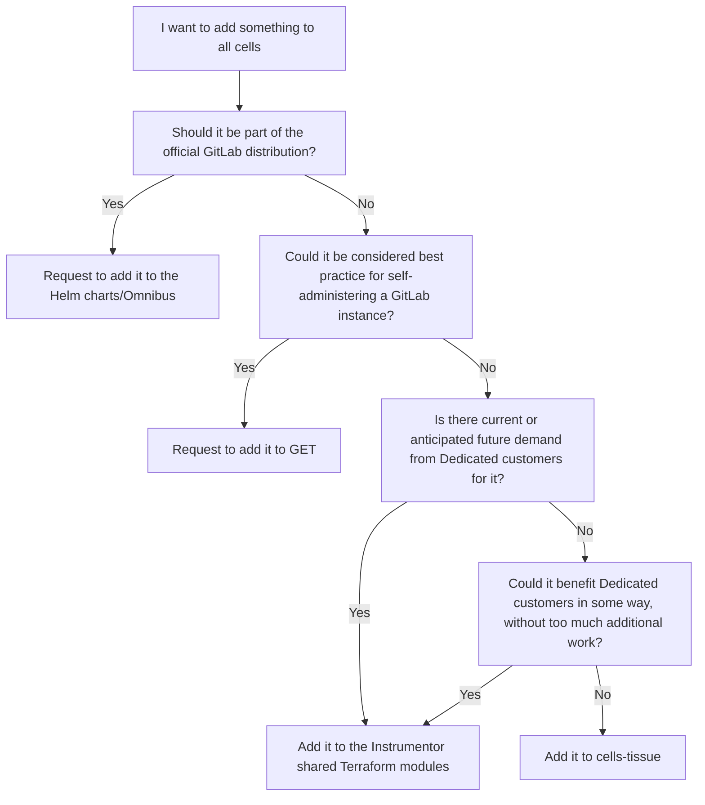

<!-- Blueprints often contain forward-looking statements -->
<!-- vale gitlab.FutureTense = NO -->

# Cell Architecture and Tooling

## Summary

This blueprint lays out how cells will be architected, which components will be managed as cell-local or globally, and how a mix of existing and new tooling will be used to provision new cells.

The core of each cell is essentially a Dedicated instance that will be configured to form part of the GitLab.com cluster of cells. This lets us reuse the existing Dedicated tooling (specifically Instrumentor and Amp) for provisioning and configuration of the initial cells. On the other hand, as a consequence of being reliant on Dedicated, many decisions - specifically how a cell is internally architected - are already made for us.

The Foundations team will develop new tooling (provisionally named `cellctl`) which will be used by callers wanting to interact with cells. This will abstract away the need for the callers to have any knowledge of how a cell is built. It does this by presenting a cell model schema - essentially a reduced version of the Dedicated tenant model schema, with additional cells-related fields added - to clients, which will be translated into a Dedicated tenant model schema that can be used by Dedicated tooling. `cellctl`, using Terraform, will also be responsible for ensuring that GCP resources are appropriately located within the resource hierarchy. `cells-tissue` will continue to be the source of truth for cell definitions.

For the initial stages of the cells rollout, we don't believe it is necessary to have a separate provisioning process for cell-local infrastructure, but that option remains on the table in the event of the requirements of cells and Dedicated diverging too greatly to consolidate cleanly within Instrumentor.

## Motivation

It has been apparent for some time that we have hit a scalability ceiling on GitLab.com. Noisy neighbor issues abound, and the underlying infrastructure demands an ever-increasing amount of toil from SREs due to the inevitable buildup of unaddressed technical debt under the hood.

To alleviate these problems, we aim to replace the current monolithic architecture with a resilient, horizontally scalable multi-tenanted architecture ("Cells") that provides a high level of isolation between tenants while still providing a largely unchanged experience to the user. This change should also make implementation of customer requirements such as data residency possible.

In doing this, we're also trying to achieve some degree of homogeneity in how GitLab is deployed. Currently, GitLab.com involves myriad different tools to provision: Helm, Chef, Tanka, and Terraform among them. Cells will be using the tooling used to provision GitLab Dedicated tenants, meaning that any improvements to the process for cells can be applied to Dedicated customers too, or vice versa.

### Goals

This blueprint will:

- Describe the architecture of each cell
- Enumerate reasons for why certain architectural decisions were made
- Broadly address how existing and new tooling will be used for cell provisioning

### Non-Goals

The following is out of scope:

- Details of cell provisioning or configuration management - these will be addressed in separate blueprints (for brevity)
- Process changes (e.g. which team is responsible for what task)
- Low-level implementation details of tooling
- Migration from monolith to cells
  - How to run monolith and cells concurrently

## Proposal

- Each cell is effectively its own GitLab Dedicated instance that can interface seamlessly with the rest of GitLab.com, yet is limited to using resources available to that cell only. Users on a cell will not perceive the isolation of the underlying resources
- Dedicated tooling (Instrumentor and Amp) will be used to provision new cells
  - To reduce potential future disruption, common Terraform modules will be split out of the current Instrumentor repo and vendored instead. Foundations will share ownership of the modules with the Dedicated team
  - A separate Amp environment will be setup for cells use
- `cellctl` is a tool that will be developed by Foundations to translate a cell model schema into a Dedicated tenant model schema, and calling Instrumentor to provision and configure the tenant. Users of `cellctl` need not be aware of the infrastructure underlying a cell
  - `cellctl` will also be responsible for ensuring the resource hierarchy in GCP matches the defined hierarchy in `cells-tissue`

## Design and implementation details

### Architecture



#### Components

Each cell contains a [Cloud Native Hybrid deployment](../../../../administration/reference_architectures/50k_users.md#cloud-native-hybrid-reference-architecture-with-helm-charts-alternative) of GitLab, sized appropriately for its expected workload. This is provided by the [GitLab Environment Toolkit (GET)](https://gitlab.com/gitlab-org/gitlab-environment-toolkit) via the Dedicated tool [Instrumentor](https://gitlab.com/gitlab-com/gl-infra/gitlab-dedicated/instrumentor) which acts as an orchestration layer on top of GET.

Cell definitions (i.e. size of each cell, which components it includes, etc.) will be stored in the [`cells-tissue` repository](https://gitlab.com/gitlab-com/gl-infra/cells-tissue), which already contains definitions for a number of cells and rings.

| Service | Runs on |
|---------|---------|
| Webservice | Kubernetes |
| Sidekiq | Kubernetes |
| Supporting services | Kubernetes |
| Gitaly | Google Compute Engine VM |
| PostgreSQL | CloudSQL |
| Redis | Memorystore |
| Object storage | Google Cloud Storage |
| Per-cell observability stack | Kubernetes |
| Inter-cell networking | Private Service Connect |
| ClickHouse | ClickHouse Cloud |

Auxiliary services with a global context - that is, services handling data not specific to any individual cell - will have their lifecycle managed completely independently of cells. Such services include:

- Hashicorp Vault (for storage and management of secrets used in CI, and shared infrastructure secrets such as those used by the observability stack)
  - We will be using the existing [production Vault instance](https://vault.gitlab.net) which is configured using [`config-mgmt`](https://ops.gitlab.net/gitlab-com/gl-infra/config-mgmt/-/tree/main/environments/vault-production) and deployed in [`gitlab-helmfiles`](https://gitlab.com/gitlab-com/gl-infra/k8s-workloads/gitlab-helmfiles/-/tree/master/releases/vault).
- Camoproxy (for [proxying assets](../../../../security/asset_proxy.md))
  - We will be using the existing Camoproxy instance deployed in [`gitlab-helmfiles`](https://gitlab.com/gitlab-com/gl-infra/k8s-workloads/gitlab-helmfiles/-/tree/master/releases/camoproxy).

#### Naming conventions for cells

The ID field can only be up to 30 characters long due to restrictions imposed by the [Dedicated tenant model](https://gitlab.com/gitlab-com/gl-infra/gitlab-dedicated/tenant-model-schema/-/blob/main/json-schemas/tenant-model.json) and [GCP project naming](https://cloud.google.com/resource-manager/docs/creating-managing-projects).
This limits us in what kind of metadata we can include in the cell name: for example, we can't include the region name.

With this in mind, cells will use a [ULID](https://github.com/ulid/spec), truncated to 18 characters, as its tenant ID. For example, a single cell's ID might be `01HW6TQSAMAVPGR3N8`. Per the ULID spec, the ID consists of:

```plaintext
ttttttttttrrrrrrrr

where
t is Timestamp (10 characters)
r is Randomness (8 characters)
```

A prettier name prefixed with `cell-` will be used for situations where human readability is preferred, e.g. in the GCP project name. For example, if a cell has the ID of `01HW6TQSAMAVPGR3N8`, its prettified name will be `cell-01HW6TQSAMAVPGR3N8`.

The length of the ID allows for an additional 7 characters which can be used to name additional GCP projects (should they be needed) related to a single cell. For example, if the cell needs additional projects for Runner or Gitaly resources, they can be named like so, while staying within the 30 character limit:

- `cell-01HW6TQSAMAVPGR3N8-rnr123` or `cell-01HW6TQSAMAVPGR3N8-runner`
- `cell-01HW6TQSAMAVPGR3N8-git594` or `cell-01HW6TQSAMAVPGR3N8-gitaly`

See [this issue](https://gitlab.com/gitlab-com/gl-infra/production-engineering/-/issues/25065) for discussion.

#### Relationship to GCP projects

Each cell will have its own project in GCP to provide greater isolation between cells and simplify management. This is also in accordance with the existing Dedicated tooling, which assumes one GCP project per tenant.

See [this issue](https://gitlab.com/gitlab-com/gl-infra/production-engineering/-/issues/25067) for discussion, and [this ADR](../decisions/002_gcp_project_boundary.md).

#### Networking

Each cell will have its own VPC, with one subnet per region.

Having a single VPC per cell will make provisioning and management of a cell easier as there will be no need to worry about IP address space overlap issues, as well as make cells secure by default as they will be fully isolated.

Cells will use [Private Service Connect](https://cloud.google.com/vpc/docs/private-service-connect) to communicate with other cells if required. The definitions specifying how cells are connected will be kept alongside cell definitions that will be used by `cellctl` to provision the needed resources.

See [this issue](https://gitlab.com/gitlab-com/gl-infra/production-engineering/-/issues/25069) for discussion, and [this ADR](../decisions/004_vpc_subnet_design.md).

#### GCP organization

A new GCP organization (provisionally named `GitLab Cells`) for the sole purpose of hosting cells will be created. While it will use the same centralized billing account as the existing `gitlab.com` organization, all resources and permissions under the new org will be controlled authoritatively using Terraform and access will be locked down to only team members who need it. Admin access would be granted in break-glass situations only, and fully auditable.

This was deemed preferable to thoroughly auditing and consolidating the existing organization, which is relied upon by many different teams (so we run the risk of breaking something business-critical) and is only partially managed by Terraform. See [this issue](https://gitlab.com/gitlab-com/gl-infra/production-engineering/-/issues/25282) for discussion.

#### Cloud resource hierarchy

The cells tooling (`cellctl`) will be responsible for creating and maintaining a cloud resource hierarchy under the `Gitlab Cells` organization. This hierarchy should reflect the filesystem hierarchy of the definitions in the [`cells-tissue` repository](https://gitlab.com/gitlab-com/gl-infra/cells-tissue).

In this hierarchy, every environment will have its own folder, which in turn contains an `Ops` folder, and a `Cells` folder.

Each cell will have its own folder, named for its (prettified) ID, in the `Cells` folder. This gives us the option of adding new projects for cell-specific components (such as runners or additional Gitaly nodes) to the folder, thus grouping them with the cell concerned, in the future.

The `Ops` folder will contain the Amp environment GCP project.



#### Number of GKE clusters serving a cell

Each cell will run on one GKE cluster. Routing to and between cells will be simpler; the Helm charts do not support deploying one instance of the application across multiple clusters, while GET does not support managing multiple instances of the application in one cluster.

See [this issue](https://gitlab.com/gitlab-com/gl-infra/production-engineering/-/issues/25068) for discussion, and [this ADR](../decisions/003_num_gke_clusters_per_cell.md).

#### Secrets management for cells

We will be using both Google Secret Manager and Hashicorp Vault for secrets management.

Secret Manager will store secrets that are specific to a single cell and thus scoped to a specific GCP project.

Hashicorp Vault will store secrets that are shared across multiple (or all) cells. Such secrets may include credentials for the observability stack.

All Kubernetes secrets will be injected using [`external-secrets`](https://github.com/external-secrets/external-secrets) and _not_ provisioned directly.

See [this issue](https://gitlab.com/gitlab-com/gl-infra/production-engineering/-/issues/25076) for discussion.

#### Access to cells

This is still [being discussed](https://gitlab.com/gitlab-com/gl-infra/gitlab-dedicated/team/-/issues/4625). As much of the underlying infrastructure of a cell is derived from a Dedicated on GCP instance, we expect that any procedure for accessing a cell would be shared (or broadly similar) between the two products.

#### Observability

In general, the lifecycle of observability components for cells will be owned by the `Scalability:Observability` team.

By default, each Dedicated tenant is provisioned with a fully functional Prometheus/Grafana stack. Cells will reuse this stack, with the intention of aggregating metrics so that queries can be run over multiple cells. More information can be found [here](https://gitlab-com.gitlab.io/gl-infra/gitlab-dedicated/team/engineering/observability/metrics.html).

See [this issue](https://gitlab.com/gitlab-com/gl-infra/production-engineering/-/issues/25267) for discussion.

### Tooling

#### Cells 1.0

In order to achieve the Cells 1.0 milestone in the minimum time possible, Foundations will be doing the following:

- Extracting Terraform modules required for a Dedicated GCP instance out of the Instrumentor monorepo
  - Each module will be split into its own repo and vendored in as an external Terraform module in Instrumentor
  - Thereafter, both the Dedicated team and Foundations will be responsible for maintaining these modules
- Adding reference architectures for cells and their related Jsonnet files to Instrumentor so that appropriate variables can be templated in
- Developing a new tool, provisionally called `cellctl`, to orchestrate cells
  - For Cells 1.0, `cellctl` will simply be a thin translation wrapper, transforming its own cell tenant model into an opinionated instance of the [tenant model schema used by Dedicated](https://gitlab.com/gitlab-com/gl-infra/gitlab-dedicated/tenant-model-schema/-/blob/main/json-schemas/tenant-model.json)
  - The cells model will be an opinionated derivative of the [tenant model schema used by Dedicated](https://gitlab.com/gitlab-com/gl-infra/gitlab-dedicated/tenant-model-schema/-/blob/main/json-schemas/tenant-model.json) and include additional cell-specific fields for use by orchestrators of `cellctl`.
- Set up a new Amp environment in GCP specifically for provisioning cells



Other tooling, such as [`ringctl`](https://gitlab.com/gitlab-com/gl-infra/ringctl), should be able to interface with `cellctl` to perform operations on one or many cells without needing to be aware of any specifics of how cells are implemented or orchestrated.

#### Cell tenant model

The tenant model of a cell will follow this structure, split into 2 core fields:

- a metadata struct which contains information used to identify the cell instance (name and labels), in addition to tooling specific information such as which template to use to render the cell definition. Labels can be used to store information relevant to other tools, such as the ring that the cell belongs to.
- a spec struct that contains information about the definition of a cell instance, including the location in which to create the instance.

```go
// Model entry point
type Cell struct {
  metadata CellMetadata
  spec     CellSpec
}

// Contains fields specific to Cells
type CellMetadata struct {
  // The identifier of the cell
  name string
  // Optional template specifier
  //
  // If this is not set then the template must be provided
  // externally.
  template *string `json:",omitempty"`
  // Additional annotations
  //
  // To be used for defining features and passing additional
  // context through to the cell template.
  annotations map[string]string `json:",omitempty"`
  // Additional labels

  // Used to add human understandable context to cell instances.
  // Can be used to perform searches across cell instances.
  labels map[string]string `json:",omitempty"`
}

// Contains fields related to the definition of the cell through the dedicated tooling
type CellSpec struct {
  // Primary GCP project ID
  project_id string
  // The region we want this cell to be provisioned within
  region string
  // Reference architecture
  reference_architecture string
  // Instrumentor version
  instrumentor_version *string `json:",omitempty"`
  // GitLab version
  gitlab_version *string `json:",omitempty"`
  // Prerelease version
  prerelease_version *string `json:",omitempty"`
}
```

`cellctl` processes these cell instance definitions from YAML files, and translates them through a mapping layer of jsonnet templates to output a tenant model for provisioning through Amp and Instrumentor.

These cell definition files can also be processed by other tooling at the same plane as `cellctl` to create additional infrastructure with a "global" view of all cell instances.

#### Beyond Cells 1.0

As cells are gradually built out, we may find that the requirements for Dedicated tenants and cells will diverge, and attempting to consolidate this into Instrumentor may result in unacceptable complexity. This may necessitate an additional layer of resources provisioned and managed by cells-specific tooling, which would be developed and maintained by Foundations.

##### Where should something be implemented for cells?

There are four places containing resource definitions for components making up a single cell. Each builds on top of the last:



As we build out cells, there will inevitably be questions about the best place to add something. The following chart should help guide the decision:


