Disclaimer: This blueprint requires more cross-functional alignment - **Confidence Level:** Low

# Application Deployment with a Cellular Architecture

This blueprint describes a deployment strategy that can support the new scaling dimension introduced by the Cell Architecture.

The complexity of this transition will require many teams in the Platforms section to participate by taking ownership of the features necessary to reach the production grade rating on this architecture.

## Introduction

### Preamble

From a high level perspective, a Cell Cluster is a system made of only 3 items:

1. **Router** - An HA routing system deployed independently from the GitLab application.
1. **Primary Cell** - The GitLab installation that is the leader for all the cluster wide data and services. This will be the legacy GitLab.com deployment.
1. Zero or more **Secondary Cells** - GitLab installations authoritative for a limited number of Organizations. Those Cells are deployed using GitLab Dedicated tools.

As we can see from the diagram, users interact with the system through the router only. Secondary Cells communicate with the Primary Cell using internal API and have a local copy of all the database rows necessary to operate.

It is important to note that even if a Secondary Cell supports GitLab Geo out of the box, we will not be able to provide this feature to our users until the Router supports it.

### Key Terms

- Deployment - The GitLab application and its components being installed into infrastructure
- `auto-deploy` version - The active version that creates a package viable for deployment
- ring - A logical partition of the cell cluster. In order to deploy to the next ring a package must be validated inside the current ring.
- `perimeter` - the ring marking the "definition of done" for Release Managers, a package validated inside the perimeter is allowed to rollout in the rest of the fleet
- `graduated` version - The version deemed safe to deploy to cells outside of the perimeter
- `.com` - Our old existing or currently running infrastructure
- Primary Cell - The GitLab installation that is the leader for all the cluster wide data and services. Initially this will be the legacy GitLab.com deployment. This implicitly includes .com as our legacy infrastructure.
- Secondary Cell(s) - GitLab installation(s) authoritative for a limited number of Organizations. Deployed using GitLab Dedicated tools.

### Ring deployment

The scale of the Cell project deployment together with the strong user partitioning maps well with a [ring deployment](https://configcat.com/ring-deployment/) approach.

In the image above we are showing a possible ring layout with a cluster made of the Primary Cell and 10 Secondary cells, the upper bound of the Cell 1.0 milestone.

The general rule is that:

1. The deployment process progresses from Ring 0 to the outer rings.
1. Rings are a collection of Cells sharing the same risk factor associated to a deployment.
1. Deployments can get halted at any stage and the package will not reach the outer rings.
1. We define the "perimeter" ring that marks the "definition of done" for the Release Managers.
   - Crossing perimeter is the logical point in time of a given package lifecycle after the PDM has successfully run on the Main Stage. Effectively, between Ring 1 and Ring 2 as described throughout this document.
   - A successful run of the Post Deploy Migrations inside the perimeter marks a package as `graduated`.
   - A `graduated` package is a valid candidate for the monthly release.
   - A `graduated` package is rolled out to the rest of the rings automatically.
   - Deployments must be automated: inside the perimeter are responsibility of Release Managers, outside of it are responsibility of Team:Ops.

### Reference materials

- [Cell 1.0 blueprint](https://gitlab.com/gitlab-org/gitlab/-/blob/master/doc/architecture/blueprints/cells/iterations/cells-1.0.md)
- [The merge request for this blueprint](https://gitlab.com/gitlab-org/gitlab/-/merge_requests/141427)
- [Delivery Point of View on Cells](https://gitlab.com/gitlab-com/Product/-/issues/12770)
- [GitLab.com deployment process before Cells](https://gitlab.com/gitlab-com/content-sites/handbook/-/blob/21f6898110466b5c581a881db0ce343bf9cb1a72/content/handbook/engineering/deployments-and-releases/deployments/index.md)

## Goals and Non-Goals

### Goals

- Limit the increase in cognitive load for the release manager; in doing so, we defined the perimeter as the clear handover point where a package is no longer a release manager's responsibility.
- Limit the blast radius of failures by partitioning the cell cluster into rings, automated validation occurs between each ring.
- Ensure deployments are reliably automated
- Ensure automatic handling of failed deployments
- Provide observability into package rollouts and deployments

### Non-Goals

- Extending `release-tools` to take ownership of the Cell Application Deployments. A smaller, more specific piece of software will allow us to keep the tooling focused on one job.
- Introduce major changes related to Release Management
- Lifecycle management of Cells
- Management of routing traffic to/from Cells
- Individual component deploys

## Requirements

Before we can integrate Secondary Cells to our deployment pipeline, we need a few items immediately:

1. The router should exist, it must be HA, and have an independent deployment pipeline
   - This is required for appropriate testing. As noted below, we'll need a QA cell to direct a deployment to for which QA will execute tests against. A router will need to route QA tests to the appropriate Cell.
1. Assets Deployment
   - This already exists today for .com. Today this is handled via HAProxy, but with Cells, the routing layer will become the responsible party to redirect assets in a similar fashion.
   - If assets are chosen to be managed differently, this changes both how Delivery need to deploy said assets in order to provide as close to Zero Downtime Upgrades as possible, and configuration to the Cell installation to support routing to assets properly.
1. Feature Flags
   - We are assuming that the current Feature Flags workflows and tooling will just work on the Primary Cell and that Secondary Cells will not be affected.
   - The use of feature flags to mitigate incidents is limited to only the Primary Cell.
   - Tooling may need to mature to ensure that Cells do not drift for long periods of time with feature flags. This ensures that customers have a similar experience if their work expands across Cells and that we as operators of .com need not worry about version drift and the implications of code differing behind the feature flag.
   - Further guidance, documentation will need to be developed for this area. Engineers shouldn't care what cell an organization is a part of. Thus Feature Flag toggles abstract away the need for engineers to care.

## Proposed plan of action

From a delivery perspective not much changes between the 3 proposed Cells iterations (1.0, 1.5, and 2.0). The split is an iterative approach based on cutting the scope of the features available for Organizations bound to a given Cell. From a deployment point of view, it should be possible to have multiple Secondary Cells from the first iteration so we have to figure out a roadmap to get there that is independent from the Cell architecture version.

### Iterations

#### Cells 1.0

The intent in this iteration is to focus our efforts on building and integrating our own tooling that builds and manages Cells. The following milestones, and their exit criterion, are a collaborative effort of the Platforms section and spans across many teams.

1. The Dedicated technology stack expansion:
   - Instrumentor and AMP support GCP
   - A cell is defined as a reference architecture in Instrumentor
1. Control Plane for Cells - Cell Cluster Coordinator
   - Switchboard is currently leveraged by Dedicated but is not an appropriate tool for Cells. We should evaluate the capabilities of other tooling created by Dedicated, `amp` and `instrumentor`, to determine how they could be integrated into a deployment workflow.
   - Implement Cell deployment converging the entire infrastructure of the cell (current dedicated capability)
   - Implement the concept of Rings: initially only Rings 0 and 2
1. First Secondary Cell: the QA Cell in Ring 0
   - Build integration with our current tooling to perform deployments to the QA cell via the Coordinator
   - The QA Cell runs it's own QA smoke tests
   - The QA Cell is updated in parallel with the production canary stage: QA cell failures are considered soft and do not block auto_deploy
1. Control Plane for Cells - Individual dashboards and alerting
   - observability is at least on par with the legacy infrastructure
   - alerting is at least on par with the legacy infrastructure
1. First Customer Secondary Cell: Ring 2
   - release-tools can `graduate` a package after the PDM execution
   - the Coordinator can manage Ring 2 deployments
1. Support for multiple Secondary Cells
   - the Coordinator can converge multiple cells in the same Ring to the desired version

> - Limitations:
>   - all Secondary Cells will be in the same ring, Ring 2
>   - Rollbacks are possible but require downtime to achieve on all secondary cells

#### Cells 1.5 and 2.0

The following features can be distributed between Cell 1.5 and 2.0, they are all improving the operational aspects and we should prioritize them as we learn more about operating Cells.

1. Control Plane for Cells - Additional rings
   - Secondary Cells can be spread over multiple rings
   - Deployment to the next ring starts automatically after the current ring converged
   - Emergency brake: ability to block package rollout to the next ring
1. The QA Cell becomes a blocker for auto-deploy
1. Control Plane for Cells - Cluster dashboards and alerting
   - A dashboard should indicate what package is expected for any given Cell and Ring deployment
   - Any cell not running the desired version should be easily visible and alert if not converged in a reasonable amount of time
   - Deployment health metrics to block package rollout inside a ring (z-score on the four golden signals?)
1. The Post Deploy Migration (PDM) step of deployments needs to be segregated from the application deployment to ensure we have the ability to perform rollbacks on Cells.
   - Without this capability, a Cell must suffer downtime in order for a rollback to complete successfully. This is disruptive and should not be considered a wise solution.
   - The separation of the PDM on the primary Cell already functions as desired. Thus our Primary Cell will have rollbacks as an option to mitigate incidents.
1. Modified tooling that enables us to target only Deploying the GitLab application. Currently the destined tooling to be leveraged employs a strategy where the entire installation is converged. This includes the infrastructure and the version of GitLab which creates a lengthy CI pipeline and long running jobs.
1. Automated Rollbacks - if a deployment fails for any reason, a rollback procedure should be initiated automatically to minimize disruption to the affected Cell. We should be able to use a health metric for this.

The focus here is productionalizing what has been built and cleaning up areas of tech debt incurred during the MVP stage of the first iteration.

#### Mindmap

```mermaid
%%{init: {'theme':'default'}}%%
mindmap
  root((Cells Deployment))
    Core concepts 📚
      Current .com infra is the Primary Cell
      It is possible to have multiple Cells in Cell 1.0
      Cell isn't an HA solution
      Secondary Cells talks to the Primary Cell using internal API

    Prerequisites 🏗️
        router
            HA solution
            independent deployment
        Dedicated
            Support GCP
            Cell reference architecture

    Decisions 📔
        Ring style deployment
            Ring 0: Current Canary + a new QA Cell
            Ring 1: Current Main stage
            Ring 2+: New Secondary Cells for customers
            The Perimenter
                Marks the handover point between Release Managers and Team:Ops
                Inside: Ring 0 and 1
                Outside: Ring 2+
        Running PDM inside the perimeter graduates a package
            A graduated pacage is a valid candidate for the monthly release
        We are not porting staging to Cell
            A new QA Cell will validate the package without affecting users

    Procedures needing upgrades 🦾
        Rollbacks
        auto-deploy rollout
        Post Deployment Migration
        Deployment health metrics

    Risk area ☢️
        There is no dogfooding in Cell 1.0  and 1.5
```

#### Deployment coordinator and Cell Cluster Coordinator

In the context of `auto deploy` we have an external coordinator pipeline, inside the `release-tools` project, that takes care of orchestrating package generation and rollout invoking the specific tool for each job.

In today's GitLab.com infrastructure, deployments are executed by specific tools (`deployer` and `gitlab-com/k8s-workloads`) that can be independently operated by SRE and Release Managers, with the introduction of the Cell cluster we will face new operational challenges like a simple cluster overview, package rollout status, feature flag configuration, provisioning and deprovisioning.

The GitLab Dedicated stack features its own method of controlling installs of GitLab, primarily through a slew of tools, Switchboard, Amp, and Tenctl. The use of Switchboard is not geared towards Cells and thus cannot be leveraged. Other tooling such as Instrumentor and Amp may have a place or modifications to enable them to be more portable for usage between both the Dedicated team and Cells. We'll need to evaluate these tools, their interactions with Cells, and how we may leverage them. Pending how the work is scheduled, this may be a highly collaborative effort with team members working closely across team boundaries to ensure requirements are met during the initial period or MVP for Cells.

In this paragraph we describe an ideal interaction where a data store is updated with a desired version to be deployed, and a Cell Cluster Coordinator is created to support Cell deployments.

In Cell 1.0, inside the perimeter, we will have a single Secondary Cell, the QA Cell.
We should expand release-tools to command some-tool to perform a Cell update on demand.

As we mentioned before, when we run post-deployment migrations in Ring 1, release-tools will mark that version as `graduated` and thus be capable to rollout outside of the perimeter.

Cell Cluster Coordinator will be leveraged to help coordinate automated version upgrades to further rings with automated checks before and after deployments to ensure we are deploying to the correct cells of a desired ring and validate instances are healthy before and after deployments, rolling back in the face of failure, and alerting the appropriate teams as necessary.

### Procedures

#### Auto-Deploy

Auto-deploy shall continue to work as it does today as our Primary Cell is equivalent to our legacy .com infrastructure. Thus our existing procedures related to auto-deploy can still be continued to be leveraged. Think hot-patching, rollbacks, auto-deploy picking, the PDM, the existing auto-deploy schedule, etc. A new procedure will be added to ensure that `release-tools` knows to trigger a deployment after a PDM is executed to the next Ring. Currently `release-tools` doesn't understand anything related to Ring Deployments, this is functionality that will need to be added.

- Auto-deploy is limited to Rings 0 and 1:
  - Ring 0 contains a QA Cell plus the canary stage of the .com infra
  - Ring 1 contains main stage of the .com infra - this is the cut off for release tools
  - All cells will deploy the same way; this eliminates needing to deal with differing deployment technologies
  - `release-tools` will interact with the Coordinator to pilot the deployments to Ring 0 as part of its coordinator pipeline
- Release-tools must be able to `graduate` a package:
  - A `graduate` version of GitLab is any `auto-deploy` version which has a successful deploy onto the Main Stage of Production and the [Post Deploy Migration (PDM)](https://gitlab.com/gitlab-org/release/docs/-/blob/master/general/post_deploy_migration/readme.md) has completed.
  - This could mean we expect to see a single package deploy each day to our Secondary Cells. Currently, the PDM is only run 1 time per day. Note that there are exceptions to this rule.
  - This will enable us to use our existing procedures to remediate high severity incidents where application code may be at fault.
  - We do not want to run official released versions of GitLab as these are produced far slower than auto-deploys thus we risk missing SLA's on incident response. In the cell architecture, most issues should be found in the Primary Cell and fixed prior to being deployed to any Secondary Cell.
  - We'll need new procedures, runbooks, and documentation such that when a problem is found through manual testing, we have some ability to halt deployments of what may be labeled a `graduated` package from actually being deployed.
  - It would be wise to track these failure cases as realistically, QA should be finding issues to enable us to run a automated deployments.

Note that currently, some smaller components deploy themselves to the .com infrastructure. Notably, Zoekt, Container Registry, and Mailroom, have their own cadence of providing newer versions to .com. This aspect will not be carried over into secondary cells, as currently, the tooling we'll leverage does not allow a segregation of components to enable this functionality. Instead, we'll rely on the current defined versions as specified in the default branch which built the `auto-deploy` package. This mimics how our releases are accomplished and thus should carry over well with Cells.

#### Rollbacks

Long term, we should aim to modify the deployment tooling such that Cells are provided a grace period to enable each of them to be able to be safely rolled back in the event of a deployment failure, or mitigating a failure that is noticed post deployment. Currently for the legacy .com or the Primary Cell, we hold the PDM to execute 1 time per day at the discretion of Release Managers. The tooling that performs deployments to Cells currently do not have a way to NOT run the PDM, thus no there does not currently exist a way to rollback without inducing downtime on a particular Cell. Procedures and tooling updates will be required in this area.

#### Hot patching

Hot patching is one source of our ability to mitigate problems. If we rely on `graduate` versions, the hot patcher has no place for secondary cells. It could still be leveraged for our Primary Cell, however. Though, it would be wise if we can eliminate hot patching in favor of safer deployment methodologies.

> For reference, we've only hot patched production 1 time for year 2023.

#### Deployment Health Metrics

Currently we do not automate a deployment to the Main stage of the .com legacy infrastructure, or the Primary Cell. In order to reduce operational overhead we should be able to rely on existing metrics which form a health indicator for a given installation and automatically trigger a deployment at the appropriate time. This deployment health indicator would also need to be carried into each of our cells. Tooling that triggers a deployment at various rings should be made aware to continue or halt a deploy given the status of earlier rings and the health state of the next target ring.

#### Feature Flags

Feature Flags are discussed in [data-stores#83](https://gitlab.com/gitlab-org/enablement-section/data-stores/-/issues/83).

#### Package Rollout Policy

We have an implicit procedure driven by our current use of auto-deploys. This will become more prominent with Cells. As implied in various formats above, auto-deploy shall operate relatively similarly to how it operates today. Cells becomes an addition to the existing `release-tools` pipeline with triggers in differing areas. When and what we trigger will need to be keenly defined. It is expected that Secondary Cells only receive `graduated` versions of GitLab. Thus, we'll leverage the use of our Post Deployment Migration pipeline as the gatekeeper for when a package is considered `graduated`. In an ideal world, when the PDM is executed successfully on the Primary Cell, that package is then considered `graduated` and can be deployed to any outer ring. This same concept is already leveraged when we build releases for self managed customers. This break point is already natural to Release Managers and thus is a good carry over for Cell deployments.

We should aim to deploy to Cells as quickly as possible. For all Cells that exist in a single ring, we should have the ability to deploy in parallel. Doing so minimizes the version drift between Cells and reduces potential issues. If the version drifts too greatly, auto-deploy shall pause itself and an investigation into the reason why we are too far behind begins. Ideally we know about this situation ahead of time. We should aim to be no greater than 1 `graduate` package behind our PDM. Thus the expectation is that for every PDM, is a deployment to our Cells, every day. There are days which the PDM is skipped. We'll need to evaluate on a case-by-case basis why the PDM is halted to determine the detriment this will incur on our Cell deployments.

Rings outside of the perimeter are self-managed by the orchestration engine. Once `release-tools` graduates a package it can forget about it. The orchestration engine will converge the desired GitLab version to all Cell in Ring 2, ther first ring outside of the perimeter, and move to next ring only when all Cells converged.

### FAQ

**Will Developers see indicators on MR's as they are deployed to various Cells?**

No. Our current labeling schema is primarily to showcase that the commit landed in production, the PDM successfully executed, which signals to us that the observed commit is safe for being placed in a release for self-managed customers. Being that after we reach this point, issues with a package should be minimal, there's no need to update issues/MR's with the status as we move forward into our many Rings of deployments. Developers should not need to care what version is deployed to what Cell.

**A P1/S1 issue exists, how do we mitigate this on Cells?**

Cells are still a part of .com, thus our existing [bug](https://handbook.gitlab.com/handbook/engineering/infrastructure/engineering-productivity/issue-triage/#severity-slos) and [vulnerability](https://handbook.gitlab.com/handbook/security/threat-management/vulnerability-management/#remediation-slas) SLA's for remediation apply. We can deploy whatever we want to secondary cells so long as it's considered `graduated`. If a high priority issue comes about, we should be able to freely leverage our existing procedures to update our code base and any given auto-deploy branch for mitigation, and maybe after some extra rounds of testing, or perhaps a slower roll out, we can deploy that auto-deploy package into our cells. This provides us with the same mitigation methods that we leverage today. The problem that this causes is that there could exist some code that may not have been fully vetted. We can still rely on rollbacks in this case and revisit any necessary patch for the next round of auto-deployments and evaluate the fix for another attempt to remediate our cells.

**What changes are expected from a Developers perspective**

Release and Auto-Deploy procedures should largely remain the same. We're shifting where code lands. Any changes in this realm would increase the most the closer we are to Iteration 2.0 when various environments or stages to GitLab begin to change.

**All tiers but one have a failed deploy, what triggers a rollback of that package for all cells?**

This depends on various characteristics that we'll probably want to iterate on and develop processes for. Example, if we fail on the very first cell on the first Tier, we should investigate that cell, but also ensure that this is not systemic to all cells. This can only be handled on a case-by-case basis. If we reach the last tier and last cell and some failure would occur, there should be no reason to rollback any other cell as enough time should have passed by for us to catch application failures.

**What happens with self-managed releases?**

Theoretically not much changes. Currently we use Production, or .com's Main Stage as our proving grounds for changes that are destined to be releasable for self-managed. This does not change as in the Cellular architecture, this notion for this exists in the same place. The vocabulary changes, in this case, a `graduated` package is now considered safe for a release.

**What happens to PreProd**

This instance specifically tests the hybrid installation of a GitLab package and Helm chart when we create release candidates. It's our last step prior to a release being tagged. This is not impacted by the Cells work. Though we may change how preprod is managed.

**What happens with Staging**

Staging is crucial for long term instance testing of a deployment alongside QA. Hypothetically staging could completely go away in favor of a deployment to Tier 0. Reference the above Iteration 3 {+TODO add proper link+}

**What happens to Ops**

No need to change. But if Cell management becomes easy, it would be prudent to make this installation operate as similar as possible to avoid overloading operations teams with unique knowledge for our many instances.

This same answer could be provided for the Dev instance.
