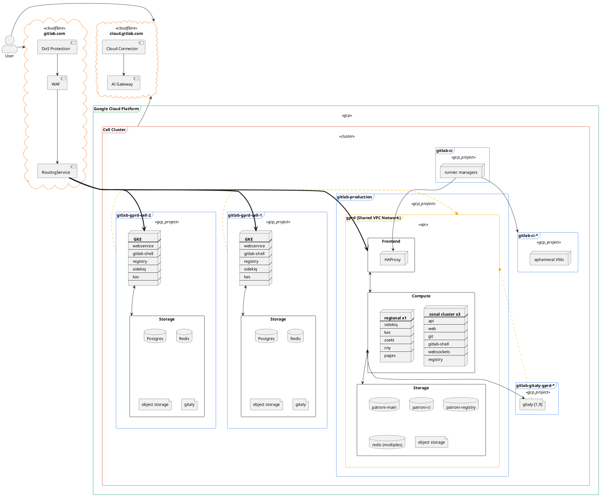
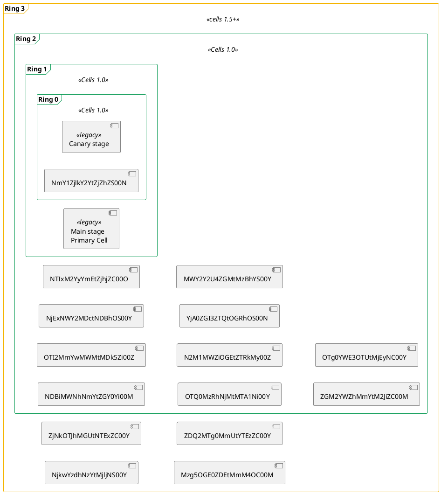

<!-- vale gitlab.FutureTense = NO -->

# Cells: Infrastructure

## Pre-reads

1. [Cells Iteration](../index.md#cells-iterations), specifically `Cells 1.0`
1. [GitLab Dedicated](https://about.gitlab.com/dedicated/)
1. [GitLab Dedicated Architecture](https://gitlab-com.gitlab.io/gl-infra/gitlab-dedicated/team/architecture/Architecture.html)

## Philosophy

- **Cell-local by default**: All services should be cell-local, and not global, unless there are documented, and good reasons why they aren't cell-local.
  If we keep things cell-local, communication between the cell and service stays internal, the service has to run at a smaller scale, and the blast radius is much smaller.
  Example, Gitaly and GitLab Registry are cell-local.
- **Homogeneous environments**: For now, every GitLab cell should look the same. Bootstrapping and provisioning should be done in an automated way.
  For the first iteration all Cells are the same size, there are benefits of running different sizes but this adds complexity and scope.
- **Fresh start, but not so much**: Brand new GitLab instances are created, so it's tempting to redo everything. We have to balance the existing infrastructure, dedicated tooling, and time.
- **All operations get rolled out the same**: Configuration changes, Feature Flags, Deployments, and operational tasks ideally go through the same process of rolling out a change.
  Having 1 way of doing things can bring efficiencies and a single source of truth for automation.
- **Centralize Tooling**: We have a lot of tooling to manage GitLab.com and separate tooling for GitLab Dedicated,
  which creates silos, duplication of effort, and less portability.
  We have to provision multiple Cells for GitLab.com, we need new tooling, GitLab Dedicated built tooling just for this reason.
  We should try to use this tooling as much as possible, if there are things we don't agree with we should try [disagree, commit, and disagree](https://handbook.gitlab.com/handbook/values/#disagree-commit-and-disagree) to improve a single tool.
  It is ok to start with tooling that has shortcomings, an iterative approach leads to _one_ mature product instead of two.

## Glossary/[Ubiquitous Language](https://martinfowler.com/bliki/UbiquitousLanguage.html)

- `Provision`: When we create a new Cell. Example: We _provisioned_ Cell 5, which is a brand new Cell.
- `Deploy`: When we change the running code inside of an existing Cell. Example: We _deployed_ the new auto-deploy version on GitLab.com.
  - [Blueprint](deployments.md)
- `Configuration change`: When we change any configuration on the application or infrastructure. Example: We did a _configuration change_ on labels added to VMs.
- `Cell`: A single unit, and instance of GitLab. Not used to refer to Dedicated, where an instance of GitLab is called a Tenant.
- `Ring`: A collection of Cells grouped as single deployment stage target. Example: Cells in Ring 2 will deploy changes after Cells in Ring 1.
- `Cluster`: A collection of Cells, and the existing GitLab.com infrastructure. Example: We need to change the version of Registry in the Cluster.
- `Fleet`: The collection of all SaaS environments, both single-tenant and multi-tenant, that collectively form our production environments.
  This includes existing GitLab.com infrastructure, Cells, and Dedicated.

## Architecture

Below is the Cell architecture. You can find the current GitLab.com architecture (pre-Cells) in <https://handbook.gitlab.com/handbook/engineering/infrastructure/production/architecture/>.



- <details>
  <summary> KAS: Select to Expand </summary>

  ```plantuml
  @startuml

  skinparam frame {
    borderColor<<customer>> #F4B400
  }
  skinparam frame {
    borderColor<<gcp>> #4285F4
  }
  skinparam cloud {
    borderColor<<cloudflare>> #F48120
  }

  together {
    frame "cluster 1" <<customer>> {
        component "agentk" as cluster1AgentK
    }

    frame "cluster 2" <<customer>> {
        component "agentk" as cluster2AgentK
    }

    frame "cluster 3" <<customer>> {
        component "agentk" as cluster3AgentK
    }

    frame "workstation" <<customer>> {
        component "kubectl"
    }
  }


  cloud wss://kas.gitlab.com <<cloudflare>> as kas.gitlab.com {
      component "routing service"
  }

  cluster1AgentK <..d..> kas.gitlab.com
  cluster2AgentK <..d..> kas.gitlab.com
  cluster3AgentK <--d--> kas.gitlab.com
  kubectl <--d--> kas.gitlab.com

  together {
    frame "gprd-gitlab-cell-1" <<gcp>> {
      component kas as kasCell1
      component webservice as webserviceCell1
      component redis as redisCell1
      collections "gitaly(s)" as gitalyCell1

      kasCell1 <-d-> webserviceCell1
      kasCell1 <-d-> redisCell1
      kasCell1 <-d-> gitalyCell1
    }

    frame "gprd-gitlab-cell-2" <<gcp>> {
      component kas as kasCell2
      component webservice as webserviceCell2
      component redis as redisCell2
      collections "gitaly(s)" as gitalyCell2

      kasCell2 <-d-> webserviceCell2
      kasCell2 <-d-> redisCell2
      kasCell2 <-d-> gitalyCell2
    }
  }

  "routing service" <--d--> kasCell1
  "routing service" <--d--> kasCell1
  "routing service" <..d..> kasCell2
  "routing service" <..d..> kasCell2

  @enduml
  ```

  </details>

### Rings

`Rings` serve as the basis of the mental model of how we group the Cells we provision and the existing infrastructure.
Inside of a ring, there is X number of Cells, subsequent rings consist of more cells gradually covering the entire fleet.
Each Ring will be a superset of the previous rings.
For example ring zero only contains the Cells in ring zero,
ring 5 contains the Cells in `ring 5` and all other rings before it.
Changes cascade outwards from inner rings to outer rings in discrete stages.
For example If a change has reached `ring 5`, it will have reached ring 4, 3, 2, and 1.

Any type of rollout will allow start from `ring 0` and move to subsequent rings if the change is successful,
if it fails we can stop the rollout and we don't affect all of our customers.
With this type of progressive rollout, we'll get the following benefits:

1. Changes have a smaller blast radius, not affecting all customers at once.
1. Clear boundaries on how to roll out a change.
1. Removes the need of having different environments like [Staging](#staging), all Cells will be production.
1. The more confident we are with a change the wider the audience.



For [Cells 1.0](../iterations/cells-1.0.md) our aim is to have up to 10 cells inside `ring 2`.
The number of Cells in a ring is arbitrary, their size is still to be determined.
It will take into consideration our necessity to [adequately test auto-deploy packages before a public release](deployments.md#package-rollout-policy),
the speed of a full production rollout for security fixes,
and the protection from outages or bugs of our users.

Where we'll eventually use rings for:

1. [Deployments](deployments.md#ring-deployment).
1. Roll out configuration changes.
1. Feature flag rollouts.

#### Staging

We do not have the traditional Staging environment in rings,
because we can test changes in the first rings which achieves the same outcome.
This doesn't mean that we will shut off the existing staging environment,
which will still be in use for the non-cell infrastructure.

With this set up we'll end up removing some of the problems we have with staging right now:

1. Staging is not a real representation of Production.
1. We consider Staging as Production because it blocks deployments.
1. The configuration of Staging can drift from Production.

## Large Domains

The infrastructure is multifaceted and all teams have a role in setting up the cell infrastructure.

The `Confidence` column refers to how confident we are with the specific domain and its path forward for Cells.
When we have a blueprint merged ideally the confidence should move to 👍 because we have a blueprint that provides direction to that domain.

| Domain                           | Owner                             | Blueprint                                                                 | Confidence |
|----------------------------------|-----------------------------------|---------------------------------------------------------------------------|------------|
| Routing                          | group::tenant scale               | [Blueprint](../routing-service.md)                                        | 👍         |
| Cell Control Plane               | group::Delivery/team::Foundations | To-Do                                                                     | 👎         |
| Cell Sizing                      | team::Scalability-Observability   | [To-Do](https://gitlab.com/gitlab-com/gl-infra/scalability/-/issues/2838) | 👎         |
| CI Runners                       | team::Scalability-Practices       | To-Do                                                                     | 👎         |
| Databases                        | team::Database Reliability        | [To-Do](https://gitlab.com/gitlab-org/gitlab/-/merge_requests/144238)     | 👎         |
| Deployments                      | group::Delivery                   | [Blueprint](deployments.md)                                               | 👍         |
| Observability                    | team::Scalability-Observability   | [Blueprint](observability.md)                                             | 👎         |
| Cell Architecture and Tooling    | team::Foundations                 | [To-Do](https://gitlab.com/groups/gitlab-com/gl-infra/-/epics/1209)       | 👎         |
| Provisioning                     | team::Foundations                 | To-Do                                                                     | 👎         |
| Configuration Management/Rollout | team::Foundations                 | To-Do                                                                     | 👎         |
| Disaster Recovery                 | team::Production Engineering       | [Blueprint](disaster_recovery.md)                                         | 👍         |


## Stakeholders

We have several teams partaking in the operations of Cell.
The first distinction is between teams implementing and maintaining the tools, and teams using those tools.

| Areas                                             | Features                                                  | Owners                          |
|---------------------------------------------------|-----------------------------------------------------------|---------------------------------|
| Integration with Dedicated tools*                 |                                                           |                                 |
|                                                   | Integration with Release Managers' workflows              | team::Delivery-Deployments      |
|                                                   | Deployment mechanics using `Instrumentor` and `AMP`       | team::Foundations               |
|                                                   | Cell application reference architectures and overlays     | team::Ops                       |
|                                                   | Cell bootstrapping, tooling, and supporting infrastructure | team::Ops                       |
|                                                   | Cell deprovisioning                                       | team::Ops                       |
| Control Plane for cluster state**                 |                                                           |                                 |
|                                                   | Investigate GitOps model                                  | team::Delivery-Deployments      |
|                                                   | Investigate `CRD` + operator                              | team::Delivery-Deployments      |
| Ring-based deployment automation                  |                                                           |                                 |
|                                                   | Propagating changes inside a ring perimeter               | team::Delivery-Deployments      |
|                                                   | Orchestrating changes propagation outside ring perimeter  | team::Foundations               |
|                                                   | Emergency brake: stopping a package rollout               | team::Delivery-Deployments      |
| Rollback capabilities                             |                                                           |                                 |
|                                                   | Rollback with downtime (for QA Cell in ring 0)            | team::Delivery-Deployments      |
|                                                   | Delayed Post Deploy Migrations for rollback support       | team::Environment Automation    |
| Observability                                     |                                                           |                                 |
|                                                   | Cell health metric                                        | team::Scalability-Observability |
|                                                   | Fleet health metric                                       | team::Scalability-Observability |
|                                                   | Package States                                            | team::Delivery-Deployments      |
| Incident Lifecycle Management                     |                                                           |                                 |
|                                                   | Paging Engineer On Call                                   | team::Ops                       |
|                                                   | Incident tooling                                          | team::Ops                       |
| Network Edge                                      |                                                           |                                 |
|                                                   | Web Application Firewall                                  | team::Foundations               |
|                                                   | CDN                                                       | team::Foundations               |
|                                                   | Load Balancing and networking                             | team::Foundations               |
|                                                   | Rate Limiting                                             | team::Foundations               |

> \* These items may require contributions from various stakeholders in SaaS Platforms and Core Platform. Stakeholders should closely collaborate on this work to ensure appropriate alignment to meet the needs of the owning team and customer teams.
>
> \*\* These items are for consideration after the Cell 2.0 iteration.

The users of those features are the Release Managers, the Engineer On Call, and the Team:Ops.
The following list defines the tasks those groups can perform in the cell cluster:

1. Release Managers
   - Command deployments inside the perimeter
   - Declare "graduated" packages
   - Rollback deployments inside the perimeter
1. Engineer On Call
   - Receive alerts for failed deployments
   - Can pause a package rollout (not reaching the next ring)
   - Drive investigation for failed deployments
1. Team::Ops
   - Cells Bootstrapping
      - Provisioning
      - Deprovisioning
      - Re-balancing
      - Cell-Ring association
