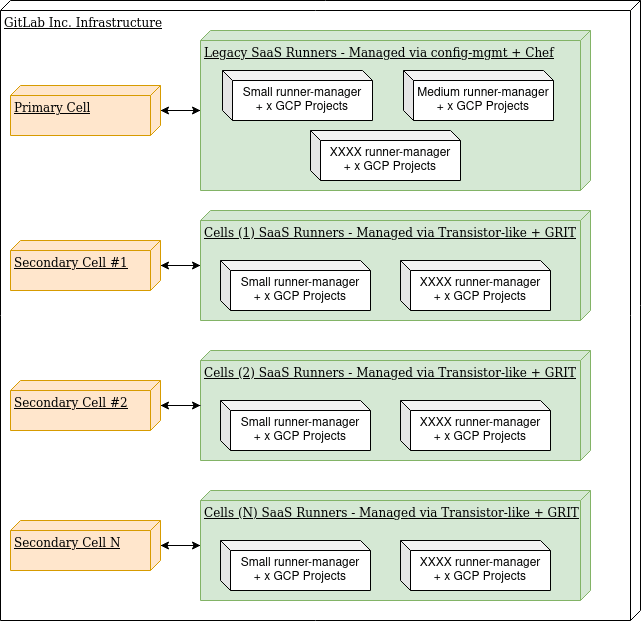

# Cells: Runner

This blueprint describes the architecture and roadmap of the Runner service in a cellular architecture.

## Introduction

[GitLab Runner](https://docs.gitlab.com/runner/) is a service that is relatively easy to provision and update compared to other GitLab.com services.

Currently having two exemplary setups, [SaaS Runners](https://gitlab.com/gitlab-org/gitlab/-/blob/master/doc/ci/runners/index.md) and [Dedicated Runners](https://gitlab.com/gitlab-com/gl-infra/gitlab-dedicated/team/-/blob/main/architecture/blueprints/dedicated-runners-beta.md?ref_type=heads), with the latter having a superior setup enhanced by implementing [GRIT](https://gitlab.com/gitlab-org/ci-cd/runner-tools/grit).

Following [Cell's philosophy](https://gitlab.com/gitlab-org/gitlab/-/blob/master/doc/architecture/blueprints/cells/infrastructure/index.md#philosophy), the Runner service is a perfect candidate for implementing a cell-local service, with almost no need for any change to its [codebase](https://gitlab.com/gitlab-org/gitlab-runner/)(_TBC_).

In [Cells 1.0](https://gitlab.com/gitlab-org/gitlab/-/blob/master/doc/architecture/blueprints/cells/iterations/cells-1.0.md), new customers are expected to enroll in the first Cell, in this iteration, we'll utilize the existing work made as part of Dedicated [Beta release](https://gitlab.com/gitlab-com/gl-infra/gitlab-dedicated/team/-/blob/main/architecture/blueprints/dedicated-runners-beta.md?ref_type=heads#dedicated-runners-beta) to provision the Runners.

### Architecture

- There's a 1:n relationship between a Cell and a Runner, i.e, one Cell can have many Runners, while a Runner is only registered to one Cell.
- Primary Cell (GitLab.com) is using Runners that are managed via [config-mgmt](https://gitlab.com/gitlab-com/gl-infra/config-mgmt) and [chef-repo](https://gitlab.com/gitlab-com/gl-infra/chef-repo), while the Secondary Cells are using [Transistor](https://gitlab.com/gitlab-com/gl-infra/gitlab-dedicated/transistor/)-like setup, which vendors in GRIT.

Note, there's currently no Runner Reference Architectures, however, some links the reader can reference:

- [GitLab-runner/docs/fleet_scaling](https://gitlab.com/gitlab-org/gitlab-runner/-/blob/main/docs/fleet_scaling/index.md).
- [Create a test framework for testing runner fleet autoscaling configurations](https://gitlab.com/gitlab-org/gitlab/-/issues/458311).
- [Document jump start configurations for an autoscaled runner fleet on Google Compute](https://gitlab.com/gitlab-org/gitlab/-/issues/458313).
- [Runner Fleet Scaling and Configuration Best Practices Center](https://gitlab.com/groups/gitlab-org/-/epics/8952).

### Provision

Cells are expected to follow provisioning design and tooling similar to that of Dedicated; Runners in this case would utilize a tool similar to [Transistor](https://gitlab.com/gitlab-com/gl-infra/gitlab-dedicated/transistor/), which in a nutshell, is a collection of Terraform modules and bash scripts.

Transistor's [development guidelines](https://gitlab.com/gitlab-com/gl-infra/gitlab-dedicated/transistor/-/blob/main/DEVELOPMENT.md) have more elaborate info, but a simplified version of the provisioning steps of a Runner could look like the following: 

1. Generate a runner model.
1. Provision the runner via one of the following steps:
    - Execute ./bin/prepare, ./bin/onboard/ then ./bin/provision.
    - Alternatively, create an [MR in Switchboard](https://gitlab.com/gitlab-com/gl-infra/gitlab-dedicated/sandbox/switchboard_runners/#triggering-a-deployment-via-merge-request), which will execute the scripts above in order.

The deployment pipeline for a Runner could be triggered as a downstream pipeline following Instrumentor's deployment of a GitLab instance, this would require Instrumentor (or a higher-level job, e.g. in switchboard) to generate a runner model before the downstream pipeline is triggered.

#### Cells vs Dedicated

The Dedicated team has restricted access to the GitLab instances in which Runners are registered, this however, is not the case with Cells.

The SRE team fully owns and maintains a Cell, which means that registration token management will not require any external coordination, and can be a step that is automated using the provisioning scripts.

### Deployment

Ideally, Cells:Runner should be managed similarly to the rest of the services in a Cell.

At this moment, GitLab.com SaaS Runners have a separate ad-hoc [deployer tool](https://gitlab.com/gitlab-com/gl-infra/ci-runners/deployer/), not to be confused with the [GitLab.com grand Deployer](https://ops.gitlab.net/gitlab-com/gl-infra/deployer), which is run and maintained by the Runner group.

In Cells, the Runner service will utilize Dedicated-like tooling, which is similar to the rest of the services, this will ensure visibility, observability and maintainability. Runners Dedicated are highly dependent on GRIT, which promises to introduce a [blue-green mechanism](https://gitlab.com/groups/gitlab-org/ci-cd/runner-tools/-/epics/1) which will be eventually utilized by both Dedicated and Cells.

### Observability

Observability for Runners on Dedicated is currently a WIP, Runners should be treated as the rest of the services, and should utilize the recording rules and dashboards used currently in GitLab.com.

## Roadmap

To keep [Centralize tooling](index.md#philosophy), 2 open questions:

1. How do we feel about eventually combining [Transistor](https://gitlab.com/gitlab-com/gl-infra/gitlab-dedicated/transistor/) back into [Instrumentor](https://gitlab.com/gitlab-com/gl-infra/gitlab-dedicated/instrumentor/)?

Combining Transistor and Instrumentor could "make changes to runners INCREDIBLY costly and slow to have to go through the whole instrumentor deployment process." (@amknight , 2024), additionally, keeping both projects modular would enable a more efficient and safer release process as the QA testing process is separate (@skarbek, 2024).

1. How do we feel about incorporating Runner deployments with the rest of GitLab service deployments in a Cell?

As mentioned under [Provision](runner.md#provision), we could possible use downstream pipelines to achieve this.

### Iterations [WIP]

#### Cells 1.0

Linux Runners of type `small` will be available.

#### Cells 1.5

#### Cells 2.0

## FAQ [WIP]

**Q1**

A1

**Q2**

A2

## References

- @amknight (2024): [!146768 (comment 1823581090)](https://gitlab.com/gitlab-org/gitlab/-/merge_requests/146768#note_1823581090).
- @skarbek (2024):[!146768 (comment 1819418987)](https://gitlab.com/gitlab-org/gitlab/-/merge_requests/146768#note_1819418987).
