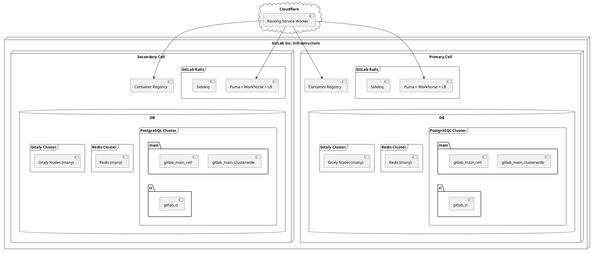
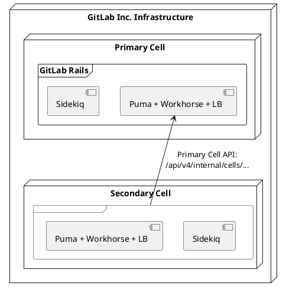

# Cells 1.0

This document describes a technical proposal for a Cells 1.0.

Cells 1.0 is a first iteration of the cellular architecture. The Cells 1.0 target is to deliver a solution
for new enterprise customers using the SaaS GitLab.com offering.

Cells 1.0 is a complete working feature that is meant to be deployed to GitLab.com SaaS.

Read more about [Cells 1.5](cells-1.5.md), which is meant to provide a mechanism to migrate existing customers
and is built on top of the Cells 1.0 architecture.

Read more about [Cells 2.0](cells-2.0.md), which is meant to support the public and open source
contribution model in a cellular architecture.

## Preamble

A Cells 1.0 is meant to target enterprise customers that have the following expectations:

1. They want to use our multi-tenant SaaS solution (GitLab.com) to serve their Organization.
1. They accept that they may receive updates later than the rest of GitLab.com. Note that when GitLab does a security release, the Delivery team makes sure that production (every cell) runs the security release version before making the release public. This does not mean that outside of a security release, all the cells run the same version of GitLab. See [this private discussion](https://gitlab.com/gitlab-com/gl-security/appsec/threat-models/-/issues/45#note_1794904358) for more information.
1. They want to use an environment with higher degree of isolation to rest of the system.
1. They want to control all users that contribute to their Organization.
1. Their groups and projects are meant to be private.
1. Their users don't need to interact with other Organizations, or contribute to public projects with their account.
1. Are OK with being unable to switch Organizations with their account.

From a development and infrastructure perspective we want to achieve the following goals:

1. All Cells are accessible under a single domain.
1. Cells are mostly independent with minimal data sharing. All stateful data is segregated, and minimal data sharing is needed initially. This includes any database and cloud storage buckets.
1. Cells need to be able to run independently with different versions.
1. An architecture that allows for eventual cluster-wide data sharing.
1. A routing solution that is robust, but simple.
1. All identifiers (primary keys, user, group, and project names) are unique across the cluster, so that we can perform logical re-balancing at a later time. This includes all database tables, except ones using schemas `gitlab_internal`, or `gitlab_shared`.
1. Because all users and groups are unique across the cluster, the same user can access other Organizations and groups at GitLab.com in [Cells 2.0](cells-2.0.md).
1. The overhead of managing and upgrading Cells is minimal and similar to managing a GitLab Dedicated instance. Secondary Cells should not be a linear increase in operational burden.
1. The Cell should be deployed using the same tooling as GitLab Dedicated.

This proposal is designed to cut as much scope as possible but it must not make it impossible to meet the following long-term goals:

1. Users can interact with many Organizations.
1. Cells can be re-balanced by moving Organizations between Cells.
1. The routing solution can dynamically route customers.

## Proposal

The following statements describe a high-level proposal to achieve a Cells 1.0:

1. Terms used:

   1. Primary Cell: The current GitLab.com deployment. A special purpose Cell that serves
      as a cluster-wide service in this architecture.
   1. Secondary Cells: A Cell that connects to the Primary Cell to ensure cluster-wide uniqueness.

1. Organization properties:

   1. We allow customers to create a new Organization on a Secondary Cell.
      The chosen Cell would be controlled by GitLab Administrators.
   1. The Organization is private, and cannot be made public.
   1. Groups and projects can be made private, but not public.

1. User properties:

   1. Users are created on the Cell that contains the Organization.
   1. Users are presented with the Organization navigation, but can only be part of a single Organization.
   1. Users cannot join or interact with other Organizations.
   1. User accounts cannot be migrated between Cells.
   1. A user's personal namespace is created in that Organization.

The following statements describe a low-level development proposal to achieve the above goals:

1. Application properties:

   1. Each secret token (personal access token, build token, runner token, etc.) generated by the application includes a unique identifier indicating the Cell, for example `us0`. The identifier should try to obfuscate information about the Cell.
   1. The session cookie sent to the client is prefixed with a unique identifier indicating the Cell, for example `us0`.
   1. The application configuration includes a Cell secret prefix, and information about the Primary Cell.
   1. User always logs into the Cell on which the user was created.

1. Database properties:

   1. Each primary key in the database is unique across the cluster. We use database sequences that are allocated from the Primary Cell.
   1. We require each table to be classified: to be cluster-wide or Cell-local.
   1. We follow a model of eventual consistency:
      1. All cluster-wide tables are stored in a Cell-local database.
         1. All cluster-wide tables retain unique constraints across the whole cluster.
      1. Locally stored cluster-wide tables contain information required by this Cell only, unless it is the Primary Cell.
      1. The cluster-wide tables are restricted to be modified by the Cell that is authoritative over the particular record:
         1. The user record can be modified by the given Cell only if that Cell is the authoritative source of this record.
         1. In Cells 1.0 we are likely to not be replicating data across cluster,
            so the authoritative source is the Cell that contains the record.
   1. The Primary Cell serves as a single source of truth for the uniqueness constraint (be it ID or user, group, project uniqueness).
      1. Secondary Cells use APIs to claim usernames, groups or projects.
      1. The Primary Cell holds information about all usernames, groups and projects, and the Cell holding the record.
      1. The Primary Cell does not hold source information (actual user or project records), only references that are indicative of the Cell where that information is stored.

1. Routing properties:

   1. We implement a static routing service that performs secret-based routing based on the prefix.
   1. The routing service is implemented as a Cloudflare Worker and is run on edge. The routing service is run with a static list of Cells. Each Cell is described by a proxy URL, and a prefix.
   1. Cells are exposed over the public internet, but might be guarded with Zero Trust.

### Architecture overview



### API overview



### Problems

The following technical problems have to be addressed:

1. All secrets are prefixed as this is required by a simple routing layer to perform secret-based routing.
1. All usernames, Organizations, top-level groups (and as result groups and projects) are unique across the cluster.
1. All primary key identifiers are unique across the cluster.

### GitLab Configuration

The GitLab configuration in `gitlab.yml` is extended with the following parameters to:

```yaml
production:
  gitlab:
    primary_cell:
      url: https://cell1.gitlab.com
      token: abcdef
    secrets_prefix: kPptz
```

1. `primary_cell:` configured on Secondary Cells, and indicates the URL endpoint to access the Primary Cell API.
1. `secrets_prefix:` can be used on all Cells, and indicates that each secret and session cookie is prefixed with this identifier.

### Primary Cell

The Primary Cell serves a special purpose to ensure cluster uniqueness.
The Primary Cell exposes a set of API interfaces to be used by Secondary Cells.
The API is considered internal, and is guarded with a secret that is shared with Secondary Cells.

1. `POST /api/v4/internal/cells/database/claim`

   1. Request:
      - `table`: table name for the allocated sequence, for example `projects`
      - `count`: number of IDs to claim that are guaranteed to be unique, for example 100_000
   1. Response:
      - `start`: the start sequence value
      - `limit`: the allowed maximum sequence value

1. `POST /api/v4/internal/cells/routes`

   1. Request:
      - `path`: the full path to a resource, for example `my-company/my-project`
      - `source_type`: the class name for the container holding the resource, for example `project`
      - `source_id`: the source ID for the container holding the resource, for example `1000`
      - `namespace_id`: the underlying namespace associated with the resource, for example `32`
      - `name`: the display name for the resource
      - `cell_id`: the identifier of the Cell holding the resource
   1. Response:
      - 201: Created: The resource was created.
        - `id:`: The ID of the resource as stored on the Primary Cell.
      - 409: Conflict: The resource already exists.
   1. Behavior:
      1. The endpoint returns an `id`. The same ID has to be used to insert a record in `routes` table for the calling cell.

1. `GET /api/v4/internal/cells/routes/:id`

   1. Request:
      - `id`: resource identifier
   1. Response:
      - 200: OK: The resource was found. For response parameters look at `POST /api/v4/internal/cells/routes` request parameters.
      - 404: Not found: The resource does not exit.

1. `PUT /api/v4/internal/cells/routes/:id`

   1. Request: For parameters look at `POST /api/v4/internal/cells/routes` request parameters.
   1. Response:
      - 200: OK: The resource was updated.
      - 403: Forbidden: The resource cannot be modified, because it is owned by another `cell_id`.
      - 404: Not found: The resource does not exit.
      - 409: Conflict: The resource already exists. The uniqueness constraint on `path` failed.
   1. Behavior:
      1. The endpoint modifies the given resource as long the `cell_id` matches.

1. `DELETE /api/v4/internal/cells/routes/:id`

   1. Request: For parameters look at `POST /api/v4/internal/cells/routes` request parameters.
   1. Response:
      - 200: OK: The resource with given parameters was successfully deleted.
      - 404: Not found: The given resource was not found.
      - 400: Bad request: The resource failed to be deleted.

1. `POST /api/v4/internal/cells/redirect_routes`
1. `GET /api/v4/internal/cells/redirect_routes/:id`
1. `PUT /api/v4/internal/cells/redirect_routes/:id`
1. `DELETE /api/v4/internal/cells/redirect_routes/:id`

### Secondary Cell

The Secondary Cell does not expose any specific API at this point.
The Secondary Cell implements a solution to guarantee uniqueness of primary database keys.

1. `ReplenishDatabaseSequencesWorker`: this worker runs periodically, check all sequences, and replenish them.

#### Simple uniqueness of Database Sequences

Simple uniqueness of database sequences refers to
the practice of claiming, using and replenishing a cluster-wide unique range of IDs for a table.

Our DDL schema uses ID generation in the form: `id bigint DEFAULT nextval('product_analytics_events_experimental_id_seq'::regclass) NOT NULL`.

The `/api/v4/internal/cells/database/claim` would execute the following logic
to atomically claim a range of IDs.

```ruby
def claim_table_seq(table, count)
  sql = <<-SQL
    BEGIN;
      -- `ALTER SEQUENCE` effectively locks `some_seq` for write and read.
      ALTER SEQUENCE seq_name INCREMENT BY 1000;
      SELECT nextval(seq_name); -- Suppose this returned 1001.
      ALTER SEQUENCE seq_name INCREMENT BY 1; -- UNDO "INCREMENT BY 1000".

      INSERT INTO cells_sequence_claims (cell_id, table_name, start_id, end_id)
        VALUES (cell_id, table_name, 2, 1001);
    COMMIT;
  SQL

  seq_name = "#{table}_id_seq"
  last_id = select_one(sql, seq_name, limit, seq_name, seq_name).first
  { start: last_id - count, limit: count }
end
```

#### Replenishing available IDs

The `ReplenishDatabaseSequencesWorker` would check how much space is left in a sequence, and request a new range if the value goes below the threshold.

```ruby
def replenish_table_seq(table, lower_limit, count)
  seq_name = "#{table}_id_seq"
  # maxval is not existing, so it would have to be implemented different way, but this is to showcase purposes
  last_id, max_id = select_one("SELECT currval(?), maxval(?)", seq_name, seq_name)
  return if max_id - last_id > lower_limit

  new_start, new_limit = post("/api/v4/internal/cells/database/claim", { table: table, count: count })
  execute("ALTER SEQUENCE RESTART ? MAXVALUE ?", new_start, new_limit)
end
```

This makes us lose the `lower_limit` of IDs of sequence creating gaps. However, in this model we need to replenish the
sequence ahead of time, otherwise we will have catastrophic failure on inserting new records.

The above claiming and replenishing approach can potentially waste too much ID space
claimed by each table.

For example, after having claimed the range from `101` to `200`,
a table might choose to replenish after it's used up the first 80 IDs (`101` to `180`)
leaving the remaining 20 IDs to be wasted.

To efficiently utilize all claimed IDs, we introduce the concept of robust uniqueness
in which a table maintains two alternating sequences and uses a custom implementation for `nextval` and similar functions.

#### Robust uniqueness of table sequences

This is very similar to simple uniqueness, with these additions:

- We use and alternate between two sequences per-table (A/B), fully utilizing allocated sequences.
- We change the `DEFAULT` to accept two arguments to function `nextval2(table_id_seq_a::regclass, table_id_seq_b::regclass)`.
- We replenish the sequence as soon as it runs out of free IDs.
- We don't create sequence gaps.

```sql
CREATE FUNCTION nextval2(seq_a oid, seq_b oid) RETURNS bigint
    LANGUAGE plpgsql
    AS $$
BEGIN
    -- pick from sequence that has lower number
    -- as we want to retain monotonically increasing numbers
    -- when allocation fails (as the sequence is exhausted) switch to another one
    SELECT last_value INTO seq_a_last_value FROM seq_a;
    SELECT last_value INTO seq_b_last_value FROM seq_b;
    IF seq_a_last_value < seq_b_last_value
        BEGIN TRY
              RETURN nextval(seq_a);
        END TRY
        BEGIN CATCH
              RETURN nextval(seq_b);
        END CATCH;
    ELSE
        BEGIN TRY
              RETURN nextval(seq_b);
        END TRY
        BEGIN CATCH
              RETURN nextval(seq_a);
        END CATCH;
    END
END
$$;
```

## Pros

- The proposal is lean:
  - Each Cell holds only a fraction of the data that is required for the cluster to operate.
  - The tables marked as `main_clusterwide` that are stored locally can be selectively replicated across Cells following a mesh-architecture.
    - Based on the assumption that Cells require only a fraction of shared data (like users), it is expected that Secondary Cells might need a small percentage of records across the whole cluster.
- The primary Cell is a single point of failure only for a limited set of features:
  - Uniqueness is enforced by the primary Cell.
  - The temporary reliability of the primary Cell has a limited impact on Secondary Cells.
  - Secondary Cells would not be able to enforce unique constraints: create group, project, or user.
  - Other functionality of Secondary Cells would continue working as is: push, run CI.
- The routing layer makes this service very simple, because it is secret-based and uses prefix.
  - Reliability of the service is not dependent on Cell availability, because at this stage no dynamic classification is required.
  - We anticipate that the routing layer will evolve to perform regular classification at a later point.
- Mixed-deployment compatible by design.
  - We do not share database connections. We expose APIs to interact with cluster-wide data.
  - The application is responsible to support API compatibility across versions, allowing us to easily support many versions of the application running from day zero.
- Database migrations.
  - Work out of the box, and are isolated to the Cell.
  - Because we don't share databases across Cells, the Cell has full ownership of `main_clusterwide` tables.
  - Fixing all the cross-joins between cluster-wide tables and cell-local tables is a large work.
    Storing `main_clusterwide` tables locally in each cell allows us to save time for the first iteration.

## Cons

- We intentionally split data for tables marked as `main_clusterwide` across all cluster cells.
  - These tables will be selectively replicated (likely) outside of the application to allow Secondary Cells to share data.
  - We effectively reinvent database replication to some extent.
- We are severely limited by how many tables can be made `main_clusterwide`. Exposing many tables is a significant amount of additional code to allow cross-Cell interaction.
  - We require all tables to be classified. We want to ensure data consistency across the cluster if records are replicated.

## Features on GitLab.com that are not supported on Cells

For the initial deployment of Cells 1.0, we are cutting scope on some features to get something deployed.
This doesn't mean that Cells 1.0 is not going to support these in the future, but our application/infrastructure doesn't support them yet.

The table below is a comparison between the existing GitLab.com features, and not self-managed/Dedicated.

| No Initial Support                                           | Reasoning                                                                                                                                                                                                                                                                                    |
| ------------------------------------------------------------ | -------------------------------------------------------------------------------------------------------------------------------------------------------------------------------------------------------------------------------------------------------------------------------------------- |
| GitLab Pages                                                 | [Complexity](#questions).                                                                                                                                                                                                                                                                    |
| CI Catalog                                                   | CI Catalog depends on public projects, organizations in Cells 1.0 can't see public projects.                                                                                                                                                                                                 |
| Organization Switching                                       | A user belongs to a single organization.                                                                                                                                                                                                                                                     |
| Shared user accounts across Cells                            | Users will need to have new user accounts on each Cell for now                                                                                                                                                                                                                               |
| GitLab Duo Pro license works across all projects on instance | GitLab Duo Pro licenses, once granted, [should allow users to use GitLab Duo Pro on all projects on the instance](https://gitlab.com/gitlab-org/gitlab/-/issues/441244). With Cells 1.0, this will only work within their own cell.                                                          |
| Shared user accounts across Cells                            | Users needs to have new user accounts on each Cell for now                                                                                                                                                                                                                                   |
| User removal                                                 | Users can only be part of one Organization. A removal would equal a deletion in this case, so only user deletions will be offered in Organizations on Cells 1.0. Upon removal, there would be no way for a User to discover another Organization to join, as they are private for Cells 1.0. |
| Windows and Mac OS Runners    |  Mac and Windows runners are still in beta and there are some more complex technical considerations related to cost. See the discussion: [#434982 (comment 1789275416)](https://gitlab.com/gitlab-org/gitlab/-/issues/434982#note_1789275416) on sharing resources. |
| Multiple Sizes for Linux Runners | We will only support [small linux runners on Cells 1.0](https://gitlab.com/gitlab-org/gitlab/-/issues/434982#note_1806447839). |

## Questions

1. How do we create new Organizations with the user on Secondary Cell?

   To be defined.

1. How do we register new users for the existing Organization on Secondary Cell?

   If an Organization is already created, users can be invited.
   We can then serve the registration flow from Secondary Cell.

1. How would users log in?

   - UI: The login to Organizations would be scoped to the Organization: `https://<GITLAB_DOMAIN>/users/sign_in?organization=gitlab-inc`.
   - SAML: `https://<GITLAB_DOMAIN>/users/auth/saml/callback` would receive `?organization=gitlab-inc` which would be routed to the correct Cell.
   - This would require using the dynamic routing method with a list of Organizations available using a solution with high availability.

1. How do we add a new table if it is initially deployed on Secondary Cell?

   The Primary Cell is ensuring uniqueness of sequences, so it needs to have `sequence`.

1. Is Container Registry cluster-wide or cell-local?

   The Container Registry can be run Cell-local, and if we follow the secret-based routing, it can follow the same model for filtering.
   We would have to ensure that the JWT token signed by GitLab is in a form that can be statically routed by the routing layer.

1. Are GitLab Pages cluster-wide or Cell-local?

   GitLab Pages was determined to be non-essential for Cells 1.0, so we would not support them for Cells 1.0.
   The discussion about this can be found [here](https://gitlab.com/gitlab-org/gitlab/-/issues/434972#note_1763737452).

   If GitLab Pages are meant to support the `.gitlab.io` domain:

   - GitLab Pages need to be run as a single service that is not run as part of a Cell.
   - Because GitLab Pages use the API we need to make them routable.
   - Similar to `routes`, claim `pages_domain` on the Primary Cell
   - Implement dynamic classification in the routing service, based on a sharding key.
   - Cons: This adds another table that has to be kept unique cluster-wide.

   Alternatively:

   - Run GitLab Pages in a Cell, but provide a separate domain.
   - Custom domains would use the separate domain.
   - Cons: This creates a problem with having to manage a domain per Cell.
   - Cons: We expose Cells to users.

1. Should we use a static secret for the internal endpoint or JWT?

   To be defined. The static secret is used for simplicity of the presented solution.

1. How do we handle SSH cloning?

   This is a separate problem tangential to routing, which is intentionally not solved by this proposal.
   The problems associated with SSH cloning are:

   - We need to validate a user public key to identify the Cell holding it.
   - We need to ensure uniqueness of public keys across the cluster.

1. Are there other cluster-wide unique constraints?

   - Authorized keys
   - GPG keys
   - Custom e-mails
   - Pages domains
   - TBD

1. How do we synchronize cluster-wide tables, such as broadcast messages or application settings?

   We would very likely take a naive approach: expose those information using API, and synchronize it periodically.
   Tables likely to be made synchronized are:

   - Application Settings
   - Broadcast Messages
   - TBD

1. How do we dogfood this work?

   To be defined.

1. How do we manage admin accounts?

   Since we don't yet synchronize across the cluster, admin accounts would have to be provided per Cell.
   This might be solved by GitLab Dedicated already?

1. Is it a Primary Cell or cluster-wide service?

   The Primary Cell in fact serves as a cluster-wide service. Depending on our intent it could be named the following:

   - Primary Cell: To clearly state that the Primary Cell has a special purpose today, but we rename it later.
   - Cluster-wide Data Provider
   - Global Service: Alternative name to Cluster-wide Data Provider, indicating that the Primary Cell would implement a Global Service today.

1. How are secrets are generated?

   The Cell prefix is used to generate a secret in a way that encodes the prefix. The prefix is added to the generated secret.
   Example:

   - GitLab Runner Tokens are generated in the form: `glrt-2CR8_eVxiioB1QmzPZwa`
   - For Cell prefix: `secrets_prefix: kPptz`
   - We would generate Runner tokens in the form: `glrt-kPptz_2CR8_eVxiioB1QmzPZwa`

1. Why secrets-based routing instead of path-based routing?

   Cells 1.0 are meant to provide a first approximation of the architecture allowing to deploy a multi-tenant and multi-Cell solution quickly.
   Solving path-based routing requires significant effort:

   - Prefixing all existing routes with `/org/<org-name>/-/` will require a
     deliberate choice how to handle ambiguous or Cell-local or cluster-wide routes, such as
     `/api/v4/jobs/request`. Changing routes also introduces breaking changes for all users
     that we would migrate.
   - Making all existing routes routable would be a significant effort to fix
     for routes like `/-/autocomplete/users` and likely a multi-year effort. Some preliminary analysis
     how many routes are already classified can be found [in this comment](https://gitlab.com/gitlab-org/gitlab/-/issues/430330#note_1633125914).
   - In each case the routing service needs to be able to dynamically classify existing routes
     based on some defined criteria, requiring significant development effort, and increasing the
     dependency on the Primary Cell or Cluster-wide service.

   By following secret-based routing we can cut a lot of initial complexity, which allows us to
   make the best decision at a later point:

   - The injected prefix is a temporary measure to have a static routing mechanism.
   - We will have to implement dynamic classification anyway at a later point.
   - We can figure out what is the best way to approach path-based routing after Cells 1.0.

1. What about data migration between Cells?

   Cells 1.0 is targeted towards **new** customers. Migrating existing customers is a big undertaking on its own:

   - Customers to be migrated need to opt into the Organization model first.
   - We expect most of the isolation features to work.
   - We have to transparently move data from the source Cell to the target Cell. Initially we would
     follow a model of Cell split. We would clone the Cell and mark where the given record is located.

   Existing customers could still be migrated onto a Cells 1.0, but it would require to use import/export
   features similar to how we migrate customers from GitLab.com to Dedicated. As a result, not all information
   would be migrated. For example, the current project import/export does neither migrate CI traces, nor job artefacts.

1. Is secret-based routing a problem?

   To be determined.

1. How would we synchronize `users` across Cells?

   We build out-of-band replication of tables marked as `main_clusterwide`. We have yet to define
   if this would be better to do with an `API` that is part of Rails, or using the Dedicated service.
   However, using Rails would likely be the simplest and most reliable solution, because the
   application knows the expected data structure.

   Following the above proposal we would expose `users` and likely all adjacent tables using `API`:
   `/api/v4/internal/cells/users/:id`. The API would serialize the `users` table into a `protobuf`
   data model.
   This information would be fetched by another Cell that would synchronize user entries.

1. How would the Cell find users or projects?

   To be defined. However, we would need `Primary Cell`/`Cluster-wide Data Provider` access to the `routes` table that contains a mapping of all names into objects (group, project, user) and the Cell holding the information.

1. Would the User Profile be public if created for enterprise customer?

   No. Users created on another Cell in a given Organization would be limited to this Organization only.
   The User Profile would be available as long as you are logged in.

1. What is the resiliency of a Primary Cell exposing cluster-wide API?

   The API would be responsible for ensuring uniqueness of: User, Groups, Projects, Organizations, SSH keys, Pages domains, e-mails.
   The API would also be responsible for classifying a sharding key for the routing service.
   We need to ensure that the Primary Cell cluster-wide API is highly available. The solution here could be to:

   1. Run the Primary Cell API as an additional node that has dedicated database replica and can work while the main Cell is down.
   1. Implement a Primary Cell API on top of another highly available database in a different technology than Rails. Forward the API write calls to this storage (claim), but make read API calls (classify) to use this storage.

1. How can instance-wide CI runners be configured on the new cells?

   To be defined.

1. Why not use FQDN (`mycorp.gitlab.com` or `mygitlab.mycorp.com`) instead?

   We want the `gitlab.com` to feel like a single application, regardless how many organizations you interact with.
   This means that we want to share users, and possibly some data between organizations at later point.
   Following model of `mycorp.gitlab.com` or `mygitlab.mycorp.com` creates a feel of a strong isolation between instances,
   and different perception of how system operates compared to how we the system to actually behaves.

1. Are feature-flags cell-local or cluster-wide?

   To be defined.

1. How the Cells 1.0 differ to [GitLab Dedicated](https://about.gitlab.com/dedicated/)?

   - The GitLab Dedicated is a single-tenant hosted solution provided by GitLab Inc.
     to serve a single customer under a custom domain.
   - The Cellular architecture is meant to be multi-tenant solution using `gitlab.com` domain.
   - The GitLab Dedicated by design has all resources separate between tenants.
   - The Cellular architecture does share resources between tenants to achieve greater
     operational efficiency and lower cost.

1. Why the `Organization is private, and cannot be made public` in Cells 1.0?

   - Private organizations on Secondary Cells do not require any data sharing
     or isolation as this is achieved by the current system.

     - We don't have to do extensive work to isolate organizations yet.

   - Routing is simpler since we anticipate all requests to be authenticated,
     making them easier to route.

     - We don't have to "fix" routes to make them sharded yet.

1. Why not to prefix all endpoints with the `relative_path` for all organizations?

   This breaks the main contract of what we want to achieve:

   - Migration to use organizations is seamless.
   - We do not want to break existing user workflows if user migrates their groups to organization,
     or when we migrate the organization to another Cell.
   - For the following reason this is why we don't want to force particular paths, or use of subdomains.
   - If we choose the path to force to use `relative_path` it would break all cell-wide endpoints
     This seems to be longer and more complex that approaching this by making existing to be shareded.
   - If we choose to fix existing not sharded [can be made](https://gitlab.com/gitlab-org/gitlab/-/issues/430330)
     at later point we will achieve much better API consistency, and likely much less amount of the work.

1. Why not use subdomains, like `mycorp.gitlab.com`?

   Reasons to avoid using DNS for routing:

   - Risks setting an expectation of full isolation, which is not the case.
   - Care must be taken to prevent security issues with cookies leaking across subdomains.
   - Complicates working across Organizations, with changing hostnames.
     and a requirement to pass full hostname in all links.
   - Complicates integrations and API interactions, as the URL and host will change based on the organization.
   - We will need to build a common login service, which will redirect users to a valid organization/URL.
   - Increased risk of naming collisions with higher impact. For example different divisions
     or organizations across a large enterprise, or companies with similar names.

1. What about Geo support?

   The Geo support is out of scope of Cells 1.0. However, it is fair to assume the following:

   - Geo is per-Cell.
   - Routing Service can direct to Geo replica of the Cell (if it knows it).
   - We might have many routing services in many regions.

1. Are cluster-wide tables available to all cells?

   No, cluster-wide tables are stored in a Cell-local database. However, we will
   determine synchronization of cluster-wide tables on a case by case basis.

1. How can I adapt a feature to be compatible with Cells?

   Many groups have questions about how to adapt a feature for Cell.
   This especially applies if a feature is available at the instance level, or
   can be used across groups.

   Here are some strategies for evolving a thing for Cells 1.0:

   - Leave the feature unchanged.
     For example, admins / users will have to create an account per cell.
   - Disable the feature for Cells 1.0.
   - For critical cases, move the feature to cluster-wide level.
     For example, users can sign in at a single location, `https://gitlab.com/users/sign_in`.

   In many cases, it is not yet necessary to re-implement an instance-wide feature
   to work on a cluster-wide level. This is because for Cells 1.0, the net
   effect of only allowing private visibility and new users mean that we can
   defer this until Cells 1.5.
