This document is a work-in-progress and represents a very early state of the
Pods design. Significant aspects are not documented, though we expect to add
them in the future. This is one possible architecture for Pods, and we intend to
contrast this with alternatives before deciding which approach to implement.
This documentation will be kept even if we decide not to implement this so that
we can document the reasons for not choosing this approach.

# Proposal: Stateless Router

We will decompose `gitlab_users`, `gitlab_routes` and `gitlab_admin` related
tables so that they can be shared between all pods and allow any pod to
authenticate a user and route requests to the correct pod. Pods may receive
requests for the resources they don't own, but they know how to redirect back
to the correct pod.

The router is stateless and does not read from the `routes` database which
means that all interactions with the database still happen from the Rails
monolith. This architecture also supports regions by allowing for low traffic
databases to be replicated across regions.

Users are not directly exposed to the concept of Pods but instead they see
different data dependent on their chosen "organization".
[Organizations](index.md#organizations) will be a new model introduced to enforce isolation in the
application and allow us to decide which request route to which pod, since an
organization can only be on a single pod.

## Differences

The main difference between this proposal and one [with buffering requests](proposal-stateless-router-with-buffering-requests.md)
is that this proposal uses a pre-flight API request (`/api/v4/pods/learn`) to redirect the request body to the correct Pod.
This means that each request is sent exactly once to be processed, but the URI is used to decode which Pod it should be directed.

## Summary in diagrams

This shows how a user request routes via DNS to the nearest router and the router chooses a pod to send the request to.

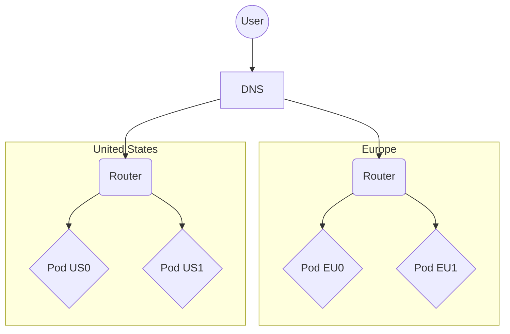

### More detail

This shows that the router can actually send requests to any pod. The user will
get the closest router to them geographically.

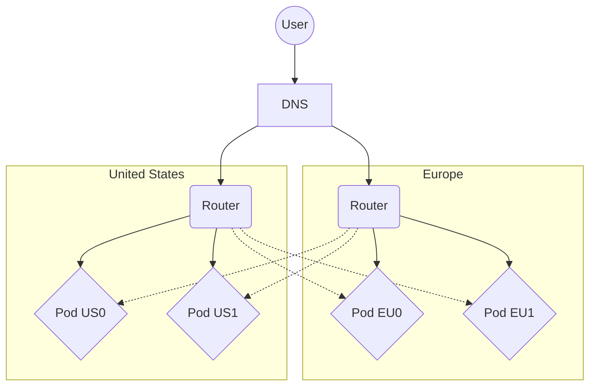

### Even more detail

This shows the databases. `gitlab_users` and `gitlab_routes` exist only in the
US region but are replicated to other regions. Replication does not have an
arrow because it's too hard to read the diagram.

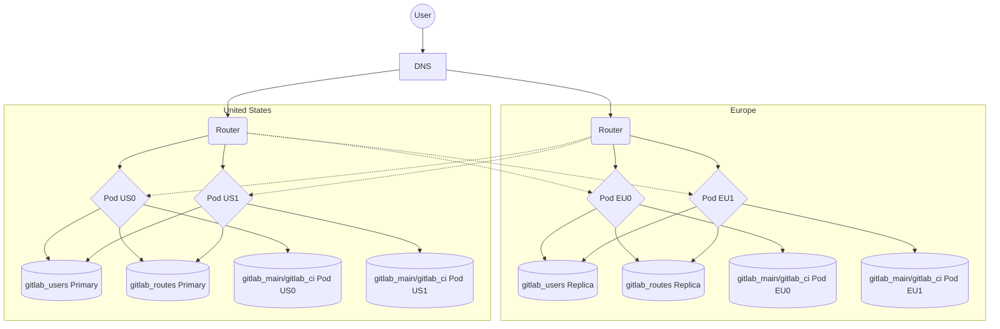

## Summary of changes

1. Tables related to User data (including profile settings, authentication credentials, personal access tokens) are decomposed into a `gitlab_users` schema
1. The `routes` table is decomposed into `gitlab_routes` schema
1. The `application_settings` (and probably a few other instance level tables) are decomposed into `gitlab_admin` schema
1. A new column `routes.pod_id` is added to `routes` table
1. A new Router service exists to choose which pod to route a request to.
1. If a router receives a new request it will send `/api/v4/pods/learn?method=GET&path_info=/group-org/project` to learn which Pod can process it
1. A new concept will be introduced in GitLab called an organization
1. We require all existing endpoints to be routable by URI, or be fixed to a specific Pod for processing. This requires changing ambiguous endpoints like `/dashboard` to be scoped like `/organizations/my-organization/-/dashboard`
1. Endpoints like `/admin` would be routed always to the specific Pod, like `pod_0`
1. Each Pod can respond to `/api/v4/pods/learn` and classify each endpoint
1. Writes to `gitlab_users` and `gitlab_routes` are sent to a primary PostgreSQL server in our `US` region but reads can come from replicas in the same region. This will add latency for these writes but we expect they are infrequent relative to the rest of GitLab.

## Pre-flight request learning

While processing a request the URI will be decoded and a pre-flight request
will be sent for each non-cached endpoint.

When asking for the endpoint GitLab Rails will return information about
the routable path. GitLab Rails will decode `path_info` and match it to
an existing endpoint and find a routable entity (like project). The router will
treat this as short-lived cache information.

1. Prefix match: `/api/v4/pods/learn?method=GET&path_info=/gitlab-org/gitlab-test/-/issues`

   ```json
   {
      "path": "/gitlab-org/gitlab-test",
      "pod": "pod_0",
      "source": "routable"
   }
   ```

1. Some endpoints might require an exact match: `/api/v4/pods/learn?method=GET&path_info=/-/profile`

   ```json
   {
      "path": "/-/profile",
      "pod": "pod_0",
      "source": "fixed",
      "exact": true
   }
   ```

## Detailed explanation of default organization in the first iteration

All users will get a new column `users.default_organization` which they can
control in user settings. We will introduce a concept of the
`GitLab.com Public` organization. This will be set as the default organization for all existing
users. This organization will allow the user to see data from all namespaces in
`Pod US0` (ie. our original GitLab.com instance). This behavior can be invisible to
existing users such that they don't even get told when they are viewing a
global page like `/dashboard` that it's even scoped to an organization.

Any new users with a default organization other than `GitLab.com Public` will have
a distinct user experience and will be fully aware that every page they load is
only ever scoped to a single organization. These users can never
load any global pages like `/dashboard` and will end up being redirected to
`/organizations/<DEFAULT_ORGANIZATION>/-/dashboard`. This may also be the case
for legacy APIs and such users may only ever be able to use APIs scoped to a
organization.

## Detailed explanation of Admin Area settings

We believe that maintaining and synchronizing Admin Area settings will be
frustrating and painful so to avoid this we will decompose and share all Admin Area
settings in the `gitlab_admin` schema. This should be safe (similar to other
shared schemas) because these receive very little write traffic.

In cases where different pods need different settings (eg. the
Elasticsearch URL), we will either decide to use a templated
format in the relevant `application_settings` row which allows it to be dynamic
per pod. Alternatively if that proves difficult we'll introduce a new table
called `per_pod_application_settings` and this will have 1 row per pod to allow
setting different settings per pod. It will still be part of the `gitlab_admin`
schema and shared which will allow us to centrally manage it and simplify
keeping settings in sync for all pods.

## Pros

1. Router is stateless and can live in many regions. We use Anycast DNS to resolve to nearest region for the user.
1. Pods can receive requests for namespaces in the wrong pod and the user
   still gets the right response as well as caching at the router that
   ensures the next request is sent to the correct pod so the next request
   will go to the correct pod
1. The majority of the code still lives in `gitlab` rails codebase. The Router doesn't actually need to understand how GitLab URLs are composed.
1. Since the responsibility to read and write `gitlab_users`,
   `gitlab_routes` and `gitlab_admin` still lives in Rails it means minimal
   changes will be needed to the Rails application compared to extracting
   services that need to isolate the domain models and build new interfaces.
1. Compared to a separate routing service this allows the Rails application
   to encode more complex rules around how to map URLs to the correct pod
   and may work for some existing API endpoints.
1. All the new infrastructure (just a router) is optional and a single-pod
   self-managed installation does not even need to run the Router and there are
   no other new services.

## Cons

1. `gitlab_users`, `gitlab_routes` and `gitlab_admin` databases may need to be
   replicated across regions and writes need to go across regions. We need to
   do an analysis on write TPS for the relevant tables to determine if this is
   feasible.
1. Sharing access to the database from many different Pods means that they are
   all coupled at the Postgres schema level and this means changes to the
   database schema need to be done carefully in sync with the deployment of all
   Pods. This limits us to ensure that Pods are kept in closely similar
   versions compared to an architecture with shared services that have an API
   we control.
1. Although most data is stored in the right region there can be requests
   proxied from another region which may be an issue for certain types
   of compliance.
1. Data in `gitlab_users` and `gitlab_routes` databases must be replicated in
   all regions which may be an issue for certain types of compliance.
1. The router cache may need to be very large if we get a wide variety of URLs
   (ie. long tail). In such a case we may need to implement a 2nd level of
   caching in user cookies so their frequently accessed pages always go to the
   right pod the first time.
1. Having shared database access for `gitlab_users` and `gitlab_routes`
   from multiple pods is an unusual architecture decision compared to
   extracting services that are called from multiple pods.
1. It is very likely we won't be able to find cacheable elements of a
   GraphQL URL and often existing GraphQL endpoints are heavily dependent on
   ids that won't be in the `routes` table so pods won't necessarily know
   what pod has the data. As such we'll probably have to update our GraphQL
   calls to include an organization context in the path like
   `/api/organizations/<organization>/graphql`.
1. This architecture implies that implemented endpoints can only access data
   that are readily accessible on a given Pod, but are unlikely
   to aggregate information from many Pods.
1. All unknown routes are sent to the latest deployment which we assume to be `Pod US0`.
   This is required as newly added endpoints will be only decodable by latest pod.
   Likely this is not a problem for the `/pods/learn` is it is lightweight
   to process and this should not cause a performance impact.

## Example database configuration

Handling shared `gitlab_users`, `gitlab_routes` and `gitlab_admin` databases, while having dedicated `gitlab_main` and `gitlab_ci` databases should already be handled by the way we use `config/database.yml`. We should also, already be able to handle the dedicated EU replicas while having a single US primary for `gitlab_users` and `gitlab_routes`. Below is a snippet of part of the database configuration for the Pod architecture described above.

**Pod US0**:

```yaml
# config/database.yml
production:
  main:
    host: postgres-main.pod-us0.primary.consul
    load_balancing:
      discovery: postgres-main.pod-us0.replicas.consul
  ci:
    host: postgres-ci.pod-us0.primary.consul
    load_balancing:
      discovery: postgres-ci.pod-us0.replicas.consul
  users:
    host: postgres-users-primary.consul
    load_balancing:
      discovery: postgres-users-replicas.us.consul
  routes:
    host: postgres-routes-primary.consul
    load_balancing:
      discovery: postgres-routes-replicas.us.consul
  admin:
    host: postgres-admin-primary.consul
    load_balancing:
      discovery: postgres-admin-replicas.us.consul
```

**Pod EU0**:

```yaml
# config/database.yml
production:
  main:
    host: postgres-main.pod-eu0.primary.consul
    load_balancing:
      discovery: postgres-main.pod-eu0.replicas.consul
  ci:
    host: postgres-ci.pod-eu0.primary.consul
    load_balancing:
      discovery: postgres-ci.pod-eu0.replicas.consul
  users:
    host: postgres-users-primary.consul
    load_balancing:
      discovery: postgres-users-replicas.eu.consul
  routes:
    host: postgres-routes-primary.consul
    load_balancing:
      discovery: postgres-routes-replicas.eu.consul
  admin:
    host: postgres-admin-primary.consul
    load_balancing:
      discovery: postgres-admin-replicas.eu.consul
```

## Request flows

1. `gitlab-org` is a top level namespace and lives in `Pod US0` in the `GitLab.com Public` organization
1. `my-company` is a top level namespace and lives in `Pod EU0` in the `my-organization` organization

### Experience for paying user that is part of `my-organization`

Such a user will have a default organization set to `/my-organization` and will be
unable to load any global routes outside of this organization. They may load other
projects/namespaces but their MR/Todo/Issue counts at the top of the page will
not be correctly populated in the first iteration. The user will be aware of
this limitation.

#### Navigates to `/my-company/my-project` while logged in

1. User is in Europe so DNS resolves to the router in Europe
1. They request `/my-company/my-project` without the router cache, so the router chooses randomly `Pod EU1`
1. The `/pods/learn` is sent to `Pod EU1`, which responds that resource lives on `Pod EU0`
1. `Pod EU0` returns the correct response
1. The router now caches and remembers any request paths matching `/my-company/*` should go to `Pod EU0`

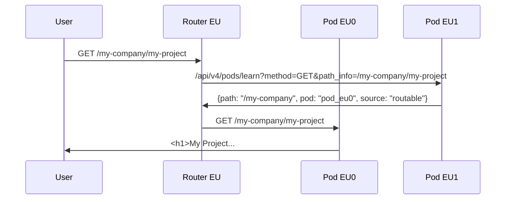

#### Navigates to `/my-company/my-project` while not logged in

1. User is in Europe so DNS resolves to the router in Europe
1. The router does not have `/my-company/*` cached yet so it chooses randomly `Pod EU1`
1. The `/pods/learn` is sent to `Pod EU1`, which responds that resource lives on `Pod EU0`
1. `Pod EU0` redirects them through a login flow
1. User requests `/users/sign_in`, uses random Pod to run `/pods/learn`
1. The `Pod EU1` responds with `pod_0` as a fixed route
1. User after login requests `/my-company/my-project` which is cached and stored in `Pod EU0`
1. `Pod EU0` returns the correct response

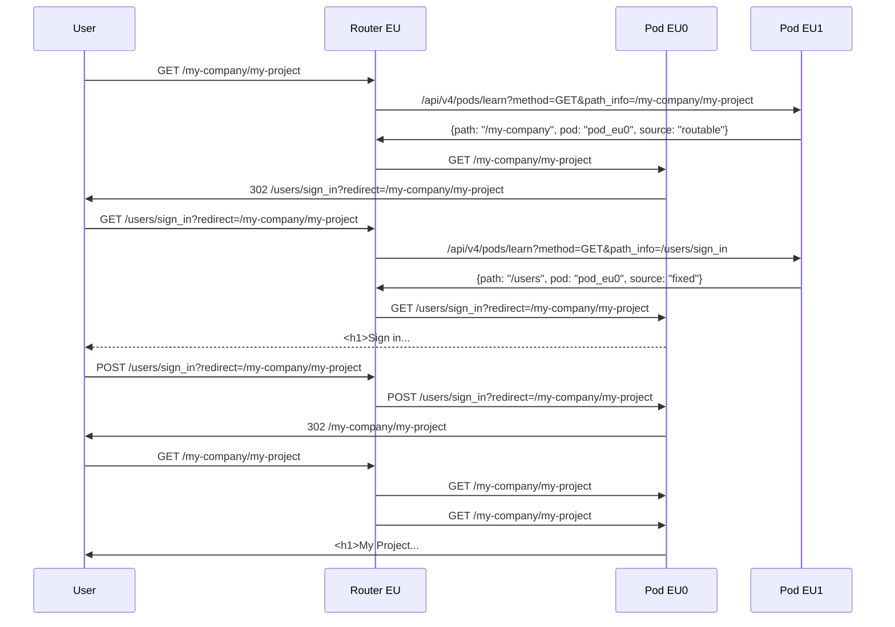

#### Navigates to `/my-company/my-other-project` after last step

1. User is in Europe so DNS resolves to the router in Europe
1. The router cache now has `/my-company/* => Pod EU0`, so the router chooses `Pod EU0`
1. `Pod EU0` returns the correct response as well as the cache header again

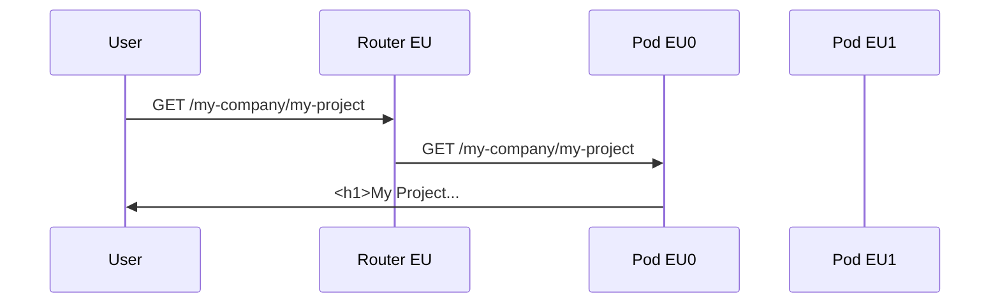

#### Navigates to `/gitlab-org/gitlab` after last step

1. User is in Europe so DNS resolves to the router in Europe
1. The router has no cached value for this URL so randomly chooses `Pod EU0`
1. `Pod EU0` redirects the router to `Pod US0`
1. `Pod US0` returns the correct response as well as the cache header again

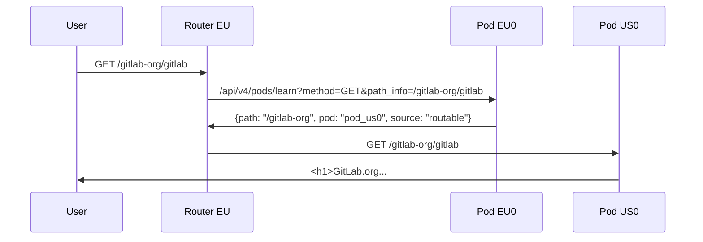

In this case the user is not on their "default organization" so their TODO
counter will not include their normal todos. We may choose to highlight this in
the UI somewhere. A future iteration may be able to fetch that for them from
their default organization.

#### Navigates to `/`

1. User is in Europe so DNS resolves to the router in Europe
1. Router does not have a cache for `/` route (specifically rails never tells it to cache this route)
1. The Router choose `Pod EU0` randomly
1. The Rails application knows the users default organization is `/my-organization`, so
   it redirects the user to `/organizations/my-organization/-/dashboard`
1. The Router has a cached value for `/organizations/my-organization/*` so it then sends the
   request to `POD EU0`
1. `Pod EU0` serves up a new page `/organizations/my-organization/-/dashboard` which is the same
   dashboard view we have today but scoped to an organization clearly in the UI
1. The user is (optionally) presented with a message saying that data on this page is only
   from their default organization and that they can change their default
   organization if it's not right.

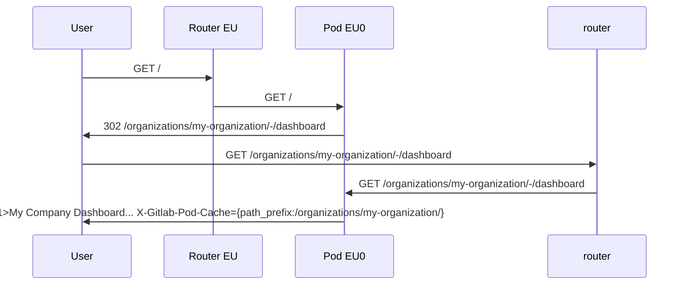

#### Navigates to `/dashboard`

As above, they will end up on `/organizations/my-organization/-/dashboard` as
the rails application will already redirect `/` to the dashboard page.

### Navigates to `/not-my-company/not-my-project` while logged in (but they don't have access since this project/group is private)

1. User is in Europe so DNS resolves to the router in Europe
1. The router knows that `/not-my-company` lives in `Pod US1` so sends the request to this
1. The user does not have access so `Pod US1` returns 404

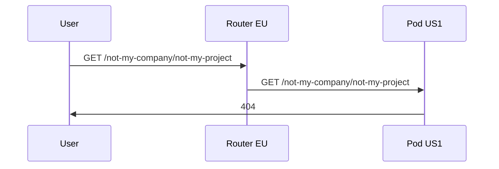

#### Creates a new top level namespace

The user will be asked which organization they want the namespace to belong to.
If they select `my-organization` then it will end up on the same pod as all
other namespaces in `my-organization`. If they select nothing we default to
`GitLab.com Public` and it is clear to the user that this is isolated from
their existing organization such that they won't be able to see data from both
on a single page.

### Experience for GitLab team member that is part of `/gitlab-org`

Such a user is considered a legacy user and has their default organization set to
`GitLab.com Public`. This is a "meta" organization that does not really exist but
the Rails application knows to interpret this organization to mean that they are
allowed to use legacy global functionality like `/dashboard` to see data across
namespaces located on `Pod US0`. The rails backend also knows that the default pod to render any ambiguous
routes like `/dashboard` is `Pod US0`. Lastly the user will be allowed to
navigate to organizations on another pod like `/my-organization` but when they do the
user will see a message indicating that some data may be missing (eg. the
MRs/Issues/Todos) counts.

#### Navigates to `/gitlab-org/gitlab` while not logged in

1. User is in the US so DNS resolves to the US router
1. The router knows that `/gitlab-org` lives in `Pod US0` so sends the request
   to this pod
1. `Pod US0` serves up the response

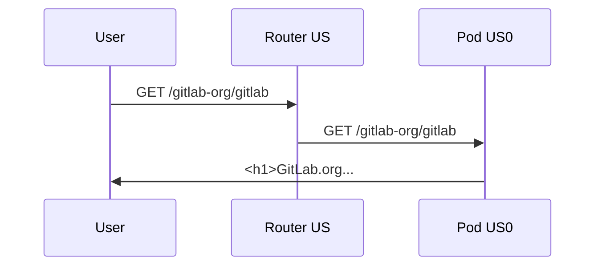

#### Navigates to `/`

1. User is in US so DNS resolves to the router in US
1. Router does not have a cache for `/` route (specifically rails never tells it to cache this route)
1. The Router chooses `Pod US1` randomly
1. The Rails application knows the users default organization is `GitLab.com Public`, so
   it redirects the user to `/dashboards` (only legacy users can see
   `/dashboard` global view)
1. Router does not have a cache for `/dashboard` route (specifically rails never tells it to cache this route)
1. The Router chooses `Pod US1` randomly
1. The Rails application knows the users default organization is `GitLab.com Public`, so
   it allows the user to load `/dashboards` (only legacy users can see
   `/dashboard` global view) and redirects to router the legacy pod which is `Pod US0`
1. `Pod US0` serves up the global view dashboard page `/dashboard` which is the same
   dashboard view we have today

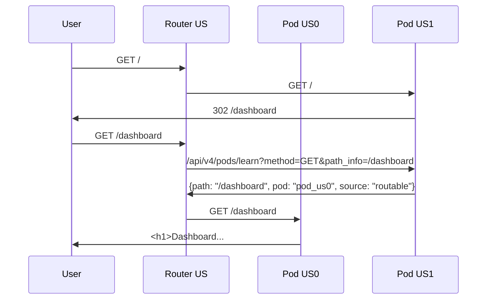

#### Navigates to `/my-company/my-other-project` while logged in (but they don't have access since this project is private)

They get a 404.

### Experience for non-authenticated users

Flow is similar to logged in users except global routes like `/dashboard` will
redirect to the login page as there is no default organization to choose from.

### A new customers signs up

They will be asked if they are already part of an organization or if they'd
like to create one. If they choose neither they end up no the default
`GitLab.com Public` organization.

### An organization is moved from 1 pod to another

TODO

### GraphQL/API requests which don't include the namespace in the URL

TODO

### The autocomplete suggestion functionality in the search bar which remembers recent issues/MRs

TODO

### Global search

TODO

## Administrator

### Loads `/admin` page

1. The `/admin` is locked to `Pod US0`
1. Some endpoints of `/admin`, like Projects in Admin are scoped to a Pod
   and users needs to choose the correct one in a dropdown, which results in endpoint
   like `/admin/pods/pod_0/projects`.

Admin Area settings in Postgres are all shared across all pods to avoid
divergence but we still make it clear in the URL and UI which pod is serving
the Admin Area page as there is dynamic data being generated from these pages and
the operator may want to view a specific pod.

## More Technical Problems To Solve

### Replicating User Sessions Between All Pods

Today user sessions live in Redis but each pod will have their own Redis instance. We already use a dedicated Redis instance for sessions so we could consider sharing this with all pods like we do with `gitlab_users` PostgreSQL database. But an important consideration will be latency as we would still want to mostly fetch sessions from the same region.

An alternative might be that user sessions get moved to a JWT payload that encodes all the session data but this has downsides. For example, it is difficult to expire a user session, when their password changes or for other reasons, if the session lives in a JWT controlled by the user.

### How do we migrate between Pods

Migrating data between pods will need to factor all data stores:

1. PostgreSQL
1. Redis Shared State
1. Gitaly
1. Elasticsearch

### Is it still possible to leak the existence of private groups via a timing attack?

If you have router in EU, and you know that EU router by default redirects
to EU located Pods, you know their latency (lets assume 10 ms). Now, if your
request is bounced back and redirected to US which has different latency
(lets assume that roundtrip will be around 60 ms) you can deduce that 404 was
returned by US Pod and know that your 404 is in fact 403.

We may defer this until we actually implement a pod in a different region. Such timing attacks are already theoretically possible with the way we do permission checks today but the timing difference is probably too small to be able to detect.

One technique to mitigate this risk might be to have the router add a random
delay to any request that returns 404 from a pod.

## Should runners be shared across all pods?

We have 2 options and we should decide which is easier:

1. Decompose runner registration and queuing tables and share them across all
   pods. This may have implications for scalability, and we'd need to consider
   if this would include group/project runners as this may have scalability
   concerns as these are high traffic tables that would need to be shared.
1. Runners are registered per-pod and, we probably have a separate fleet of
   runners for every pod or just register the same runners to many pods which
   may have implications for queueing

## How do we guarantee unique ids across all pods for things that cannot conflict?

This project assumes at least namespaces and projects have unique ids across
all pods as many requests need to be routed based on their ID. Since those
tables are across different databases then guaranteeing a unique ID will
require a new solution. There are likely other tables where unique IDs are
necessary and depending on how we resolve routing for GraphQL and other APIs
and other design goals it may be determined that we want the primary key to be
unique for all tables.
