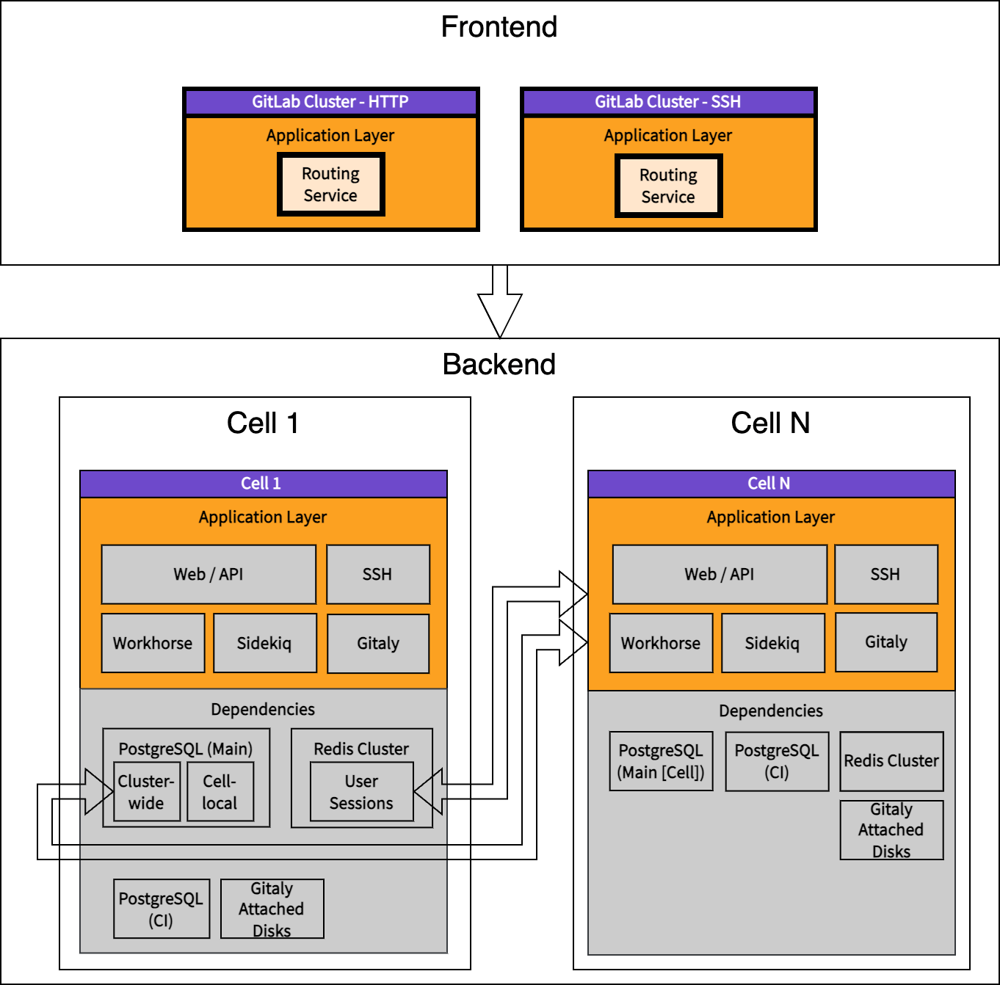

_This blueprint was surpassed by the [infrastructure blueprint](../infrastructure/index.md)_

# Cells: Deployment Architecture

This section describes the existing deployment architecture
of GitLab.com and contrasts it with the expected Cells architecture.

## 1. Before Cells - Monolithic architecture

The diagram represents simplified GitLab.com deployment components before the introduction of a Cells architecture.
This diagram intentionally omits some services that are not relevant for the architecture overview (Cloudflare, Consul, PgBouncers, ...).
Those services are considered to be Cell-local, with the exception of Cloudflare.

The component blocks are:

- Separate components that can be deployed independently.
- Components that are independent from other components and offer a wide range of version compatibility.

The application layer services:

- Are strongly interconnected and require to run the same version of the application.
  Read more in [!131657](https://gitlab.com/gitlab-org/gitlab/-/merge_requests/131657#note_1563513431).
- Each service is run across many nodes and scaled horizontally to provide sufficient throughput.
- Services that interact with other services using an API (REST, gRPC), Redis or DB.

The dependent services:

- Are updated infrequently and selectively.
- Might use cloud managed services.
- Each service is clustered and might be run across different availability zones to provide high availability.
- Object storage is also accessible directly to users if a pre-signed URL is provided.

## 2. Development Cells - Adapting application to Cellular architecture

The purpose of **Development Cells** is to model a production-like architecture to test and validate the changes introduced.
This could be achieved with testing Cells on top of the [Reference Architectures](../../../../administration/reference_architectures/index.md).
Read more in [#425197](https://gitlab.com/gitlab-org/gitlab/-/issues/425197).

The differences compared to [Before Cells](#1-before-cells---monolithic-architecture) are:

- A Routing Service is developed by Cells.
- Development Cells are meant to be run using a development environment only to allow prototyping of Cells without the overhead of managing all auxiliary services.
- Development Cells represent a simplified GitLab.com architecture by focusing only on essential services required to be split.
- Development Cells are not meant to be used in production.
- Cluster-wide data sharing is done with a read-write connection to the main database of Cell 1: PostgreSQL main database, and Redis user-sessions database.

## 3. Initial Cells deployment - Transforming monolithic architecture to Cells architecture

The differences compared to [Development Cells](#2-development-cells---adapting-application-to-cellular-architecture) are:

- A Cluster-wide Data Provider is introduced by Cells.
- The Cluster-wide Data Provider is deployed with Cell 1 to be able to access cluster-wide data directly.
- The Cluster-wide database is isolated from the main PostgreSQL database.
- A Cluster-wide Data Provider is responsible for storing and sharing user data,
  user sessions (currently stored in Redis sessions cluster), routing information,
  and cluster-wide settings across all Cells.
- Access to the cluster-wide database is done asynchronously:
  - Read access always uses a database replica.
  - A database replica might be deployed with the Cell.
  - Write access uses the dedicated Cluster-wide Data Provider service.
- Additional Cells are deployed, upgraded and maintained via a [GitLab Dedicated-like](../../../../subscriptions/gitlab_dedicated/index.md) control plane.
- Each Cell aims to run as many services as possible in isolation.
- A Cell can run its own Gitaly cluster, or can use a shared Gitaly cluster, or both.
  Read more in [!131657](https://gitlab.com/gitlab-org/gitlab/-/merge_requests/131657#note_1569151454).
- Shared Runners provided by GitLab are expected to be run locally on the Cell.
- Infrastructure components might be shared across the cluster and be used by different Cells.
- It is undefined whether Elasticsearch service would be better run cluster-wide or Cell-local.
- Delay the decision how to scale the **GitLab Pages - `gitlab.io`** component.
- Delay the decision how to scale the **Registry - `registry.gitlab.com`** component.

## 4. Hybrid Cells deployment - Initial complete Cells architecture

The differences compared to [Initial Cells deployment](#3-initial-cells-deployment---transforming-monolithic-architecture-to-cells-architecture) are:

- Removes coupling of Cell N to Cell 1.
- The Cluster-wide Data Provider is isolated from Cell 1.
- The cluster-wide databases (PostgreSQL, Redis) are moved to be run with the Cluster-wide Data Provider.
- All application data access paths to cluster-wide data use the Cluster-wide Data Provider.
- Some services are shared across Cells.

## 5. Target Cells - Fully isolated Cells architecture

The differences compared to [Hybrid Cells deployment](#4-hybrid-cells-deployment---initial-complete-cells-architecture) are:

- The Routing Service is expanded to support [GitLab Pages](../../../../user/project/pages/index.md) and [GitLab container registry](../../../../user/packages/container_registry/index.md).
- Each Cell has all services isolated.
- It is allowed that some Cells will follow a [hybrid architecture](#4-hybrid-cells-deployment---initial-complete-cells-architecture).

## Isolation of Services

Each service can be considered individually regarding its requirements, the risks associated
with scaling the service, its location (cluster-wide or Cell-local), and impact on our ability to migrate data between Cells.

### Cluster-wide services

| Service                        | Type         | Uses                            | Description |
|--------------------------------|--------------|---------------------------------|-------------|
| **Routing Service**            | GitLab-built | Cluster-wide Data Provider      | A general purpose routing service that can redirect requests from all GitLab SaaS domains to the Cell |
| **Cluster-wide Data Provider** | GitLab-built | PostgreSQL, Redis, Event Queue? | Provide user profile and routing information to all clustered services |

As per the architecture, the above services are required to be run cluster-wide:

- Those are additional services that are introduced by the Cells architecture.

### Cell-local services

| Service                    | Type            | Uses                                | Migrate from cluster-wide to Cell | Description |
|----------------------------|-----------------|-------------------------------------|-----------------------------------|-------------|
| **Redis Cluster**          | Managed service | Disk storage                        | No problem                        | Redis is used to hold user sessions, application caches, or Sidekiq queues. Most of that data is only applicable to Cells. |
| **GitLab Runners Manager** | Managed service | API, uses Google Cloud VM Instances | No problem                        | Significant changes required to API and execution of CI jobs |

As per the architecture, the above services are required to be run Cell-local:

- The consumer data held by the Cell-local services needs to be migratable to another Cell.
- The compute generated by the service is substantial, and it is strongly desired to reduce impact of [single Cell failure](../goals.md#high-resilience-to-a-single-cell-failure).
- It is complex to run the service cluster-wide from the Cells architecture perspective.

### Hybrid Services

| Service             | Type            | Uses                            | Migrate from cluster-wide to Cell                                       | Description |
|---------------------|-----------------|---------------------------------|-------------------------------------------------------------------------|-------------|
| **GitLab Pages**    | GitLab-built    | Routing Service, Rails API      | No problem                                                              | Serving CI generated pages under `.gitlab.io` or custom domains |
| **GitLab Registry** | GitLab-built    | Object Storage, PostgreSQL      | Non-trivial data migration in case of split                             | Service to provide GitLab container registry |
| **Gitaly Cluster**  | GitLab-built    | Disk storage, PostgreSQL        | No problem: Built-in migration routines to balance Gitaly nodes         | Gitaly holds Git repository data. Many Gitaly clusters can be configured in application. |
| **Elasticsearch**   | Managed service | Many nodes required by sharding | Time-consuming: Rebuild cluster from scratch                            | Search across all projects |
| **Object Storage**  | Managed service |                                 | Not straightforward: Rather hard to selectively migrate between buckets | Holds all user and CI uploaded files that is served by GitLab |

As per the architecture, the above services are allowed to be run either cluster-wide or Cell-local:

- The ability to run hybrid services cluster-wide might reduce the amount of work to migrate data between Cells due to some services being shared.
- The hybrid services that are run cluster-wide might negatively impact Cell availability and resiliency due to increased impact caused by [single Cell failure](../goals.md#high-resilience-to-a-single-cell-failure).

| Service            | Type            | Uses                            | Migrate from cluster-wide to Cell                                       | Description |
|--------------------|-----------------|---------------------------------|-------------------------------------------------------------------------|-------------|
| **Elasticsearch**  | Managed service | Many nodes requires by sharding | Time-consuming: Rebuild cluster from scratch                            | Search across all projects |
| **Object Storage** | Managed service |                                 | Not straightforward: Rather hard to selectively migrate between buckets | Holds all user and CI uploaded files that is served by GitLab |

As per the architecture, the above services are allowed to be run either cluster-wide or Cell-local:

- The ability to run above services cluster-wide might reduce the amount of work to migrate data between Cells due to some services being shared.
- The hybrid services that are run cluster-wide might negatively impact Cell availability and resiliency due to increased impact caused by [single Cell failure](../goals.md#high-resilience-to-a-single-cell-failure).
