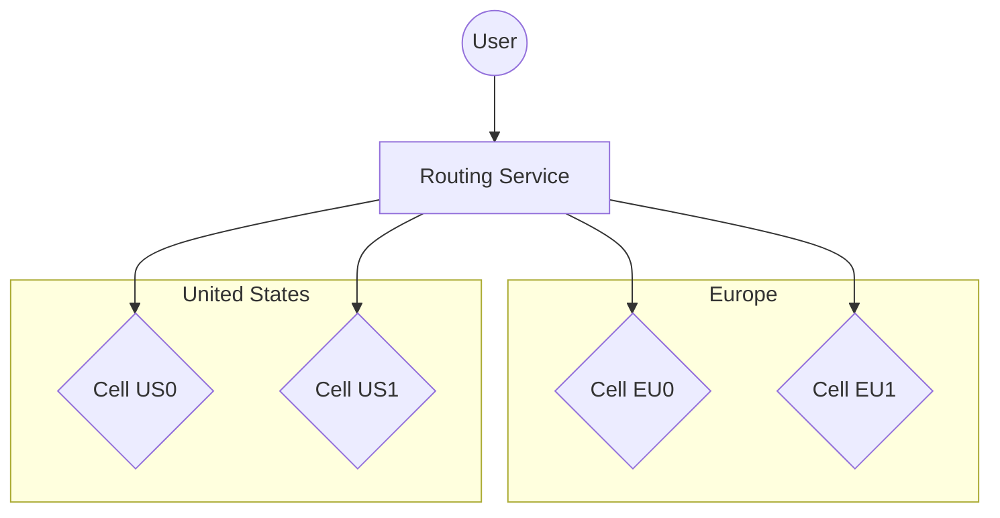
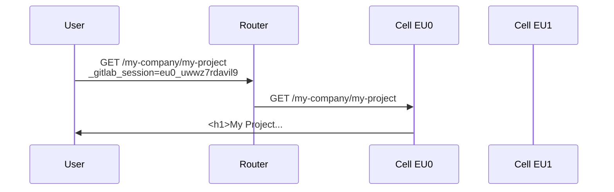
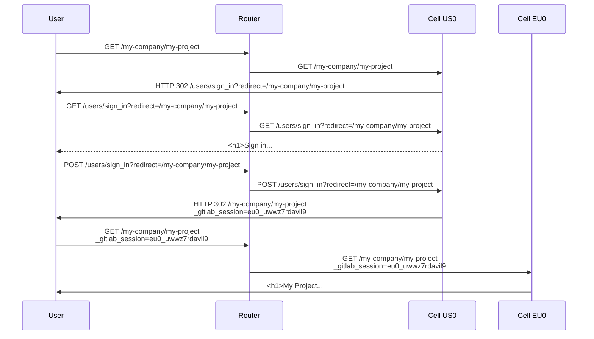
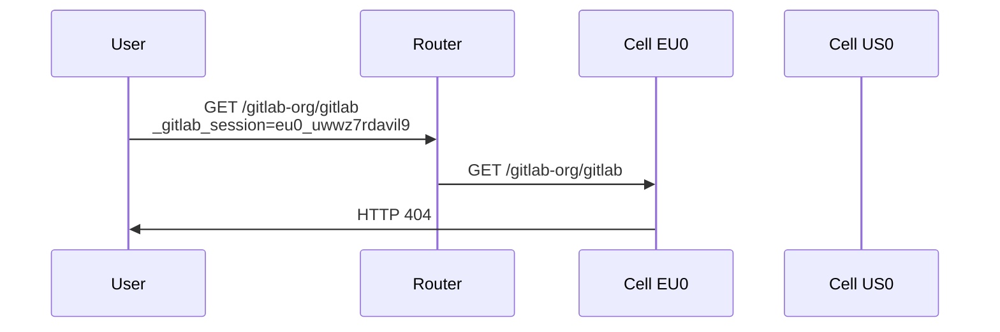
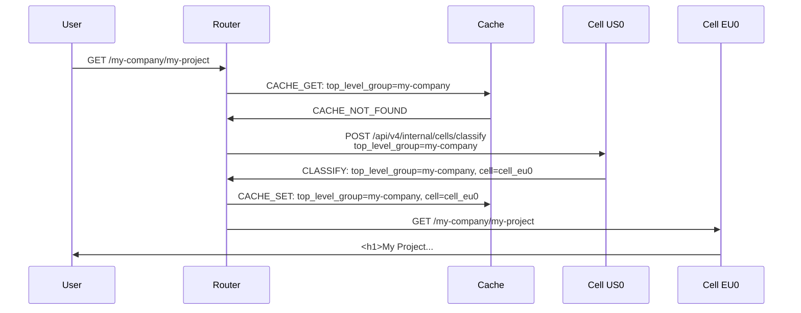
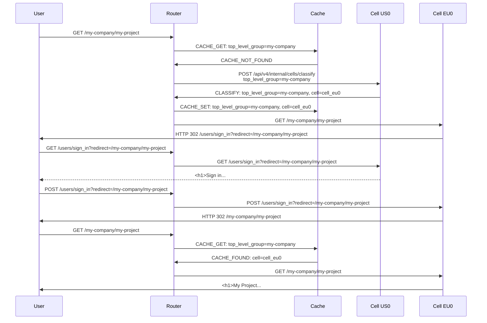
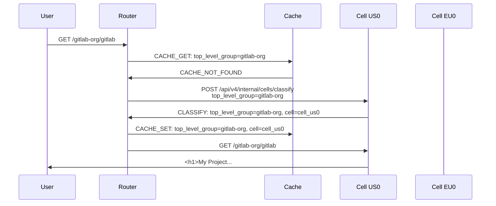

# Cells: Routing Service

This document describes design goals and architecture of Routing Service
used by Cells. To better understand where the Routing Service fits
into architecture take a look at [Infrastructure Architecture](infrastructure/index.md#architecture).

## Goals

The routing layer is meant to offer a consistent user experience where all Cells are presented under a single domain (for example, `gitlab.com`), instead of having to go to separate domains.

The user will be able to use `https://gitlab.com` to access Cell-enabled GitLab.
Depending on the URL access, it will be transparently proxied to the correct Cell that can serve this particular information.
For example:

- All requests going to `https://gitlab.com/users/sign_in` are randomly distributed to all Cells.
- All requests going to `https://gitlab.com/gitlab-org/gitlab/-/tree/master` are always directed to Cell 5, for example.
- All requests going to `https://gitlab.com/my-username/my-project` are always directed to Cell 1.

1. **Technology.**

    We decide what technology the routing service is written in.
    The choice is dependent on the best performing language, and the expected way and place of deployment of the routing layer.
    If it is required to make the service multi-cloud it might be required to deploy it to the CDN provider.
    Then the service needs to be written using a technology compatible with the CDN provider.

    [ADR 001](decisions/001_routing_technology.md)

1. **Cell discovery.**

    The routing service needs to be able to discover and monitor the health of all Cells.

1. **User can use single domain to interact with many Cells.**

    The routing service will intelligently route all requests to Cells based on the resource being
    accessed versus the Cell containing the data.

1. **Router endpoints classification.**

    The stateless routing service will fetch and cache information about endpoints from one of the Cells.
    We need to implement a protocol that will allow us to accurately describe the incoming request (its fingerprint), so it can be classified by one of the Cells, and the results of that can be cached.
    We also need to implement a mechanism for negative cache and cache eviction.

1. **GraphQL and other ambiguous endpoints.**

    Most endpoints have a unique sharding key: the Organization, which directly or indirectly (via a Group or Project) can be used to classify endpoints.
    Some endpoints are ambiguous in their usage (they don't encode the sharding key), or the sharding key is stored deep in the payload.
    In these cases, we need to decide how to handle endpoints like `/api/graphql`.

1. **Small.**

    The Routing Service is configuration-driven and rules-driven, and does not implement any business logic.
    The maximum size of the project source code in initial phase is 1_000 lines without tests.
    The reason for the hard limit is to make the Routing Service to not have any special logic,
    and could be rewritten into any technology in a matter of a few days.

## Requirements

| Requirement         | Description                                                       | Priority |
| ------------------- | ----------------------------------------------------------------- | -------- |
| Discovery           | needs to be able to discover and monitor the health of all Cells. | high     |
| Security            | only authorized cells can be routed to                            | high     |
| Single domain       | for example GitLab.com                                            | high     |
| Caching             | can cache routing information for performance                     | high     |
| Low latency         | [50 ms of increased latency](#low-latency)                        | high     |
| Path-based          | can make routing decision based on path                           | high     |
| Complexity          | the routing service should be configuration-driven and small      | high     |
| Rolling             | the routing service works with Cells running mixed versions       | high     |
| Feature Flags       | features can be turned on, off, and % rollout                     | high     |
| Progressive Rollout | we can slowly rollout a change                                    | medium   |
| Stateless           | does not need database, Cells provide all routing information     | medium   |
| Secrets-based       | can make routing decision based on secret (for example JWT)       | medium   |
| Observability       | can use existing observability tooling                            | low      |
| Self-managed        | can be eventually used by [self-managed](goals.md#self-managed)   | low      |
| Regional            | can route requests to different [regions](goals.md#regions)       | low      |

### Low Latency

The target latency for routing service **should be less than 50 _ms_**.

Looking at the `urgency: high` request we don't have a lot of headroom on the p50.
Adding an extra 50 _ms_ allows us to still be in or SLO on the p95 level.

There is 3 primary entry points for the application; [`web`](https://gitlab.com/gitlab-com/runbooks/-/blob/5d8248314b343bef15a4c021ac33978525f809e3/services/service-catalog.yml#L492-537), [`api`](https://gitlab.com/gitlab-com/runbooks/-/blob/5d8248314b343bef15a4c021ac33978525f809e3/services/service-catalog.yml#L18-62), and [`git`](https://gitlab.com/gitlab-com/runbooks/-/blob/5d8248314b343bef15a4c021ac33978525f809e3/services/service-catalog.yml#L589-638).
Each service is assigned a Service Level Indicator (SLI) based on latency using the [apdex](https://www.apdex.org/wp-content/uploads/2020/09/ApdexTechnicalSpecificationV11_000.pdf) standard.
The corresponding Service Level Objectives (SLOs) for these SLIs require low latencies for large amount of requests.
It's crucial to ensure that the addition of the routing layer in front of these services does not impact the SLIs.
The routing layer is a proxy for these services, and we lack a comprehensive SLI monitoring system for the entire request flow (including components like the Edge network and Load Balancers) we use the SLIs for `web`, `git`, and `api` as a target.

The main SLI we use is the [rails requests](../../../development/application_slis/rails_request.md).
It has multiple `satisfied` targets (apdex) depending on the [request urgency](../../../development/application_slis/rails_request.md#how-to-adjust-the-urgency):

| Urgency    | Duration in ms |
| ---------- | -------------- |
| `:high`    | 250 _ms_       |
| `:medium`  | 500 _ms_       |
| `:default` | 1000 _ms_      |
| `:low`     | 5000 _ms_      |

#### Analysis

The way we calculate the headroom we have is by using the following:

```math
\mathrm{Headroom}\ {ms} = \mathrm{Satisfied}\ {ms} - \mathrm{Duration}\ {ms}
```

**`web`**:

| Target Duration | Percentile | Headroom  |
| --------------- | ---------- | --------- |
| 5000 _ms_       | p99        | 4000 _ms_ |
| 5000 _ms_       | p95        | 4500 _ms_ |
| 5000 _ms_       | p90        | 4600 _ms_ |
| 5000 _ms_       | p50        | 4900 _ms_ |
| 1000 _ms_       | p99        | 500 _ms_  |
| 1000 _ms_       | p95        | 740 _ms_  |
| 1000 _ms_       | p90        | 840 _ms_  |
| 1000 _ms_       | p50        | 900 _ms_  |
| 500 _ms_        | p99        | 0 _ms_    |
| 500 _ms_        | p95        | 60 _ms_   |
| 500 _ms_        | p90        | 100 _ms_  |
| 500 _ms_        | p50        | 400 _ms_  |
| 250 _ms_        | p99        | 140 _ms_  |
| 250 _ms_        | p95        | 170 _ms_  |
| 250 _ms_        | p90        | 180 _ms_  |
| 250 _ms_        | p50        | 200 _ms_  |

_Analysis was done in <https://gitlab.com/gitlab-org/gitlab/-/issues/432934#note_1667993089>_

**`api`**:

| Target Duration | Percentile | Headroom  |
| --------------- | ---------- | --------- |
| 5000 _ms_       | p99        | 3500 _ms_ |
| 5000 _ms_       | p95        | 4300 _ms_ |
| 5000 _ms_       | p90        | 4600 _ms_ |
| 5000 _ms_       | p50        | 4900 _ms_ |
| 1000 _ms_       | p99        | 440 _ms_  |
| 1000 _ms_       | p95        | 750 _ms_  |
| 1000 _ms_       | p90        | 830 _ms_  |
| 1000 _ms_       | p50        | 950 _ms_  |
| 500 _ms_        | p99        | 450 _ms_  |
| 500 _ms_        | p95        | 480 _ms_  |
| 500 _ms_        | p90        | 490 _ms_  |
| 500 _ms_        | p50        | 490 _ms_  |
| 250 _ms_        | p99        | 90 _ms_   |
| 250 _ms_        | p95        | 170 _ms_  |
| 250 _ms_        | p90        | 210 _ms_  |
| 250 _ms_        | p50        | 230 _ms_  |

_Analysis was done in <https://gitlab.com/gitlab-org/gitlab/-/issues/432934#note_1669995479>_

**`git`**:

| Target Duration | Percentile | Headroom  |
| --------------- | ---------- | --------- |
| 5000 _ms_       | p99        | 3760 _ms_ |
| 5000 _ms_       | p95        | 4280 _ms_ |
| 5000 _ms_       | p90        | 4430 _ms_ |
| 5000 _ms_       | p50        | 4900 _ms_ |
| 1000 _ms_       | p99        | 500 _ms_  |
| 1000 _ms_       | p95        | 750 _ms_  |
| 1000 _ms_       | p90        | 800 _ms_  |
| 1000 _ms_       | p50        | 900 _ms_  |
| 500 _ms_        | p99        | 280 _ms_  |
| 500 _ms_        | p95        | 370 _ms_  |
| 500 _ms_        | p90        | 400 _ms_  |
| 500 _ms_        | p50        | 430 _ms_  |
| 250 _ms_        | p99        | 200 _ms_  |
| 250 _ms_        | p95        | 230 _ms_  |
| 250 _ms_        | p90        | 240 _ms_  |
| 250 _ms_        | p50        | 240 _ms_  |

_Analysis was done in <https://gitlab.com/gitlab-org/gitlab/-/issues/432934#note_1671385680>_

## Non-Goals

Not yet defined.

## Proposal

The Routing Service implements the following design guidelines:

1. Simple:
   - Routing service does not buffer requests.
   - Routing service can only proxy to a single Cell based on request headers.
1. Stateless:
   - Routing service does not have permanent storage.
   - Routing service uses multi-level cache: in-memory, external shared cache.
1. Zero-trust:
   - Routing service signs each request that is being proxied.
   - The trust is established by using JWT token, or mutual authentication scheme.
   - Cells can be available over public internet, as long as they follow the zero-trust model.
1. Configuration-based:
   - Routing service is configured with a static list of Cells.
   - Routing service configuration is applied as part of service deployment.
1. Rule-based:
   - Routing service is deployed with a routing rules gathered from all Cells.
   - Routing service does support rules lists generated by different versions of GitLab.
   - rules allows to match by any criteria: header, content of the header, or route path.
1. Agnostic:
   - Routing service is not aware of high-level concepts like organizations.
   - The classification is done per-specification provided in a rules, to find the sharding key.
   - The sharding key result is cached.
   - The single sharding key cached is used to handle many similar requests.

The following diagram shows how a user request routes through DNS to the Routing Service deployed
as Cloudflare Worker and the router chooses a cell to send the request to.



### Routing rules

Each Cell will publish a precompiled list of routing rules that will be consumed by the Routing Service:

- The routing rules describe how to decode the request, find the sharding key, and make the routing decision.
- The routing rules are compiled during the deployment of the Routing Service.
  - The deployment process fetches latest version of the routing rules from each Cell
    that is part of Routing Service configuration.
  - The compilation process merges the routing rules from all Cells.
  - The conflicting rules prevent routing service from being compiled / started.
  - Each routing rule entry has a unique identifier to ease the merge.
  - The Routing Service would be re-deployed only if the list of rules was changed,
    which shouldn't happen frequently, because we expect the majority of newly added endpoints
    to already adhere to the prior route rules.
- The configuration describes from which Cells the routing rules need to be fetched during deploy.
- The published routing rules might make routing decision based on the secret. For example, if the session cookie
  or authentication token has prefix `c100-` all requests are to be forwarded to the given Cell.
- The Cell does publish routing rules at `/api/v4/internal/cells/route_rules.json`.
- The rules published by Cell only include endpoints that the particular Cell can process.
- The Cell might request to perform dynamic classification based on sharding key, by configuring
  routing rules to call `/api/v4/internal/cells/classify`.
- The routing rules should use `prefix` as a way to speed up classification. During the compilation phase
  the routing service transforms all found prefixes into a decision tree to speed up any subsequent regex matches.
- Some of the prefixes need to be Cell independent, example Personal Access Tokens prefix need to be organization bound and not Cell bound.
  We want the ability to move an organization from 1 cell to another without changing the Personal Access Token or any other token.
- The routing rules is ideally compiled into source code to avoid expensive parsing and evaluation of the rules
  dynamically as part of deployment.

The routing rules JSON structure describes all matchers:

```json
{
    "rules": [
        {
            "id": "<unique-identifier>",
            "cookies": {
                "<cookie_name>": {
                    "prefix": "<match-given-prefix>",
                    "match_regex": "<regex_match>"
                },
                "<cookie_name2>": {
                    "prefix": "<match-given-prefix>",
                    "match_regex": "<regex_match>"
                }
            },
            "headers": {
                "<header_name>": {
                    "prefix": "<match-given-prefix>",
                    "match_regex": "<regex_match>"
                },
                "<header_name2>": {
                    "prefix": "<match-given-prefix>",
                    "match_regex": "<regex_match>"
                },
            },
            "path": {
                "prefix": "<match-given-prefix>",
                "match_regex": "<regex_match>"
            },
            "method": ["<list_of_accepted_methods>"],

            // If many rules are matched, define which one wins
            "priority": 1000,

            // Accept request and proxy to the Cell in question
            "action": "proxy",

            // Classify request based on regex matching groups
            "action": "classify",
            "classify": {
                "keys": ["list_of_regex_match_capture_groups"]
            }
        }
    ]
}
```

Example of the routing rules published by the Cell 100 that makes routing decision based session cookie, and secret.
The high priority is assigned since the routing rules is secret-based, and should take precedence before all other matchers:

```json
{
    "rules": [
        {
            "id": "t4mkd5ndsk58si6uwwz7rdavil9m2hpq",
            "cookies": {
                "_gitlab_session": {
                    "prefix": "c100-" // accept `_gitlab_session` that are prefixed with `c100-`
                }
            },
            "action": "proxy",
            "priority": 1000
        },
        {
            "id": "jcshae4d4dtykt8byd6zw1ecccl5dkts",
            "headers": {
                "GITLAB_TOKEN": {
                    "prefix": "C100_" // accept `GITLAB_TOKEN` that are prefixed with `C100_`
                }
            },
            "action": "proxy",
            "priority": 1000
        }
    ]
}
```

Example of the routing rules published by all Cells that makes routing decision based on the path:

```json
{
    "rules": [
        {
            "id": "c9scvaiwj51a75kzoh917uwtnw8z4ebl",
            "path": {
                "prefix": "/api/v4/projects/", // speed-up rule matching
                "match_regex": "^/api/v4/projects/(?<project_id_or_path_encoded>[^/]+)(/.*)?$"
            },
            "action": "classify",
            "classify": {
                "keys": ["project_id_or_path_encoded"]
            }
        }
    ]
}
```

### Classification

Each Cell does implement classification endpoint:

- The classification endpoint is at `/api/v4/internal/cells/classify` (or gRPC endpoint).
- The classification endpoint accepts a list of the sharding keys. Sharding keys are decoded from request,
  based on the routing rules provided by the Cell.
- The endpoint returns other equivalent sharding keys to pollute cache for similar requests.
  This is to ensure that all similar requests can be handled quickly without having to classify each time.
- Routing Service tracks the health of Cells, and issues a `classify` request to Cells based on weights,
  health of the Cell, or other defined criteria. Weights would indicate which Cell is preferred to perform the
  classification of sharding keys.
- Routing Service retries the `classify` call for a reasonable amount of time.
  The repetitive failure of Cell to `classify` is indicative of Cell being unhealthy.
- The `classify` result is cached regardless of returned `action` (proxy or reject).
  The rejected classification is cached to prevent excessive amount of
  requests for sharding keys that are not found.
- The cached response is for time defined by `expiry` and `refresh`.
  - The `expiry` defines when the item is removed from cache unless used.
  - The `refresh` defines when the item needs to be reclassified if used.
  - The refresh is done asynchronously as the request should be served without a delay if they were classified. The refresh is done to ensure that cache is always hot and up-to date.

For the above example:

1. The router sees request to `/api/v4/projects/1000/issues`.
1. It selects the above `rule` for this request, which requests `classify` for `project_id_or_path_encoded`.
1. It decodes `project_id_or_path_encoded` to be `1000`.
1. Checks the cache if there's `project_id_or_path_encoded=1000` associated to any Cell.
1. Sends the request to `/api/v4/internal/cells/classify` if no Cells was found in cache.
1. Rails responds with the Cell holding the given project, and also all other equivalent sharding keys
   for the resource that should be put in the cache.
1. Routing Service caches for the duration specified in configuration, or response.

```json
# POST /api/v4/internal/cells/classify
## Request:
{
    "metadata": {
        "rule_id": "c9scvaiwj51a75kzoh917uwtnw8z4ebl",
        "headers": {
            "all_request_headers": "value"
        },
        "method": "GET",
        "path": "/api/v4/projects/100/issues"
    },
    "keys": {
        "project_id_or_path_encoded": 100
    }
}

## Response:
{
    "action": "proxy",
    "proxy": {
        "name": "cell_1",
        "url": "https://cell1.gitlab.com"
    },
    "ttl": "10 minutes",
    "matched_keys": [ // list of all equivalent keys that should be put in the cache
        { "project_id_or_path_encoded": 100 },
        { "project_id_or_path_encoded": "gitlab-org%2Fgitlab" },
        { "project_full_path": "gitlab-org/gitlab" },
        { "namespace_full_path": "gitlab-org" },
        { "namespace_id": 10 },
        { "organization_full_path": "gitlab-inc" },
        { "organization_id": 50 },
    ]
}
```

The following code represents a negative response when a sharding key was not found:

```json
# POST /api/v4/internal/cells/classify
## Request:
{
    "metadata": {
        "rule_id": "c9scvaiwj51a75kzoh917uwtnw8z4ebl",
        "headers": {
            "all_request_headers": "value"
        },
        "method": "GET",
        "path": "/api/v4/projects/100/issues"
    },
    "keys": {
        "project_id_or_path_encoded": 100
    }
}

## Response:
{
    "action": "reject",
    "reject": {
        "http_status": 404
    },
    "cache": {
        "refresh": "10 minutes",
        "expiry": "10 minutes"
    },
    "matched_keys": [ // list of all equivalent keys that should be put in the cache
        { "project_id_or_path_encoded": 100 },
    ]
}
```

### Configuration

The Routing Service will use the configuration similar to this:

```toml
[[cells]]
name=cell_1
url=https://cell1.gitlab.com
key=ABC123
classify_weight=100

[[cells]]
name=cell_2
url=https://cell2.gitlab.com
key=CDE123
classify_weight=1

[cache.memory.classify]
refresh_time=10 minutes
expiry_time=1 hour

[cache.external.classify]
refresh_time=30 minutes
expiry_time=6 hour
```

We assume that this is acceptable to provide a static list of Cells, because:

1. Static: Cells provisioned are unlikely to be dynamically provisioned and decommissioned.
1. Good enough: We can manage such list even up to 100 Cells.
1. Simple: We don't have to implement robust service discovery in the service,
   and we have guarantee that this list is always exhaustive.

The configuration describes all Cells, URLs, zero-trust keys, and weights,
and how long requests should be cached. The `classify_weight` defines how often
the Cell should receive classification requests versus other Cells.

## Request flows

1. There are two Cells.
1. `gitlab-org` is a top-level namespace and lives in `Cell US0` in the `GitLab.com Public` organization.
1. `my-company` is a top-level namespace and lives in `Cell EU0` in the `my-organization` organization.

### Router configured to perform static routing

1. The Cell US0 supports all other public-facing projects.
1. The Cells is configured to generate all secrets and session cookies with a prefix like `eu0_` for Cell EU0.
   1. The Personal Access Token is scoped to Organization, and because the Organization is part only of a single Cell,
      the PATs generated are prefixed with Cell identifier.
   1. The Session Cookie encodes Organization in-use, and because the Organization is part only of a single Cell,
      the session cookie generated is prefixed with Cell identifier.
1. The Cell EU0 allows only private organizations, groups, and projects.
1. The Cell US0 is a target Cell for all requests unless explicitly prefixed.

Cell US0:

```json
{
    "rules": [
        {
            "id": "tjh147se67wadjzum7onwqiad2b75uft",
            "path": {
                "prefix": "/"
            },
            "action": "proxy",
            "priority": 1
        }
    ]
}
```

Cell EU0:

```json
{
    "rules": [
        {
            "id": "t4mkd5ndsk58si6uwwz7rdavil9m2hpq",
            "cookies": {
                "_gitlab_session": {
                    "prefix": "eu0_"
                }
            },
            "path": {
                "prefix": "/"
            },
            "action": "proxy",
            "priority": 1000
        },
        {
            "id": "jcshae4d4dtykt8byd6zw1ecccl5dkts",
            "headers": {
                "GITLAB_TOKEN": {
                    "prefix": "eu0_"
                }
            },
            "path": {
                "prefix": "/"
            },
            "action": "proxy",
            "priority": 1000
        }
    ]
}
```

#### Goes to `/my-company/my-project` while logged in into Cell EU0

1. Because user switched the Organization to `my-company`, its session cookie is prefixed with `eu0_`.
1. User sends request `/my-company/my-project`, and because the cookie is prefixed with `eu0_` it is directed to Cell EU0.
1. `Cell EU0` returns the correct response.



#### Goes to `/my-company/my-project` while not logged in

1. User visits `/my-company/my-project`, and because it does not have session cookie, the request is forwarded to `Cell US0`.
1. User signs in.
1. GitLab sees that user default organization is `my-company`, so it assigns session cookie with `eu0_` to indicate that
   user is meant to interact with `my-company`.
1. User sends request to `/my-company/my-project` again, now with the session cookie that proxies to `Cell EU0`.
1. `Cell EU0` returns the correct response.



#### Goes to `/gitlab-org/gitlab` after last step

User visits `/my-company/my-project`, and because it does not have a session cookie, the request is forwarded to `Cell US0`.



### Router configured to perform dynamic routing based on classification

The Cells publish route rules that allows to classify the requests.

Cell US0 and EU0:

```json
{
    "rules": [
        {
            "id": "tjh147se67wadjzum7onwqiad2b75uft",
            "path": {
                "prefix": "/",
                "regex": "^/(?top_level_group)[^/]+(/.*)?$",
            },
            "action": "classify",
            "classify": {
                "keys": ["top_level_group"]
            }
        },
        {
            "id": "jcshae4d4dtykt8byd6zw1ecccl5dkts",
            "path": {
                "prefix": "/"
            },
            "action": "proxy"
        }
    ]
}
```

#### Goes to `/my-company/my-project` while logged in into Cell EU0

1. The `/my-company/my-project/` is visited.
1. Router decodes sharding key `top_level_group=my-company`.
1. Router checks if this sharding key is cached.
1. Because it is not, the classification request is sent to a random Cell to `/classify`.
1. The response of classify is cached.
1. The request is then proxied to Cell returned by classification.



### Goes to `/my-company/my-project` while not logged in

1. The `/my-company/my-project/` is visited.
1. Router decodes sharding key `top_level_group=my-company`.
1. Router checks if this sharding key is cached.
1. Because it is not, the classification request is sent to a random Cell to `/classify`.
1. The response of `classify` is cached.
1. The request is then proxied to Cell returned by classification.
1. Because project is private, user is redirected to sign in.
1. The sign-in since is defined to be handled by all Cells, so it is proxied to a random Cell.
1. User visits the `/my-company/my-project/` again after logging in.
1. The `top_level_group=my-company` is proxied to the correct Cell.



#### Goes to `/gitlab-org/gitlab` after last step

1. Because the `/gitlab-org` is not found in cache, it will be classified and then directed to correct Cell.



### Performance and reliability considerations

- It is expected that each Cell can classify all sharding keys.
- Alternatively the classification could be done by Cluster-wide Data Provider
  if it would own all data required to classify.
- The published routing rules allow to define static criteria, allowing to make routing decision
  only on a secret. As a result, the Routing Service doesn't add any latency
  for request processing, and superior resiliency.
- It is expected that there will be penalty when learning new sharding key. However,
  it is expected that multi-layer cache should provide a very high cache-hit-ratio,
  due to low cardinality of sharding key. The sharding key would effectively be mapped
  into resource (organization, group, or project), and there's a finite amount of those.

## Alternatives

### Buffering requests

The [Stateless Router using Requests Buffering](rejected/proposal-stateless-router-with-buffering-requests.md)
describes an approach where Cell answers with `X-Gitlab-Cell-Redirect` to redirect request to another Cell:

- This is based on a need to buffer the whole request (headers + body) which is very memory intensive.
- This proposal does not provide an easy way to handle mixed deployment of Cells, where Cells might be running different versions.
- This proposal likely requires caching significantly more information, since it is based on requests, rather than on decoded sharding keys.

### Learn request

The [Stateless Router using Routes Learning](rejected/proposal-stateless-router-with-routes-learning.md)
describes an approach similar to the one in this document. Except the route rules and classification
is done in a single go in a form of pre-flight check `/api/v4/internal/cells/learn`:

- This makes the whole routes learning dynamic, and dependent on availability of the Cells.
- This proposal does not provide an easy way to handle mixed deployment of Cells, where Cells might be running different versions.
- This proposal likely requires caching significantly more information, since it is based on requests, rather than on decoded sharding keys.

## FAQ

1. How and when will Routing Service compile set of rules?

To be defined.

## Links

- [Cells - Routing: Technology](https://gitlab.com/groups/gitlab-org/-/epics/11002)
- [Classify endpoints](https://gitlab.com/gitlab-org/gitlab/-/issues/430330)
