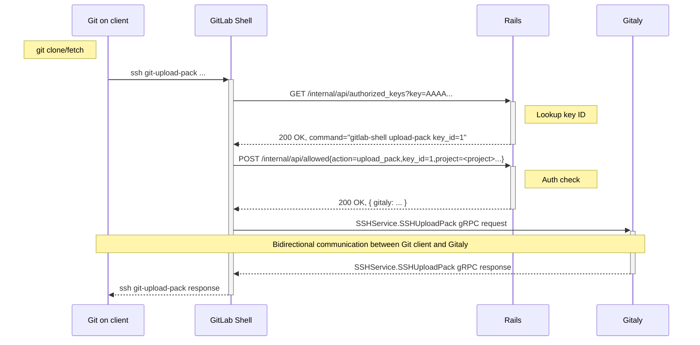
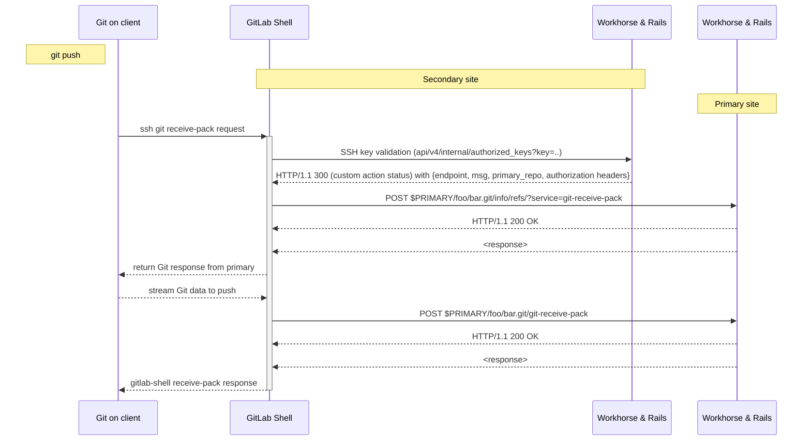
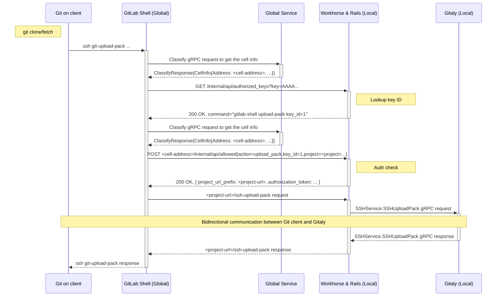
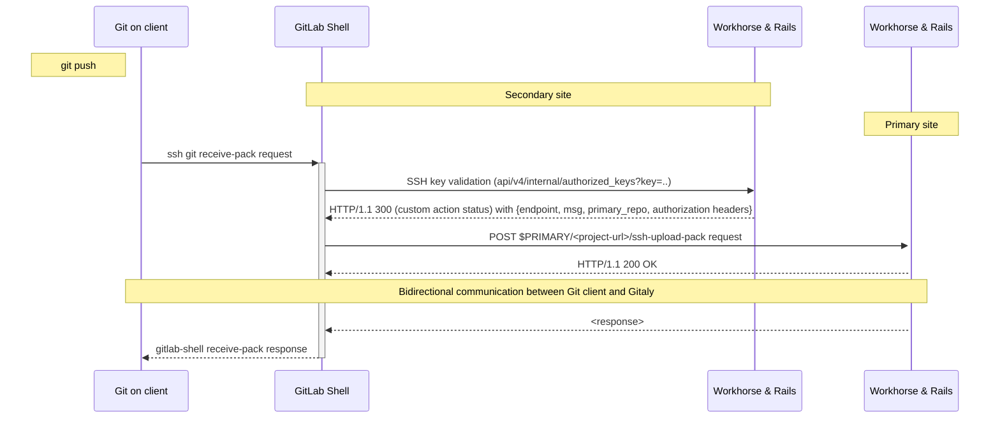

# Routing Git over SSH requests

This document outlines the design goals and architecture of Routing Git over SSH.

## Overview

When a Git operation (`git pull/clone/fetch`, `git push`, `git archive`) is performed via SSH,
[GitLab Shell](https://gitlab.com/gitlab-org/gitlab-shell) processes the request, authorizes the request against GitLab Rails, and
performs a `gRPC` request to Gitaly for bidirectional data exchange between Git and the user:

### Example: Git pull

Gitaly servers [must not](../../../administration/gitaly/configure_gitaly.md#network-architecture)
be exposed to the public internet, as Gitaly network traffic is unencrypted by default.
This restriction makes it challenging to redirect Git over SSH requests to other instances.

### Geo: Git push over SSH to secondary nodes

When `git push` is performed to a secondary node, the request must be rerouted to the primary node.
Because Gitaly servers of the primary node are not exposed, we need to access the public endpoints (Git over SSH, Git over HTTP(S))
in order to redirect the request. As a result, we [opted](https://gitlab.com/groups/gitlab-org/-/epics/8819)
to proxy the Git over SSH request to Git over HTTP(S), translate the Git HTTP(S) response to the one compatible with SSH protocol, and return it to the user.
The final implementation has the following flow:

The solution is good for covering the general case.
However, the subtle differences between SSH and HTTP(S) Git protocols cause [issues](https://gitlab.com/gitlab-org/gitlab-shell/-/issues/751)
in edge-case scenarios and make the solution unreliable and vulnerable to Git upgrades.

### Cells: Route SSH requests to the right cell

With the development of [Cells Architecture](infrastructure/index.md#architecture)
and introduction of its [Routing Service](routing-service.md), a similar challenge is encountered.
When an SSH request is performed, it must be [routed](https://gitlab.com/gitlab-org/gitlab/-/issues/438826)
to the cell that contains the data related to this request.

This is another reason to find a sustainable solution for routing SSH requests.

## Goals

- Find a sustainable solution that reliably covers general cases and edge cases.
- General enough to cover Geo and Cells scenarios and can be used for other similar cases.

## Proposal

We cannot access Gitaly `gRPC` directly, but we can expose the gRPC data via an HTTP Workhorse endpoint. Since `gRPC` is a bidirectional protocol, Workhorse must support bidirectional streaming via HTTP for this endpoint.

- This approach doesn't require Git protocol translation which makes it more reliable.
- The exposed Gitaly RPCs are secured by Workhorse and additional authorization checks.

### Cells

For Cells architecture, GitLab Shell acts as a router and communicates with [Global Service](https://gitlab.com/gitlab-org/gitlab/-/merge_requests/145944) to re-route the request to the correct cell.

### Geo

For Geo architecture, secondary GitLab Shell communicates with secondary Rails in order to re-route the request to the primary.

### Proof of concept

The following MRs introduce minimal changes to demonstrate how `git clone` works when implemented using the described architecture. The main purpose is to verify that GitLab Shell can establish bidirectional communication with Workhorse via HTTP:

- [Create a Workhorse HTTP endpoint that exposes a Gitaly RPC for Git clone via SSH](https://gitlab.com/gitlab-org/gitlab/-/merge_requests/146227).
- [Perform a request to this endpoint from GitLab Shell and send the response to the user](https://gitlab.com/gitlab-org/gitlab-shell/-/merge_requests/969).

### Authentication

Currently, Geo generates a token that is used for the access to the primary node:

- GitLab Rails returns this token in `/allowed` response.
- The token is sent within Git over HTTP(S) request to the primary node.
- The primary node recognizes the token and authorizes the request.

A similar approach can be applied to the proposed solution:

- GitLab Rails returns a token in `/allowed` response.
- The token is sent in a header to `ssh-` HTTP endpoint of Workhorse.
- Workhorse propagates the token to GitLab Rails that recognizes it and authorizes the request.

The mentioned PoC provides an example of how the approach can be implemented:

- GitLab Shell sends to Rails a JWT token that was generated using the shared secret between Shell and Rails.
- GitLab Rails sends this token back in `git_rpc_auth_header` field that can be also used for Geo secret.
- GitLab Shell propagates this token to Workhorse -> GitLab Rails.
- GitLab Rails recognizes this token again and authorizes the request.

The JWT generation requires knowledge of the shared secret, so a user cannot usually generate or intercept this token.

### Bidirectional streaming

Git protocol implies bidirectional communication between a Git server and Git client. `HTTP/1.1` doesn't support bidirectional streaming by default, so we should either:

- Experiment with bidirectional streaming for `HTTP/1.1`. The PoC has a working version by using [`EnableFullDuplex`](https://pkg.go.dev/net/http#ResponseController.EnableFullDuplex) option for a Go server.
- Upgrade the connection and switch the protocols.
- Support HTTP/2 protocol at Workhorse.

The most feasible option from infrastructure perspective must be chosen.
