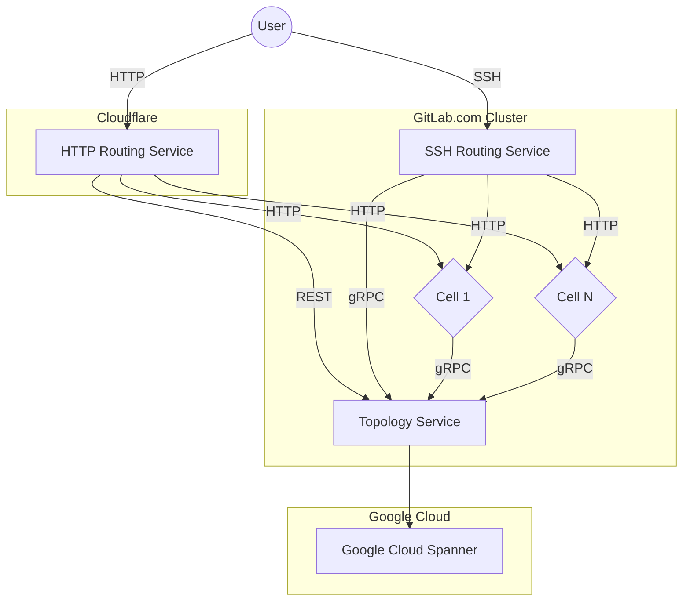
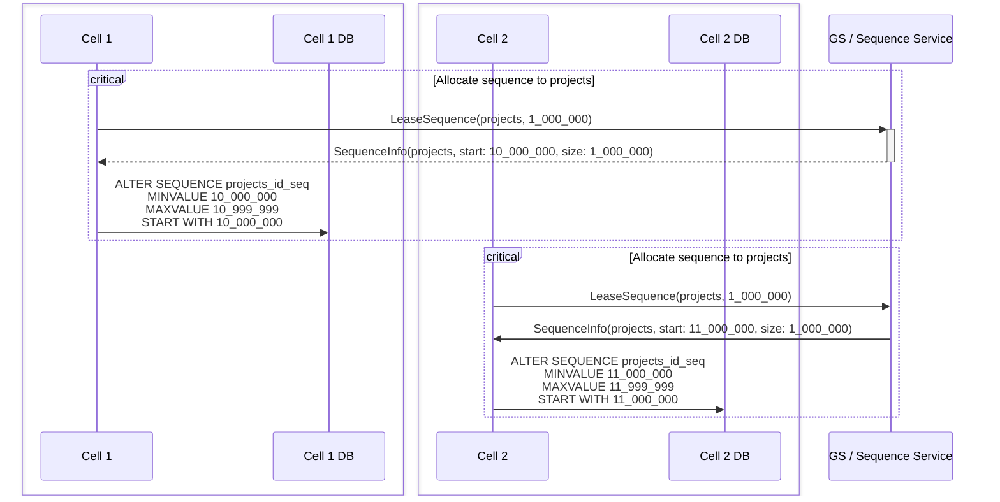
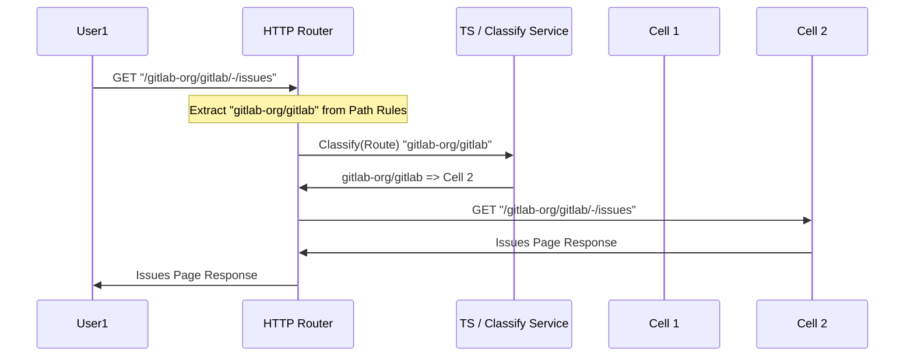
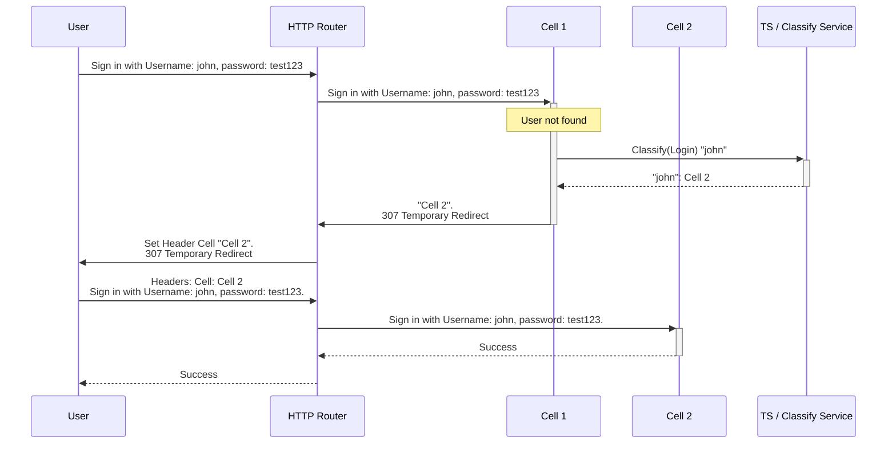
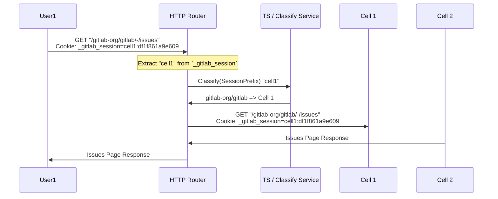
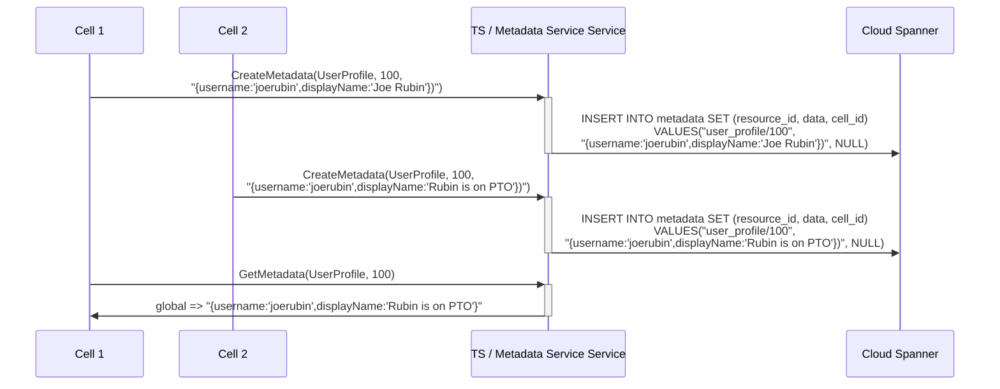
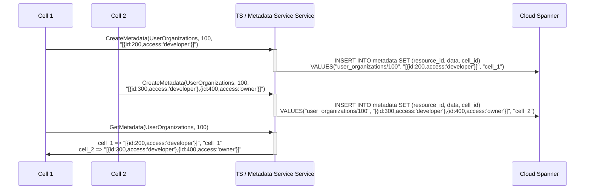
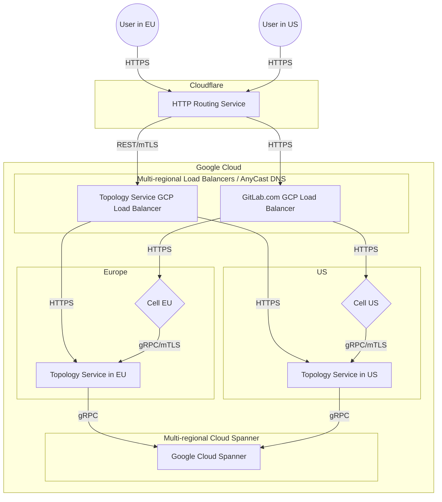

<!-- vale gitlab.FutureTense = NO -->

# Cells: Topology Service

This document describes design goals and architecture of Topology Service
used by Cells.

## Goals

The purpose of Topology Service is to provide essential features for Cells
to operate. The Topology Service will implement a limited set of functions
and serve as an authoritative entity within the Cluster. There's only a single
Topology Service, that can be deployed in many regions.

1. **Technology.**

    The Topology Service will be written in [Go](https://go.dev/)
    and expose API over [gRPC](https://grpc.io/), and REST API.

1. **Cells aware.**

    The Topology Service will contain a list of all Cells. The Topology Service
    will monitor Cells health, and could pass this information down to Cells
    itself or Routing Service. Whether the Cell is healthy will be determined
    by various factors:

    - Watchdog: last time Cell contacted,
    - Failure rate: information gathered from the Routing Service
    - Configuration: Cells explicitly marked as orphaned

1. **Cloud first.**

    The Topology Service will be deployed in Cloud, and use Cloud managed services
    to operate. Those services at later point could be extended with on-premise
    equivalents if required.

    The Topology Service will be written using a dual dialect:

    - GoogleSQL to run at scale for GitLab.com with Cloud Spanner
    - PostgreSQL for use internally and later provide on-premise compatibility.

1. **Small.**

    The Topology Service due to its criticality in architecture will be limited to
    provide only essential functions required for cluster to operate.

## Requirements

| Requirement   | Description                                                                | Priority |
| ------------- | -------------------------------------------------------------------------- | -------- |
| Configurable  | contains information about all Cells                                       | high     |
| Security      | only authorized cells can use it                                           | high     |
| Cloud-managed | can use cloud managed services to operate                                  | high     |
| Latency       | Satisfactory Latency Threshold of 20ms, 99.95% Error SLO, 99.95% Apdex SLO | high     |
| Self-managed  | can be eventually used by [self-managed](goals.md#self-managed)            | low      |
| Regional      | can route requests to different [regions](goals.md#regions)                | low      |

## Non-Goals

Those Goals are outside of the Topology Service scope as they heavily inflate the complexity:

- The Topology Service will not provide indexing of the user-facing information for Cells.
  Example: CI Catalog to show data available cluster-wide will have to use another means
  to merge the information from all Cells.
- The Topology Service has no knowledge of the business logic of GitLab.
  In theory it can work with any other web application that has the same authentication/access
  tokens as GitLab. However, this is subject to change as part of implementation.

## Architecture

The Topology Service implements the following design guidelines:

- Topology Service implements only a few gRPC services.
- Some services due to backward compatibility are additionally exposed with REST API.
- Topology Service does not perform complex processing of information.
- Topology Service does not aggregate information from Cells.



### Configuration

The Topology Service will use `config.toml` to configure all service parameters.

#### List of Cells

```toml
[[cells]]
id = 1
address = "cell-us-1.gitlab.com"
session_prefix = "cell1:"
```

### Sequence Service

```proto
message LeaseSequenceRequest {
  string uuid = 3;
  string table_name = 1;
  int64 block_size = 2;
}

service SequenceService {
  rpc ValidateSequence(ValidateSequenceRequest) returns (ValidateSequenceResponse) {}
  rpc LeaseSequence(LeaseSequenceRequest) returns (LeaseSequenceRequest) {}
  rpc ReleaseSequence(ReleaseSequenceRequest) returns (ReleaseSequenceRequest) {}
}
```

The purpose of this service is to be the global allocator of [Database Sequences](decisions/008_database_sequences.md).

#### Sequence Allocation workflow

Sequences will be allocated once, at the Cell provisioning.



### Claim Service

```proto
enum ClaimType {
    Unknown = 0;
    Routes = 1;
};

message ClaimInfo {
    int64 id = 1;
    ClaimType claim_type = 2;
    string claim_value = 3;
    ...
}

service ClaimService {
    rpc CreateClaim(CreateClaimRequest) returns (CreateClaimResponse) {}
    rpc GetClaims(GetClaimsRequest) returns (GetClaimsResponse) {}
    rpc DestroyClaim(DestroyClaimRequest) returns (DestroyClaimResponse) {}
}
```

The purpose of this service is to provide a way to enforce uniqueness (ex. usernames, e-mails,
tokens) within the cluster.

#### Example usage of Claim Service in Rails

```ruby
class User < MainClusterwide::ApplicationRecord
  include CellsUniqueness

  cell_cluster_unique_attributes :username,
   sharding_key_object: -> { self },
   claim_type: Gitlab::Cells::ClaimType::Usernames,
 owner_type: Gitlab::Cells::OwnerType::User

  cell_cluster_unique_attributes :email,
   sharding_key_object: -> { self },
   claim_type: Gitlab::Cells::ClaimType::Emails,
 owner_type: Gitlab::Cells::OwnerType::User
end
```

The `CellsUniqueness` concern will implement `cell_cluster_unique_attributes`.
The concern will register before and after hooks to call Topology Service gRPC
endpoints for Claims within a transaction.

### Classify Service

```proto
enum ClassifyType {
    Route = 1;
    Login = 2;
    SessionPrefix = 3;
}

message ClassifyRequest {
    ClassifyType type = 2;
    string value = 3;
}

service ClassifyService {
    rpc Classify(ClassifyRequest) returns (ClassifyResponse) {
        option (google.api.http) = {
            get: "/v1/classify"
        };
    }
}
```

The purpose of this service is find owning cell of a given resource by string value.
Allowing other Cells, HTTP Routing Service and SSH Routing Service to find on which Cell
the project, group or organization is located.

#### Path Classification workflow with Classify Service



#### User login workflow with Classify Service



The sign-in request going to Cell 1 might at some point later be round-rubin routed to all Cells,
as each Cell should be able to classify user and redirect it to correct Cell.

#### Session cookie classification workflow with Classify Service



The session cookie will be validated with `session_prefix` value.

### Metadata Service (**future**, implemented for Cells 1.5)

The Metadata Service is a way for Cells to distribute information cluster-wide:

- metadata is defined by the `resource_id`
- metadata can be owned by all Cells (each Cell can modify it), or owned by a Cell (only Cell can modify the metadata)
- get request returns all metadata for a given `resource_id`
- the metadata structure is owned by the application, it is strongly preferred to use protobuf to encode information due to multi-version compatibility
- metadata owned by Cell is to avoid having to handle race conditions of updating a shared resource

The purpose of the metadata is to allow Cells to own a piece of distributed information,
and allow Cells to merge the distributed information.

Example usage for different owners:

- owned by all Cells: a user profile metadata is published representing the latest snapshot of a user publicly displayable information.
- owner by Cell: a list of organizations to which user belongs is owned by the Cell (a distributed information), each Cell can get all metadata shared by other Cells and aggregate it.

```proto
enum MetadataOwner {
    Global = 1; // metadata is shared and any Cell can overwrite it
    Cell = 2; // metadata is scoped to Cell, and only Cell owning metadata can overwrite it
}

enum MetadataType {
    UserProfile = 1; // a single global user profile
    UserOrganizations = 2; // a metadata provided by each Cell individually
    OrganizationProfile = 3; // a single global organization information profile
}

message ResourceID {
    ResourceType type = 1;
    int64 id = 2;
};

message MetadataInfo {
    bytes data = 1;
    MetadataOwner owner = 2;
    optional CellInfo owning_cell = 3;
};

message CreateMetadataRequest {
    string uuid = 1;
    ResourceID resource_id = 2;
    MetadataOwner owner = 3;
    bytes data = 4;
};

message GetMetadataRequest {
    ResourceID resource_id = 1;
};

message GetMetadataResponse {
    repeated MetadataInfo metadata = 1;
};

service MetadataService {
    rpc CreateMetadata(CreateMetadataRequest) returns (CreateaMetadataResponse) {}
    rpc GetMetadata(GetMetadataRequest) returns (GetMetadataResponse) {}
    rpc DestroyMetadata(DestroyMetadataRequest) returns (DestroyMetadataResponse) {}
}
```

#### Example: User profile published by a Cell



#### Example: Globally accessible list of Organizations to which user belongs



## Reasons

1. Provide stable and well described set of cluster-wide services that can be used
   by various services (HTTP Routing Service, SSH Routing Service, each Cell).
1. As part of Cells 1.0 PoC we discovered that we need to provide robust classification API
   to support more workflows than anticipated. We need to classify various resources
   (username for login, projects for SSH routing, etc.) to route to correct Cell.
   This would put a lot of dependency on resilience of the First Cell.
1. It is our desire long-term to have Topology Service for passing information across Cells.
   This does a first step towards long-term direction, allowing us to much easier perform
   additional functions.

## Spanner

[Spanner](https://cloud.google.com/spanner) will be a new data store introduced into the GitLab Stack, the reasons we are going with Spanner are:

1. It supports Multi-Regional read-write access with a lot less operations when compared to PostgreSQL helping with out [regional DR](../disaster_recovery/index.md)
1. The data is read heavy not write heavy.
1. Spanner provides [99.999%](https://cloud.google.com/spanner/sla) SLA when using Multi-Regional deployments.
1. Provides consistency whilst still being globally distributed.
1. Shards/[Splits](https://cloud.google.com/spanner/docs/schema-and-data-model#database-splits) are handled for us.

The cons of using Spanners are:

1. Vendor lock-in, our data will be hosted in a proprietary data.
    - How to prevent this: Topology Service will use generic SQL.
1. Not self-managed friendly, when we want to have Topology Service available for self-managed customers.
    - How to prevent this: Spanner supports PostgreSQL dialect.
1. Brand new data store we need to learn to operate/develop with.

### GoogleSQL vs PostgreSQL dialects

Spanner supports two dialects one called [GoogleSQL](https://cloud.google.com/spanner/docs/reference/standard-sql/overview) and [PostgreSQL](https://cloud.google.com/spanner/docs/reference/postgresql/overview).
The dialect [doesn't change the performance characteristics of Spanner](https://cloud.google.com/spanner/docs/postgresql-interface#choose), it's mostly how the Database schemas and queries are written.
Choosing a dialect is a one-way door decision, to change the dialect we'll have to go through a data migration process.

We will use the `GoogleSQL` dialect for the Topology Service, and [go-sql-spanner](https://github.com/googleapis/go-sql-spanner) to connect to it, because:

1. Using Go's standard library `database/sql` will allow us to swap implementations which is needed to support self-managed.
1. GoogleSQL [data types](https://cloud.google.com/spanner/docs/reference/standard-sql/data-types) are narrower and don't allow to make mistakes for example choosing int32 because it only supports int64.
1. New features seem to be released on GoogleSQL first, for example, <https://cloud.google.com/spanner/docs/ml>. We don't need this feature specifically, but it shows that new features support GoogleSQL first.
1. A more clear split in the code when we are using Google Spanner or native PostgreSQL, and won't hit edge cases.

Citations:

1. Google (n.d.). _PostgreSQL interface for Spanner._ Google Cloud. Retrieved April 1, 2024, from <https://cloud.google.com/spanner/docs/postgresql-interface>
1. Google (n.d.). _Dialect parity between GoogleSQL and PostgreSQL._ Google Cloud. Retrieved April 1, 2024, from <https://cloud.google.com/spanner/docs/reference/dialect-differences>

### Multi-Regional

Running Multi-Regional read-write is one of the biggest selling points of Spanner.
When provisioning an instance you can choose single Region or Multi-region.
After provisioning you can [move an instance](https://cloud.google.com/spanner/docs/move-instance) whilst is running but this is a manual process that requires assistance from GCP.

We will provision a Multi-Regional Cloud Spanner instance because:

1. Won't require migration to Multi-Regional in the future.
1. Have Multi Regional on day 0 which cuts the scope of multi region deployments at GitLab.

This will however increase the cost considerably, using public facing numbers from GCP:

1. [Regional](https://cloud.google.com/products/calculator?hl=en&dl=CiRlMjU0ZDQyMy05MmE5LTRhNjktYjUzYi1hZWE2MjQ4N2JkNDcQIhokOTlGQUM4RjUtNjdBRi00QTY1LTk5NDctNThCODRGM0ZFMERC): $1,716
1. [Multi Regional](https://cloud.google.com/products/calculator?hl=en&dl=CiQzNjc2ODc5My05Y2JjLTQ4NDQtYjRhNi1iYzIzODMxYjRkYzYQIhokOTlGQUM4RjUtNjdBRi00QTY1LTk5NDctNThCODRGM0ZFMERC): $9,085

Citations:

1. Google (n.d.). _Regional and multi-region configurations._ Google Cloud. Retrieved April 1, 2024, from <https://cloud.google.com/spanner/docs/instance-configurations>
1. Google (n.d.). FeedbackReplication. Google Cloud. Retrieved April 1, 2024, from <https://cloud.google.com/spanner/docs/replication>

#### Architecture of multi-regional deployment of Topology Service



### Performance

We haven't run any benchmarks ourselves because we don't have a full schema designed.
However looking at the [performance documentation](https://cloud.google.com/spanner/docs/performance), both the read and write throughput of a Spanner instance scale linearly as you add more compute capacity.

### Alternatives

1. PostgreSQL: Having a multi-regional deployment requires a lot of operations.
1. ClickHouse: It's an `OLAP` database not an `OLTP`.
1. Elasticsearch: Search and analytics document store.

## Disaster Recovery

We must stay in our [Disaster Recovery targets](../disaster_recovery/index.md#dr-implementation-targets) for the Topology Service.
Ideally, we need smaller windows for recovery because this service is in the critical path.

The service is stateless, which should be much easier to deploy to multiple regions using [runway](https://gitlab.com/groups/gitlab-com/gl-infra/-/epics/1206).
The state is stored in Cloud Spanner, the state consists of database sequences, projects, username, and anything we need to keep global uniqueness in the application.
This data is critical, and if we loose this data we won't be able to route requests accordingly or keep global uniqueness to have the ability to move data between cells in the future.
For this reason we are going to set up [Multi-Regional read-write deployment](#multi-regional) for Cloud Spanner so even if a region goes down, we can still read-write to the state.

Cloud Spanner provides 3 ways of recovery:

1. [Backups](https://cloud.google.com/spanner/docs/backup): A backup of a database _inside_ of the instance. You can copy the backup to another instance but this requires an instance [of the same size of storage](https://cloud.google.com/spanner/docs/backup/copy-backup#prereqs) which can 2x the costs.
    One concern with using backups is if the instance gets deleted by mistake (even with [deletion protection](https://cloud.google.com/spanner/docs/prevent-database-deletion))
1. [Import/Export](https://cloud.google.com/spanner/docs/import-export-overview): Export the database as a [medium priority](https://cloud.google.com/spanner/docs/cpu-utilization#task-priority) task inside of Google Cloud Storage.
1. [Point-in-time recovery](https://cloud.google.com/spanner/docs/pitr): Version [retention period](https://cloud.google.com/spanner/docs/use-pitr#set-period) up to 7 days, this can help with recovery of a [portion of the database](https://cloud.google.com/spanner/docs/use-pitr#recover-portion) or create a backup/restore from a specific time to [recover the full database](https://cloud.google.com/spanner/docs/use-pitr#recover-entire).
    Increasing the retention period does have [performance implications](https://cloud.google.com/spanner/docs/pitr#performance)

As you can see all these options only handle the data side, not the storage/compute side, this is because storage/compute is managed for us.
This means our Disaster Recovery plan should only account for potential logical application errors where it deletes/logically corrupts the data.

These require testing, and validation but to have all the protection we can have:

1. Import/Export: Daily
1. Backups: Hourly
1. Point-in-time recovery: Retention period of 2 days.

On top of those backups we'll also make sure:

1. We have [database deletion protection](https://cloud.google.com/spanner/docs/prevent-database-deletion#enable) on.
1. Make sure the application user doesn't have `spanner.database.drop` IAM.
1. The Import/Export bucket will have [bucket lock](https://cloud.google.com/storage/docs/bucket-lock) configured to prevent deletion.

Citations:

1. Google (n.d.). _Choose between backup and restore or import and export._ Google Cloud. Retrieved April 2, 2024, from <https://cloud.google.com/spanner/docs/backup/choose-backup-import>

## FAQ

1. Does Topology Service implement all services for Cells 1.0?

    No, for Cells 1.0 Topology Service will implement `ClaimService` and `ClassifyService` only.
    Due to complexity the `SequenceService` will be implemented by the existing Cell of the cluster.
    The reason is to reduce complexity of deployment: as we would only add a function to the first cell.
    We would add new feature, but we would not change "First Cell" behavior. At later point
    the Topology Service will take over that function from First Cell.

1. How we will push all existing claims from "First Cell" into Topology Service?

    We would add `rake gitlab:cells:claims:create` task. Then we would configure First Cell
    to use Topology Service, and execute the Rake task. That way First Cell would claim all new
    records via Topology Service, and concurrently we would copy data over.

1. How and where the Topology Service will be deployed?

    We will use [Runway](https://handbook.gitlab.com/handbook/engineering/infrastructure/platforms/tools/runway/),
    and configure Topology Service to use [Spanner](https://cloud.google.com/spanner) for data storage.

1. How Topology Service handle regions?

    We anticipate that [Spanner](https://cloud.google.com/spanner) will provide regional database support,
    with high-performance read access. In such case the Topology Service will be run in each region
    connected to the same multi-write database. We anticipate one Topology Service deployment per-region
    that might scale up to desired number of replicas / pods based on the load.

1. Will Topology Service information be encrypted at runtime?

    This is yet to be defined. However, Topology Service could encrypt customer sensitive information
    allowing for the information to be decrypted by the Cell that did create that entry. Cells could
    transfer encrypted/hashed information to Topology Service making the Topology Service to only store
    metadata without the knowledge of information.

1. Will Topology Service data to be encrypted at rest?

    This is yet to be defined. Data is encrypted during transport (TLS/gRPC and HTTPS)
    and at rest by Spanner.

## Links

- [Cells 1.0](iterations/cells-1.0.md)
- [Routing Service](http_routing_service.md)

### Topology Service discussions

- [Topology Service PoC](https://gitlab.com/gitlab-org/tenant-scale-group/pocs/global-service)
- [Topology Service Fastboot Presentation](https://docs.google.com/presentation/d/12NlfOwolRf10DSLszQi9NjxFy0UUKc2XVC2kYW0HFGk/edit#slide=id.g2cd2d29ce3d_0_147)
- [Topology Service Fastboot Agenda](https://docs.google.com/document/d/1fTeiS6ksvhxJggui_DnCZ9tl5xIN23IZGrqgiqzB5JU/edit#heading=h.24quiflbyl2c)
