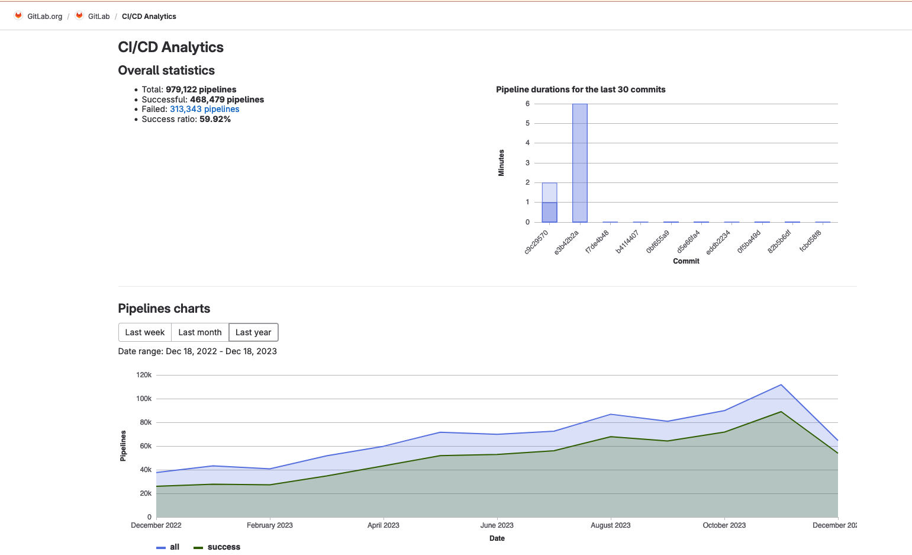

# CI Insights

## Summary

As part of the Fleet Metrics, we would like to have a section dedicated to CI insights to help users monitor pipelines and summarize findings about pipelines speed, common job failures and more. It would eventually offer actionables to help users optimize and fix issues with their CI/CD.

## Motivation

We have a [page for CI/CD Analytics](https://gitlab.com/gitlab-org/gitlab/-/pipelines/charts?chart=pipelines) that contain some very basic analytics on pipelines. Most of this information relates to the **total** number of pipelines over time, which does not give any real value to customers: projects will always see an increase of pipelines number over time, so the total number of pipelines is of little consequence.



Because this page lacks real insights, it makes understanding pipelines slowdowns or failures hard to track and becomes a very manual task. We want to empower users to optimize their workflow in a centralized place to avoid all of the manual labor associated with either querying the API for data and then manually parsing it or navigating the UI through dozens of pages utils the insights or action required can be found.

As we are going to process large quantities of data relating to a proejct pipelines, there is potential to eventually summarize findings with an AI tool to give insights into job failures, pipeline slowdowns and flaky specs. As AI has become a crucial part of our product roadmap and Verify lacks any promising lead in that area, this page could be the center of this new addition.

- Deliver a new Pipelines Analysis Dashbord page
- Have excellent data visualization to help digest information quickly
- Flexible querying to let users get the information they want

- Clear actionables based on information presented in the page
- Show some default information on landing like pipelines duration over time and slowest jobs
- Make the CI/CD Analytics more accessible, liked and remembered (AKA, more page views)

### Non-Goals

We do not aim to improve the GitLab project's pipeline speed. This feature could help us achieve this, but it is not a direct objective of this blueprint.

We also are not aiming to have AI in the first iteration and should instead focus on making as much information available and disgestible as possible.

## Proposal

Revamp the [page for CI/CD Analytics](https://gitlab.com/gitlab-org/gitlab/-/pipelines/charts?chart=pipelines) to include more meaningful data so that users can troubleshoot their pipelines with ease. Here is a list of the main improvements:

### Overall statistics

The current "overall statistics" will become a one line header in a smaller font to keep this information available, but without taking as much visual space. For the pipelines chart, we will replace it with a stacked bar plot where each stack of a bar represents a status and each bar is a unit (in days, a day, in month a month and in years, a year) so users can keep track of how many pipelines ran in that specific unit of time and what percent of these pipelines ended up in failling or succeeding.

### Pipeline duration graph

A new pipeline duration graph that can be customized by type (MR pipelines, pipeline on a specific branch, etc), number of runs and status (success, failed, etc) and will replace the current `Pipeline durations for the last 30 commits` chart. The existing chart checks the latest 30 commits made on the repository with no filtering so the results presented are not very valuable.

We also add jobs that failed multiple times and jobs that are the slowest in the last x pipelines on master. All of this is to support the effort of allowing users to query their pipelines data to figure out what they need to improve on or what kind of problems they are facing with their CI/CD configuration.

### Visibility

Add a link in the `pipelines` page to increase the visibility of this feature. We can add a new option with the `Run pipeline` primary button.

### Master Broken

Add a "Is master broken?" quick option that scans the last x pipelines on the main branch and check for failed jobs. All jobs that failed multiple times will be listed in a table with the option to create an incident from that list.

### Color scheme

Rethink our current color schemes for data visuliaztion when it comes to pipelines statuses. We currently use the default visualization colors, but they don't actually match with that colors user have grown accustomed to for pipeline/jobs statuses. There is an opportunity here to help user better understand their data through more relevant color schemes and better visualization.

### Routing

Change the routing from `pipelines/charts` to `pipelines/analytics` since `charts` is a really restrictive terminology when talking about data visualization. It also doesn't really convey what this page is, which is a way to get information, not just nice charts. Then we can also get rid of the query parameter for the tabs and instead support first-class routing.

## Design and implementation details

### New API for aggregated data

This feature depends on having a new set of data available to us that aggregates jobs and pipelines insights and make them available to the client.

We'll start by aggregating data from ClickHouse, and probably only for `gitlab.com`, as the MVC. We will aggregate the data on the backend on the fly. So far ClickHouse has been very capable of such things.

We won't store the aggregated data anywhere (we'll probably have the materialized views in ClickHouse, but nothing more complex). Then if the features get traction, we can explore ways to bring these features to environments without ClickHouse

This way we can move fast, test our ideas with real users, and get feedback.

### Feature flag

To develop this new analytic page, we will gate the new page behind a feature flag `ci_insights`, and conditionally render the old or new analytics page. Potentially, we could even add the flag on the controller to decide which route to render: the new `/analytic` when the flag is one, and the old `/charts` when it isn't.

### Add analytics on page view

Make sure that we can get information on how often this page is viewed. If we do not have it, then let's implment some to know how visible this page is. The changes to this section should make the view count go up and we want to track this as a measure of success.

### Routing

We are planning to have new routes for the page and some redicts to set up. To read more about the routing proposal, see the [related issue](https://gitlab.com/gitlab-org/gitlab/-/issues/437556)

### Pipelines duration graph

We want a way for user to query data about pipelines with a lot of different criterias. Most notably, query for only pipelines with the scope `finished` or by status `success` or `failed`. There is also the possibility to scope this to a ref, so users could either test for the main branch or maybe even a branch that has introduced a CI/CD change. We want branch comparaison for pipeline speed.

To get more accurate data, we want to increase the count of pipelines requested. In graphQL, we have a limit of 100 items and we will probably get performance degradations quite quickly. We need to define how we could get more data set for more accurate data visualization.

### Jobs insights

Currently, there is no way to query a single job across multiple pipelines and it prevent us from doing a query that would look like this:

```graphql
query getJob($projectPath: ID!, $jobName: String!){
  project(fullPath:$projectPath){
    job(name: $jobName, last: 100){
      nodes{
        id
        duration
      }
    }
  }
}
```

There are plans to create a new unified table to log job analytics and it is not yet defined what this API will look like. Without comitting yet to an API definiton, we want so unified way to query information for nalytics that may look rougly like so:

```ruby
get_jobs(project_id:, job_name: nil, stage: nil, stage_index: nil, *etc)
# >
[{id: 1, duration: 134, status: 'failed'}, *etc] 

get_jobs_statistics(project_id, job_name:, *etc)
# >
[{time_bucket: '2024-01-01:00:00:00', avg_duration: 234, count: 123, statuses_count: {success: 123, failed: 45, cancelled: 45}}]
```

### Revamping our charts

Explore new color scheme and nicer look on our charts. Colaborate with UX to determine whether this is something we had on our mind or not and support any iniative to have nicer, more modern looking charts as our charts are quite forgettable.

## Alternative Solutions

### New page

We could create a brand new page and leave this section as it is. The pro would be that we could perhaps have a more prominent placement in the Navigation under `Build`, while the cons are that we'd have clear overlap with the section.

### Pipeline analysis per pipeline

There was an [experiment](https://gitlab.com/gitlab-org/gitlab/-/issues/365902) in the past to add performance insights **per pipeline**. The experiment was removed and deemed not viable. Some of the findings were that:

- Users did not interact with the page as much as thought and would not click on the button to view insights
- Users who did click on the button did not try to get more insights into a job.
- Users did not leave feedback in the issue.

This experiment reveals to us mostly that users who go on the pipeline graph page `pipelines/:id` are **not** trying to imrpove the performance of pipelines. Instead, it is most likely that this page is used to debug pipeline failures, which means that they are from the IC/developer persona, not the DevOps engineer trying to improve the workflow. By having this section in a more "broad" area, we expect a much better adoption and more useful actionables.

### Do nothing

We could leave this section untouched and not add any new form of analytics. The pro here would be the saved resources and time. The cons are that we currently have no way to help customers improve their CI/CD configurations speed except reading our documentation. This revamped section would also be a great gateway for AI features and help user iteration on their setup.
