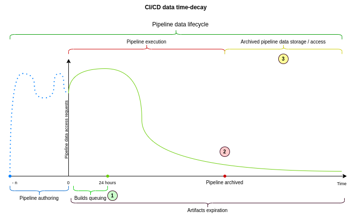
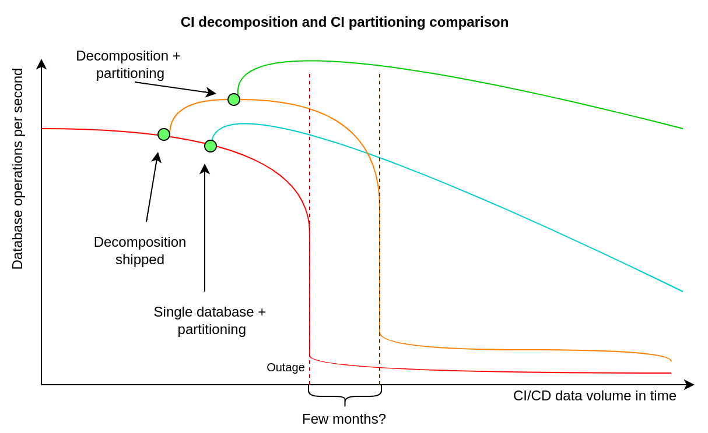
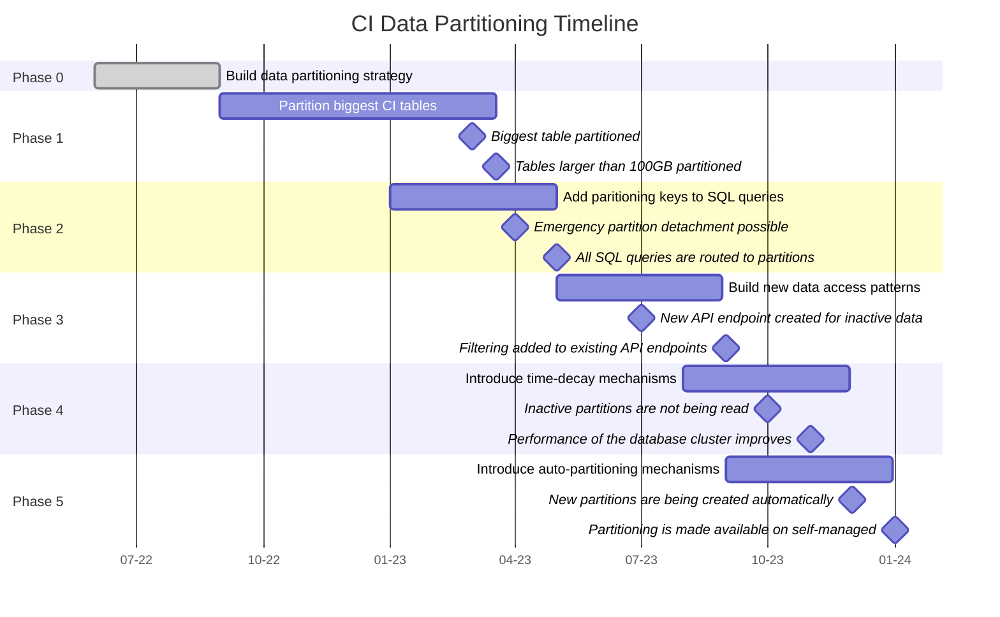

<!-- vale gitlab.FutureTense = NO -->

# Pipeline data partitioning design

## What problem are we trying to solve?

We want to partition the CI/CD dataset, because some of the database tables are
extremely large, which might be challenging in terms of scaling single node
reads, even after we ship the CI/CD database decomposition.

We want to reduce the risk of database performance degradation by transforming
a few of the largest database tables into smaller ones using PostgreSQL
declarative partitioning.

See more details about this effort in [the parent blueprint](index.md).



## How are CI/CD data decomposition, partitioning, and time-decay related?

CI/CD decomposition is an extraction of a CI/CD database cluster out of the
"main" database cluster, to make it possible to have a different primary
database receiving writes. The main benefit is doubling the capacity for writes
and data storage. The new database cluster will not have to serve reads /
writes for non-CI/CD database tables, so this offers some additional capacity
for reads too.

CI/CD partitioning is dividing large CI/CD database tables into smaller ones.
This will improve reads capacity on every CI/CD database node, because it is
much less expensive to read data from small tables, than from large
multi-terabytes tables. We can add more CI/CD database replicas to better
handle the increase in the number of SQL queries that are reading data, but we
need partitioning to perform a single read more efficiently. Performance in
other aspects will improve too, because PostgreSQL will be more efficient in
maintaining multiple small tables than in maintaining a very large database
table.

CI/CD time-decay allows us to benefit from the strong time-decay
characteristics of pipeline data. It can be implemented in many different ways,
but using partitioning to implement time-decay might be especially beneficial.
When implementing a time decay we usually mark data as archived, and migrate it
out of a database to a different place when data is no longer relevant or
needed. Our dataset is extremely large (tens of terabytes), so moving such a
high volume of data is challenging. When time-decay is implemented using
partitioning, we can archive the entire partition (or set of partitions) by
updating a single record in one of our database tables. It is one of the
least expensive ways to implement time-decay patterns at a database level.



## Why do we need to partition CI/CD data?

We need to partition CI/CD data because our database tables storing pipelines,
builds, and artifacts are too large. The `ci_builds` database table size is
currently around 2.5 TB with an index of around 1.4 GB. This is too much and
violates our [principle of 100 GB max size](../database_scaling/size-limits.md).
We also want to [build alerting](https://gitlab.com/gitlab-com/gl-infra/tamland/-/issues/5)
to notify us when this number is exceeded.

Large SQL tables increase index maintenance time, during which freshly deleted tuples
cannot be cleaned by `autovacuum`. This highlight the need for small tables.
We will measure how much bloat we accumulate when (re)indexing huge tables. Base on this analysis,
we will be able to set up SLO (dead tuples / bloat), associated with (re)indexing.

We've seen numerous S1 and S2 database-related production environment
incidents, over the last couple of months, for example:

- S1: 2022-03-17 [Increase in writes in `ci_builds` table](https://gitlab.com/gitlab-com/gl-infra/production/-/issues/6625)
- S1: 2021-11-22 [Excessive buffer read in replicas for `ci_job_artifacts`](https://gitlab.com/gitlab-com/gl-infra/production/-/issues/5952)
- S2: 2022-04-12 [Transactions detected that have been running for more than 10m](https://gitlab.com/gitlab-com/gl-infra/production/-/issues/6821)
- S2: 2022-04-06 [Database contention plausibly caused by excessive `ci_builds` reads](https://gitlab.com/gitlab-com/gl-infra/production/-/issues/6773)
- S2: 2022-03-18 [Unable to remove a foreign key on `ci_builds`](https://gitlab.com/gitlab-com/gl-infra/production/-/issues/6642)
- S2: 2022-10-10 [The `queuing_queries_duration` SLI apdex violating SLO](https://gitlab.com/gitlab-com/gl-infra/production/-/issues/7852#note_1130123525)

We have approximately 50 `ci_*` prefixed database tables, and some of them
would benefit from partitioning.

A simple SQL query to get this data:

```sql
WITH tables AS (SELECT table_name FROM information_schema.tables WHERE table_name LIKE 'ci_%')
  SELECT table_name,
    pg_size_pretty(pg_total_relation_size(quote_ident(table_name))) AS total_size,
    pg_size_pretty(pg_relation_size(quote_ident(table_name))) AS table_size,
    pg_size_pretty(pg_indexes_size(quote_ident(table_name))) AS index_size,
    pg_total_relation_size(quote_ident(table_name)) AS total_size_bytes
  FROM tables ORDER BY total_size_bytes DESC;
```

See data from March 2022:

| Table name              | Total size | Index size |
|-------------------------|------------|------------|
| `ci_builds`             | 3.5 TB     | 1 TB       |
| `ci_builds_metadata`    | 1.8 TB     | 150 GB     |
| `ci_job_artifacts`      | 600 GB     | 300 GB     |
| `ci_pipelines`          | 400 GB     | 300 GB     |
| `ci_stages`             | 200 GB     | 120 GB     |
| `ci_pipeline_variables` | 100 GB     | 20 GB      |
| (...around 40 more)     |            |            |

Based on the table above, it is clear that there are tables with a lot of
stored data.

While we have almost 50 CI/CD-related database tables, we are initially
interested in partitioning only 6 of them. We can start by partitioning the
most interesting tables in an iterative way, but we also should have a strategy
for partitioning the remaining ones if needed. This document is an attempt to
capture this strategy, describe as many details as possible, to share this
knowledge among engineering teams.

## How do we want to partition CI/CD data?

We want to partition the CI/CD tables in iterations. It might not be feasible
to partition all of the 6 initial tables at once, so an iterative strategy
might be necessary. We also want to have a strategy for partitioning the
remaining database tables when it becomes necessary.

It is also important to avoid large data migrations. We store almost 6
terabytes of data in the biggest CI/CD tables, in many different columns and
indexes. Migrating this amount of data might be challenging and could cause
instability in the production environment. Due to this concern, we've developed
a way to attach an existing database table as a partition zero without downtime
and excessive database locking, what has been demonstrated in one of the
[first proofs of concept](https://gitlab.com/gitlab-org/gitlab/-/merge_requests/80186).
This makes creation of a partitioned schema possible without a downtime (for
example using a routing table `p_ci_pipelines`), by attaching an existing
`ci_pipelines` table as partition zero without exclusive locking. It will be
possible to use the legacy table as usual, but we can create the next partition
when needed and the `p_ci_pipelines` table will be used for routing queries. To
use the routing table we need to find a good partitioning key.

Our plan is to use logical partition IDs. We want to start with the
`ci_pipelines` table and create a `partition_id` column with a `DEFAULT` value
of `100` or `1000`. Using a `DEFAULT` value avoids the challenge of backfilling
this value for every row. Adding a `CHECK` constraint prior to attaching the
first partition tells PostgreSQL that we've already ensured consistency and
there is no need to check it while holding an exclusive table lock when
attaching this table as a partition to the routing table (partitioned schema
definition). We will increment this value every time we create a new partition
for `p_ci_pipelines`, and the partitioning strategy will be `LIST`
partitioning.

We will also create a `partition_id` column in the other initial 6 database
tables we want to iteratively partition. After a new pipeline is created, it
will get a `partition_id` assigned, and all the related resources, like builds
and artifacts, will share the same value. We want to add the `partition_id`
column into all 6 problematic tables because we can avoid backfilling this data
when we decide it is time to start partitioning them.

We want to partition CI/CD data iteratively. We plan to start with the
`ci_builds_metadata` table, because this is the fastest growing table in the CI
database and want to contain this rapid growth. This table has also the most
simple access patterns - a row from it is being read when a build is exposed to
a runner, and other access patterns are relatively simple too. Starting with
`p_ci_builds_metadata` will allow us to achieve tangible and quantifiable
results earlier, and will become a new pattern that makes partitioning the
largest table possible. We will partition builds metadata using the `LIST`
partitioning strategy.

Once we have many partitions attached to `p_ci_builds_metadata`, with many
`partition_ids` we will choose another CI table to partition next. In that case
we might want to use `RANGE` partitioning in for that next table because
`p_ci_builds_metadata` will already have many physical partitions, and
therefore many logical `partition_ids` will be used at that time. For example,
if we choose `ci_builds` as the next partitioning candidate, after having
partitioned `p_ci_builds_metadata`, it will have many different values stored
in `ci_builds.partition_id`. Using `RANGE` partitioning in that case might be
easier.

Physical partitioning and logical partitioning will be separated, and a
strategy will be determined when we implement physical partitioning for the
respective database tables. Using `RANGE` partitioning works similarly to using
`LIST` partitioning in database tables, but because we can guarantee continuity
of `partition_id` values, using `RANGE` partitioning might be a better
strategy.

### Multi-project pipelines

Parent-child pipeline will always be part of the same partition because child
pipelines are considered a resource of the parent pipeline. They can't be
viewed individually in the project pipeline list page.

On the other hand, multi-project pipelines can be viewed in the pipeline list page.
They can also be accessed from the pipeline graph as downstream/upstream links
when created via the `trigger` token or the API using a job token.
They can also be created from other pipelines by using trigger tokens, but in this
case we don't store the source pipeline.

While partitioning `ci_builds` we need to update the foreign keys to the
`ci_sources_pipelines` table:

```plain
Foreign-key constraints:
    "fk_be5624bf37" FOREIGN KEY (source_job_id) REFERENCES ci_builds(id) ON DELETE CASCADE
    "fk_d4e29af7d7" FOREIGN KEY (source_pipeline_id) REFERENCES ci_pipelines(id) ON DELETE CASCADE
    "fk_e1bad85861" FOREIGN KEY (pipeline_id) REFERENCES ci_pipelines(id) ON DELETE CASCADE
```

A `ci_sources_pipelines` record references two `ci_pipelines` rows (parent and
the child). Our usual strategy has been to add a `partition_id` to the
table, but if we do it here we will force all multi-project
pipelines to be part of the same partition.

We should add two `partition_id` columns for this table, a
`partition_id` and a `source_partition_id`:

```plain
Foreign-key constraints:
    "fk_be5624bf37" FOREIGN KEY (source_job_id, source_partition_id) REFERENCES ci_builds(id, source_partition_id) ON DELETE CASCADE
    "fk_d4e29af7d7" FOREIGN KEY (source_pipeline_id, source_partition_id) REFERENCES ci_pipelines(id, source_partition_id) ON DELETE CASCADE
    "fk_e1bad85861" FOREIGN KEY (pipeline_id, partition_id) REFERENCES ci_pipelines(id, partition_id) ON DELETE CASCADE
```

This solution is the closest to a two way door decision because:

- We retain the ability to reference pipelines in different partitions.
- If we later decide that we want to force multi-project pipelines in the same partition
  we could add a constraint to validate that both columns have the same value.

## Why do we want to use explicit logical partition ids?

Partitioning CI/CD data using a logical `partition_id` has several benefits. We
could partition by a primary key, but this would introduce much more complexity
and additional cognitive load required to understand how the data is being
structured and stored in partitions.

CI/CD data is hierarchical data. Stages belong to pipelines, builds belong to
stages, artifacts belong to builds (with rare exceptions). We are designing a
partitioning strategy that reflects this hierarchy, to reduce the complexity
and therefore cognitive load for contributors. With an explicit `partition_id`
associated with a pipeline, we can cascade the partition ID number when trying
to retrieve all resources associated with a pipeline. We know that for a
pipeline `12345` with a `partition_id` of `102`, we are always able to find
associated resources in logical partitions with number `102` in other routing
tables, and PostgreSQL will know in which partitions these records are being
stored in for every table.

Another interesting benefit for using a single and incremental latest
`partition_id` number, associated with pipelines, is that in theory we can
cache it in Redis or in memory to avoid excessive reads from the database to
find this number, though we might not need to do this.

The single and uniform `partition_id` value for pipeline data gives us more
choices later on than primary-keys-based partitioning.

## Altering partitioned tables

It will still be possible to run `ALTER TABLE` statements against partitioned tables,
similarly to how the tables behaved before partitioning. When PostgreSQL runs
an `ALTER TABLE` statement against a parent partitioned table, it acquires the same
lock on all child partitions and updates each to keep them in sync. This differs from
running `ALTER TABLE` on a non-partitioned table in a few key ways:

- PostgreSQL acquires `ACCESS EXCLUSIVE` locks against a larger number of tables, but
  not a larger amount of data, than it would were the table not partitioned.
  Each partition will be locked similarly to the parent table, and all will be updated
  in a single transaction.
- Lock duration will be increased based on the number of partitions involved.
  All `ALTER TABLE` statements executed on the GitLab database (other than `VALIDATE CONSTRAINT`)
  take small constant amounts of time per table modified. PostgreSQL will need
  to modify each partition in sequence, increasing the runtime of the lock. This
  time will still remain very small until there are many partitions involved.
- If thousands of partitions are involved in an `ALTER TABLE`, we will need to verify that
  the value of `max_locks_per_transaction` is high enough to support all of the locks that
  need to be taken during the operation.

## Splitting large partitions into smaller ones

We want to start with the initial `partition_id` number `100` (or higher, like
`1000`, depending on our calculations and estimations). We do not want to start
from 1, because existing tables are also large already, and we might want to
split them into smaller partitions. If we start with `100`, we will be able to
create partitions for `partition_id` of `1`, `20`, `45`, and move existing
records there by updating `partition_id` from `100` to a smaller number.

PostgreSQL will move these records into their respective partitions in a
consistent way, provided that we do it in a transaction for all pipeline
resources at the same time. If we ever decide to split large partitions into
smaller ones (it's not yet clear if we will need to do this), we might be able
to just use background migrations to update partition IDs, and PostgreSQL is
smart enough to move rows between partitions on its own.

### Naming conventions

A partitioned table is called a **routing** table and it will use the `p_`
prefix which should help us with building automated tooling for query analysis.

A table partition will be called **partition** and it can use the a physical
partition ID as suffix, for example `ci_builds_101`. Existing CI tables will
become **zero partitions** of the new routing tables. Depending on the chosen
[partitioning strategy](#how-do-we-want-to-partition-cicd-data) for a given
table, it is possible to have many logical partitions per one physical partition.

### Attaching first partition and acquiring locks

We learned when [partitioning](https://gitlab.com/gitlab-org/gitlab/-/issues/378644)
the first table that `PostgreSQL` requires an `AccessExclusiveLock` on the table and
all of the other tables that it references through foreign keys. This can cause a deadlock
if the migration tries to acquire the locks in a different order from the application
business logic.

To solve this problem, we introduced a **priority locking strategy** to avoid
further deadlock errors. This allows us to define the locking order and
then try keep retrying aggressively until we acquire the locks or run out of retries.
This process can take up to 40 minutes.

With this strategy, we successfully acquired a lock on `ci_builds` table after 15 retries
during a low traffic period([after `00:00 UTC`](https://dashboards.gitlab.net/d/web-main/web-overview?orgId=1&viewPanel=537181794&from=now-2d&to=now)).

See an example of this strategy in our [partition tooling](../../../development/database/partitioning/list.md#step-6---create-parent-table-and-attach-existing-table-as-the-initial-partition)).

### Partitioning steps

The database [partition tooling](../../../development/database/partitioning/list.md)
docs contain a list of steps to partition a table, but the steps are not enough
for our iterative strategy. As our dataset continues to grow we want to take
advantage of partitioning performance right away and not wait until all tables
are partitioned. For example, after partitioning the `ci_builds_metadata` table
we want to start writing and reading data to/from a new partition. This means
that we will increase the `partition_id` value from `100`, the default value,
to `101`. Now all of the new resources for the pipeline hierarchy will be
persisted with `partition_id = 101`. We can continue following the database
tooling instructions for the next table that will be partitioned, but we require
a few extra steps:

- add `partition_id` column for the FK references with default value of `100`
  since the majority of records should have that value.
- change application logic to cascade the `partition_id` value
- correct `partition_id` values for recent records with a post deploy/background
  migration, similar to this:

  ```sql
  UPDATE ci_pipeline_metadata
         SET partition_id = ci_pipelines.partition_id
         FROM ci_pipelines
              WHERE ci_pipelines.id = ci_pipeline_metadata.pipeline_id
                AND ci_pipelines.partition_id in (101, 102);
  ```

- change the foreign key definitions
- ...

## Storing partitions metadata in the database

To build an efficient mechanism that will be responsible for creating
new partitions, and to implement time decay we want to introduce a partitioning
metadata table, called `ci_partitions`. In that table we would store metadata
about all the logical partitions, with many pipelines per partition. We may
need to store a range of pipeline ids per logical partition. Using it we will
be able to find the `partition_id` number for a given pipeline ID and we will
also find information about which logical partitions are "active" or
"archived", which will help us to implement a time-decay pattern using database
declarative partitioning.

Doing that will also allow us to use a Unified Resource Identifier for
partitioned resources, that will contain a pointer to a pipeline ID, we could
then use to efficiently lookup a partition the resource is stored in. It might
be important when a resources can be directly referenced by an URL, in UI or
API. We could use an ID like `1e240-5ba0` for pipeline `123456`, build `23456`.
Using a dash `-` can prevent an identifier from being highlighted and copied
with a mouse double-click. If we want to avoid this problem, we can use any
character of written representation that is not present in base-16 numeral
system - any letter from `g` to `z` in Latin alphabet, for example `x`. In that
case an example of an URI would look like `1e240x5ba0`. If we decide to update
the primary identifier of a partitioned resource (today it is just a big
integer) it is important to design a system that is resilient to migrating data
between partitions, to avoid changing identifiers when rebalancing happens.

`ci_partitions` table will store information about a partition identifier,
pipeline ids range it is valid for and whether the partitions have been
archived or not. Additional columns with timestamps may be helpful too.

## Implementing a time-decay pattern using partitioning

We can use `ci_partitions` to implement a time-decay pattern using declarative
partitioning. By telling PostgreSQL which logical partitions are archived we
can stop reading from these partitions using a SQL query like the one below.

```sql
SELECT * FROM ci_builds WHERE partition_id IN (
  SELECT id FROM ci_partitions WHERE active = true
);
```

This query will make it possible to limit the number of partitions we will read
from, and therefore will cut access to "archived" pipeline data, using our data
retention policy for CI/CD data. Ideally we do not want to read from more than
two partitions at once, so we need to align the automatic partitioning
mechanisms with the time-decay policy. We will still need to implement new
access patterns for the archived data, presumably through the API, but the cost
of storing archived data in PostgreSQL will be reduced significantly this way.

There are some technical details here that are out of the scope of this
description, but by using this strategy we can "archive" data, and make it much
less expensive to reside in our PostgreSQL cluster by toggling a boolean
column value.

## Accessing partitioned data

It will be possible to access partitioned data whether it has been archived or
not, in most places in GitLab. On a merge request page, we will always show
pipeline details even if the merge request was created years ago. We can do
that because `ci_partitions` will be a lookup table associating a pipeline ID
with its `partition_id`, and we will be able to find the partition that the
pipeline data is stored in.

We will need to constrain access to searching through pipelines, builds,
artifacts etc. Search cannot be done through all partitions, as it would not
be efficient enough, hence we will need to find a better way of searching
through archived pipelines data. It will be necessary to have different access
patterns to access archived data in the UI and API.

There are a few challenges in enforcing usage of the `partition_id`
partitioning key in PostgreSQL. To make it easier to update our application to
support this, we have designed a new queries analyzer in our
[proof of concept merge request](https://gitlab.com/gitlab-org/gitlab/-/merge_requests/80186).
It helps to find queries that are not using the partitioning key.

In a [separate proof of concept merge request](https://gitlab.com/gitlab-org/gitlab/-/merge_requests/84071)
and [related issue](https://gitlab.com/gitlab-org/gitlab/-/issues/357090) we
demonstrated that using the uniform `partition_id` makes it possible to extend
Rails associations with an additional scope modifier so we can provide the
partitioning key in the SQL query.

Using instance dependent associations, we can easily append a partitioning key
to SQL queries that are supposed to retrieve associated pipeline resources, for
example:

```ruby
has_many :builds, -> (pipeline) { where(partition_id: pipeline.partition_id) }
```

The problem with this approach is that it makes preloading much more difficult
as instance dependent associations cannot be used with preloads:

```plaintext
ArgumentError: The association scope 'builds' is instance dependent (the
scope block takes an argument). Preloading instance dependent scopes is not
supported.
```

### Query analyzers

We implemented 2 query analyzers to detect queries that need to be fixed so that everything
keeps working with partitioned tables:

- One analyzer to detect queries not going through a routing table.
- One analyzer to detect queries that use routing tables without specifying the `partition_id` in the `WHERE` clauses.

We started by enabling our first analyzer in `test` environment to detect existing broken
queries. It is also enabled on `production` environment, but for a small subset of the traffic (`0.1%`)
because of scalability concerns.

The second analyzer will be enabled in a future iteration.

### Primary key

Primary key must include the partitioning key column to partition the table.

We first create a unique index including the `(id, partition_id)`.
Then, we drop the primary key constraint and use the new index created to set
the new primary key constraint.

`ActiveRecord` [does not support](https://github.com/rails/rails/blob/6-1-stable/activerecord/lib/active_record/attribute_methods/primary_key.rb#L126)
composite primary keys, so we must force it to treat the `id` column as a primary key:

```ruby
class Model < ApplicationRecord
  self.primary_key = 'id'
end
```

The application layer is now ignorant of the database structure and all of the
existing queries from `ActiveRecord` continue to use the `id` column to access
the data. There is some risk to this approach because it is possible to
construct application code that results in duplicate models with the same `id`
value, but on a different `partition_id`. To mitigate this risk we must ensure
that all inserts use the database sequence to populate the `id` since they are
[guaranteed](https://www.postgresql.org/docs/12/sql-createsequence.html#id-1.9.3.81.7)
to allocate distinct values and rewrite the access patterns to include the
`partition_id` value. Manually assigning the ids during inserts must be avoided.

### Foreign keys

Foreign keys must reference columns that either are a primary key or form a
unique constraint. We can define them using these strategies:

#### Between routing tables sharing partition ID

For relations that are part of the same pipeline hierarchy it is possible to
share the `partition_id` column to define the foreign key constraint:

```plaintext
p_ci_pipelines:
 - id
 - partition_id

p_ci_builds:
 - id
 - partition_id
 - pipeline_id
```

In this case, `p_ci_builds.partition_id` indicates the partition for the build
and also for the pipeline. We can add a FK on the routing table using:

```sql
ALTER TABLE ONLY p_ci_builds
    ADD CONSTRAINT fk_on_pipeline_and_partition
    FOREIGN KEY (pipeline_id, partition_id)
    REFERENCES p_ci_pipelines(id, partition_id) ON DELETE CASCADE;
```

#### Between routing tables with different partition IDs

It's not possible to reuse the `partition_id` for all relations in the CI domain,
so in this case we'll need to store the value as a different attribute. For
example, when canceling redundant pipelines we store on the old pipeline row
the ID of the new pipeline that cancelled it as `auto_canceled_by_id`:

```plaintext
p_ci_pipelines:
 - id
 - partition_id
 - auto_canceled_by_id
 - auto_canceled_by_partition_id
```

In this case we can't ensure that the canceling pipeline is part of the same
hierarchy as the canceled pipelines, so we need an extra attribute to store its
partition, `auto_canceled_by_partition_id`, and the FK becomes:

```sql
ALTER TABLE ONLY p_ci_pipelines
    ADD CONSTRAINT fk_cancel_redundant_pipelines
    FOREIGN KEY (auto_canceled_by_id, auto_canceled_by_partition_id)
    REFERENCES p_ci_pipelines(id, partition_id) ON DELETE SET NULL;
```

#### Between routing tables and regular tables

Not all of the tables in the CI domain will be partitioned, so we'll have routing
tables that will reference non-partitioned tables, for example we reference
`external_pull_requests` from `ci_pipelines`:

```sql
FOREIGN KEY (external_pull_request_id)
REFERENCES external_pull_requests(id)
ON DELETE SET NULL
```

In this case we only need to move the FK definition from the partition level
to the routing table so that new pipeline partitions may use it:

```sql
ALTER TABLE p_ci_pipelines
  ADD CONSTRAINT fk_external_request
  FOREIGN KEY (external_pull_request_id)
  REFERENCES external_pull_requests(id) ON DELETE SET NULL;
```

#### Between regular tables and routing tables

Most of the tables from the CI domain reference at least one table that will be
turned into a routing tables, for example `ci_pipeline_messages` references
`ci_pipelines`. These definitions will need to be updated to use the routing
tables and for this they will need a `partition_id` column:

```plaintext
p_ci_pipelines:
 - id
 - partition_id

ci_pipeline_messages:
 - id
 - pipeline_id
 - pipeline_partition_id
```

The foreign key can be defined by using:

```sql
ALTER TABLE ci_pipeline_messages ADD CONSTRAINT fk_pipeline_partitioned
  FOREIGN KEY (pipeline_id, pipeline_partition_id)
  REFERENCES p_ci_pipelines(id, partition_id) ON DELETE CASCADE;
```

The old FK definition will need to be removed, otherwise new inserts in the
`ci_pipeline_messages` with pipeline IDs from non-zero partition will fail with
reference errors.

### Indexes

We [learned](https://gitlab.com/gitlab-org/gitlab/-/issues/360148) that `PostgreSQL`
does not allow to create a single index (unique or otherwise) across all partitions of a table.

One solution to solve this problem is to embed the partitioning key inside the uniqueness constraint.

This might mean prepending the partition ID in a hexadecimal format before the token itself and storing
the concatenated string in a database. To do that we would need to reserve an appropriate number of
leading bytes in a token to accommodate for the maximum number of partitions we may have in the future.
It seems that reserving four characters, what would translate into 16-bits number in base-16,
might be sufficient. The maximum number we can encode this way would be FFFF, what is 65535 in decimal.

This would provide a unique constraint per-partition which
is sufficient for global uniqueness.

We have also designed a query analyzer that makes it possible to detect direct
usage of zero partitions, legacy tables that have been attached as first
partitions to routing tables, to ensure that all queries are targeting
partitioned schema or partitioned routing tables, like `p_ci_pipelines`.

## Why not partition using the project or namespace ID?

We do not want to partition using `project_id` or `namespace_id` because
sharding and podding is a different problem to solve, on a different layer of
the application. It doesn't solve the original problem statement of performance
growing worse over time as we build up infrequently read data. We may want to
introduce pods in the future, and that might become the primary mechanism of
separating data based on the group or project the data is associated with.

In theory we could use either `project_id` or `namespace_id` as a second
partitioning dimension, but this would add more complexity to a problem that is
already very complex.

## Partitioning builds queuing tables

We also want to partition our builds queuing tables. We currently have two:
`ci_pending_builds` and `ci_running_builds`. These tables are different from
other CI/CD data tables, as there are business rules in our product that make
all data stored in them invalid after 24 hours.

As a result, we will need to use a different strategy to partition those
database tables, by removing partitions entirely after these are older than 24
hours, and always reading from two partitions through a routing table. The
strategy to partition these tables is well understood, but requires a solid
Ruby-based automation to manage the creation and deletion of these partitions.
To achieve that we will collaborate with the Database team to adapt
[existing database partitioning tools](../../../development/database/table_partitioning.md)
to support CI/CD data partitioning.

## Iterating to reduce the risk

This strategy should reduce the risk of implementing CI/CD partitioning to
acceptable levels. We are also focusing on implementing partitioning for
reading only from two partitions initially to make it possible to detach zero
partitions in case of problems in our production environment. Every iteration
phase, described below has a revert strategy and before shipping database
changes we want to test them in our benchmarking environment.

The main way of reducing risk in case of this effort is iteration and making
things reversible. Shipping changes, described in this document, in a safe and
reliable way is our priority.

As we move forward with the implementation we will need to find even more ways
to iterate on the design, support incremental rollouts and have better control
over reverting changes in case of something going wrong. It is sometimes
challenging to ship database schema changes iteratively, and even more
difficult to support incremental rollouts to the production environment. This
can, however, be done, it just sometimes requires additional creativity, that
we will certainly need here. Some examples of how this could look like:

### Incremental rollout of partitioned schema

Once we introduce a first partitioned routing table (presumably
`p_ci_pipelines`) and attach its zero partition (`ci_pipelines`), we will need
to start interacting with the new routing table, instead of a concrete
partition zero. Usually we would override the database table the `Ci::Pipeline`
Rails model would use with something like `self.table_name = 'p_ci_pipelines'`.
Unfortunately this approach might not support incremental rollout, because
`self.table_name` will be read upon application boot up, and later we might be
unable revert this change without restarting the application.

One way of solving this might be introducing `Ci::Partitioned::Pipeline` model,
that will inherit from `Ci::Pipeline`. In that model we would set
`self.table_name` to `p_ci_pipeline` and return its meta class from
`Ci::Pipeline.partitioned` as a scope. This will allow us to use feature flags
to route reads from `ci_pipelines` to `p_ci_pipelines` with a simple revert
strategy.

### Incremental experimentation with partitioned reads

Another example would be related to the time when we decide to attach another
partition. The goal of Phase 1 will be have two partitions per partitioned
schema / routing table, meaning that for `p_ci_pipelines` we will have
`ci_pipelines` attached as partition zero, and a new `ci_pipelines_p1`
partition created for new data. All reads from `p_ci_pipelines` will also need
to read data from the `p1` partition and we should also iteratively experiment
with reads targeting more than one partition, to evaluate performance and
overhead of partitioning.

We can do that by moving _old_ data to `ci_pipelines_m1` (minus 1) partition
iteratively. Perhaps we will create `partition_id = 1` and move some really old
pipelines there. We can then iteratively migrate data into `m1` partition to
measure the impact, performance and increase our confidence before creating a
new partition `p1` for _new_ (still not created) data.

## Iterations

We want to focus on Phase 1 iteration first. The goal and the main objective of
this iteration is to partition the biggest 6 CI/CD database tables into 6
routing tables (partitioned schema) and 12 partitions. This will leave our
Rails SQL queries mostly unchanged, but it will also make it possible to
perform emergency detachment of "zero partitions" if there is a database
performance degradation. This will cut users off their old data, but the
application will remain up and running, which is a better alternative to
application-wide outage.

1. **Phase 0**: Build CI/CD data partitioning strategy: Done. ✅
1. **Phase 1**: Partition the 6 biggest CI/CD database tables.
   1. Create partitioned schemas for all 6 database tables.
   1. Design a way to cascade `partition_id` to all partitioned resources.
   1. Implement initial query analyzers validating that we target routing tables.
   1. Attach zero partitions to the partitioned database tables.
   1. Update the application to target routing tables and partitioned tables.
   1. Measure the performance and efficiency of this solution.

   **Revert strategy**: Switch back to using concrete partitions instead of routing tables.

1. **Phase 2**: Add a partitioning key to add SQL queries targeting partitioned tables.
   1. Implement query analyzer to check if queries targeting partitioned tables
      are using proper partitioning keys.
   1. Modify existing queries to make sure that all of them are using a
      partitioning key as a filter.

   **Revert strategy**: Use feature flags, query by query.

1. **Phase 3**: Build new partitioned data access patterns.
   1. Build a new API or extend an existing one to allow access to data stored in
      partitions that are supposed to be excluded based on the time-decay data
      retention policy.

   **Revert strategy**: Feature flags.

1. **Phase 4**: Introduce time-decay mechanisms built on top of partitioning.
   1. Build time-decay policy mechanisms.
   1. Enable the time-decay strategy on GitLab.com.
1. **Phase 5**: Introduce mechanisms for creating partitions automatically.
   1. Make it possible to create partitions in an automatic way.
   1. Deliver the new architecture to self-managed instances.

The diagram below visualizes this plan on Gantt chart. The dates
on the chart below are just estimates to visualize the plan better, these are
not deadlines and can change at any time.



## Conclusions

We want to build a solid strategy for partitioning CI/CD data. We are aware of
the fact that it is difficult to iterate on this design, because a mistake made
in managing the database schema of our multi-terabyte PostgreSQL instance might
not be easily reversible without potential downtime. That is the reason we are
spending a significant amount of time to research and refine our partitioning
strategy. The strategy, described in this document, is subject to iteration as
well. Whenever we find a better way to reduce the risk and improve our plan, we
should update this document as well.

We've managed to find a way to avoid large-scale data migrations, and we are
building an iterative strategy for partitioning CI/CD data. We documented our
strategy here to share knowledge and solicit feedback from other team members.

## Who

DRIs:

<!-- vale gitlab.Spelling = NO -->

| Role                | Who                                            |
|---------------------|------------------------------------------------|
| Author              | Grzegorz Bizon, Principal Engineer             |
| Recommender         | Kamil Trzciński, Senior Distinguished Engineer |
| Product Leadership     | Jackie Porter, Director of Product Management         |
| Engineering Leadership | Caroline Simpson, Engineering Manager / Cheryl Li, Senior Engineering Manager  |
| Lead Engineer       | Marius Bobin, Senior Backend Engineer          |
| Senior Engineer     | Maxime Orefice, Senior Backend Engineer        |
| Senior Engineer     | Tianwen Chen, Senior Backend Engineer        |

<!-- vale gitlab.Spelling = YES -->
