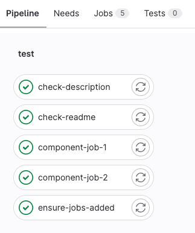
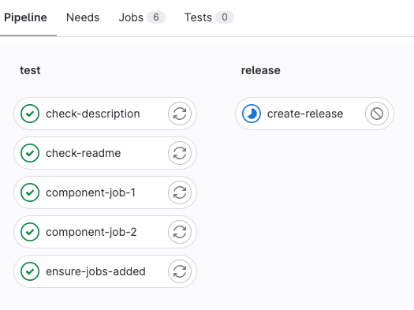
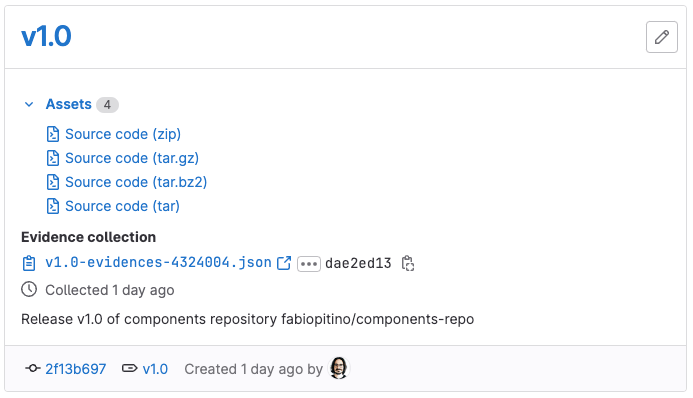

# Development workflow for a components repository

## Summary

This page describes the process of creating a components repository.
It describes all the necessary steps, from the creation of the project to having new releases displayed in the
catalog page.

## 1. Create a new project

First, create a new project and add a `README.md` file, which is a planned future
requirement for a repository to become a catalog resource.

## 2. Create a component inside the repository

If you intend to have only one component in the repository, you can define it in the root directory.
Otherwise, create a directory for the component.
For more information, see the [directory structure of a components repository](index.md#structure-of-a-components-repository).

This example defines a single component in the root directory.

Create a `template.yml` file that contains the configuration we want to provide as a component:

```yaml
spec:
  inputs:
    stage:
      default: test
---
.component-default-job:
  image: busybox
  stage: $[[ inputs.stage ]]

component-job-1:
  extends: .component-default-job
  script: echo job 1

component-job-2:
  extends: .component-default-job
  script: echo job 2
```

The example component configuration above adds two jobs, `component-job-1` and `component-job-2`, to a pipeline.

## 3. Test changes in CI

To test any changes pushed to our component, we create a `.gitlab-ci.yml` in the root directory:

```yaml
##
# This configuration expects an access token with read-only access to the API
# to be saved as in a masked CI/CD variable named 'API_TOKEN'

include:
  # Leverage predefined variables to refer to the current project and SHA
  - component: gitlab.com/$CI_PROJECT_PATH@$CI_COMMIT_SHA

stages: [test, release]

# Expect all `component-job-*` jobs are added
ensure-jobs-added:
  image: badouralix/curl-jq
  script:
    - |
      route="https://gitlab.com/api/v4/projects/$CI_PROJECT_ID/pipelines/$CI_PIPELINE_ID/jobs"
      count=`curl --silent --header "PRIVATE-TOKEN: $API_TOKEN" $route | jq 'map(select(.name | contains("component-job-"))) | length'`
      if [ "$count" != "2" ]; then
        exit 1
      fi

# Ensure that a project description exists, because it will be important to display
# the resource in the catalog.
check-description:
  image: badouralix/curl-jq
  script:
    - |
      route="https://gitlab.com/api/v4/projects/$CI_PROJECT_ID"
      desc=`curl --silent --header "PRIVATE-TOKEN: $API_TOKEN" $route | jq '.description'`
      if [ "$desc" = "null" ]; then
        echo "Description not set. Please set a projet description"
        exit 1
      else
        echo "Description set"
      fi

# Ensure that a `README.md` exists in the root directory as it represents the
# documentation for the whole components repository.
check-readme:
  image: busybox
  script: ls README.md || (echo "Please add a README.md file" && exit 1)

# If we are tagging a release with a specific convention ("v" + number) and all
# previous checks succeeded, we proceed with creating a release automatically.
create-release:
  stage: release
  image: registry.gitlab.com/gitlab-org/release-cli:latest
  rules:
    - if: $CI_COMMIT_TAG =~ /^v\d+/
  script: echo "Creating release $CI_COMMIT_TAG"
  release:
    tag_name: $CI_COMMIT_TAG
    description: "Release $CI_COMMIT_TAG of components repository $CI_PROJECT_PATH"
```

This pipeline contains examples of several tasks:

- Use the component to ensure that the final configuration uses valid syntax.
  This also ensures that the minimal requirements for the component to work are in place,
  like inputs and secrets.
- Test that the created pipeline has the expected characteristics.
  For example, ensure the `component-job-*` jobs are added to the pipeline.
  - We call the [pipeline API endpoint](../../../api/pipelines.md#get-a-single-pipeline) with `curl`
    and parse the data via `jq`.
  - With this technique users could check things like ensuring certain jobs were included,
    the job has the right properties set, or the log contains the expected output.
- Ensure that the project description is set.
- Ensure that the repository contains a `README.md` file.
- Create a [release automatically](../../../ci/yaml/index.md#release). When a tag is created and follows specific regex, create a release
  after all previous checks pass.

## 4. Run a pipeline

Now run a new pipeline for the `main` branch, by pushing a change or manually running a pipeline:



## 5. Create a tag

As the pipeline for `main` is green, we can now [create our first tag](../../../user/project/repository/tags/index.md#create-a-tag): `v1.0`.

As soon as the `v1.0` tag is created, we see a tag pipeline start.
This time the pipeline also has a `create-release` job in the `release` stage:



When the `create-release` job finishes we should see the new release available in the **Releases** menu:



## 6. Publish the repository to the catalog

To ensure that both the components repository and the new release is visible in the CI Catalog,
we need to publish it.

Publishing a components repository makes it a catalog resource.

The API endpoint for this action is under development.
For more details read the [issue](https://gitlab.com/gitlab-org/gitlab/-/issues/387065).
