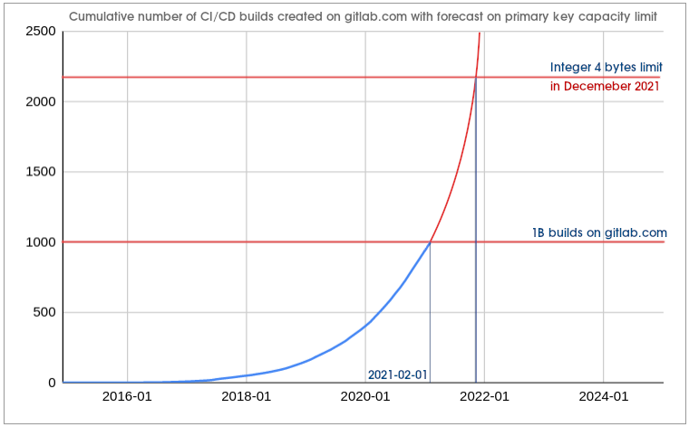
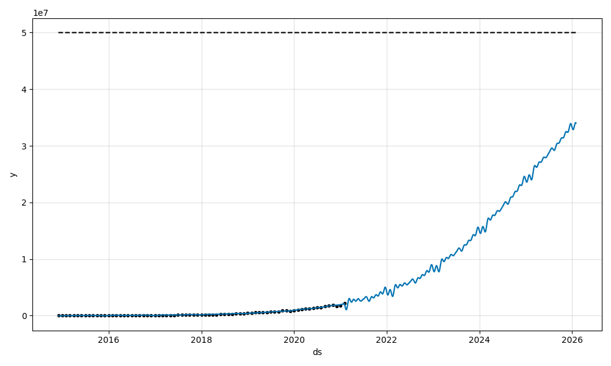

# CI/CD Scaling

## Summary

GitLab CI/CD is one of the most data and compute intensive components of GitLab.
Since its [initial release in November 2012](https://about.gitlab.com/blog/2012/11/13/continuous-integration-server-from-gitlab/),
the CI/CD subsystem has evolved significantly. It was [integrated into GitLab in September 2015](https://about.gitlab.com/releases/2015/09/22/gitlab-8-0-released/)
and has become [one of the most beloved CI/CD solutions](https://about.gitlab.com/blog/2017/09/27/gitlab-leader-continuous-integration-forrester-wave/).

GitLab CI/CD has come a long way since the initial release, but the design of
the data storage for pipeline builds remains almost the same since 2012. We
store all the builds in PostgreSQL in `ci_builds` table, and because we are
creating more than [2 million builds each day on GitLab.com](https://docs.google.com/spreadsheets/d/17ZdTWQMnTHWbyERlvj1GA7qhw_uIfCoI5Zfrrsh95zU),
we are reaching database limits that are slowing our development velocity down.

On February 1st, 2021, GitLab.com surpassed 1 billion CI/CD builds created and the number of
builds continues to grow exponentially.

## Goals

**Enable future growth by making processing 20M builds in a day possible.**

## Challenges

The current state of CI/CD product architecture needs to be updated if we want
to sustain future growth.

### We are running out of the capacity to store primary keys

The primary key in `ci_builds` table is an integer generated in a sequence.
Historically, Rails used to use [integer](https://www.postgresql.org/docs/14/datatype-numeric.html)
type when creating primary keys for a table. We did use the default when we
[created the `ci_builds` table in 2012](https://gitlab.com/gitlab-org/gitlab/-/blob/046b28312704f3131e72dcd2dbdacc5264d4aa62/db/ci/migrate/20121004165038_create_builds.rb).
[The behavior of Rails has changed](https://github.com/rails/rails/pull/26266)
since the release of Rails 5. The framework is now using `bigint` type that is 8
bytes long, however we have not migrated primary keys for `ci_builds` table to
`bigint` yet.

We will run out of the capacity of the integer type to store primary keys in
`ci_builds` table before December 2021. When it happens without a viable
workaround or an emergency plan, GitLab.com will go down.

`ci_builds` is just one of the tables that are running out of the primary keys
available in Int4 sequence. There are multiple other tables storing CI/CD data
that have the same problem.

Primary keys problem will be tackled by our Database Team.

**Status**: In October 2021, the primary keys in CI tables were migrated
to big integers. See the [related Epic](https://gitlab.com/groups/gitlab-org/-/epics/5657) for more details.

### The table is too large

There is more than a billion rows in `ci_builds` table. We store more than 2
terabytes of data in that table, and the total size of indexes is more than 1
terabyte (as of February 2021).

This amount of data contributes to a significant performance problems we
experience on our primary PostgreSQL database.

Most of the problem are related to how PostgreSQL database works internally,
and how it is making use of resources on a node the database runs on. We are at
the limits of vertical scaling of the primary database nodes and we frequently
see a negative impact of the `ci_builds` table on the overall performance,
stability, scalability and predictability of the database GitLab.com depends
on.

The size of the table also hinders development velocity because queries that
seem fine in the development environment may not work on GitLab.com. The
difference in the dataset size between the environments makes it difficult to
predict the performance of even the most simple queries.

Team members and the wider community members are struggling to contribute the
Verify area, because we restricted the possibility of extending `ci_builds`
even further. Our static analysis tools prevent adding more columns to this
table. Adding new queries is unpredictable because of the size of the dataset
and the amount of queries executed using the table. This significantly hinders
the development velocity and contributes to incidents on the production
environment.

We also expect a significant, exponential growth in the upcoming years.

One of the forecasts done using [Facebook's
Prophet](https://facebook.github.io/prophet/) shows that in the first half of
2024 we expect seeing 20M builds created on GitLab.com each day. In comparison
to around 2M we see created today, this is 10x growth our product might need to
sustain in upcoming years.

**Status**: As of October 2021 we reduced the growth rate of `ci_builds` table
by writing build options and variables to `ci_builds_metadata` table. We plan
to ship further improvements that will be described in a separate blueprint.

### Queuing mechanisms are using the large table

Because of how large the table is, mechanisms that we use to build queues of
pending builds (there is more than one queue), are not very efficient. Pending
builds represent a small fraction of what we store in the `ci_builds` table,
yet we need to find them in this big dataset to determine an order in which we
want to process them.

This mechanism is very inefficient, and it has been causing problems on the
production environment frequently. This usually results in a significant drop
of the CI/CD Apdex score, and sometimes even causes a significant performance
degradation in the production environment.

There are multiple other strategies that can improve performance and
reliability. We can use [Redis
queuing](https://gitlab.com/gitlab-org/gitlab/-/issues/322972), or [a separate
table that will accelerate SQL queries used to build
queues](https://gitlab.com/gitlab-org/gitlab/-/issues/322766) and we want to
explore them.

**Status**: As of October 2021 the new architecture [has been implemented on
GitLab.com](https://gitlab.com/groups/gitlab-org/-/epics/5909#note_680407908).
The following epic tracks making it generally available: [Make the new pending
builds architecture generally available](
https://gitlab.com/groups/gitlab-org/-/epics/6954).

### Moving big amounts of data is challenging

We store a significant amount of data in `ci_builds` table. Some of the columns
in that table store a serialized user-provided data. Column `ci_builds.options`
stores more than 600 gigabytes of data, and `ci_builds.yaml_variables` more
than 300 gigabytes (as of February 2021).

It is a lot of data that needs to be reliably moved to a different place.
Unfortunately, right now, our [background migrations](../../../development/database/background_migrations.md)
are not reliable enough to migrate this amount of data at scale. We need to
build mechanisms that will give us confidence in moving this data between
columns, tables, partitions or database shards.

Effort to improve background migrations will be owned by our Database Team.

**Status**: In progress. We plan to ship further improvements that will be
described in a separate architectural blueprint.

## Proposal

Making GitLab CI/CD product ready for the scale we expect to see in the
upcoming years is a multi-phase effort.

First, we want to focus on things that are urgently needed right now. We need
to fix primary keys overflow risk and unblock other teams that are working on
database partitioning and sharding.

We want to improve known bottlenecks, like
builds queuing mechanisms that is using the large table, and other things that
are holding other teams back.

Extending CI/CD metrics is important to get a better sense of how the system
performs and to what growth should we expect. This will make it easier for us
to identify bottlenecks and perform more advanced capacity planning.

Next step is to better understand how we can leverage strong time-decay
characteristic of CI/CD data. This might help us to partition CI/CD dataset to
reduce the size of CI/CD database tables.

## Iterations

Work required to achieve our next CI/CD scaling target is tracked in the
[CI/CD Scaling](https://gitlab.com/groups/gitlab-org/-/epics/5745) epic.

1. ✓ Migrate primary keys to big integers on GitLab.com.
1. ✓ Implement the new architecture of builds queuing on GitLab.com.
1. [Make the new builds queuing architecture generally available](https://gitlab.com/groups/gitlab-org/-/epics/6954).
1. [Partition CI/CD data using time-decay pattern](../ci_data_decay/).

## Status

|-------------|--------------|
| Created at  | 21.01.2021   |
| Approved at | 26.04.2021   |
| Updated at  | 28.02.2022   |

Status: In progress.

## Who

Proposal:

<!-- vale gitlab.Spelling = NO -->

| Role                         | Who
|------------------------------|-------------------------|
| Author                       | Grzegorz Bizon          |
| Architecture Evolution Coach | Kamil Trzciński         |
| Engineering Leader           | Cheryl Li               |
| Product Manager              | Jackie Porter           |
| Domain Expert / Verify       | Fabio Pitino            |
| Domain Expert / Database     | Jose Finotto            |
| Domain Expert / PostgreSQL   | Nikolay Samokhvalov     |

DRIs:

| Role                         | Who
|------------------------------|------------------------|
| Leadership                   | Cheryl Li              |
| Product                      | Jackie Porter          |
| Engineering                  | Grzegorz Bizon         |

Domain experts:

| Area                         | Who
|------------------------------|------------------------|
| Domain Expert / Verify       | Fabio Pitino           |
| Domain Expert / Verify       | Marius Bobin           |
| Domain Expert / Database     | Jose Finotto           |
| Domain Expert / PostgreSQL   | Nikolay Samokhvalov    |

<!-- vale gitlab.Spelling = YES -->
