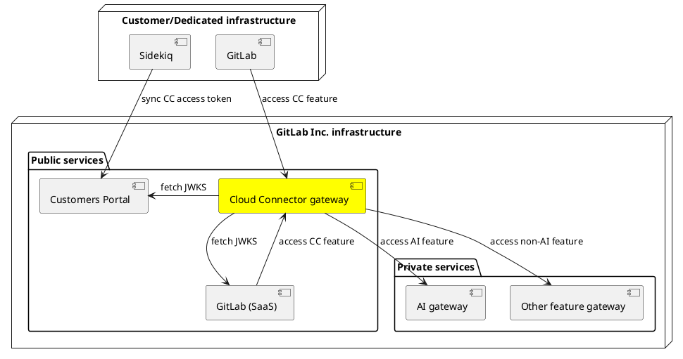

# Cloud Connector gateway service

## Summary

This design doc proposes a new GitLab-hosted edge service for our
[Cloud Connector product offering](https://gitlab.com/groups/gitlab-org/-/epics/308), which would act as a public
gateway into all features offered under the Cloud Connector umbrella.

## Motivation

We currently serve only AI related features to Cloud Connector customers, and our
[current architecture](../../../development/cloud_connector/architecture.md)
is a direct reflection of that.
Both SaaS and Self-managed/Dedicated GitLab instances (SM hereafter) talk to the [AI gateway](../ai_gateway/index.md)
directly, which also implements an `Access Layer` to verify that a given request is allowed
to access the respective AI feature endpoint.

This approach has served us well because it:

- Required minimal changes from an architectural standpoint to allow SM users to consume AI features hosted by us.
- Caused minimal friction with ongoing development on SaaS.
- Reduced time to market.

It is clear that the AI gateway alone does not sufficiently abstract over a wider variety of features, as by definition it is designed to serve AI features only.
Adding non-AI features to the Cloud Connector offering would leave us with
three choices:

1. Evolve the AI gateway into something that also hosts non-AI features.
1. Expose new Cloud Connector offerings by creating new publicly available services next to the AI-gateway.
1. Introduce a new Cloud Connector public gateway service (CC gateway hereafter) that fronts all feature gateways.
   Feature gateways would become privately routed instead. This approach follows the North/South traffic pattern established
   by the AI gateway.

Option 3 is the primary focus of this blueprint. We briefly explore options 1 and 2 in [Alternative solutions](#alternative-solutions).

### Goals

Introducing a dedicated edge service for Cloud Connector serves the following goals:

- **Provide single access point for customers.** We found that customers are not keen on configuring their web proxies and firewalls
  to allow outbound traffic to an ever growing list of GitLab-hosted services. While we investigated ways to
  [minimize the amount of configuration](https://gitlab.com/gitlab-org/gitlab/-/issues/424780) required,
  a satisfying solution has yet to be found. Ideally, we would have _one host only_ that is configured and contacted by a GitLab instance.
- **Reduce risk surface.** With a single entry point facing the public internet, we reduce the attack surface to
  malicious users and the necessity to guard each internal service individually from potential abuse. In face of security issues
  with a particular milestone release, we could guard against this in the single CC gateway service rather than in
  feature gateways individually, improving the pace at which we can respond to security incidents.
- **Provide CC specific telemetry.** User telemetry was added hastily for current Cloud Connector features and was originally
  designed for SaaS, which is directly hooked up to Snowplow; that is not true for SM instances.
  In order to track usage telemetry specific to CC use cases, it could be valuable to have a dedicated place to collect it and that can be connected
  to GitLab-internal data pipelines.
- **Reduce duplication of efforts.** Certain tasks such as instance authorization and "clearing requests" against CustomersDot
  that currently live in the AI gateway would have to be duplicated to other services without a central gateway.
- **Improve control over rate limits.** With all requests going to a single AI gateway currently, be it from SM or SaaS, rate
  limiting gets more complicated because we need to inspect request metadata to understand where a request originated from.
  Moreover, having a dedicated service would allow us, if desired, to implement application-level request budgets, something
  we do not currently support.
- **Independently scalable.** For reasons of fault tolerance and scalability, it is beneficial to have all SM traffic go
  through a separate service. For example, if an excess of unexpected requests arrive from SM instances due to a bug
  in a milestone release, this traffic could be absorbed at the CC gateway level without cascading further, thus leaving
  SaaS users unaffected.

### Non-goals

- **We are not proposing to build a new feature service.** We consider Cloud Connector to run orthogonal to the
  various stage groups efforts that build end user features. We would not want actual end user feature development
  to happen in this service, but rather provide a vehicle through which these features can be delivered in a consistent manner
  across all deployments (SaaS, SM and Dedicated).
- **Changing the existing mechanism by which we authenticate instances and verify permissions.** We intend to keep
  the current mechanism in place that emits access tokens from CustomersDot that are subsequently verified in
  other systems using public key cryptographic checks. We may move some of the code around that currently implements this,
  however.

## Decisions

- [ADR-001: Use load balancer as single entry point](decisions/001_lb_entry_point.md)

## Proposal

We propose to make two major changes to the current architecture:

1. Build and deploy a new Cloud Connector edge service that acts as a gateway into all features included
   in our Cloud Connector product offering.
1. Make the AI gateway a GitLab-internal service so it does not face the public internet anymore. The new
   edge service will front the AI gateway instead.

At a high level, the new architecture would look as follows:

## Design and implementation details

### CC gateway roles & responsibilities

The new service would be made available at `cloud.gitlab.com` and act as a "smart router".
It will have the following responsibilities:

1. **Request handling.** The service will make decisions about whether a particular request is handled
   in the service itself or forwarded to other backends. For example, a request to `/ai/code_suggestions/completions`
   could be handled by forwarding this request to an appropriate endpoint in the AI gateway unchanged, while a request
   to `/-/metrics` could be handled by the service itself. As mentioned in [non-goals](#non-goals), the latter would not
   include domain logic as it pertains to an end user feature, but rather cross-cutting logic such as telemetry, or
   code that is necessary to make an existing feature implementation accessible to end users.

   When handling requests, the service should be unopinionated about which protocol is used, to the extent possible.
   Reasons for injecting custom logic could be setting additional HTTP header fields. A design principle should be
   to not require CC service deployments if a backend service merely changes request payload or endpoint definitions. However,
   supporting more protocols on top of HTTP may require adding support in the CC service itself.
1. **Authentication/authorization.** The service will be the first point of contact for authenticating clients and verifying
   they are authorized to use a particular CC feature. This will include fetching and caching public keys served from GitLab SaaS
   and CustomersDot to decode JWT access tokens sent by GitLab instances, including matching token scopes to feature endpoints
   to ensure an instance is eligible to consume this feature. This functionality will largely be lifted out of the AI gateway
   where it currently lives. To maintain a ZeroTrust environment, the service will implement a more lightweight auth/z protocol
   with internal backends that merely performs general authenticity checks but forgoes billing and permission
   related scoping checks. How this protocol will look like is to be decided, and might be further explored in
   [Discussion: Standardized Authentication and Authorization between internal services and GitLab Rails](https://gitlab.com/gitlab-org/gitlab/-/issues/421983).
1. **Organization-level rate limits.** It is to be decided if this is needed, but there could be value in having application-level rate limits
   and or "pressure relief valves" that operate at the customer/organization level rather than the network level, the latter of which
   Cloudflare already affords us with. These controls would most likely be controlled by the Cloud Connector team, not SREs or
   infra engineers. We should also be careful to not simply extend the existing rate limiting configuration that is mainly concerned with GitLab SaaS.
1. **Recording telemetry.** In any cases where telemetry is specific to Cloud Connector feature usage or would result in
   duplication of efforts when tracked further down the stack (for example, counting unique users), it should be recorded here instead.
   To record usage/business telemetry, the service will talk directly to Snowplow. For operational telemetry, it will provide
   a Prometheus metrics endpoint. We may decide to also route Service Ping telemetry through the CC service because this
   currently goes to [`version-gitlab-com`](https://gitlab.com/gitlab-services/version-gitlab-com/).

### Implementation choices

We suggest to use one of the following language stacks:

1. **Go.** There is substantial organizational knowledge in writing and running
   Go systems at GitLab, and it is a great systems language that gives us efficient ways to handle requests where
   they merely need to be forwarded (request proxying) and a powerful concurrency mechanism through goroutines. This makes the
   service easier to scale and cheaper to run than Ruby or Python, which scale largely at the process level due to their use
   of Global Interpreter Locks, and use inefficient memory models especially as regards byte stream handling and manipulation.
   A drawback of Go is that resource requirements such as memory use are less predictable because Go is a garbage collected language.
1. **Rust.** We are starting to build up knowledge in Rust at GitLab. Like Go, it is a great systems language that is
   also starting to see wider adoption in the Ruby ecosystem to write CRuby extensions. A major benefit is more predictable
   resource consumption because it is not garbage collected and allows for finer control of memory use.
   It is also very fast; we found that the Rust implementation for `prometheus-client-mmap` outperformed the original
   extension written in C.

## Alternative solutions

### Cloudflare Worker

One promising alternative to writing and deploying a service from scratch is to use
[Cloudflare Workers](https://developers.cloudflare.com/workers/),
a serverless solution to deploying application code that:

- Is auto-scaled through Cloudflare's service infrastructure.
- Supports any language that compiles to Webassembly, including Rust.
- Supports various options for [cloud storage](https://developers.cloudflare.com/workers/learning/storage-options/)
  including a [key-value store](https://developers.cloudflare.com/kv/) we can use to cache data.
- Supports a wide range of [network protocols](https://developers.cloudflare.com/workers/learning/protocols/)
  including WebSockets.

We are exploring this option in issue [#427726](https://gitlab.com/gitlab-org/gitlab/-/issues/427726).

### Per-feature public gateways

This approach would be a direct extrapolation of what we're doing now. Because we only host AI features for
Cloud Connector at the moment, we have a single publicly routed gateway that acts as the entry point for
Cloud Connector features and implements all the necessary auth/z and telemetry logic.

Were we to introduce any non-AI features, each of these would receive their own gateway service, all
publicly routed and be accessed by GitLab instances through individual host names. For example:

- `ai.gitlab.com`: Services AI features for GitLab instances
- `cicd.gitlab.com`: Services CI/CD features for GitLab instances
- `foo.gitlab.com`: Services foo features for GitLab instances

A benefit of this approach is that in the absence of an additional layer of indirection, latency
may be improved.

A major question is how shared concerns are handled because duplicating auth/z, telemetry, rate limits
etc. across all such services may mean re-inventing the wheel for different language stacks (the AI gateway was
written in Python; a non-AI feature gateway will most likely be written in Ruby or Go, which are far more popular
at GitLab).

One solution to this could be to extract shared concerns into libraries, although these too, would have to be
made available in different languages. This is what we do with `labkit` (we have 3 versions already, for Go, Ruby and Python),
which creates organizational challenges because we are already struggling as an organization to properly allocate
people to maintaining foundational libraries, which is often handled on a best-effort, crowd-sourced basis.

Another solution could be to extract services that handle some of these concerns. One pattern I have seen used
with multiple edge services is for them to contact a single auth/z service that maps user identity and clears permissions
before handling the actual request, thus reducing code duplication between feature services.

Other drawbacks of this approach:

- Increases risk surface by number of feature domains we pull into Cloud Connector because we need to deploy
  and secure these services on the public internet.
- Higher coupling of GitLab to feature services. Where and how a particular feature is made
  available as an implementation detail. By coupling GitLab to specific network endpoints like `ai.gitlab.com`
  we reduce our flexibility to shuffle around both our service architecture but also how we map technology to features
  and customer plans/tiers because some customers stay on older GitLab
  versions for a very long time. This would necessitate putting special routing/DNS rules in place to address any
  larger changes we make to this topology.
- Higher config overhead for customers. Because they may have to configure web proxies and firewalls, they need to
  permit-list every single host/IP-range we expose this way.

### Envoy

[Envoy](https://www.envoyproxy.io/docs/envoy/v1.27.0/) is a Layer 7 proxy and communication bus that allows
us to overlay a service mesh to solve cross-cutting
problems with multi-service access such as service discovery and rate limiting. Envoy runs as a process sidecar
to the actual application service it manages traffic for.
A single LB could be deployed as Ingress to this service mesh so we can reach it at `cloud.gitlab.com`.

A benefit of this approach would be that we can use an off-the-shelves solution to solve common networking
and scaling problems.

A major drawback of this approach is that it leaves no room to run custom application code, which would be necessary
to validate access tokens or implement request budgets at the customer or organization level. In this solution,
these functions would have to be factored out into libraries or other shared services instead, so it shares
other drawbacks with the [per-feature public gateways alternative](#per-feature-public-gateways).

### Evolving the AI gateway into a CC gateway

This was the original idea behind the first iteration of the [AI gateway](../ai_gateway/index.md) architecture,
which defined the AI gateway as a "prospective GitLab Plus" service (GitLab Plus was the WIP name for
Cloud Connector.)

This is our least favorite option for several reasons:

- Low code cohesion. This would lead us to build another mini-monolith with wildly unrelated responsibilities
  that would span various feature domains (AI, CI/CD, secrets management, observability etc.) and teams
  having to coordinate when contributing to this service, introducing friction.
- Written in Python. We chose Python for the AI gateway because it seemed a sensible choice, considering the AI
  landscape has a Python bias. However, Python is almost non-existent at GitLab outside of this space, and most
  of our engineers are Ruby or Go developers, with years of expertise built up in these stacks. We would either
  have to rewrite the AI gateway in Ruby or Go to make it more broadly accessible, or invest heavily into Python
  training and hiring as an organization.
  Furthermore, Python has poor scaling characteristics because like CRuby it uses a Global Interpreter Lock and
  therefore primarily scales through processes, not threads.
- Ownership. The AI gateway is currently owned by the AI framework team. This would not make sense if we evolved this into a CC gateway, which should be owned by the Cloud Connector group instead.
