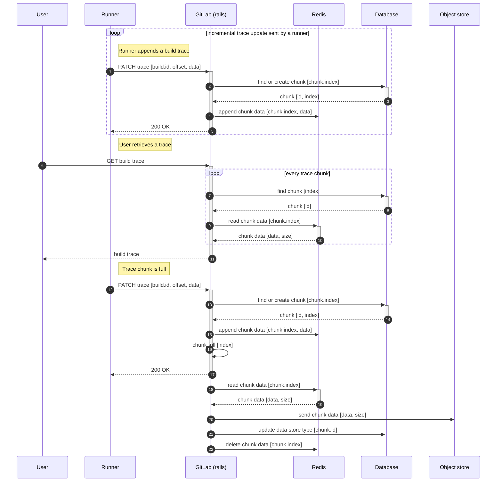

# Cloud Native Build Logs

Cloud native and the adoption of Kubernetes has been recognised by GitLab to be
one of the top two biggest tailwinds that are helping us grow faster as a
company behind the project.

This effort is described in a more details [in the infrastructure team
handbook](https://about.gitlab.com/handbook/engineering/infrastructure/production/kubernetes/gitlab-com/).

## Traditional build logs

Traditional job logs depend a lot on availability of a local shared storage.

Every time a GitLab Runner sends a new partial build output, we write this
output to a file on a disk. This is simple, but this mechanism depends on
shared local storage - the same file needs to be available on every GitLab web
node machine, because GitLab Runner might connect to a different one every time
it performs an API request. Sidekiq also needs access to the file because when
a job is complete, the trace file contents are sent to the object store.

## New architecture

New architecture writes data to Redis instead of writing build logs into a
file.

In order to make this performant and resilient enough, we implemented a chunked
I/O mechanism - we store data in Redis in chunks, and migrate them to an object
store once we reach a desired chunk size.

Simplified sequence diagram is available below.

## NFS coupling

In 2017, we experienced serious problems of scaling our NFS infrastructure. We
even tried to replace NFS with
[CephFS](https://docs.ceph.com/docs/master/cephfs/) - unsuccessfully.

Since that time it has become apparent that the cost of operations and
maintenance of a NFS cluster is significant and that if we ever decide to
migrate to Kubernetes [we need to decouple GitLab from a shared local storage
and
NFS](https://gitlab.com/gitlab-org/gitlab-pages/-/issues/426#note_375646396).

1. NFS might be a single point of failure
1. NFS can only be reliably scaled vertically
1. Moving to Kubernetes means increasing the number of mount points by an order
   of magnitude
1. NFS depends on extremely reliable network which can be difficult to provide
   in Kubernetes environment
1. Storing customer data on NFS involves additional security risks

Moving GitLab to Kubernetes without NFS decoupling would result in an explosion
of complexity, maintenance cost and enormous, negative impact on availability.

## Iterations

1. ✓ Implement the new architecture in way that it does not depend on shared local storage
1. ✓ Evaluate performance and edge-cases, iterate to improve the new architecture
1. ✓ Design cloud native build logs correctness verification mechanisms
1. ✓ Build observability mechanisms around performance and correctness
1. ✓ Rollout the feature into production environment incrementally

The work needed to make the new architecture production ready and enabled on
GitLab.com had been tracked in [Cloud Native Build Logs on
GitLab.com](https://gitlab.com/groups/gitlab-org/-/epics/4275) epic.

Enabling this feature on GitLab.com is a subtask of [making the new
architecture generally
available](https://gitlab.com/groups/gitlab-org/-/epics/3791) for everyone.

## Status

This change has been implemented and enabled on GitLab.com.

We are working on [an epic to make this feature more resilient and observable](https://gitlab.com/groups/gitlab-org/-/epics/4860).

## Who

Proposal:

<!-- vale gitlab.Spelling = NO -->

| Role                         | Who
|------------------------------|-------------------------|
| Author                       |     Grzegorz Bizon      |
| Architecture Evolution Coach | Gerardo Lopez-Fernandez |
| Engineering Leader           |       Darby Frey        |
| Domain Expert                |     Kamil Trzciński     |
| Domain Expert                |      Sean McGivern      |

DRIs:

| Role                         | Who
|------------------------------|------------------------|
| Product                      |      Thao Yeager       |
| Leadership                   |       Darby Frey       |
| Engineering                  |     Grzegorz Bizon     |

<!-- vale gitlab.Spelling = YES -->
