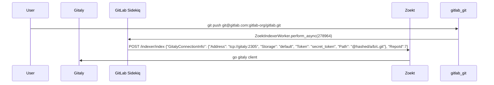
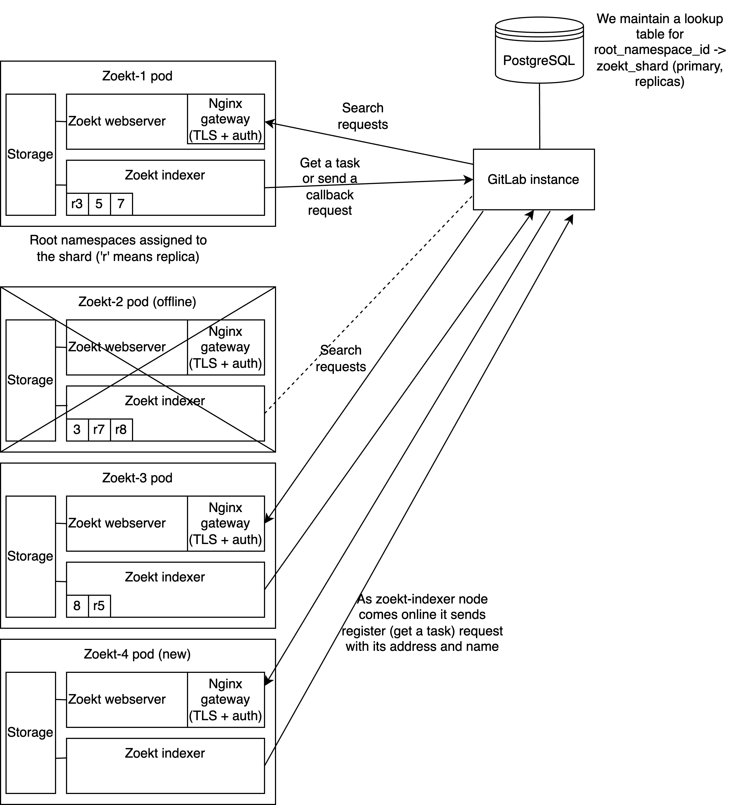

<!-- vale gitlab.FutureTense = NO -->

# Use Zoekt For code search

## Summary

We will be implementing an additional code search functionality in GitLab that
is backed by [Zoekt](https://github.com/sourcegraph/zoekt), an open source
search engine that is specifically designed for code search. Zoekt will be used as
an API by GitLab and remain an implementation detail while the user interface
in GitLab will not change much except for some new features made available by
Zoekt.

This will be rolled out in phases to ensure that the system will actually meet
our scaling and cost expectations and will run alongside code search backed by
Elasticsearch until we can be sure it is a viable replacement. The first step
will be making it available for `gitlab-org` for internal and expanding
customer by customer based on customer interest.

## Motivation

GitLab code search functionality today is backed by Elasticsearch.
Elasticsearch has proven useful for other types of search (issues, merge
requests, comments and so-on) but is by design not a good choice for code
search where users expect matches to be precise (ie. no false positives) and
flexible (for example, support
[substring matching](https://gitlab.com/gitlab-org/gitlab/-/issues/325234)
and
[regexes](https://gitlab.com/gitlab-org/gitlab/-/issues/4175)). We have
[investigated our options](https://gitlab.com/groups/gitlab-org/-/epics/7404)
and [Zoekt](https://github.com/sourcegraph/zoekt) is pretty much the only well
maintained open source technology that is suited to code search. Based on our
research we believe it will be better to adopt a well maintained open source
database than attempt to build our own. This is mostly due to the fact that our
research indicates that the fundamental architecture of Zoekt is what we would
implement again if we tried to implement something ourselves.

Our
[early benchmarking](https://gitlab.com/gitlab-org/gitlab/-/issues/370832#note_1183611955)
suggests that Zoekt will be viable at our scale, but we feel strongly
that investing in building a beta integration with Zoekt and rolling it out
group by group on GitLab.com will provide better insights into scalability and
cost than more accurate benchmarking efforts. It will also be relatively low
risk as it will be rolled out internally first and later rolled out to
customers that wish to participate in the trial.

### Goals

The main goals of this integration will be to implement the following highly
requested improvements to code search:

1. [Exact match (substring match) code searches in advanced search](https://gitlab.com/gitlab-org/gitlab/-/issues/325234)
1. [Support regular expressions with Advanced Global Search](https://gitlab.com/gitlab-org/gitlab/-/issues/4175)
1. [Support multiple line matches in the same file](https://gitlab.com/gitlab-org/gitlab/-/issues/668)

The initial phases of the rollout will be designed to catch and resolve scaling
or infrastructure cost issues as early as possible so that we can pivot early
before investing too much in this technology if it is not suitable.

### Non-Goals

The following are not goals initially but could theoretically be built upon
this solution:

1. Improving security scanning features by having access to quickly perform
   regex scans across many repositories
1. Saving money on our search infrastructure - this may be possible with
   further optimizations, but initial estimates suggest the cost is similar
1. AI/ML features of search used to predict what users might be interested in
   finding
1. Code Intelligence and Navigation - likely code intelligence and navigation
   features should be built on structured data rather than a trigram index but
   regex based searches (using Zoekt) may be a suitable fallback for code which
   does not have structured metadata enabled or dynamic languages where static
   analysis is not very accurate. Zoekt in particular may not be well suited
   initially, despite existing symbol extraction using ctags, because ctags
   symbols may not contain enough data for accurate navigation and Zoekt
   doesn't undersand dependencies which would be necessary for cross-project
   navigation.

## Proposal

An
[initial implementation of a Zoekt integration](https://gitlab.com/gitlab-org/gitlab/-/merge_requests/105049)
was created to demonstrate the feasibility of using Zoekt as a drop-in
replacement for Elasticsearch code searches. This blueprint will extend on all
the details needed to provide a minimum viable change as well steps needed to
scale this to a larger customer rollout on GitLab.com.

## Design and implementation details

### User Experience

When a user performs an advanced search on a group or project that is part
of the Zoekt rollout we will present a toggle somewhere in the UI to change
to "precise search" (or some other UX TBD) which switches them from
Elasticsearch to Zoekt. Early user feedback will help us assess the best way
to present these choices to users and ultimately we will want to remove the
Elasticsearch option if we find Zoekt is a suitable long term option.

### Indexing

Similar to our Elasticsearch integration, GitLab will notify Zoekt every time
there are updates to a repository. We've introduced a new indexer called
[`gitlab-zoekt-indexer`](https://gitlab.com/gitlab-org/gitlab-zoekt-indexer) and
we are going to replace the legacy indexer that needs to clone repositories with it.
The new indexer expects a payload with all required information to connect to
Gitaly in order to index the repository.

The rails side of the integration will be a Sidekiq worker that is scheduled
every time there is an update to a repository and it will simply call this
`/indexer/index` endpoint in Zoekt. This will also need to send a Gitaly token
that can allow Zoekt to connect to Gitaly.

We're going to encrypt the connection with SSL and add basic auth in [Add authentication for GitLab -> Zoekt HTTP calls](https://gitlab.com/gitlab-org/gitlab/-/issues/389749)
before enabling the new indexer since it receives Gitaly secrets from GitLab.



The Sidekiq worker can leverage de-duplication based on the `project_id`.

Zoekt supports indexing multiple projects we'll likely need to, eventually,
allow a way for users to configure additional branches (beyond the default
branch) and this will need to be sent to Zoekt. We will need to decide if these
branch lists are sent every time we index the project or only when they change
configuration.

There may be race conditions with multiple Zoekt processes indexing the same
repo at the same time. For this reason we should implement a locking mechanism
somewhere to ensure we are only indexing 1 project in 1 place at a time. We
could make use of the same Redis locking we use for indexing projects in
Elasticsearch.

### Searching

Searching will be implemented using the `/api/search` functionality in
Zoekt. There is also
[an open PR to fix this endpoint in Zoekt](https://github.com/sourcegraph/zoekt/pull/506),
and again we may consider working from a fork until this is fixed. GitLab will
prepend all searches with the appropriate filter for repositories based on the
user's search context (group or project) in the same way we do for
Elasticsearch. For Zoekt this will be implemented as a query string regex that
matches all the searched repositories.

### Zoekt infrastructure

Each Zoekt node will need to run a
[`gitlab-zoekt-indexer`](https://gitlab.com/gitlab-org/gitlab-zoekt-indexer/-/blob/main/cmd/gitlab-zoekt-indexer/main.go)
and a
[`zoekt-webserver`](https://github.com/sourcegraph/zoekt/blob/main/cmd/zoekt-webserver/main.go).
These are both webservers with different responsibilities.
The actual `.zoekt` index files will be stored on an SSD for fast searches.
These web servers need to run on the same node as they access the same files.
The `gitlab-zoekt-indexer` is responsible for writing the `.zoekt` index files.
The `zoekt-webserver` is responsible for responding to searches that it performs
by reading these `.zoekt` index files.

### Rollout strategy

Initially Zoekt code search will only be available to `gitlab-org`. After that
we'll start rolling it out to specific customers that have requested better
code search experience. As we learn about scaling and make improvements we will
gradually roll it out to all licensed groups on GitLab.com. We will use a
similar approach to Elasticsearch for keeping track of which groups are indexed
and which are not. This will be based on a new table `zoekt_indexed_namespaces`
with a `namespace_id` reference. We will only allow rolling out to top level
namespaces to simplify the logic of checking for all layers of group
inheritance. Once we've rolled out to all licensed groups we'll enable logic to
automatically enroll newly licensed groups. This table also may be a place to
store per-namespace sharding and replication data as described below.

### Sharding and replication strategy

Zoekt does not have any inbuilt sharding, and we expect that we'll need
multiple Zoekt servers to reach the scale to provide search functionality to
all of GitLab licensed customers.

There are 2 clear ways to implement sharding:

1. Build it on top of, or in front of Zoekt, as an independent component. Building
   all the complexities of a distributed database into Zoekt is not likely to
   be a good direction for the project so most likely this would be an
   independent piece of infrastructure that proxied requests to the correct
   shard.
1. Manage the shards inside GitLab. This would be an application layer in
   GitLab which chooses the correct shard to send indexing and search requests
   to.

Likewise, there are a few ways to implement replication:

1. Server-side where Zoekt replicas are aware of other Zoekt replicas and they
   stream updates from some primary to remain in sync
1. Client-side replication where clients send indexing requests to all replicas
   and search requests to any replica

We plan to implement sharding inside GitLab application but replication may be
best served at the level of the filesystem of Zoekt servers rather than sending
duplicated updates from GitLab to all replicas. This could be some process on
Zoekt servers that monitors for changes to the `.zoekt` files in a specific
directory and syncs those updates to the replicas. This will need to be
slightly more sophisticated than `rsync` because the files are constantly
changing and files may be getting deleted while the sync is happening so we
would want to be syncing the updates in batches somehow without slowing down
indexing.

Implementing sharding in GitLab simplifies the additional infrastructure
components that need to be deployed and allows more flexibility to control our
rollout to many customers alongside our rollout of multiple shards.

Implementing syncing from primary -> replica on Zoekt nodes at the filesystem
level optimizes that overall resource usage. We only need to sync the index
files to replicas as the bare repo is just a cache. This saves on:

1. Disk space on replicas
1. CPU usage on replicas as it does not need to rebuild the index
1. Load on Gitaly to clone the repos

We plan to defer the implementation of these high availability aspects until
later, but a preliminary plan would be:

1. GitLab is configured with a pool of Zoekt servers
1. GitLab assigns groups randomly a Zoekt primary server
1. There will also be Zoekt replica servers
1. Periodically Zoekt primary servers will sync their `.zoekt` index files to
   their respective replicas
1. There will need to be some process by which to promote a replica to a
   primary if the primary is having issues. We will be using Consul for
   keeping track of which is the primary and which are the replicas.
1. When indexing a project GitLab will queue a Sidekiq job to update the index
   on the primary
1. When searching we will randomly select one of the Zoekt primaries or replica
   servers for the group being searched. We don't care which is "more up to
   date" as code search will be "eventually consistent" and all reads may read
   slightly out of date indexes. We will have a target of maximum latency of
   index updates and may consider removing nodes from rotation if they are too
   far out of date.
1. We will shard everything by top level group as this ensures group search can
   always search a single Zoekt server. Aggregation may be possible for global
   searches at some point in future if this turns out to be important. Smaller
   self-managed instances may use a single Zoekt server allowing global
   searches to work without any aggregation being implemented. Depending on our
   largest group sizes and scaling limitations of a single node Zoekt server we
   may consider implementing an approach where a group can be assigned multiple
   shards.

The downside of the chosen path will be added complexity of managing all these
Zoekt servers from GitLab when compared with a "proxy" layer outside of GitLab
that is managing all of these shards. We will consider this decision a work in
progress and reassess if it turns out to add too much complexity to GitLab.

#### Sharding proposal using GitLab `::Zoekt::Shard` model

This is already implemented as the `::Zoekt::IndexedNamespace`
implements a many-to-many relationship between namespaces and shards.

#### Sharding proposal with self-registering Zoekt nodes

This proposal is mostly inspired by GitLab Runner's architecture with the main difference
that the communication is bidirectional. We've arrived to this after discussions in [Zoekt Sharding and Replication](https://gitlab.com/gitlab-org/gitlab/-/issues/419900).

##### Alternatives we've considered

We've considered different options for where to manage the Zoekt cluster state including Raft and Zoekt's own database. We decided that there are many benefits to having the whole cluster state managed by GitLab instead of Zoekt so we're opting to keep Zoekt nodes as naive as possible.

The main benefits are:

1. The deployment cycle for GitLab is faster than Zoekt which requires many version bumps across many projects
1. GitLab already has lots tooling that can be used for managing the state that we are already familiar with including Postgres, Redis, Sidekiq and others
1. The engineers mainly working on this project have much more experience with Rails than Go and spend more time writing Rails code than Go code as the other search features are mostly in Rails

Some of those benefits could also be seen as downsides and maybe not the right choice for different projects owned by different teams.

##### High level proposal



1. Zoekt nodes are started with 3 additional arguments: its own address, shard name, and GitLab URL.
1. We'd like to keep shard name separate so that one will be able to migrate a shard to a different address.
1. When Zoekt is running in k8s, we can pass `hostname --fqdn` (for example, `gitlab-zoekt-1.gitlab-zoekt.default.svc.cluster.local`) as an argument for the address. Customers running Zoekt on bare-metal will need to configure it separately.
1. Zoekt most likely will use [Internal API](../../../development/internal_api/index.md) to connect to GitLab. We might also want to use a separate GitLab URL to keep the traffic internal and to avoid extra traffic cost.
1. GitLab will maintain a lookup table with `last_seen_at` and shard's name (we could expand `::Zoekt::Shard`). We'll also need to introduce the concept of replicas and primaries.
1. Zoekt nodes (indexers in this case) will send periodic requests to get new jobs with its address and name to the configured GitLab URL. GitLab will either register a new node or update the existing record in the lookup table.
1. After the job is completed, `zoekt-indexer` will send a callback to GitLab to indicate that the job has been completed.
1. If after a specified time GitLab doesn't receive a request, it can reassign namespaces to different shards and mark the missing shard as unavailable.
1. When executing searches, we can round-robin requests to primaries and replicas. We might even want to implement retries. For example, if a request to primary fails, we send another request to replica right away or vice versa. Here is a related issue: [Consider circuit breaker for Zoekt code search](https://gitlab.com/gitlab-org/gitlab/-/issues/393445).
1. Initially, we might want to skip replication until we implement efficiently moving and copying index files between shards (rsync for example).
1. Rebalancing most likely will happen in a cron Sidekiq worker, which will consider if an indexed namespace has enough replicas as well as available storage.

An example of command we might consider running in k8s:

```shell
./gitlab-zoekt-indexer -index_dir=/data/index -shard_name=`hostname` -address=`hostname --fqdn`
```

When we add more replicas to the stateful set, it should automatically handle addresses and shard names. For example:

- `gitlab-zoekt-0` / `gitlab-zoekt-0.gitlab-zoekt.default.svc.cluster.local`
- `gitlab-zoekt-1` / `gitlab-zoekt-1.gitlab-zoekt.default.svc.cluster.local`
- ..

Possible jobs indexer can receive:

- `index_repositories(ids: [1,2,3,4])`
- `delete_repositories(ids: [5,6])`
- `copy_index(from: 'gitlab-zoekt-0', to: 'gitlab-zoekt-1', repo_id: 4)`

#### Replication and service discovery using Consul

If we plan to replicate at the Zoekt node level as described above we need to
change our data model to use a one-to-many relationship from `zoekt_shards -> namespaces`.
This means making the `namespace_id` column unique in
`zoekt_indexed_namespaces`. Then we need to implement a service discovery
approach where the `index_url` always points at a primary Zoekt node and the
`search_url` is a DNS record with N replicas and the primary. We then choose
randomly from `search_url` records when searching.

### Iterations

1. Make available for `gitlab-org`
1. Improve monitoring
1. Improve performance
1. Make available for select customers
1. Implement sharding
1. Implement replication
1. Make available to many more licensed groups
1. Implement automatic (re)balancing of shards
1. Estimate costs for rolling out to all licensed groups and decide if it's worth it or if we need to optimize further or adjust our plan
1. Rollout to all licensed groups
1. Improve performance
1. Assess costs and decide whether we should roll out to all free customers
