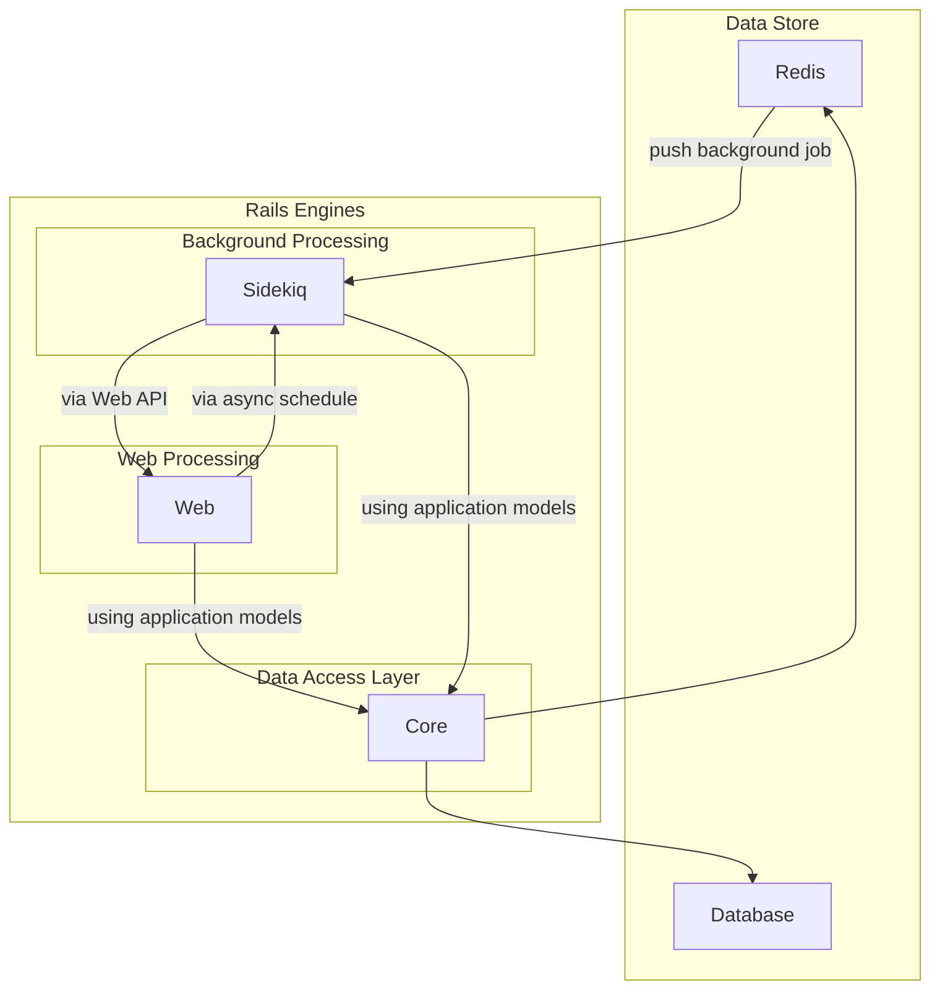
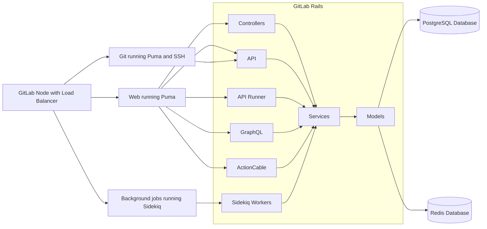
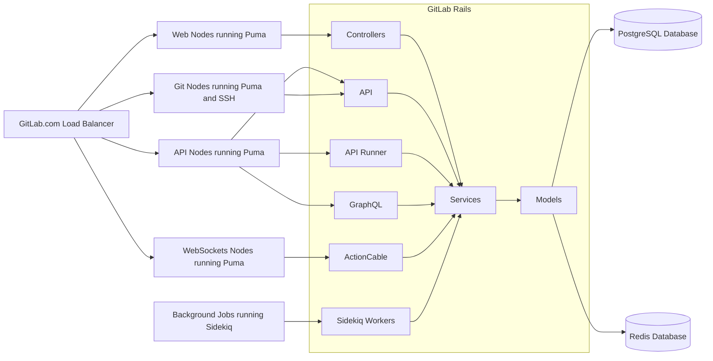

# Composable GitLab codebase - using Rails Engines

The one of the major risks of a single codebase is an infinite growth of the whole
application. The more code being added results in not only ever increasing resource requirements
for running the application, but increased application coupling and explosion of the complexity.

## Executive summary

This blueprint discusses an impact of introducing **Application Layers** as a way to reduce and improve the application
codebase. This discusses the positive and negative outcomes of the proposed solution and tries to estimate the impact
on GitLab.com and smaller installations.

**Application Layers** tries to split GitLab Rails codebase horizontally following the pattern of how we actually
run GitLab instead of vertical split. This follows the idea that a single feature needs to run in many different ways
(CI for example has Web interface, uses API, and performs background processing), and we are not able to easily
run only a given feature separate to the rest application (like CI) due to coupling.

The proposal itself does allow us to disconnect some aspects of the features. These aspects could be treated
as components that are run separately from the rest of the stack, but still sharing a large portion of core.
This model could be implemented to provide an API interface for external tooling (Runners API, Packages API, Feature Flags Unleash API)
and allow us to have much better resiliency and much easier way to scale application in the future.

The actual split was tested with the usage of [Rails Engines](https://guides.rubyonrails.org/engines.html)
implementing separate gems in a single repository. The [Rails Engines](https://guides.rubyonrails.org/engines.html)
allowed us to well describe the individual components with its dependencies and run an application
consisting of many Rails Engines.

The blueprint aims to retain all key aspects of GitLab success: single and monolithic codebase (with a [single data-store](https://about.gitlab.com/handbook/product/single-application/#single-data-store)),
but allows us to better model application and make our codebase more composable.

## Challenges of the Monolith (a current state)

Today the usage of monolith proves to be challenging in many cases. A single big monolith
codebase without clear boundaries results in a number of problems and inefficiencies, some of them being:

- Deep coupling makes application harder to develop in longer term, as it leads to a spaghetti implementation
  instead of considering building more interface-based architecture
- Deep coupling between parts of the codebase making it harder to test. To test only a small portion of application
  we usually need to run a whole test suite to confidently know which parts are affected. This to
  some extent can be improved by building a heuristic to aid this process, but it is prone to errors and hard
  to keep accurate at all times
- All components need to be loaded at all times in order to run only parts of the application
- Increased resource usage, as we load parts of the application that are rarely used in a given context
- The high memory usage results in slowing the whole application as it increases GC cycles duration
  creating significantly longer latency for processing requests or worse cache usage of CPUs
- Increased application boot-up times as we need to load and parse significantly more files
- Longer boot-up times slows down the development, as running application or tests takes significantly longer
  reducing velocity and amount of iterations

## Composable codebase dimensions

In general, we can think about two ways how codebase can be modeled:

- **vertically** in Bounded Contexts, each representing a domain of the application, ex.: All features related to CI are in a given context
- **horizontally** in Application Layers: Sidekiq, GraphQL, REST API, Web Controllers, all Domain Models and Services that interface with DB directly

This blueprint explicitly talks about **horizontal** split and **Application Layers**.

## Current state of Bounded Contexts (**vertical** split)

The Bounded Contexts is a topic that was discussed extensively number of times for a couple of years.
Reflected in number of issues:

- [Create new models / classes within a module / namespace](https://gitlab.com/gitlab-org/gitlab/-/issues/212156)
- [Make teams to be maintainers of their code](https://gitlab.com/gitlab-org/gitlab/-/issues/25872)
- [Use nested structure to organize CI classes](https://gitlab.com/gitlab-org/gitlab/-/issues/209745)
- [WIP: Make it simple to build and use "Decoupled Services"](https://gitlab.com/gitlab-org/gitlab/-/issues/31121)

We are partially executing a **Bounded Contexts** idea:

- Make each team to own their own namespace, namespace which is defined as a `module` in a codebase
- Make each team to own their own tests, as namespaces would define a clear boundaries
- Since we use namespaces, individual contributor or reviewer can know who to reach from domain experts about help with
  the given context

The module namespaces are actively being used today to model codebase around team boundaries. Currently, the most
prominent namespaces being used today are `Ci::` and `Packages::`. They provide a good way to contain the code owned
by a group in a well-defined structure.

However, the **Bounded Contexts** while it helps development, it does not help with the above stated goals. This is purely
a logical split of the code. This does not prevent deep-coupling. It is still possible to create a circular dependency (and it often happens)
between a background processing of CI pipeline and Runner API interface.
API can call Sidekiq Worker, Sidekiq can use API to create an endpoint path.

The **Bounded Contexts** do not make our codebase smarter to know what depends on what, as the whole codebase
is treated as single package that needs to be loaded and executed.

Possible additional considerations to the disadvantages of Bounded Context:

- It can lead to tribal knowledge and duplicate code
- The deep coupling can make it difficult to iterate and make minimal changes
- Changes may have cascading effects that are difficult to isolate due to the vertical split

## The Application Layers (**horizontal* split)

While we continue leveraging **Bounded Contexts** in form of namespace separation that aids development and review process
the **Application Layers** can provide a way to create a clean separation between different functional parts.

Our main codebase (`GitLab Rails` after a GitLab running on Ruby on Rails) consists many of implicit **Application Layers**.
There are no clear boundaries between each layer which results in a deep coupling.

The concept of **Application Layers** looks at the application from the perspective of how we run the application
instead of perspective of individual features (like CI or Packages). GitLab application today can be decomposed into the following
application layers. This list is not exhaustive, but shows a general list of the different parts of a single monolithic codebase:

- Web Controllers: process Web requests coming from users visiting web interface
- Web API: API calls coming from the automated tooling, in some cases also users visiting web interface
- Web Runners API: API calls from the Runners, that allows Runner to fetch new jobs, or update trace log
- Web GraphQL: provide a flexible API interface, allowing the Web frontend to fetch only the data needed thereby reducing the amount of compute and data transfer
- Web ActionCable: provide bi-directional connection to enable real-time features for Users visiting web interface
- Web Feature Flags Unleash Backend: provide an Unleash-compatible Server that uses GitLab API
- Web Packages API: provide a REST API compatible with the packaging tools: Debian, Maven, Container Registry Proxy, etc.
- Git nodes: all code required to authorize `git pull/push` over `SSH` or `HTTPS`
- Sidekiq: run background jobs
- Services/Models/DB: all code required to maintain our database structure, data validation, business logic and policies models that needs to be shared with other components

The best way to likely describe how the actual GitLab Rails split would look like. It is a satellite model.
Where we have a single core, that is shared across all satellite components. The design of that implies
that satellite components have a limited way to communicate with each other. In a single monolithic application
in most of cases application would communicate with a code. In a satellite model the communication needs
to be performed externally to the component. This can be via Database, Redis or using a well defined exposed API.



### Application Layers for on-premise installations

The on-premise installations are significantly smaller and they usually run GitLab Rails in two main flavors:



### Application Layers on GitLab.com

Due to its scale, GitLab.com requires much more attention to run. This is needed in order to better manage resources
and provide SLAs for different functional parts. The chart below provides a simplistic view of GitLab.com application layers.
It does not include all components, like Object Storage nor Gitaly nodes, but shows the GitLab Rails dependencies between
different components and how they are configured on GitLab.com today:



### Layer dependencies

The differences in how GitLab is run for on-premise versus how we run GitLab.com does show a main division line in GitLab Rails:

- Web: containing all API, all Controllers, all GraphQL and ActionCable functionality
- Sidekiq: containing all background processing jobs
- Core: containing all database, models and services that needs to be shared between Web and Sidekiq

Each of these top-level application layers do depend only on a fraction of the codebase with all relevant dependencies:

- In all cases we need the underlying database structure and application models
- In some cases we need dependent services
- We only need a part of the application common library
- We need gems to support the requested functionality
- Individual layers should not use another sibling layer (tight coupling), rather connect via API, Redis or DB to share data (loose coupling)

## Proposal

The Memory team group conducted a Proof-of-Concept phase to understand the impact of introducing **Application Layers**.
We did this to understand the complexity, impact, and needed iterations to execute this proposal.

The proposals here should be treated as evaluation of the impact of this blueprint,
but not a final solution to be implemented. The PoC as defined is not something that should be merged,
but serves as a basis for future work.

### PoC using Rails Engines

We decided to use Rails Engines by modeling a Web Application Layer. The Web Engine contained Controllers, API, GraphQL.
This allowed us to run Web Nodes with all dependencies, but measure the impact on Sidekiq not having these components loaded.

All work can be found in these merge requests:

- [Provide mechanism to load GraphQL with all dependencies only when needed](https://gitlab.com/gitlab-org/gitlab/-/issues/288044)
- [Draft: PoC - Move GraphQL to the WebEngine](https://gitlab.com/gitlab-org/gitlab/-/merge_requests/50180)
- [Draft: PoC - Move Controllers and Grape API:API to the WebEngine](https://gitlab.com/gitlab-org/gitlab/-/merge_requests/53720)
- [Draft: PoC - Move only Grape API:API to the WebEngine](https://gitlab.com/gitlab-org/gitlab/-/merge_requests/53982)
- [Measure performance impact for proposed web_engine](https://gitlab.com/gitlab-org/gitlab/-/issues/300548)

What was done?

- We used [Rails Engines](https://guides.rubyonrails.org/engines.html)
- The 99% of changes as visible in the above MRs is moving files as-is
- We moved all GraphQL code and specs into `engines/web_engine/` as-is
- We moved all API and Controllers code and specs into `engines/web_engine`
- We adapted CI to test `engines/web_engine/` as a self-sufficient component of stack
- We configured GitLab to load `gem web_engine` running Web nodes (Puma web server)
- We disabled loading `web_engine` when running Background processing nodes (Sidekiq)

#### Implementation details for proposed solution

1. Introduce new Rails Engine for each application layer.

    We created `engines` folder, which could contain different engines for each application layer we introduce in the future.

    In the above PoCs we introduced the new Web Application Layer, located in `engines/web_engine` folder.

1. Move all code and specs into `engines/web_engine/`

    - We moved all GraphQL code and specs into `engines/web_engine/` without changing files itself
    - We moved all Grape API and Controllers code into `engines/web_engine/` without changing files itself

1. Move gems to the `engines/web_engine/`

    - We moved all GraphQL gems to the actual web_engine Gemfile
    - We moved Grape API gem to the actual web_engine Gemfile

    ```ruby
    Gem::Specification.new do |spec|
      spec.add_dependency 'apollo_upload_server'
      spec.add_dependency 'graphql'
      spec.add_dependency 'graphiql-rails'

      spec.add_dependency 'graphql-docs'
      spec.add_dependency 'grape'
    end
     ```

1. Move routes to the `engines/web_engine/config/routes.rb` file

    - We moved GraphQL routes to the web_engine routes.
    - We moved API routes to the web_engine routes.
    - We moved most of the controller routes to the web_engine routes.

    ```ruby
    Rails.application.routes.draw do
      post '/api/graphql', to: 'graphql#execute'
      mount GraphiQL::Rails::Engine, at: '/-/graphql-explorer', graphql_path:
      Gitlab::Utils.append_path(Gitlab.config.gitlab.relative_url_root, '/api/graphql')

      draw :api

      #...
    end
    ```

1. Move initializers to the `engines/web_engine/config/initializers` folder

    - We moved `graphql.rb` initializer to the `web_engine` initializers folder
    - We moved `grape_patch.rb` and `graphe_validators` to the `web_engine` initializers folder

1. Connect GitLab application with the WebEngine

    In GitLab Gemfile.rb, add web_engine to the engines group

    ```ruby
    # Gemfile
    group :engines, :test do
      gem 'web_engine', path: 'engines/web_engine'
    end
    ```

    Since the gem is inside :engines group, it will not be automatically required by default.

1. Configure GitLab when to load the engine.

    In GitLab `config/engines.rb`, we can configure when do we want to load our engines by relying on our `Gitlab::Runtime`

    ```ruby
    # config/engines.rb
    # Load only in case we are running web_server or rails console
    if Gitlab::Runtime.web_server? || Gitlab::Runtime.console?
      require 'web_engine'
    end
    ```

1. Configure Engine

    Our Engine inherits from the `Rails::Engine` class. This way this gem notifies Rails that
    there's an engine at the specified path so it will correctly mount the engine inside
    the application, performing tasks such as adding the app directory of the engine to
    the load path for models, mailers, controllers, and views.
    A file at `lib/web_engine/engine.rb`, is identical in function to a standard Rails
    application's `config/application.rb` file. This way engines can access a configuration
    object which contains configuration shared by all railties and the application.
    Additionally, each engine can access `autoload_paths`, `eager_load_paths`, and `autoload_once_paths`
    settings which are scoped to that engine.

    ```ruby
    module WebEngine
      class Engine < ::Rails::Engine
        config.eager_load_paths.push(*%W[#{config.root}/lib
                                         #{config.root}/app/graphql/resolvers/concerns
                                         #{config.root}/app/graphql/mutations/concerns
                                         #{config.root}/app/graphql/types/concerns])

        if Gitlab.ee?
          ee_paths = config.eager_load_paths.each_with_object([]) do |path, memo|
            ee_path = config.root
                        .join('ee', Pathname.new(path).relative_path_from(config.root))
            memo << ee_path.to_s
          end
          # Eager load should load CE first
          config.eager_load_paths.push(*ee_paths)
        end
      end
    end
    ```

1. Testing

    We adapted CI to test `engines/web_engine/` as a self-sufficient component of stack.

    - We moved `spec` as-is files to the `engines/web_engine/spec` folder
    - We moved `ee/spec` as-is files to the `engines/web_engine/ee/spec` folder
    - We control specs from main application using environment variable `TEST_WEB_ENGINE`
    - We added new CI job that will run `engines/web_engine/spec` tests separately using `TEST_WEB_ENGINE` environment variable.
    - We added new CI job that will run `engines/web_engine/ee/spec` tests separately using `TEST_WEB_ENGINE` environment variable.
    - We are running all whitebox frontend tests with `TEST_WEB_ENGINE=true`

#### Results

The effect on introducing these changes:

- Savings for RSS
- 61.06 MB (7.76%) - Sidekiq without GraphQL
- 100.11 MB (12.73%) - Sidekiq without GraphQL and API
- 208.83 MB (26.56%) - Sidekiq without GraphQL, API, Controllers
- The size of Web nodes (running Puma) stayed the same as before

Savings on Sidekiq `start-up` event, for a single Sidekiq cluster without GraphQL, API, Controllers

- We saved 264.13 MB RSS (28.69%)
- We saved 264.09 MB USS (29.36%)
- Boot-up time was reduced from 45.31 to 21.80 seconds. It was 23.51 seconds faster (51.89%)
- We have 805,772 less live objects, 4,587,535 less allocated objects, 2,866 less allocated pages and 3.65 MB less allocated space for objects outside of the heap
- We loaded 2,326 less code files (15.64%)
- We reduced the duration of a single full GC cycle from 0.80s to 0.70 (12.64%)

Puma single, showed very little difference as expected.

More details can be found in the [issue](https://gitlab.com/gitlab-org/gitlab/-/issues/300548#note_516323444).

#### Impact on GitLab.com

Estimating the results for the scale of running GitLab.com, today we use:

- Currently individual GC cycle takes around [130ms for Web](https://thanos-query.ops.gitlab.net/graph?g0.range_input=1h&g0.max_source_resolution=0s&g0.expr=avg(rate(ruby_gc_duration_seconds_sum%7Bstage%3D%22main%22%2Ctype%3D%22web%22%7D%5B5m%5D)%2Frate(ruby_gc_duration_seconds_count%5B5m%5D))&g0.tab=0)
  and [200ms for Sidekiq](https://thanos-query.ops.gitlab.net/graph?g0.range_input=1h&g0.max_source_resolution=0s&g0.expr=avg(rate(ruby_gc_duration_seconds_sum%7Bstage%3D%22main%22%2Ctype%3D%22sidekiq%22%7D%5B5m%5D)%2Frate(ruby_gc_duration_seconds_count%5B5m%5D))&g0.tab=0) on GitLab.com
- On average we do around [2 GC cycles per-second](https://thanos-query.ops.gitlab.net/graph?g0.range_input=1h&g0.end_input=2021-02-17%2017%3A56&g0.max_source_resolution=0s&g0.expr=avg(rate(ruby_gc_duration_seconds_count%7Bstage%3D%22main%22%2Ctype%3D%22web%22%7D%5B5m%5D))&g0.tab=0)
  or [0.12 cycles per second for Sidekiq](https://thanos-query.ops.gitlab.net/graph?g0.range_input=1h&g0.end_input=2021-02-17%2017%3A56&g0.max_source_resolution=0s&g0.expr=avg(rate(ruby_gc_duration_seconds_count%7Bstage%3D%22main%22%2Ctype%3D%22sidekiq%22%7D%5B5m%5D))&g0.tab=0)
- This translates to using [around 9.5 vCPUs per-second for Web](https://thanos-query.ops.gitlab.net/graph?g0.range_input=1h&g0.max_source_resolution=0s&g0.expr=sum(rate(ruby_gc_duration_seconds_sum%7Bstage%3D%22main%22%2Ctype%3D%22web%22%7D%5B5m%5D))&g0.tab=0)
  and [around 8 vCPUs per-second for Sidekiq](https://thanos-query.ops.gitlab.net/graph?g0.range_input=1h&g0.max_source_resolution=0s&g0.expr=sum(rate(ruby_gc_duration_seconds_sum%7Bstage%3D%22main%22%2Ctype%3D%22sidekiq%22%7D%5B5m%5D))&g0.tab=0) of spend on GC alone
- Sidekiq [uses 2.1GB on average](https://thanos-query.ops.gitlab.net/graph?g0.range_input=1h&g0.max_source_resolution=0s&g0.expr=max(ruby_process_unique_memory_bytes%7Btype%3D%22sidekiq%22%7D)%2F1024%2F1024%2F1024&g0.tab=1)
  or [550GB in total](https://thanos-query.ops.gitlab.net/graph?g0.range_input=1h&g0.max_source_resolution=0s&g0.expr=sum(ruby_process_unique_memory_bytes%7Btype%3D%22sidekiq%22%7D)%2F1024%2F1024%2F1024&g0.tab=0) of memory on GitLab.com

We estimate the possible maximum savings for introducing `web_engine`:

- Reduce a GC cycle time by 20%, from to 200ms to 160ms
- The amount of GC cycles per-second would stay the same, but due to GC cycle time reduction we would use around 6 vCPUs instead of 8 vCPUs
- In the best case we would be looking at Sidekiq alone we would be estimating to save up-to 137GB of memory on GitLab.com

This model could be extended to introduce `sidekiq_engine` giving a similar benefits
(even more important due to visible impact on users) for Web nodes.

#### Outcome

We achieved a number of benefits introducing these changes.

Pros:

- Significantly lower memory usage
- Significantly shorter application load time for Sidekiq
- Significantly improved responsiveness of Sidekiq service due to much shorter GC cycles
- Significantly easier testing of a portion of application, ex. changing `web_engines/` does require
  re-running test only for this application layer
- We retained a monolithic architecture of the codebase, but sharing database and application models
- A significant saving from the infrastructure side
- Ability to comfortably run on constrained environments by reducing application footprint

Cons:

- It is harder to implement GraphQL subscriptions as in case of Sidekiq as we need another way to pass subscriptions
- `api_v4` paths can be used in some services that are used by Sidekiq (e.g. `api_v4_projects_path`)
- url_helpers paths are used in models and services, that could be used by Sidekiq (e.g. `Gitlab::Routing.url_helpers.project_pipelines_path` is used by [ExpirePipelineCacheService](https://gitlab.com/gitlab-org/gitlab/-/blob/master/app/services/ci/expire_pipeline_cache_service.rb#L20) in [ExpirePipelineCacheWorker](https://gitlab.com/gitlab-org/gitlab/-/blob/master/app/workers/expire_pipeline_cache_worker.rb#L18))

#### Example: GraphQL

[Draft: PoC - Move GraphQL to the WebEngine](https://gitlab.com/gitlab-org/gitlab/-/merge_requests/50180)

- The [99% of changes](https://gitlab.com/gitlab-org/gitlab/-/merge_requests/50180/diffs?commit_id=49c9881c6696eb620dccac71532a3173f5702ea8) as visible in the above MRs is moving files as-is.
- The [actual work](https://gitlab.com/gitlab-org/gitlab/-/merge_requests/50180/diffs?commit_id=1d9a9edfa29ea6638e7d8a6712ddf09f5be77a44) on fixing cross-dependencies, specs, and configuring web_engine
- We [adapted](https://gitlab.com/gitlab-org/gitlab/-/merge_requests/50180/diffs?commit_id=d7f862cc209ce242000b2aec88ff7f4485acdd92) CI to test `engines/web_engine/` as a self-sufficient component of stack

Today, loading GraphQL requires a bunch of [dependencies](https://gitlab.com/gitlab-org/gitlab/-/issues/288044):

> We also discovered that we load/require 14480 files, [memory-team-2gb-week#9](https://gitlab.com/gitlab-org/memory-team/memory-team-2gb-week/-/issues/9#note_452530513)
> when we start GitLab. 1274 files belong to GraphQL. This means that if we don't load 1274 application files
> and all related GraphQL gems when we don't need them (Sidekiq), we could save a lot of memory.

GraphQL only needs to run in a specific context. If we could limit when it is being loaded we could effectively improve application efficiency, by reducing application load time and required memory. This, for example, is applicable for every size installation.

A potential challenge with GraphQL and Websockets is that at some point we might want to use Action Cable subscriptions and push GraphQL/API payload from Sidekiq to clients. This would likely utilize Redis to pass data through. Where Sidekiq would publish information on Redis and ActionCable Node would pass through that information to connected clients. This way of working is possible in the above model, but we would have to use GraphQL or API (over HTTP endpoint) to calculate what should be sent.

An alternative way is to use a notification system that would always make an `ActionCable` node (the one handling WebSockets) generate a payload based on a send query instead of performing passthrough. This could be applicable since `ActionCable` is the one handling a given connection for a client. This could have a downside of having to recalculate the same payload if many clients would be watching the same resource. However, this behavior of system might still be desired for security purposes, as generated payload might be dependent on permission of watching client (we would show different for anonymous, and different for the member of the project).

#### Example: API

[Draft: PoC - Move only Grape API:API to the WebEngine](https://gitlab.com/gitlab-org/gitlab/-/merge_requests/53982)

- [99% of the changes](https://gitlab.com/gitlab-org/gitlab/-/merge_requests/53982/diffs?commit_id=c8b72249b6e8f875ed4c713f0668207377604043), as visible in the above MRs, are moving the files as-is.
- The [actual work](https://gitlab.com/gitlab-org/gitlab/-/merge_requests/53982/diffs?commit_id=00d9b54ba952c85ff4d158a18205c2fac13eaf8d) on fixing cross-dependencies, specs, configuring initializers, gems and routes.

Grape::API is another example that only needs to run only in a web server context.

Potential challenges with Grape API:

- Currently there are some API::API dependencies in the models (e.g. `API::Helpers::Version` dependency in [project model](https://gitlab.com/gitlab-org/gitlab/-/blob/master/app/models/project.rb#L2019) or API::API dependency in GeoNode model for [`geo_retrieve_url`](https://gitlab.com/gitlab-org/gitlab/-/blob/master/ee/app/models/geo_node.rb#L183))
- `api_v4` paths are used in helpers, presenters, and views (e.g. `api_v4_projects_path` in [PackagesHelper](https://gitlab.com/gitlab-org/gitlab/-/blob/master/app/helpers/packages_helper.rb#L17))

#### Example: Controllers

[Draft: PoC - Move Controllers and Grape API:API to the WebEngine](https://gitlab.com/gitlab-org/gitlab/-/merge_requests/53720)

- [99% of the changes](https://gitlab.com/gitlab-org/gitlab/-/merge_requests/53720/diffs?commit_id=17174495cf3263c8e69a0420092d9fa759170aa6), as visible in the above MRs, are moving files as-is.
- The [actual work](https://gitlab.com/gitlab-org/gitlab/-/merge_requests/53720/diffs?commit_id=39cc4bb1e0ce47f66605d06eb1b0d6b89ba174e6) on fixing cross-dependencies, specs, configuring initializers, gems and routes.

Controllers, Serializers, some presenters and some of the Grape:Entities are also good examples that only need to be run in web server context.

Potential challenges with moving Controllers:

- We needed to extend `Gitlab::Patch::DrawRoute` in order to support `engines/web_engine/config/routes` and `engines/web_engine/ee/config/routes` in case when `web_engine` is loaded. Here is potential [solution](https://gitlab.com/gitlab-org/gitlab/-/merge_requests/53720#note_506957398).
- `Gitlab::Routing.url_helpers` paths are used in models and services, that could be used by Sidekiq (e.g. `Gitlab::Routing.url_helpers.project_pipelines_path` is used by [ExpirePipelineCacheService](https://gitlab.com/gitlab-org/gitlab/-/blob/master/app/services/ci/expire_pipeline_cache_service.rb#L20) in [ExpirePipelineCacheWorker](https://gitlab.com/gitlab-org/gitlab/-/blob/master/app/workers/expire_pipeline_cache_worker.rb#L18)))

### Packwerk

NOTE:
Packwerk is currently accepting bug fixes only, and it is not being actively developed. Check for [more details](https://github.com/Shopify/packwerk#note-packwerk-is-considered-to-be-feature-complete-for-shopifys-uses-we-are-currently-accepting-bug-fixes-only-and-it-is-not-being-actively-developed-please-fork-this-project-if-you-are-interested-in-adding-new-features)

## Future impact

**Application Layers** and this proposal currently defines only `web_engine`. Following the same pattern we could easily introduce
additional engines dedicated for supporting that would allow us to maintain much better separation, lower memory usage
and much better maintainability of GitLab Rails into the future.

This would be a framework for introducing all new interfaces for features that do not need to be part of the core codebase,
like support for additional Package services. Allowing us to better scale application in the future, but retaining a single codebase
and monolithic architecture of GitLab.

As of today, it seems reasonable to define three **application layers**:

- `gitlab-core`: a core functionality: DB structure, models, services, common library. It models a data access layer, and initially all services needed to run GitLab. This might be potentially be split in the future into smaller aspects
- `gitlab-web`: a Controllers/API/GraphQL/ActionCable functionality needed to run in a web server context (depends on `gitlab-core`)
- `gitlab-sidekiq`: a background jobs functionality needed to run Sidekiq Workers (depends on `gitlab-core`)

This model is best described today as a shared core with satellite. The shared core defines data access layer, where as satellites define a way to present and process this data. Satellites can only talk with Core. They cannot directly load or talk to another satellite unless they use a well defined interface in form of API, GraphQL or Redis (as for scheduling Sidekiq jobs).

It is reasonable to assume that we limit how many `engines` we allow. Initial proposal is to allow up to 5 engines
to be created to ensure that we do not have explosion of engines.

## Issues and Merge Requests

- [Split application into functional parts to ensure that only needed code is loaded with all dependencies](https://gitlab.com/gitlab-org/gitlab/-/issues/290935)
- [Provide mechanism to load GraphQL with all dependencies only when needed](https://gitlab.com/gitlab-org/gitlab/-/issues/288044)
- [Draft: PoC - Move GraphQL to the WebEngine](https://gitlab.com/gitlab-org/gitlab/-/merge_requests/50180)
- [Draft: PoC - Move Controllers and Grape API:API to the WebEngine](https://gitlab.com/gitlab-org/gitlab/-/merge_requests/53720)
- [Draft: PoC - Move only Grape API:API to the WebEngine](https://gitlab.com/gitlab-org/gitlab/-/merge_requests/53982)
- [Measure performance impact for proposed web_engine](https://gitlab.com/gitlab-org/gitlab/-/issues/300548)
- [Create new models / classes within a module / namespace](https://gitlab.com/gitlab-org/gitlab/-/issues/212156)
- [Make teams to be maintainers of their code](https://gitlab.com/gitlab-org/gitlab/-/issues/25872)
- [Use nested structure to organize CI classes](https://gitlab.com/gitlab-org/gitlab/-/issues/209745)
- [WIP: Make it simple to build and use "Decoupled Services"](https://gitlab.com/gitlab-org/gitlab/-/issues/31121)
- [Rails takes awhile to boot, let's see if we can improve this](https://gitlab.com/gitlab-org/gitlab/-/issues/213992)

## Who

Proposal:

<!-- vale gitlab.Spelling = NO -->

| Role                         | Who
|------------------------------|-------------------------|
| Author                       |    Kamil Trzciński      |
| Architecture Evolution Coach |    ?                    |
| Engineering Leader           |    ?                    |

DRIs:

| Role                         | Who
|------------------------------|------------------------|
| Product                      |    ?                   |
| Leadership                   |    Craig Gomes         |
| Engineering                  |    ?                   |

Domain Experts:

| Role                         | Who
|------------------------------|------------------------|
| Domain Expert                | Nikola Milojevic       |
| Domain Expert                |    ?                   |
| Domain Expert                |    ?                   |

<!-- vale gitlab.Spelling = YES -->
