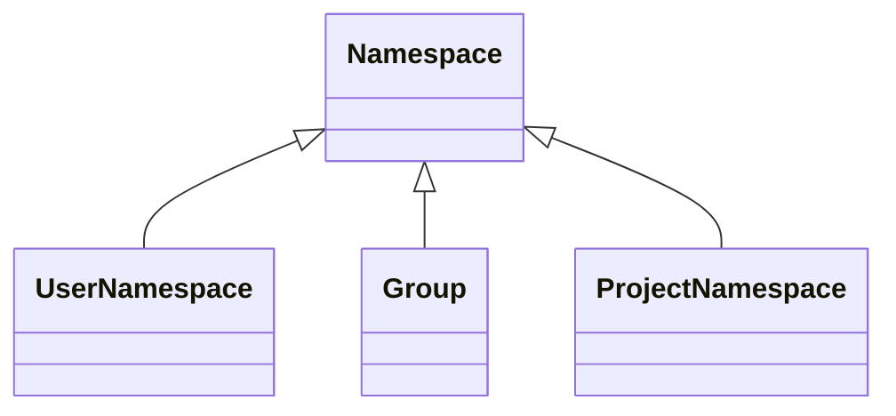

<!-- vale gitlab.FutureTense = NO -->

# Consolidating Groups and Projects

Numerous features exist exclusively within groups or projects. The boundary between group and project features used to be clear.
However, there is growing demand to have group features in projects, and
project features in groups. For example, having issues in groups, and epics
in projects.

The [Simplify Groups & Projects Working Group](https://handbook.gitlab.com/handbook/company/working-groups/simplify-groups-and-projects/)
determined that our architecture is a significant hurdle in sharing features
across groups and projects.

Architecture issue: <https://gitlab.com/gitlab-org/architecture/tasks/-/issues/7>

## Challenges

### Feature duplication

When a feature needs to be made available on a different level, we have
no established process in place. This results in the reimplementation of
the same feature. Those implementations diverge from each other over time as
they all live on their own. A few more problems with this approach:

- Features are coupled to their container. In practice, it is not straight
  forward to decouple a feature from its container. The degree of coupling
  varies across features.
- Naive duplication of features will result in a more complex and fragile codebase.
- Generalizing solutions across groups and projects may degrade system performance.
- The range of features spans across many teams, and these changes will need to
  manage development interference.
- The group/project hierarchy creates a natural feature hierarchy. When features
  exist across containers the feature hierarchy becomes ambiguous.
- Duplication of features slows down development velocity.

There is potential for significant architectural changes. These changes will
have to be independent of the product design, so that customer experience
remains consistent.

### Performance

Resources can only be queried in elaborate/complicated ways. This caused
performance issues with authorization, epics, and many other places. As an
example, to query the projects a user has access to, the following sources need
to be considered:

- Personal projects
- Direct group membership
- Direct project membership
- Inherited group membership
- Inherited project membership
- Group sharing
- Inherited membership via group sharing
- Project sharing

Group/project membership, group/project sharing are also examples of
duplicated features.

## Goals

For now, this blueprint strictly relates to the engineering challenges.

- Consolidate the group and project container architecture.
- Develop a set of solutions to decouple features from their container.
- Decouple engineering changes from product changes.
- Develop a strategy to make architectural changes without adversely affecting
  other teams.
- Provide a solution for requests asking for features to be made available at other levels.

## Proposal

Use our existing `Namespace` model as a container for features. We already have
a `Namespace` associated with `User` (personal namespace), and with `Group`
(which is a subclass of `Namespace`). We can extend this further, by associating
`Namespace` with `Projects` by introducing `ProjectNamespaces`. Each `Project`
should be owned by its `ProjectNamespace`, and this relation should replace the
existing `Project` <-> `Group` / personal namespace relation.

We also lack a model specific for personal namespaces, and we use the generic
`Namespace` model instead. This is confusing, but can be fixed by creating a
dedicated subclass: `UserNamespace`.

As a result, the `Namespace` hierarchy will transition to:

New features should be implemented on `Namespace`. Similarly, when a feature
need to be reimplemented on a different level, moving it to `Namespace`
essentially makes it available on all levels:

- Personal namespaces
- Groups
- Projects

Various traversal queries are already available on `Namespaces` to query the
group hierarchy. `Projects` represent the leaf nodes in the hierarchy, but with
the introduction of `ProjectNamespace`, these traversal queries can be used to
retrieve projects as well.

This also enables further simplification of some of our core features:

- Routes should be generated based on the `Namespace` hierarchy, instead of
  mixing the project with the group hierarchy.
- There is no need to differentiate between `GroupMembers` and `ProjectMembers`.
  All `Members` should be related to a `Namespace`. This can lead to simplified
  querying, and potentially deduplicating policies.

As more and more features will be migrated to `Namespace`, the role of the `Project`
model will diminish over time to essentially a container around the repository
related functionality.

## Iterations

The work required to establish `Namespace` as a container for our features is
tracked under [Consolidate Groups and Projects](https://gitlab.com/groups/gitlab-org/-/epics/6473)
epic.

### Phase 1 (complete)

- [Phase 1 epic](https://gitlab.com/groups/gitlab-org/-/epics/6697).
- **Goals**:
  1. Ensure every project receives a corresponding record in the `namespaces`
     table with `type='Project'`.
  1. For user namespaces, the type changes from `NULL` to `User`.

We should make sure that projects, and the project namespace, are equivalent:

- **Create project:** Use Rails callbacks to ensure a new project namespace is
  created for each project. Project namespace records should contain `created_at` and
  `updated_at` attributes equal to the project's `created_at`/`updated_at` attributes.
- **Update project:** Use the `after_save` callback in Rails to ensure some
  attributes are kept in sync between project and project namespaces.
  Read [`project#after_save`](https://gitlab.com/gitlab-org/gitlab/blob/6d26634e864d7b748dda0e283eb2477362263bc3/app/models/project.rb#L101-L101)
  for more information.
- **Delete project:** Use FKs cascade delete or Rails callbacks to ensure when a `Project`
  or its `ProjectNamespace` is removed, its corresponding `ProjectNamespace` or `Project`
  is also removed.
- **Transfer project to a different group:** Make sure that when a project is transferred,
  its corresponding project namespace is transferred to the same group.
- **Transfer group:** Make sure when transferring a group that all of its sub-projects,
  either direct or through descendant groups, have their corresponding project
  namespaces transferred correctly as well.
- **Export or import project**
  - **Export project** continues to export only the project, and not its project namespace,
    in this phase. The project namespace does not contain any specific information
    to export at this point. Eventually, we want the project namespace to be exported as well.
  - **Import project** creates a new project, so the project namespace is created through
    Rails `after_save` callback on the project model.
- **Export or import group:** When importing or exporting a `Group`, projects are not
  included in the operation. If that feature is changed to include `Project` when its group is
  imported or exported, the logic must include their corresponding project namespaces
  in the import or export.

After ensuring these points, run a database migration to create a `ProjectNamespace`
record for every `Project`. Project namespace records created during the migration
should have `created_at` and `updated_at` attributes set to the migration runtime.
The project namespaces' `created_at` and `updated_at` attributes would not match
their corresponding project's `created_at` and `updated_at` attributes. We want
the different dates to help audit any of the created project namespaces, in case we need it.
After this work completes, we must migrate data as described in
[Backfill `ProjectNamespace` for every Project](https://gitlab.com/gitlab-org/gitlab/-/issues/337100).

### Phase 2 (complete)

- [Phase 2 epic](https://gitlab.com/groups/gitlab-org/-/epics/6768).
- **Goal**: Link `ProjectNamespace` to other entities on the database level.

In this phase:

- Communicate the changes company-wide at the engineering level. We want to make
  engineers aware of the upcoming changes, even though teams are not expected to
  collaborate actively until phase 3.
- Raise awareness to avoid regressions and conflicting or duplicate work that
  can be dealt with before phase 3.

### Phase 3 (ongoing)

- [Phase 3 epic](https://gitlab.com/groups/gitlab-org/-/epics/6585).

In this phase we are migrating basic, high-priority project functionality from `Project` to `ProjectNamespace`, or directly to `Namespace`. Problems to solve as part of this phase:

- [Unify members/members actions](https://gitlab.com/groups/gitlab-org/-/epics/8010) - on UI and API level.
- Starring: Right now only projects can be starred. We want to bring this to the group level.
- Common actions: Destroying, transferring, restoring. This can be unified on the controller level and then propagated lower.
- Archiving currently only works on the project level. This can be brought to the group level, similar to the mechanism for "pending deletion".
- Avatar's serving and actions.

### Phase 4

- [Phase 4 epic](https://gitlab.com/groups/gitlab-org/-/epics/8687)

In this phase we are migrating additional functionality from `Project` to `ProjectNamespace`/`Namespace`:

- Replace usages of `Project` with `ProjectNamespace` in the code.
- API changes to expose namespaces and namespace features.
  - Investigate if we extend API for `groups` or we introduce a `namespaces` endpoint and slowly deprecate `groups` and `projects` endpoints.
- Break down each feature that needs to be migrated from `Project` to `ProjectNamespace` or `Namespace`.
  - Investigate if we can move a feature from `Project -> Namespace` directly vs `Project -> ProjectNamespace -> Namespace`. This can be decided on a feature by feature case.
- [Migrate Project#namespace to reference ProjectNamespace](https://gitlab.com/groups/gitlab-org/-/epics/6581).
- [Routes consolidation between Project & ProjectNamespace](https://gitlab.com/gitlab-org/gitlab/-/issues/337103).
- [Policies consolidation](https://gitlab.com/groups/gitlab-org/-/epics/6689).

### Phase 5

- [Phase 5 epic](https://gitlab.com/groups/gitlab-org/-/epics/6944)

We should strive to do the code clean up as we move through the phases. However, not everything can be cleaned up while something is still being developed. For example, dropping database columns can be done as the last task when we are sure everything is working. This phase will focus on:

- Code cleanup
- Database cleanup

## Migrating features to Namespaces

The initial iteration will provide a framework to house features under `Namespaces`. Stage groups will eventually need to migrate their own features and functionality over to `Namespaces`. This may impact these features in unexpected ways. Therefore, to minimize UX debt and maintain product consistency, stage groups will have to consider several factors when migrating their features over to `Namespaces`:

1. **Conceptual model**: What are the current and future state conceptual models of these features ([see object modeling for designers](https://hpadkisson.medium.com/object-modeling-for-designers-an-introduction-7871bdcf8baf))? These should be documented in Pajamas (example: [merge requests](https://design.gitlab.com/objects/merge-request/)).
1. **Merge conflicts**: What inconsistencies are there across project, group, and administrator levels? How might these be addressed? For an example of how we rationalized this for labels, see [this issue](https://gitlab.com/gitlab-org/gitlab/-/issues/338820).
1. **Inheritance & information flow**: How is information inherited across our container hierarchy currently? How might this be impacted if complying with the new [inheritance behavior](https://gitlab.com/gitlab-org/gitlab/-/issues/343316) framework?
1. **Settings**: Where can settings for this feature be found currently? How will these be impacted by `Namespaces`?
1. **Access**: Who can access this feature and is that impacted by the new container structure? Are there any role or privacy considerations?
1. **Tier**: Is there any tier functionality that is differentiated by projects and groups?
1. **Documentation**: Is the structure and content of documentation impacted by these changes at all?
1. **Solution proposal**:
   - Think big: This analysis provides a great opportunity to zoom out and consider the feature UX as a whole. How could you make this feature lovable based on the new structure, inheritance, and capabilities afforded by `Namespaces`? Is there any UI which doesn't comply with Pajamas?
   - Start small: What are the product changes that need to be made to assist with the migration?
   - Move fast: Prioritise these solution ideas, document in issues, and create a roadmap for implementation.

## Related topics

- [Organization developer documentation](../../../development/organization/index.md)
- [Organization user documentation](../../../user/organization/index.md)
