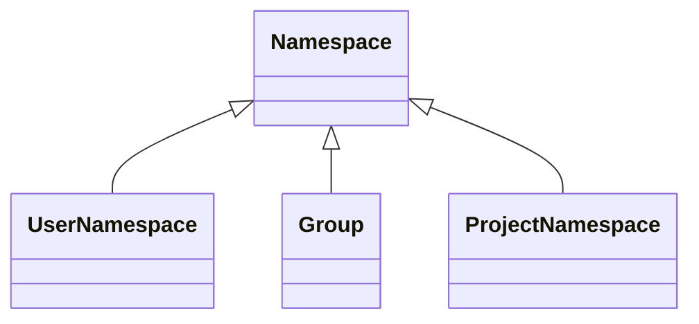

# Consolidating Group and Project

There are numerous features that exist exclusively within groups or
projects. The boundary between group and project features used to be clear.
However, there is growing demand to have group features within projects, and
project features within groups. For example, having issues in groups, and epics
in projects.

The [Simplify Groups & Projects Working Group](https://about.gitlab.com/company/team/structure/working-groups/simplify-groups-and-projects/)
determined that our architecture is a significant hurdle in sharing features
across groups and projects.

Architecture issue: <https://gitlab.com/gitlab-org/architecture/tasks/-/issues/7>

## Challenges

### Feature duplication

When a feature needs to be made available on a different level, we have
no established process in place. This results in the reimplementation of
the same feature. Those implementations diverge from each other over time as
they all live on their own. A few more problems with this approach:

- Features are coupled to their container. In practice it is not straight
  forward to decouple a feature from its container. The degree of coupling
  varies across features.
- Naive duplication of features will result in a more complex and fragile code base.
- Generalizing solutions across groups and projects may degrade system performance.
- The range of features span across many teams, and these changes will need to
  manage development interference.
- The group/project hierarchy creates a natural feature hierarchy. When features
  exist across containers the feature hierarchy becomes ambiguous.
- Duplication of features slows down development velocity.

There is potential for significant architectural changes. These changes will
have to be independent of the product design, so that customer experience
remains consistent.

### Performance

Resources can only be queried in elaborate / complicated ways. This caused
performance issues with authorization, epics, and many other places. As an
example, to query the projects a user has access to, the following sources need
to be considered:

- personal projects
- direct group membership
- direct project membership
- inherited group membership
- inherited project membership
- group sharing
- inherited membership via group sharing
- project sharing

Group / project membership, group / project sharing are also examples of
duplicated features.

## Goals

For now this blueprint strictly relates to the engineering challenges.

- Consolidate the group and project container architecture.
- Develop a set of solutions to decouple features from their container.
- Decouple engineering changes from product changes.
- Develop a strategy to make architectural changes without adversely affecting
  other teams.
- Provide a solution for requests asking for features availability of other levels.

## Proposal

Use our existing `Namespace` model as a container for features. We already have
a `Namespace` associated with `User` (personal namespace), and with `Group`
(which is a subclass of `Namespace`). We can extend this further, by associating
`Namespace` with `Projects` by introducing `ProjectNamespaces`. Each `Project`
should be owned by its `ProjectNamespace`, and this relation should replace the
existing `Project` <-> `Group` / personal namespace relation.

We also lack a model specific for personal namespaces, and we use the generic
`Namespace` model instead. This is confusing, but can be fixed by creating a
dedicated subclass: `UserNamespace`.

As a result, the `Namespace` hierarchy will transition to:

New features should be implemented on `Namespace`. Similarly, when a feature
need to be reimplemented on a different level, moving it to `Namespace`
essentially makes it available on all levels:

- personal namespaces
- groups
- projects

Various traversal queries are already available on `Namespaces` to query the
group hierarchy. `Projects` represents the leaf nodes in the hierarchy, but with
the introduction of `ProjectNamespace`, these traversal queries can be used to
retrieve projects as well.

This also enables further simplification of some of our core features:

- routes should be generated based on the `Namespace` hierarchy, instead of
  mixing project with the group hierarchy.
- there is no need to differentiate between `GroupMembers` and `ProjectMembers`.
  All `Members` should be related to a `Namespace`. This can lead to simplified
  querying, and potentially deduplicating policies.

As more and more features will be migrated to `Namespace`, the role of `Project`
model will diminish over time to essentially a container around repository
related functionality.

## Iterations

The work required to establish `Namespace` as a container for our features is
tracked under [Consolidate Groups and Projects](https://gitlab.com/groups/gitlab-org/-/epics/6473)
epic.

## Who

Proposal:

<!-- vale gitlab.Spelling = NO -->

| Role                         | Who
|------------------------------|-------------------------------------|
| Author                       | Alex Pooley, Imre Farkas            |
| Architecture Evolution Coach | Dmitriy Zaporozhets, Grzegorz Bizon |
| Engineering Leader           | Michelle Gill                       |
| Domain Expert                | Jan Provaznik                       |

<!-- vale gitlab.Spelling = YES -->

DRIs:

<!-- vale gitlab.Spelling = NO -->

| Role                         | Who
|------------------------------|------------------------|
| Product                      | Melissa Ushakov        |
| Leadership                   | Michelle Gill          |
| Engineering                  | Imre Farkas            |

<!-- vale gitlab.Spelling = YES -->
