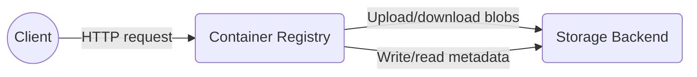
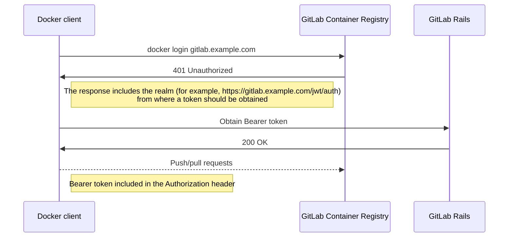
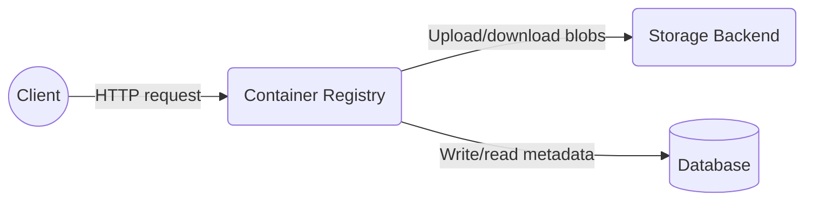

# Container Registry Metadata Database

## Usage of the GitLab Container Registry

With the [Container Registry](https://gitlab.com/gitlab-org/container-registry) integrated into GitLab, every GitLab project can have its own space to store its Docker images. You can use the registry to build, push and share images using the Docker client, CI/CD or the GitLab API.

Each day on GitLab.com, between [150k and 200k images are pushed to the registry](https://app.periscopedata.com/app/gitlab/527857/Package-GitLab.com-Stage-Activity-Dashboard?widget=9620193&udv=0), generating about [700k API events](https://app.periscopedata.com/app/gitlab/527857/Package-GitLab.com-Stage-Activity-Dashboard?widget=7601761&udv=0). It's also worth noting that although some customers use other registry vendors, [more than 96% of instances](https://app.periscopedata.com/app/gitlab/527857/Package-GitLab.com-Stage-Activity-Dashboard?widget=9832282&udv=0) are using the GitLab Container Registry.

For GitLab.com and for GitLab customers, the Container Registry is a critical component to building and deploying software.

## Current Architecture

The Container Registry is a single [Go](https://golang.org/) application. Its only dependency is the storage backend on which images and metadata are stored.

Client applications (for example, GitLab Rails and Docker CLI) interact with the Container Registry through its [HTTP API](https://gitlab.com/gitlab-org/container-registry/-/blob/master/docs/spec/api.md). The most common operations are pushing and pulling images to/from the registry, which require a series of HTTP requests in a specific order. The request flow for these operations is detailed in the [Request flow](https://gitlab.com/gitlab-org/container-registry/-/blob/master/docs-gitlab/push-pull-request-flow.md).

The registry supports multiple [storage backends](https://gitlab.com/gitlab-org/container-registry/-/blob/master/docs/configuration.md#storage), including Google Cloud Storage (GCS) which is used for the GitLab.com registry. In the storage backend, images are stored as blobs, deduplicated, and shared across repositories. These are then linked (like a symlink) to each repository that relies on them, giving them access to the central storage location.

The name and hierarchy of repositories, as well as image manifests and tags are also stored in the storage backend, represented by a nested structure of folders and files. [This video](https://www.youtube.com/watch?v=i5mbF2bgWoM&feature=youtu.be) gives a practical overview of the registry storage structure.

### Clients

The Container Registry has two main clients: the GitLab Rails application and the Docker client/CLI.

#### Docker

The Docker client (`docker` CLI) interacts with the GitLab Container Registry mainly using the [login](https://docs.docker.com/engine/reference/commandline/login/), [push](https://docs.docker.com/engine/reference/commandline/push/) and [pull](https://docs.docker.com/engine/reference/commandline/pull/) commands.

##### Login and Authentication

GitLab Rails is the default token-based authentication provider for the GitLab Container Registry.

Once the registry receives a request sent by an unauthenticated Docker client, it will reply with `401 Unauthorized` and instruct the client to obtain a token from the GitLab Rails API. The Docker client will then request a Bearer token and embed it in the `Authorization` header of all requests. The registry is responsible for determining if the user is authentication/authorized to perform those requests based on the provided token.

Please refer to the [Docker documentation](https://docs.docker.com/registry/spec/auth/token/) for more details.

##### Push and Pull

Push and pull commands are used to upload and download images, more precisely manifests and blobs. The push/pull flow is described in the [documentation](https://gitlab.com/gitlab-org/container-registry/-/blob/master/docs-gitlab/push-pull-request-flow.md).

#### GitLab Rails

GitLab Rails interacts with the registry through the HTTP API and consumes its webhook notifications.

##### From GitLab Rails to Registry

The single entrypoint for the registry is the [HTTP API](https://gitlab.com/gitlab-org/container-registry/-/blob/master/docs/spec/api.md). GitLab Rails invokes the API to perform all operations, which include:

| Operation                                                    | UI                 | Background               | Observations                                                 |
| ------------------------------------------------------------ | ------------------ | ------------------------ | ------------------------------------------------------------ |
| [Check API version](https://gitlab.com/gitlab-org/container-registry/-/blob/master/docs/spec/api.md#api-version-check) | :heavy_check_mark: | :heavy_check_mark:       | Used globally to ensure that the registry supports the Docker Distribution V2 API, as well as for identifying whether GitLab Rails is talking to the GitLab Container Registry or a third-party one (used to toggle features only available in the former). |
| [List repository tags](https://gitlab.com/gitlab-org/container-registry/-/blob/master/docs/spec/api.md#listing-image-tags) | :heavy_check_mark: | :heavy_check_mark:       | Used to list and show tags in the UI. Used to list tags in the background for [cleanup policies](../../../user/packages/container_registry/#cleanup-policy) and [Geo replication](../../../administration/geo/replication/docker_registry.md). |
| [Check if manifest exists](https://gitlab.com/gitlab-org/container-registry/-/blob/master/docs/spec/api.md#existing-manifests) | :heavy_check_mark: | :heavy_multiplication_x: | Used to get the digest of a manifest by tag. This is then used to pull the manifest and show the tag details in the UI. |
| [Pull manifest](https://gitlab.com/gitlab-org/container-registry/-/blob/master/docs/spec/api.md#pulling-an-image-manifest) | :heavy_check_mark: | :heavy_multiplication_x: | Used to show the image size and the manifest digest in the tag details UI. |
| [Pull blob](https://gitlab.com/gitlab-org/container-registry/-/blob/master/docs/spec/api.md#pulling-a-layer) | :heavy_check_mark: | :heavy_multiplication_x: | Used to show the configuration digest and the creation date in the tag details UI. |
| [Delete tag](https://gitlab.com/gitlab-org/container-registry/-/blob/master/docs/spec/api.md#deleting-a-tag) | :heavy_check_mark: | :heavy_check_mark:       | Used to delete a tag from the UI and in background (cleanup policies). |

A valid authentication token is generated in GitLab Rails and embedded in all these requests before sending them to the registry.

##### From Registry to GitLab Rails

The registry supports [webhook notifications](https://docs.docker.com/registry/notifications/) to notify external applications when an event occurs, such as an image push.

For GitLab, the registry is currently [configured](https://gitlab.com/gitlab-org/container-registry/-/blob/master/docs/configuration.md#notifications) to deliver notifications for image push events to the GitLab Rails API. These notifications are currently used for Snowplow metrics and Geo replication.

### Challenges

#### Garbage Collection

The container registry relies on an offline *mark* and *sweep* garbage collection (GC) algorithm. To run it, the registry needs to be either shutdown or set to read-only, remaining like that during the whole GC run.

During the *mark* phase, the registry analyzes all repositories, creating a list of configurations, layers, and manifests that are referenced/linked in each one of them. The registry will then list all existing configurations, layers, and manifests (stored centrally) and obtain a list of those that are not referenced/linked in any repository. This is the list of blobs eligible for deletion.

With the output from the *mark* phase in hand, the registry starts the *sweep* phase, where it will loop over all blobs identified as eligible for deletion and delete them from the storage backend, one by one.

Doing this for a huge registry may require multiple hours/days to complete, during which the registry must remain in read-only mode. This is not feasible for platforms with tight availability requirements, such as GitLab.com.

This limitation is also described in the upstream [Docker Distribution documentation](https://github.com/docker/distribution/blob/749f6afb4572201e3c37325d0ffedb6f32be8950/ROADMAP.md#deletes).

#### Performance

Due to the current architecture and its reliance on the (possibly remote) storage backend to store repository and image metadata, even the most basic operations, such as listing repositories or tags, can become prohibitively slow, and it only gets worse as the registry grows in size.

For example, to be able to tell which repositories exist, the registry has to walk through all folders in the storage backend and identify repositories in them. Only when all folders that exist have been visited, the registry can then reply to the client with the list of repositories. If using a remote storage backend (such as GCS or S3), performance becomes even worse, as for each visited folder multiple HTTP requests are required to list and inspect their contents.

#### Consistency

Some storage backends, like S3, can only provide [eventual consistency](https://docs.aws.amazon.com/AmazonS3/latest/dev/Introduction.html#ConsistencyModel). As an example, reading a blob after deleting it can succeed for a short amount of time. Eventual consistency could be problematic when paired with online garbage collection, as read requests at the API level could continue to succeed for deleted blobs.

#### Insights

For similar reasons as highlighted above, currently, it's not feasible to extract valuable information from the registry, such as how much space a repository is using, which repositories are using the most space, which ones are more active, detailed push/pull metrics for each image or tag, and others. Not having access to these insights and metrics strongly weakens the ability to make informed decisions in regards to the product strategy.

#### Additional Features

Due to the metadata limitations, it's currently not feasible to implement valuable features such as [pagination](https://gitlab.com/gitlab-org/container-registry/-/issues/13#note_271769891), filtering and sorting for HTTP API, and more advanced features such as the ability to [distinguish between Docker and Helm charts images](https://gitlab.com/gitlab-org/gitlab/-/issues/38047).

Because of all these constraints, we decided to [freeze the development of new features](https://gitlab.com/gitlab-org/container-registry/-/issues/44) until we have a solution in place to overcome all these foundational limitations.

## New Architecture

To overcome all challenges described above, we started an effort to migrate the registry metadata (the list of blobs, repositories, and which manifest/layers are referenced/linked in each one of them) from the storage backend into a [PostgreSQL database](#database).

The ultimate goal of the new architecture is to enable online garbage collection ([&2313](https://gitlab.com/groups/gitlab-org/-/epics/2313)), but once the database is in place, we will also be able to implement all features that have been blocked by the metadata limitations. The performance of the existing API should drastically increase as well.

The introduction of a database will affect the registry architecture, as we will have one more component involved:

With a database in place, the registry will no longer use the storage backend to write and read metadata. Instead, metadata will be stored and manipulated on the PostgreSQL database. The storage backend will then be used only for uploading and downloading blobs.

The interaction between the registry and its clients, including GitLab Rails and the Docker client, will remain unchanged, as documented in the [Current Architecture](#current-architecture) section. The architectural changes and the database are internal only. The registry HTTP API and webhook notifications will also remain unchanged.

### Database

Following the GitLab [Go standards and style guidelines](../../../development/go_guide), no ORM is used to manage the database, only the [`database/sql`](https://golang.org/pkg/database/sql/) package from the Go standard library, a PostgreSQL driver ([`lib/pq`](https://pkg.go.dev/github.com/lib/pq?tab=doc)) and raw SQL queries, over a TCP connection pool.

The design and development of the registry database adhere to the GitLab [database guidelines](../../../development/database/). Being a Go application, the required tooling to support the database will have to be developed, such as for running database migrations.

Running *online* and [*post deployment*](../../../development/post_deployment_migrations.md) migrations is already supported by the registry CLI, as described in the [documentation](https://gitlab.com/gitlab-org/container-registry/-/blob/master/docs-gitlab/database-migrations.md).

#### Partitioning

The registry database will be partitioned from start to achieve greater performance (by limiting the amount of data to act upon and enable parallel execution), easier maintenance (by splitting tables and indexes into smaller units), and high availability (with partition independence). By partitioning the database from start we can also facilitate a sharding implementation later on if necessary.

Although blobs are shared across repositories, manifest and tag metadata are scoped by repository. This is also visible at the API level, where all write and read requests (except [listing repositories](https://gitlab.com/gitlab-org/container-registry/-/blob/a113d0f0ab29b49cf88e173ee871893a9fc56a90/docs/spec/api.md#listing-repositories)) are scoped by repository, with its namespace being part of the request URI. For this reason, after [identifying access patterns](https://gitlab.com/gitlab-org/gitlab/-/issues/234255), we decided to partition manifests and tags by repository and blobs by digest, ensuring that lookups are always performed by partition key for optimal performance. The initial version of the partitioned schema was documented [in a merge request](https://gitlab.com/gitlab-com/www-gitlab-com/-/merge_requests/60918).

#### GitLab.com

Due to scale, performance and isolation concerns, for GitLab.com the registry database will be on a separate dedicated PostgreSQL cluster. Please see [#93](https://gitlab.com/gitlab-org/container-registry/-/issues/93) and [GitLab-com/gl-infra/infrastructure#10109](https://gitlab.com/gitlab-com/gl-infra/infrastructure/-/issues/10109) for additional context.

The diagram below illustrates the architecture of the database cluster:

##### Expected Rate and Size Requirements

[Rate](https://gitlab.com/gitlab-org/container-registry/-/issues/94) and [size](https://gitlab.com/gitlab-org/container-registry/-/issues/61#note_446609886) requirements for the GitLab.com database were extrapolated based on the `dev.gitlab.org` registry and are available in the linked issues.

#### Self-Managed Instances

By default, for self-managed instances, the registry will have a separate logical database in the same PostgreSQL instance/cluster as the GitLab database. However, it will be possible to configure the registry to use a separate instance/cluster if needed.

#### PostgreSQL

During the discussion of the [initial database schema](https://gitlab.com/gitlab-org/gitlab/-/issues/207147), we have decided to opt for PostgreSQL over other database engines mainly because:

- It offers all the features we need, including the ACID guarantees of an RDBMS, and partitioning;
- It is already used for GitLab, thus we have the required experience and tools in place to manage it;
- We want to offer self-managed customers the possibility of hosting the registry database within the same PostgreSQL instance that they already have for GitLab.

##### Version 12

PostgreSQL introduced significant improvements for partitioning in [version 12](https://www.postgresql.org/docs/12/release-12.html#id-1.11.6.9.5), among which we highlight:

- It's now possible for foreign keys to reference partitioned tables. This is a hard requirement for this project not only to guarantee consistency and integrity but also to enable cascading deletes at the database level;
- Major performance improvements for inserts, selects, and updates with less locking and consistent performance for a large number of partitions ([benchmarks](https://www.2ndquadrant.com/en/blog/postgresql-12-partitioning/));
- Major improvements to the planning algorithm for tables with a large number of partitions, with some tests finding speedups of up to 10,000 times ([source](https://aws.amazon.com/blogs/database/postgresql-12-a-deep-dive-into-some-new-functionality/));
- Attaching new partitions to an existing table no longer requires locking the entire table;
- Bulk load (`COPY`) now uses bulk inserts instead of inserting one row at a time;

To leverage these features and performance improvements, we need to use PostgreSQL 12 from the start.

GitLab currently ships with PostgreSQL 11 for self-managed instances. That is _likely_ to change in 14.0, with PostgreSQL 12 becoming the minimum required version, which will likely happen before the upgraded registry becomes available for self-managed instances. If not, self-managed instances will have two options:

1. Administrators can manually provision and configure a separate PostgreSQL 12 database for the registry, allowing them to benefit from features provided by the new registry and its metadata database.
1. Continue to use the current registry without the database if online garbage collection is not a concern or provisioning a separate database is not possible. We will continue supporting the current version with security backports and bug fixes for the foreseeable feature.

It's important to note that apart from online garbage collection, the metadata database's availability will unblock the implementation of many requested features for the GitLab Container Registry, which will only be available for instances using the new version backed by the metadata database.

### Availability

Apart from the authentication service and the blob storage backend, the registry gains one more dependency with the new architecture - the database. Given that the registry can only be as reliable as its dependencies, the database deployment should be projected for high availability. A gradual migration approach should help to identify and mitigate implementation and resource constraints for high availability environments.

#### HTTP API

This is a list of all the registry HTTP API operations and how they depend on the storage backend and the new database. The registry will return an error response if any dependencies are not available when processing a request.

| Operation                                                                                                                      | Method   | Path                                    | Requires Database | Requires Storage | Used by GitLab Rails * |
|--------------------------------------------------------------------------------------------------------------------------------|----------|-----------------------------------------|-------------------|------------------|------------------------|
| [Check API version](https://gitlab.com/gitlab-org/container-registry/-/blob/master/docs/spec/api.md#api-version-check)         | `GET`    | `/v2/`                                  | ✖                 | ✖                | ✔                      |
| [List repositories](https://gitlab.com/gitlab-org/container-registry/-/blob/master/docs/spec/api.md#listing-repositories)      | `GET`    | `/v2/_catalog`                          | ✔                 | ✖                | ✖                      |
| [List repository tags](https://gitlab.com/gitlab-org/container-registry/-/blob/master/docs/spec/api.md#listing-image-tags)     | `GET`    | `/v2/<name>/tags/list`                  | ✔                 | ✖                | ✔                      |
| [Delete tag](https://gitlab.com/gitlab-org/container-registry/-/blob/master/docs/spec/api.md#deleting-a-tag)                   | `DELETE` | `/v2/<name>/tags/reference/<reference>` | ✔                 | ✖                | ✔                      |
| [Check if manifest exists](https://gitlab.com/gitlab-org/container-registry/-/blob/master/docs/spec/api.md#existing-manifests) | `HEAD`   | `/v2/<name>/manifests/<reference>`      | ✔                 | ✖                | ✔                      |
| [Pull manifest](https://gitlab.com/gitlab-org/container-registry/-/blob/master/docs/spec/api.md#pulling-an-image-manifest)     | `GET`    | `/v2/<name>/manifests/<reference>`      | ✔                 | ✖                | ✔                      |
| [Push manifest](https://gitlab.com/gitlab-org/container-registry/-/blob/master/docs/spec/api.md#pushing-an-image-manifest)     | `PUT`    | `/v2/<name>/manifests/<reference>`      | ✔                 | ✖                | ✖                      |
| [Delete manifest](https://gitlab.com/gitlab-org/container-registry/-/blob/master/docs/spec/api.md#deleting-an-image)           | `DELETE` | `/v2/<name>/manifests/<reference>`      | ✔                 | ✖                | ✖                      |
| [Check if blob exists](https://gitlab.com/gitlab-org/container-registry/-/blob/master/docs/spec/api.md#existing-layers)        | `HEAD`   | `/v2/<name>/blobs/<digest>`             | ✔                 | ✖                | ✖                      |
| [Pull blob](https://gitlab.com/gitlab-org/container-registry/-/blob/master/docs/spec/api.md#fetch-blob)                        | `GET`    | `/v2/<name>/blobs/<digest>`             | ✔                 | ✔                | ✔                      |
| [Delete blob](https://gitlab.com/gitlab-org/container-registry/-/blob/master/docs/spec/api.md#delete-blob)                     | `DELETE` | `/v2/<name>/blobs/<digest>`             | ✔                 | ✖                | ✖                      |
| [Start blob upload](https://gitlab.com/gitlab-org/container-registry/-/blob/master/docs/spec/api.md#starting-an-upload)        | `POST`   | `/v2/<name>/blobs/uploads/`             | ✔                 | ✔                | ✖                      |
| [Check blob upload status](https://gitlab.com/gitlab-org/container-registry/-/blob/master/docs/spec/api.md#get-blob-upload)    | `GET`    | `/v2/<name>/blobs/uploads/<uuid>`       | ✔                 | ✔                | ✖                      |
| [Push blob chunk](https://gitlab.com/gitlab-org/container-registry/-/blob/master/docs/spec/api.md#chunked-upload-1)            | `PATCH`  | `/v2/<name>/blobs/uploads/<uuid>`       | ✔                 | ✔                | ✖                      |
| [Complete blob upload](https://gitlab.com/gitlab-org/container-registry/-/blob/master/docs/spec/api.md#put-blob-upload)        | `PUT`    | `/v2/<name>/blobs/uploads/<uuid>`       | ✔                 | ✔                | ✖                      |
| [Cancel blob upload](https://gitlab.com/gitlab-org/container-registry/-/blob/master/docs/spec/api.md#canceling-an-upload)      | `DELETE` | `/v2/<name>/blobs/uploads/<uuid>`       | ✔                 | ✔                | ✖                      |

`*` Please refer to the [list of interactions between registry and Rails](#from-gitlab-rails-to-registry) to know why and how.

#### Failure Scenarios

With the addition of a database, it is essential to highlight possible failure scenarios, how we expect the registry to behave in such conditions, and their impact on the registry availability and functionality.

##### Database Failover

In case of refused connections or timeouts when attempting to connect to the database, which might happen during a failover scenario, the registry will discard broken connections upfront and attempt to open a new one from the pool immediately.

The application will not panic in this scenario. It will try to establish a new connection for every request. If failed, an HTTP `503 Service Unavailable` error is returned to clients, and the error is logged and reported to Sentry. There is no retry cadence. The registry will only try to establish a new connection when another request that requires database access is received.

It is also possible to configure the registry to periodically check the health of the database server using a TCP health checker with a configurable interval and threshold ([docs](https://gitlab.com/gitlab-org/container-registry/-/blob/master/docs/configuration.md#tcp)). In case the health check fails, incoming requests will be halted with an HTTP `503 Service Unavailable` error.

Once the database server is available again, the registry will gracefully reconnect on the next incoming request, restoring the full API functionality without human intervention.

The expected registry behavior will be covered with integration tests, using a programmable TCP proxy between the registry and a database server to simulate a failover scenario.

##### Connection Pool Saturation

If unable to pull a connection from the pool to serve a given request, the registry will timeout and return an HTTP `500 Internal Server Error` error to the client and report the error to Sentry. These issues should trigger a development escalation to investigate why the pool is being exhausted. There might be too much load for the preconfigured pool size, or there might be transactions holding on to connections for too long.

Prometheus metrics should be used to create alerts to act on a possible saturation before the application starts erroring. Special attention will be paid to these scenarios during the gradual migration of the GitLab.com registry, where we will have limited, gradual, and controlled exposure on the new registry nodes. During that process, we can identify usage patterns, observe metrics, and fine tune both infrastructure and application settings accordingly as the load increases. If needed, a rate limiting algorithm may be applied to limit impact. Decisions will be based on real data to avoid overly restrictive measures and premature optimizations.

The expected registry behavior will be covered with integration tests by manipulating the pool size and spawning multiple concurrent requests against the API, putting pressure on the pool and eventually exhausting its capacity.

##### Latency

Excessive latency on established connections is hard to detect and debug, as these might not raise an application error or network timeout in normal circumstances but usually precede them.

For this reason, the duration of database queries used to serve HTTP API requests should be instrumented using metrics, allowing the detection of unusual variations and trigger alarms accordingly before an excessive latency becomes a timeout or service unavailability.

The expected registry behavior will be covered with integration tests, using a programmable TCP proxy between the registry and a database server to simulate increasing latency scenarios.

##### Problematic Migrations

Apart from unusual network and systems conditions, problematic migrations and data failures can also affect the database availability and, as a consequence, the registry availability.

Database migrations will adhere to the same [development best practices](../../../development/database/) used for GitLab Rails, except Rails-specific methods and tools, as the registry is a Go application with no ORM, and migrations are therefore expressed with raw SQL statements. Regardless, all changes will require a review and approval from the Database team.

Database migrations will be idempotent, with guard clauses used whenever necessary. It is also intended to guarantee that they are forward compatible. For a clustered environment, a node running registry version `N` should not cause any issues when the database schema is from version `N`+1.

### Observability

Adding one more component to the system makes it even more critical to guarantee that we have proper observability over the registry's behavior and its dependencies. It should be guaranteed that we have all the necessary tools in place before rolling out the new registry backed by the metadata database.

For this purpose, [error reporting with Sentry](https://gitlab.com/gitlab-com/gl-infra/infrastructure/-/issues/11297), [improved structured logging](https://gitlab.com/gitlab-com/gl-infra/infrastructure/-/issues/10933), and [improved HTTP metrics](https://gitlab.com/gitlab-com/gl-infra/infrastructure/-/issues/10935) were already implemented and released. At the time of writing, the GitLab.com rollout is in progress.

Additionally, the Prometheus metrics will be augmented with [details on the database connection pool](https://gitlab.com/gitlab-org/container-registry/-/issues/238). These will be added to the registry Grafana dashboards, joining the existing HTTP API, deployment, and storage metrics. The database cluster for the registry [will also have metrics and alerts](https://gitlab.com/gitlab-com/gl-infra/infrastructure/-/issues/11447).

Together, these resources should provide an adequate level of insight into the registry's performance and behavior.

### New Features and Breaking Changes

#### Third-Party Container Registries

GitLab ships with the GitLab Container Registry by default, but it's also compatible with third-party registries, as long as they comply with the [Docker Distribution V2 Specification](https://docs.docker.com/registry/spec/api/), now superseded by the [Open Container Initiative (OCI) Image Specification](https://github.com/opencontainers/image-spec/blob/master/spec.md).

So far, we strived to maintain full compatibility with third-party registries when adding new features. For example, in 12.8, we introduced a new [tag delete feature](https://gitlab.com/gitlab-org/gitlab/-/merge_requests/23325) to delete a single tag without deleting the underlying manifest. Because this feature is not part of the Docker or OCI specifications, we have kept the previous behavior as a fallback option to maintain compatibility with third-party registries.

However, this will likely change in the future. Apart from online garbage collection, and as described in [challenges](#challenges), the metadata database will unblock the implementation of many requested features for the GitLab Container Registry in the mid/long term. Most of these features will only be available for instances using the GitLab Container Registry. They are not part of the Docker Distribution or OCI specifications, neither we will be able to provide a compatible fallback option.

For this reason, any features that require the use of the GitLab Container Registry will be disabled if using a third-party registry, for as long as third-party registries continue to be supported.

#### Synchronizing Changes With GitLab Rails

Currently, the GitLab Rails and GitLab Container Registry releases and deployments have been fully independent, as we have not introduced any new API features or breaking changes, apart from the described tag delete feature.

The registry will remain independent from GitLab Rails changes, but in the mid/long term, the implementation of new features or breaking changes will imply a corresponding change in GitLab Rails, so the latter will depend on a specific minimum version of the registry.

For example, to track the size of each repository, we may extend the metadata database to store that information and then propagate it to GitLab Rails by extending the HTTP API that it consumes. In GitLab Rails, this new information would likely be stored in its database and processed to offer a new feature at the UI/API level.

This kind of changes will require a synchronization between the GitLab Rails and the GitLab Container Registry releases and deployments, as the former will depend on a specific version of the latter.

##### Feature Toggling

All GitLab Rails features dependent on a specific version of the registry should be guarded by validating the registry vendor and version.

This is already done to determine whether a tag should be deleted using the new tag delete feature (only available in the GitLab Container Registry v2.8.1+) or the old method. In this case, GitLab Rails sends an `OPTIONS` request to the registry tag route to determine whether the `DELETE` method is supported or not.

Alternatively, and as the universal long-term solution, we need to determine the registry vendor, version, and supported features (the last two are only applicable if the vendor is GitLab) and persist it in the GitLab Rails database. This information can then be used in realtime to toggle features or fallback to alternative methods, if possible. The initial implementation of this approach was introduced as part of [#204839](https://gitlab.com/gitlab-org/gitlab/-/issues/204839). Currently, it's only used for metrics purposes. Further improvements are required to guarantee that the version information is kept up to date in self-managed instances, where the registry may be hot swapped.

##### Release and Deployment

As described above, feature toggling offers a last line of defense against desynchronized releases and deployments, ensuring that GitLab Rails remains functional in case the registry version that supports new features is not yet available.

However, the release and deployment of GitLab Rails and the GitLab Container Registry should be synchronized to avoid any delays. Contrary to GitLab Rails, the registry release and deployment are manual processes, so special attention must be paid by maintainers to ensure that the GitLab Rails changes are only released and deployed after the corresponding registry changes.

As a solution to strengthen this process, a file can be added to the GitLab Rails codebase, containing the minimum required version of the registry. This file should be updated with every change that depends on a specific version of the registry. It should also be considered when releasing and deploying GitLab Rails, ensuring that the pipeline only goes through once the specified minimum required registry version is deployed.

## Iterations

1. Design metadata database schema;
1. Add support for managing metadata using the database;
1. Design plans and tools to facilitate the migration of small, medium and large repositories;
1. Implement online garbage collection;
1. Create database clusters in staging and production for GitLab.com;
1. Create automated deployment pipeline for GitLab.com;
1. Deployment and gradual migration of the existing registry for GitLab.com;
1. Rollout support for the metadata database to self-managed installs.

A more detailed list of all tasks, as well as periodic progress updates can be found in the epic [&2313](https://gitlab.com/groups/gitlab-org/-/epics/2313).

## Relevant Links

- [Allow admin to run garbage collection with zero downtime](https://gitlab.com/groups/gitlab-org/-/epics/2313)
- [Proposal for continuous, on-demand online garbage collection](https://gitlab.com/gitlab-org/container-registry/-/issues/199)
- [Gradual migration proposal for the GitLab.com container registry](https://gitlab.com/gitlab-org/container-registry/-/issues/191)
- [Create a self-serve registry deployment](https://gitlab.com/groups/gitlab-com/gl-infra/-/epics/316)
- [Database cluster for container registry](https://gitlab.com/gitlab-com/gl-infra/infrastructure/-/issues/11154)

## Who

Proposal:

<!-- vale gitlab.Spelling = NO -->

| Role                         | Who
|------------------------------|-------------------------|
| Author                       |      João Pereira       |
| Architecture Evolution Coach | Gerardo Lopez-Fernandez |
| Engineering Leader           |                         |
| Domain Expert                |          Hayley Swimelar               |

DRIs:

| Role                         | Who
|------------------------------|------------------------|
| Product                      |    Tim Rizzi                     |
| Leadership                   |                        |
| Engineering                  |              João Pereira           |
