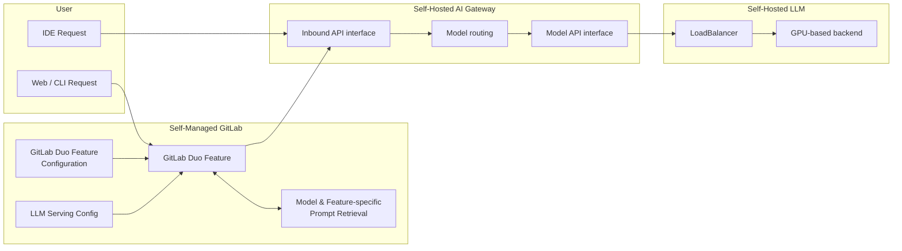

<!-- Blueprints often contain forward-looking statements -->
<!-- vale gitlab.FutureTense = NO -->

# Self-Hosted Model Deployment

This Blueprint describes support for customer self-deployments of Mistral LLMs as a backend for GitLab Duo features, as an alternative to the default Vertex or Anthropic models offered on GitLab Dedicated and .com. This initiative supports both internet connected and air-gapped GitLab deployments.

## Motivation

Self-hosted LLM models allow customers to manage the end-to-end transmission of requests to enterprise-hosted LLM backends for [GitLab Duo features](../../../user/ai_features.md), and keep all requests within their enterprise network. GitLab provides as a default LLM backends of Google Vertex and Anthropic, hosted externally to GitLab. GitLab Duo feature developers are able to access other LLM choices via the AI Gateway. More details on model and region information can be [found here](https://gitlab.com/groups/gitlab-org/-/epics/13024#current-feature-outline).

### Goals

Self-Managed models serve sophisticated customers capable of managing their own LLM infrastructure. GitLab provides the option to connect supported models to LLM features. Model-specific prompts and GitLab Duo feature support is provided by the self-hosted models feature.

- Choice of LLM models
- Ability to keep all data and request/response logs within their own domain
- Ability to select specific GitLab Duo Features for their users
- Non-reliance on the .com AI Gateway

### Non-Goals

Other features that are goals of the Custom Models group and which may have some future overlap are explicitly out of scope for the current iteration of this blueprint. These include:

- Local Models
- RAG
- Fine Tuning
- GitLab managed hosting of open source models, other than the current supported third party models.
- Bring Your Own API Key (BYOK)

## Proposal

GitLab will provide support for specific LLMs hosted in a customer's infrastructure. The customer will self-host the AI Gateway, and self-host one or more LLMs from a predefined list. Customers will then configure their GitLab instance for specific models by LLM feature. A different model can be chosen for each GitLab Duo feature.

This feature is accessible at the instance-level and is intended for use in GitLab Self-Managed instances.

Self-hosted model deployment is a [GitLab Duo Enterprise Add-on](https://about.gitlab.com/pricing/).

## Design and implementation details

### Component Architecture

#### Diagram Notes

- **User request**: A GitLab Duo Feature is accessed from one of three possible starting points (Web UI, IDE or Git CLI). The IDE communicates directly with the AI Gateway.
- **LLM Serving Config**: The existence of a customer-hosted model along with its connectivity information is declared in GitLab Rails and exposed to the AI Gateway with an API.
- **GitLab Duo Feature Configuration**: For each supported GitLab Duo feature, a user may select a supported model and the associated prompts are automatically loaded.
- **Prompt Retrieval**: GitLab Rails chooses and processes the correct prompt(s) based on the GitLab Duo Feature and model being used
- **Model Routing**: The AI Gateway routes the request to the correct external AI endpoint. The current default for GitLab Duo features is either Vertex or Anthropic. If a Self-Managed model is used, the AI Gateway must route to the correct customer-hosted model's endpoint. The customer-hosted model server details are the `LLM Serving Config` and retrieved from GitLab Rails as an API call. They may be cached in the AI Gateway.
- **Model API interface**: Each model serving has its own endpoint signature. The AI Gateway needs to be able to communicate using the right signature. We will support commonly supported model serving formats such as the OpenAI API spec.

### Configuration

Configuration is set at the GitLab instance-level; for each GitLab Duo feature a drop-down list of options will be presented. The following options will be available:

- Self-hosted model 1
- Self-hosted model n
- Feature Inactive

In the initial implementation a single self-hosted Model will be supported, but this will be expanded to a number of GitLab-defined models.

### AI Gateway Deployment

Customers will be required to deploy a local instance of the AI Gateway in their own infrastructure. The initial means to do this is via Docker container, as described [in this issue](https://gitlab.com/gitlab-org/gitlab/-/issues/452489).

Self-hosted Runway will be the preferred delivery mechanism for deploying the AI Gateway. Future options, in order of preference are:

- Runway [discussion](https://gitlab.com/gitlab-com/gl-security/security-assurance/fedramp/fedramp-certification/-/issues/452#note_1832261170)
- Kubernetes deployment [issue](https://gitlab.com/gitlab-org/gitlab/-/issues/452490)
- Omnibus packaging [issue](https://gitlab.com/gitlab-org/omnibus-gitlab/-/issues/8467)

It should be noted that deployment by Docker container is a temporary measure only, and will be superceeded by the three options listed above.

### Prompt Support

For each supported model and supported GitLab Duo feature, prompts will be developed and evaluated by GitLab. They will be baked into the Rails Monolith source code.

When the standard prompts are migrated into either the AI Gateway or a prompt template repository (direction is to be determined), the prompts supporting self-hosted models will also be migrated.

### Supported LLMs

- [Mistral-7B-v0.1](https://huggingface.co/mistralai/Mistral-7B-v0.1)
- [Mixtral-8x7B-instruct](https://huggingface.co/mistralai/Mixtral-8x7B-Instruct-v0.1)
- [Mixtral 8x22B](https://huggingface.co/mistral-community/Mixtral-8x22B-v0.1)
- [CodeGemma 7B IT](https://huggingface.co/google/codegemma-7b-it)
- [CodeGemma 2B](https://huggingface.co/google/codegemma-2b)

Installation instructions will be added to the Developer documentation. [issue](https://gitlab.com/gitlab-org/gitlab/-/issues/452509)

### GitLab Duo Feature Support

| Feature             | Default Model                | Mistral 7B | Mixtral-8x7B | Mixtral 8x22B  | CodeGemma 7B | CodeGemma 2B |
|---------------------|------------------------------|------------|--------------|----------------|--------------|--------------|
| GitLab Duo Chat     | Anthropic Claude-3           | 🔎         | 🔎            | 🔎             | 🔎           | 🔎           |
| Code Completion     | Vertex AI Codey code-gecko   | 🚫         | 🚫            | 🚫             |  ✅          | ✅           |
| Code Generation     | Anthropic Claude-3           | ✅         | ✅            |  ✅            | 🔎           | 🔎           |
| Git Suggestions     | Vertex AI Codey codechat-bison  | 🔎      | 🔎            | 🔎             | 🔎           | 🔎           |
| Discussion Summary  | Vertex AI Codey text-bison   | 🔎         | 🔎            | 🔎             | 🔎           | 🔎           |
| Issue Description Generation | Anthropic Claude-2  | 🔎         | 🔎            | 🔎             | 🔎           | 🔎           |
| Test Generation     | Anthropic Claude-2           | 🔎         | 🔎            | 🔎             | 🔎           | 🔎           |
| MR template population | Vertex AI Codey text-bison | 🔎        | 🔎            | 🔎             | 🔎           | 🔎           |
| Suggested Reviewers | GitLab In-House Model         | 🔎        | 🔎            | 🔎             | 🔎           | 🔎           |
| Merge request summary | Vertex AI Codey text-bison  | 🔎        | 🔎            | 🔎             | 🔎           | 🔎           |
| Code review summary | Vertex AI Codey text-bison    | 🔎        | 🔎            | 🔎             | 🔎           | 🔎           |
| Vulnerability explanation | Vertex AI Codey text-bison Anthropic | 🚫 | 🔎      | 🔎             | 🔎           | 🔎           |
| Vulnerability resolution | Vertex AI Codey code-bison  | 🔎     | 🔎            | 🔎             | 🔎           | 🔎           |
| Code explanation | Vertex AI Codey codechat-bison      | 🔎        | 🔎            | 🔎             | 🔎           | 🔎           |
| Root cause analysis | Vertex AI Codey text-bison       | 🔎        | 🔎            | 🔎             | 🔎           | 🔎           |
| Value stream forecasting | GitLab In-House Model       | 🔎        | 🔎            | 🔎             | 🔎           | 🔎           |

- The `Suggested Reviewers` and `Value stream forecasting` models are Convolutional Neural Networks (CNNs) developed in-house by GitLab.
- ✅ `Supported` : means the GitLab Duo feature is supported for this model
- 🚫 `Not Supported`: the GitLab Duo feature is not supported for this model
- 🔎 `To be Evaluated`: research is needed to determine if this feature will be supported
- GitLab Duo Chat can also use Vertex AI Codey textembedding-gecko
- Vulnerability explanation can fall back to Claude-2 if degraded performance

#### RAG / Duo Chat tools

Most of the tools available to Duo Chat behave the same for self-hosted models as
they do in the GitLab-hosted AI Gateway architecture. Below are the expections:

##### Duo Documentation search

Duo documentation search performed through the GitLab-managed AI Gateway (`cloud.gitlab.com`) relies on [VertexAI Search](../gitlab_rag/index.md),
which is not available for air-gapped customers. As a replacement, only within the scope of
self-hosted, air-gapped customers, an index of GitLab documentation has been provided
within the self-hosted AI Gateway.

This index is an SQLite database that allows for full-text search. An index is
generated for each GitLab version and saved into a generic package registry. The index that matches the customer's GitLab version is then downloaded by the self-hosted AI Gateway.

Using a local index does bring some limitations:

- [BM25 search](https://en.wikipedia.org/wiki/Okapi_BM25) performs worse in the presence of typos, and the performance also depends on how the index was built
- Given that the indexed tokens depend on how the corpus was cleaned (stemming, tokenisation, punctuation), the same text cleaning steps need to be applied to the user query for it to properly match the indexes
- Local search diverges from other already implemented solutions, and creates a split between self-managed and GitLab-hosted instances of the AI Gateway.

Over time, we intend to replace this solution with a self-hosted Elasticsearch/OpenSearch
alternative, but as of now, the percentage of self-hosted customers that have
[Elasticsearch enabled is low](https://gitlab.com/gitlab-org/gitlab/-/issues/438178#current-adoption).

For further discussion, refer to the [proof of concept](https://gitlab.com/gitlab-org/modelops/applied-ml/code-suggestions/ai-assist/-/merge_requests/974).

**Index creation**

Index creation and implementation is being worked on as part of [this epic](https://gitlab.com/groups/gitlab-org/-/epics/14282)

**Evaluation**

Evaluation of the local-search is being worked on as part of [this epic](https://gitlab.com/gitlab-org/gitlab/-/issues/468666).

#### LLM-hosting

Customers will self-manage LLM hosting. We provided limited documentation on how
customers can host their own [LLMs](../../../administration/self_hosted_models/install_infrastructure.md)

#### GitLab Duo License Management

The Self-Managed GitLab Rails will self-issue a token (same process as for .com) that the local AI Gateway can verify, to guarantee that cross-service communication is secure. [Details](https://gitlab.com/gitlab-org/gitlab/-/issues/444216)

### System Architectures

At this time a single system architecture only is supported. See the Out of Scope section for discussion on alternatives.

#### Self-Managed GitLab with self-hosted AI Gateway

This system architecture supports both a internet-connected GitLab and AI Gateway, or can be run in an air-gapped environment. Customers install a self-managed AI Gateway within their own infrastructure. The long-term vision for such installations is via Runway, but until that is available a Docker-based install will be supported.

Self-Managed customers who deploy a self-managed AI Gateway will only be able to access self-hosted models at this time. Future work around [Bring Your Own Key](https://gitlab.com/groups/gitlab-org/-/epics/12973) may change that in the future.

### Development Environment

Engineering documentation will be produced on how to develop this feature, with work in progress on:

- [Include AI Gateway in GDK](https://gitlab.com/gitlab-org/gitlab-development-kit/-/issues/2025)
- [Developer setup for self-hosted models](https://gitlab.com/gitlab-org/gitlab/-/issues/452509)
- [Centralized Evaluation Framework](https://gitlab.com/gitlab-org/modelops/ai-model-validation-and-research/ai-evaluation/prompt-library/-/tree/main)

### Out of scope

- It would be possible to support customer self-hosted models within a customer's infrastructure for dedicated or .com customers, but this is not within scope at this time.
- Support for models other than those listed in the Supported LLMs section above.
- Support for modified models.

#### Out of scope System Architectures

There are no plans to support these system architectures at this time, this could change if there was sufficient customer demand.

##### Self-Managed GitLab with .com AI Gateway

In this out-of-scope architecture a self-managed customer continues to use the .com hosted AI gateway, but points back to self-managed models.

##### .com GitLab with .com AI Gateway

In this out-of-scope architecture .com customers point to self-managed models. This topology might be desired if there were better quality of results for a given feature by a specific model, or if customers could improve response latency by using their own model-serving infrastructure.

##### GitLab Dedicated

Support will not be provided for Dedicated customers to use a self-hosted AI Gateway and self-hosted models. Dedicated customers who use GitLab Duo features can access them via the .com AI Gateway. If there is customer demand for self-managed models for Dedicated customers, this can be considered in the future.

##### Externally hosted models

It is expected that customers will self-host models.
