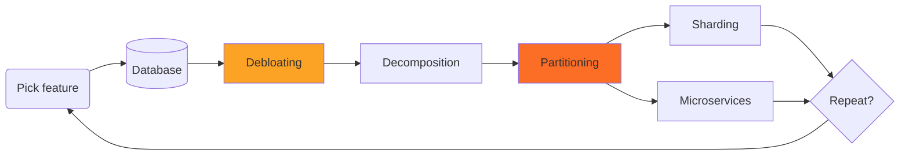

# Database Scalability: Limit on-disk table size to < 100 GB for GitLab.com

This document is a proposal to work towards reducing and limiting table sizes on GitLab.com. We establish a **measurable target** by limiting table size to a certain threshold. This is used as an indicator to drive database focus and decision making. With GitLab.com growing, we continuously re-evaluate which tables need to be worked on to prevent or otherwise fix violations.

This is not meant to be a hard rule but rather a strong indication that work needs to be done to break a table apart or otherwise reduce its size.

This is meant to be read in context with the [Database Sharding blueprint](https://gitlab.com/gitlab-org/gitlab/-/merge_requests/64115),
which paints the bigger picture. This proposal here is thought to be part of the "debloating step" below, as we aim to reduce storage requirements and improve data modeling. Partitioning is part of the standard tool-belt: where possible, we can already use partitioning as a solution to cut physical table sizes significantly. Both help to prepare efforts like decomposition (database usage is already optimized) and sharding (database is already partitioned along an identified data access dimension).

## Motivation: GitLab.com stability and performance

Large tables on GitLab.com are a major problem - for both operations and development. They cause a variety of problems:

1. **Query timings** and hence overall application performance suffers
1. **Table maintenance** becomes much more costly. Vacuum activity has become a significant concern on GitLab.com - with large tables only seeing infrequent (once per day) processing and vacuum runs taking many hours to complete. This has various negative consequences and a very large table has potential to impact seemingly unrelated parts of the database and hence overall application performance suffers.
1. **Data migrations** on large tables are significantly more complex to implement and incur development overhead. They have potential to cause stability problems on GitLab.com and take a long time to execute on large datasets.
1. **Indexes size** is significant. This directly impacts performance as smaller parts of the index are kept in memory and also makes the indexes harder to maintain (think repacking).
1. **Index creation times** go up significantly - in 2021, we see B-Tree creation take up to 6 hours for a single B-Tree index. This impacts our ability to deploy frequently and leads to vacuum-related problems (delayed cleanup).
1. We tend to add **many indexes** to mitigate, but this eventually causes significant overhead, can confuse the query planner and a large number of indexes is a smell of a design problem.

## Examples

Most prominently, the `ci_builds` table is 1.5 TB in size as of June 2021 and has 31 indexes associated with it which sum up to 1 TB in size. The overall on-disk size for this table is 2.5 TB. Currently, this grows at 300 GB per month. By the end of the year, this is thought to be close to 5 TB if we don't take measures against.

The following examples show that very large tables often constitute the root cause of incidents on GitLab.com.

1. Infrequent and long running vacuum activity has led to [repeated degradation of query performance for CI queuing](https://gitlab.com/gitlab-com/gl-infra/production/-/issues?label_name%5B%5D=Service%3A%3ACI+Runners&label_name%5B%5D=incident&scope=all&search=shared_runner_queues&state=all)
1. On large tables like `ci_builds`, index creation time varies between 1.5 to 6 hours during busy times. This process blocks deployments as migrations are being run synchronously - reducing our ability to deploy frequently.
1. Creating a large index can lead to a burst of activity on the database primary:
   1. on `merge_request_diff_commits` table: caused [high network saturation](https://gitlab.com/gitlab-com/gl-infra/production/-/issues/4823),
   1. regular reindexing activity on the weekend: causes [growing WAL queue](https://gitlab.com/gitlab-com/gl-infra/production/-/issues/4767) (impacts recovery objectives),
   1. `notes` table: Re-creating a GIN trigram index for maintenance reasons has become nearly unfeasible and had to be [aborted after 12 hours upon first try](https://gitlab.com/gitlab-com/gl-infra/production/-/issues/4633) as it was blocking other vacuum operation.

## Problematic tables on GitLab.com

This shows the TOP30 tables by their total size (includes index sizes) as of mid June 2021 on GitLab.com. `table_size, index_size` is the on-disk size of the actual data and associated indexes, respectively. `percentage_of_total_database_size` displays the ratio of total table size to database size.

As we can see, there are currently very large tables greater than 1 TB in size, which also tend to have very large indexes.

The other observation here is that there are also tables with a large number of indexes and total index size can be significantly larger than the data stored. For example, `deployments` is 30 GB in size plus additional 123 GB of index data spread across 24 indexes.

<!--
select tablename,
       pg_size_pretty(pg_total_relation_size(t.schemaname || '.' || t.tablename)) as total_size,
       pg_size_pretty(pg_relation_size(t.schemaname || '.' || t.tablename)) as table_size,
       pg_size_pretty(pg_indexes_size(t.schemaname || '.' || t.tablename)) as index_size,
       count(*) as index_count,
       round(pg_total_relation_size(t.schemaname || '.' || t.tablename) / pg_database_size('gitlabhq_production')::numeric * 100, 1) as percentage_of_total_database_size
from pg_indexes i
join pg_tables t USING (tablename)
group by 1,
         2,
         3,
         t.schemaname,
         t.tablename
order by pg_total_relation_size(t.schemaname || '.' || t.tablename) desc
limit 30;
-->

| Table                        | Total size | Table size | Index size | Index count | Percentage of total database size |
|------------------------------|------------|------------|------------|-------------|-----------------------------------|
| `ci_builds`                  | 2975 GB    | 1551 GB    | 941 GB     | 30          | 22.7                              |
| `merge_request_diff_commits` | 1890 GB    | 1454 GB    | 414 GB     | 2           | 14.4                              |
| `ci_build_trace_sections`    | 1123 GB    | 542 GB     | 581 GB     | 3           | 8.6                               |
| `notes`                      | 748 GB     | 390 GB     | 332 GB     | 13          | 5.7                               |
| `merge_request_diff_files`   | 575 GB     | 481 GB     | 88 GB      | 1           | 4.4                               |
| `events`                     | 441 GB     | 95 GB      | 346 GB     | 12          | 3.4                               |
| `ci_job_artifacts`           | 397 GB     | 187 GB     | 210 GB     | 10          | 3.0                               |
| `ci_pipelines`               | 266 GB     | 66 GB      | 200 GB     | 23          | 2.0                               |
| `taggings`                   | 238 GB     | 60 GB      | 179 GB     | 5           | 1.8                               |
| `ci_builds_metadata`         | 237 GB     | 88 GB      | 149 GB     | 5           | 1.8                               |
| `issues`                     | 219 GB     | 47 GB      | 150 GB     | 28          | 1.7                               |
| `web_hook_logs_202103`       | 186 GB     | 122 GB     | 8416 MB    | 3           | 1.4                               |
| `ci_stages`                  | 182 GB     | 58 GB      | 124 GB     | 6           | 1.4                               |
| `web_hook_logs_202105`       | 180 GB     | 115 GB     | 7868 MB    | 3           | 1.4                               |
| `merge_requests`             | 176 GB     | 44 GB      | 125 GB     | 36          | 1.3                               |
| `web_hook_logs_202104`       | 176 GB     | 115 GB     | 7472 MB    | 3           | 1.3                               |
| `web_hook_logs_202101`       | 169 GB     | 112 GB     | 7231 MB    | 3           | 1.3                               |
| `web_hook_logs_202102`       | 167 GB     | 111 GB     | 7106 MB    | 3           | 1.3                               |
| `sent_notifications`         | 166 GB     | 88 GB      | 79 GB      | 3           | 1.3                               |
| `web_hook_logs_202011`       | 163 GB     | 113 GB     | 7125 MB    | 3           | 1.2                               |
| `push_event_payloads`        | 162 GB     | 114 GB     | 48 GB      | 1           | 1.2                               |
| `web_hook_logs_202012`       | 159 GB     | 106 GB     | 6771 MB    | 3           | 1.2                               |
| `web_hook_logs_202106`       | 156 GB     | 101 GB     | 6752 MB    | 3           | 1.2                               |
| `deployments`                | 155 GB     | 30 GB      | 125 GB     | 24          | 1.2                               |
| `web_hook_logs_202010`       | 136 GB     | 98 GB      | 6116 MB    | 3           | 1.0                               |
| `web_hook_logs_202009`       | 114 GB     | 82 GB      | 5168 MB    | 3           | 0.9                               |
| `security_findings`          | 109 GB     | 21 GB      | 88 GB      | 8           | 0.8                               |
| `web_hook_logs_202008`       | 92 GB      | 66 GB      | 3983 MB    | 3           | 0.7                               |
| `resource_label_events`      | 66 GB      | 47 GB      | 19 GB      | 6           | 0.5                               |
| `merge_request_diffs`        | 63 GB      | 39 GB      | 22 GB      | 5           | 0.5                               |

## Target: All physical tables on GitLab.com are < 100 GB including indexes

NOTE:
In PostgreSQL context, a **physical table** is either a regular table or a partition of a partitioned table.

To maintain and improve operational stability and lessen development burden, we target a **table size less than 100 GB for a physical table on GitLab.com** (including its indexes). This has numerous benefits:

1. Improved query performance and more stable query plans
1. Significantly reduce vacuum run times and increase frequency of vacuum runs to maintain a healthy state - reducing overhead on the database primary
1. Index creation times are significantly faster (significantly less data to read per index)
1. Indexes are smaller, can be maintained more efficiently and fit better into memory
1. Data migrations are easier to reason about, take less time to implement and execute

This target is *pragmatic*: We understand table sizes depend on feature usage, code changes and other factors - which all change over time. We may not always find solutions where we can tightly limit the size of physical tables once and for all. That is acceptable though and we primarily aim to keep the situation on GitLab.com under control. We adapt our efforts to the situation present on GitLab.com and re-evaluate frequently.

While there are changes we can make that lead to a constant maximum physical table size over time, this doesn't need to be the case necessarily. Consider for example hash partitioning, which breaks a table down into a static number of partitions. With data growth over time, individual partitions also grow in size and may eventually reach the threshold size again. We strive to get constant table sizes, but it is acceptable to ship easier solutions that don't have this characteristic but improve the situation for a considerable amount of time.

As such, the target size of a physical table after refactoring depends on the situation and there is no hard rule for it. We suggest to consider historic data growth and forecast when physical tables reach the threshold of 100 GB again. This allows us to understand how long a particular solution is expected to last until the model has to be revisited.

## Solutions

There is no standard solution to reduce table sizes - there are many!

1. **Retention**: Delete unnecessary data, for example expire old and unneeded records.
1. **Remove STI**: We still use [single-table inheritance](../../../development/database/single_table_inheritance.md) in a few places, which is considered an anti-pattern. Redesigning this, we can split data into multiple tables.
1. **Index optimization**: Drop unnecessary indexes and consolidate overlapping indexes if possible.
1. **Optimize data types**: Review data type decisions and optimize data types where possible (example: use integer instead of text for an enum column)
1. **Partitioning**: Apply a partitioning scheme if there is a common access dimension.
1. **Normalization**: Review relational modeling and apply normalization techniques to remove duplicate data
1. **Vertical table splits**: Review column usage and split table vertically.
1. **Externalize**: Move large data types out of the database entirely. For example, JSON documents, especially when not used for filtering, may be better stored outside the database, for example, in object storage.

NOTE:
While we're targeting to limit physical table sizes, we consider retaining or improving performance a goal, too.

For solutions like normalization, this is a trade-off: Denormalized models can speed up queries when used appropriately, at the expense of table size. When normalizing models, splitting tables or externalizing data, we aim to understand the impact on performance and strive to find a solution to reduce table sizes that doesn't impact performance significantly.

### Example efforts

A few examples can be found below, many more are organized under the epic [Database efficiency](https://gitlab.com/groups/gitlab-org/-/epics/5585).

1. [Reduce number of indexes on `ci_builds`](https://gitlab.com/groups/gitlab-org/-/epics/6203)
1. [Normalize and de-duplicate committer and author details in `merge_request_diff_commits`](https://gitlab.com/gitlab-org/gitlab/-/issues/331823)
1. [Retention strategy for `ci_build_trace_sections`](https://gitlab.com/gitlab-org/gitlab/-/issues/32565#note_603138100)
1. [Implement worker that hard-deletes old CI jobs metadata](https://gitlab.com/gitlab-org/gitlab/-/issues/215646)
1. [`merge_request_diff_files` violates < 100 GB target](https://gitlab.com/groups/gitlab-org/-/epics/6215) (epic)

## Goal

The [epic for `~group::database`](https://gitlab.com/groups/gitlab-org/-/epics/6211) drives decision making to establish and communicate the target and to identify and propose necessary changes to reach it. Those changes should primarily be driven by the respective stage group owning the data (and the feature using it), with `~group::database` to support.

## Who

<!-- vale gitlab.Spelling = NO -->

Identifying solutions for offending tables is driven by the [GitLab Database Team](https://handbook.gitlab.com/handbook/engineering/infrastructure/core-platform/data_stores/database/) and respective stage groups.

| Role               | Who |
|--------------------|-----|
| Author             | Andreas Brandl |
| Engineering Leader | Craig Gomes |

<!-- vale gitlab.Spelling = YES -->
