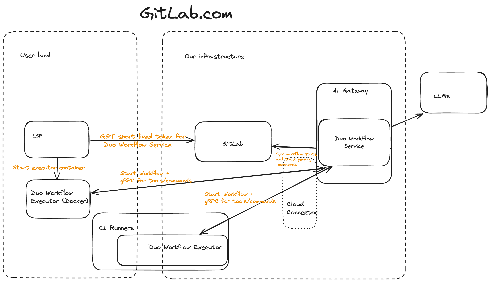
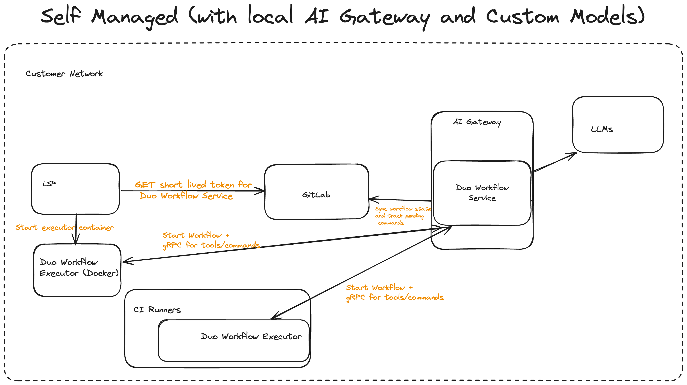
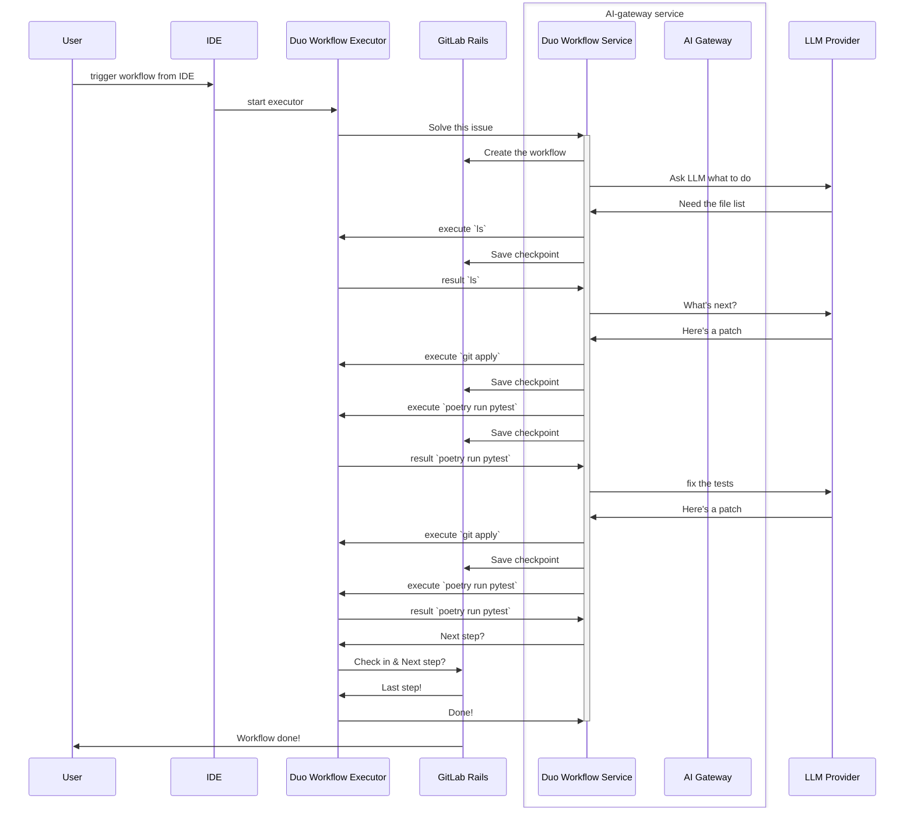

<!-- vale gitlab.FutureTense = NO -->

# GitLab Duo Workflow

## Execution Environment

### Executive Summary

The functionality to support Duo Workflow needs to be able to execute arbitrary code
which effectively means "untrusted" code. This means that they cannot just run
like any other service we deploy and specifically they cannot just run inside
the AI Gateway.

In order to address this the Duo Workflow functionality will be comprised of 2
separate components:

1. The Duo Workflow Service, which is a Python service we run in our
   infrastructure. The Workflow Service is built on top of
   [LangGraph](https://github.com/langchain-ai/langgraph).
1. The Duo Worklow Executor, which is a Go binary that communicates via long
   running gRPC connection to the Duo Workflow Service and executes the arbtitrary
   commands. It will be possible for users to run this locally or in CI pipelines.

In our first release we will support 2 execution modes:

1. Local Executor: which will run commands and edit files locally in a
   sandboxed Docker container on the developer machine. They will be able to
   see the files being edited live and it will be interactive
1. CI Executor: All non-local use-cases of Duo Workflow (for example:
   issue/epic based workflows) will be triggered by the GitLab UI and will
   create a CI Pipeline to run the Duo Workflow Executor

Our architecture will also support mixed deployments for self-managed such that
some features of Duo Workflow will be available using a cloud-hosted AI
Gateway.

### Detailed plan

We plan on building this feature set with 3 independent components that can be
run in multiple runtimes:

1. The Duo Workflow Web UI. This will be web UI built into GitLab that manages the
   creation and interaction of all workflows. There may be many interaction
   points in the GitLab application but there should be a central workflow UI
   with reusable components (e.g. Vue components) that could be embedded into
   our editor extensions
1. The Duo Workflow Service. This is a Python-based service we deploy with
   a gRPC API. The only interface to this is the gRPC interface, which is
   called from the Duo Workflow Executor. Internally, this will use LangGraph to
   execute the workflows. For reasons why LangGraph was chosen, see [this work item](https://gitlab.com/gitlab-org/gitlab/-/work_items/457958).
   The Workflow Service will not have any persisted state but the state of
   running workflows will be kept in memory and periodically checkpointed in
   GitLab. The Workflow Service is built into the existing
   [AI Gateway codebase](https://gitlab.com/gitlab-org/modelops/applied-ml/code-suggestions/ai-assist)
   but will have its own deployment. This deployment will take advantage of
Runway's [multiple deployments from one service repository](https://gitlab.com/gitlab-com/gl-infra/platform/runway/docs/-/blob/master/src/content/docs/guides/onboarding.md) feature.
1. The Duo Workflow Executor. This will be written in Go for easy installation
   in development containers. This component will run in CI jobs or on a user's
   local workstation. In the local workstation it will run sandboxed in a
   Docker container with the working directory optionally mounted by the
   user for a live pairing experience. It will only be responsible for opening
   a gRPC connection to Duo Workflow Service and executing the commands it is
   told to.

The following are important constraints of the architecture:

1. All state management for workflows will be inside GitLab.
1. Duo Workflow Service is expected to periodically checkpoint its state in GitLab
1. Duo Workflow Service in-memory state can be dropped/lost at any time so
   checkpointing will be the only guaranteed point that can be returned to
1. If a local Duo Workflow Executor drops the connection, the Duo Workflow
   Service will checkpoint and shutdown the state as soon as it runs into
   something where it is waiting on the executor
1. In order to avoid multiple Duo Workflow Service instances running on the
   same workflow, the Duo Workflow Service will always acquire a lock with
   GitLab before it starts running. When it suspends, it will release the lock and
   similarly there will be a timeout state if it has not checkpointed in the
   last 60 seconds. GitLab will not accept checkpoints from a timed out run of
   the Duo Workflow Service.
1. Each time a Duo Workflow Service resumes a workflow it gets a new ID and
   this is sent when checkpointing so that GitLab can drop/ignore zombie
   services running the workflow and inform the zombie service to shutdown.
1. Code is checkpointed by the executor pushing hidden Git refs to the GitLab
   instance. This will be happening on the same frequency as other checkpoints.
1. For local execution Duo Workflows are initiated using the Duo Workflow
   Executor directly calling Duo Workflow Service
1. For workflows triggered via the UI that don't require a Duo Workflow
   Executor GitLab can call the Duo Workflow Service directly
1. All API calls from Duo Workflow Service to GitLab that access private data
   or update data will be authenticated on behalf of the user that created the
   worklow. Duo Workflow Service should not need privileged access to GitLab

CI pipelines have been chosen as the hosted runtime option for Duo Workflow
Executor because it is the only infrastructure we have available today to run
untrusted customer workloads with stability, support, security, abuse
prevention and a billing model. In the short term for early customers we may
rely on the existing compute minutes for CI pipelines but in the long run we
may want to deploy dedicated runners and introduce a billing model specific for
Duo Workflow.

For many development use cases we expect developers may prefer to run Duo
Workflow Executor locally as it can operate on a locally mounted directory and
allow the user to more easily watch changes as they happen.

### High level architecture

#### Backend architecture

*(this PNG can be edited in Excalidraw)*

1. Initially we focus on running locally and in CI pipelines with all inputs as
   environment variables
1. State stored in GitLab so it can be accessed from the web UI and through IDE
   extensions

### Self-managed architecture

#### With local AI Gateway

When customers are running the AI Gateway locally the architecture will be very
similar to GitLab.com . This will also allow them to use whatever customer
models they configure in their AI Gateway.

#### With cloud AI Gateway

In order to allow self-managed customers to trial and rapidly adopt Duo
Workflow without running all AI Gateway components this architecture will
supported a mixed deployment mode. In this case we assume that the cloud AI
Gateway will not have access to the customers GitLab instance but we can make
use of the local executor (on the user's machine or in a CI runner) to proxy
all interactions with GitLab.

### Data flow

The below diagram shows what happens when the user is triggering workflows from
their IDE using a local executor. The architecture will be similar when
triggering from the GitLab UI using CI pipelines except that GitLab will start
a CI pipeline to create run the Duo Workflow Executor and create the workflow.

### CI Pipeline architecture

We don't want users to have to configure a specific `.gitlab-ci.yml` in order
to support Duo Workflow. In order to avoid this we'll use the same approach as
[that used by DAST site validations](https://gitlab.com/gitlab-org/gitlab/-/blob/19e0669446f55bd29a8df29174d3b0379b8e22c2/ee/app/services/app_sec/dast/site_validations/runner_service.rb#L11)
which dynamically constructs a pipeline configuration in GitLab and triggers
the pipeline without using any `.gitlab-ci.yml`.

CI Pipelines also must be run inside a project. There will be some usecases of
Duo Workflow where there is no appropriate project in which to run the pipeline
(e.g. bootstrapping a new project). For these workflows we will:

1. Initially require the user to have a default Workflow project created. It
   can just be any empty project and we'll automatically run the pipeline there.
1. If this proves to be too much setup we'll automate the creation of a default
   Duo Workflow project for you
1. If the UX is poor over time we might abstract the user away from the
   existence of the Project altogether and make this an implementation detail.
   This will be considered a last resort because it could be quite a wide
   impacting change to GitLab as projects are a central part of GitLab.

#### Considerations for CI Runners and Infrastructure

1. Our Duo Workflow rollout may involve substantial increases to our CI runner
   usage
1. Duo Workflow will likely involve running long running CI pipelines that use
   very little CPU. Mostly what they will be doing is communicating back
   and forth with the LLMs and users in a long running gRPC connection.
1. Users will expect very low latency for CI Runner startup
   1. We should determine if there are ways to have preloaded VMs with our
      Docker images running ready to start a pipeline when it a
      workflow is triggered
1. We likely want a set of CI Runners that are just for Duo Workflow. This may
   mean enabling the runners to a subset of customers or just using appropriate
   job labeling/runner matching to only use these runners for Duo Workflow
1. It might be possible to roll out some Duo Workflow features on our existing
   runner fleets but we believe there will be enough benefits to invest in
   segregating these runners.

### State checkpointing

The Duo Workflow state will be persisted in GitLab-Rails as the Duo Workflow
Service works. There are 2 components to state:

1. The State object being managed by Langgraph. This includes all prompt history
   between user and agents and any other metadata created by the LangGraph
   graph
1. The working directory where the agent is writing code.
1. We will have data retention limits on all state. We will use PostgreSQL
   partitioning to drop old workflow data after some time and we will also
   drop old Git refs after some time.

We will be persisting the LangGraph state object using APIs in GitLab to
persist this state to PostgreSQL as it goes. The API will use similar LangGraph
conventions to identify all checkpoints with a `thread_ts` as implemented in
the POC <https://gitlab.com/gitlab-org/gitlab/-/merge_requests/153551>.

For the current working directory which contains the code the agent has written
so far we will store this by pushing hidden Git refs to GitLab for the checkpoint. Each
checkpoint will have an associated ref and a checkpoint naming convention (or
something stored in PostgreSQL) will allow us to identify the appropriate Git ref
for the state checkpoint.

Storing in Git has the advantage that we don't need to build any new API for
storing artifacts and it's very easy for the user to access the code by just
checking out that SHA. It also has huge storage savings where a workflow is
working on an existing large project. Ultimately we expect code changes end up
being pushed to Git anyway so this is the simplest solution.

Some Duo Workflows do not have an existing project (e.g. bootstrapping a
project). Even those workflows will need to be triggered from some project (as
explained in the section about CI piplelines). As such we can use the workflow
project as a temporary repository to store the snapshots of code generated by
the workflow.

Consideration should also be made to cleanup Git refs over time after some
workflow expiration period.

### Authentication

Duo Workflow requires several authentication flows.

In this section, each connection that requires authentication is listed and the
authentication mechanism is discussed.

#### Local Duo Workflow Executor -> Duo Workflow Service (AI Gateway)

When a Duo Workflow starts, the Duo Workflow Executor must connect to the AI Gateway.

To authenticate this connection:

1. The IDE will use the OAuth token of Personal Access Token (PAT) that the user
   generated while setting up the GitLab editor extension.
1. The IDE uses that token to authenticate a request to a GitLab Rails API
   endpoint to obtain a short-lived user- and system-scoped JWT.
1. When the GitLab Rails instance receives this request, it loads its
   instance-scoped JWT (synced daily from CustomersDot) and contacts the AI
   gateway to swap this instance token for the above-mentioned user-scoped token
   (also cryptographically signed)
1. GitLab Rails returns this JWT to the IDE.
1. The IDE passes on this JWT to the local Duo Workflow Executor component.
1. The Duo Workflow Executor uses this JWT to authenticate the Duo Workflow
   Service gRPC connection.

This flow mimics the
[token flow that allows IDEs to connect direct to the AI Gateway](https://gitlab.com/groups/gitlab-org/-/epics/13252).

#### CI Duo Workflow Executor -> Duo Workflow Service (AI Gateway)

When a Duo Workflow is executed by a CI Runner, the Duo Workflow Executor must
connect to the AI Gateway.

A CI Pipeline is created by GitLab, so there is no need to query a GitLab Rails
API endpoint to obtain a short-lived user- and system-scoped JWT. Instead, in
the process of creating the CI pipeline, GitLab Rails will:

1. Generate the user-scoped JWT.
1. Inject the JWT as an environment variable (for example: `DUO_WORKFLOW_TOKEN`)
   in the CI pipeline.
1. The Duo Workflow Executor running inside the CI job uses this environment
   variable value to authenticate the Duo Workflow Service gRPC connection.

#### Duo Workflow Service (AI Gateway) -> GitLab Rails API

Reasons that the AI Gateway must be able to authenticate requests to the GitLab Rails API:

1. The Duo Workflow Service will need to periodically make requests to GitLab Rails
   to sync workflow state. This means that the AI Gateway must be able to
   authenticate these requests.
1. Duo Workflow may need to make other GitLab Rails API queries to gather
   context. For example, a Duo Workflow for "solve issue with code" would
   require an API request to retrieve the issue content.
1. The end state of a Duo Workflow may take the form of a generated artifact
   (for example, Git commit or pull request) on the GitLab platform. To
   generate this artifact, the AI Gateway must be able to make API requests to
   GitLab Rails.

Requirements for the token used to authenticate requests from the AI Gateway to
the GitLab Rails API:

1. Any artifacts created by a Duo Workflow must be auditable in order
   to maintain transparency about AI-generated activities on the GitLab platform.
1. The token's access level must match the access level of the user who
   initiated the Workflow to ensure that there is no privilege escalation.
1. We must have the ability to block read/write for all resources that belong to
   instances/projects/groups with `duo_features_enabled` set to false.
1. Token must be valid for as long as it takes an agent to execute or be
   refreshable by the AI Gateway. Workflow execution may take several hours.

The JWT that the Workflow Executor uses to authenticate to the AI Gateway could
potentially be adapted to also work for this use-case but has some problems:

1. Need to update GitLab Rails to accept this type of token for API authentication.
1. JWTs are not revocable; what if we need to cut off an agent's access?
1. Need to build token rotation. How would the AI Gateway authenticate an API
   request to generate a new token if the old JWT is already expired?

For these reasons, OAuth is a better protocol for this use-case. OAuth tokens:

1. Are only valid for 2 hours.
1. Can be revoked.
1. Have a built-in refresh flow.
1. Are an established authentication pattern for federating access between
   services.

To use OAuth, we will:

1. Create a new token scope called `ai_workflows` ([related issue](https://gitlab.com/gitlab-org/gitlab/-/issues/467160))
1. Create a new API endpoint in GitLab Rails that accepts the JWT.
1. That endpoint will generate an OAuth token with the `ai_workflows` scope.
1. The AI Gateway will exchange the user-scoped JWT for a user-scoped
   `ai_workflows` OAuth token.
1. Use the OAuth token for any GitLab Rails API Requests to read or write data
   for a Workflow.

### Options we've considered and pros/cons

#### Delegate only unsafe execution to local/CI pipelines

This was the option we chose. It attempts to keep as much of the functionality
as possible in services we run while delegating the unsafe execution to Duo
Workflow Executor which can run locally or in CI pipelines.

**Pros**:

1. Running the infrastructure ourselves gives us more control over the versions
   being rolled out
1. There is less dependencies the user needs to install for local usage
1. It offers a rapid onboarding experience for self-managed customers to try
   Duo Workflow without deploying any new GitLab components

**Cons**

1. We need to deploy and maintain new infrastructure which has different
   scaling characteristics to other services we run duo to long running
   execution

#### Run it locally

**Pros**:

1. This keeps developers in their local environment where most of them work
1. Compute is absorbed by the local developer so they don't have to worry about
   being billed per minute
1. Low latency for user interaction especially where the user needs to
   review/edit code while the agent is working

**Cons**:

1. There are more risks running it locally unless you have an isolated
   development environment as commands have full access to your computer. This
   can be mitigated by UX that limits what commands the agent can run without
   user confirmation.
1. This approach will require some local developer setup and may not be suited
   to tasks that users are expecting to kick off from the web UI (e.g.
   issue/epic planning)

#### CI pipelines (on CI runners)

See <https://gitlab.com/gitlab-org/gitlab/-/issues/457959> for a POC and investigation.

**Pros**:

1. CI pipelines are the only pre-configured infrastructure we have that can run untrusted workflows
1. We have an established billing model for CI minutes

**Cons**:

1. CI pipelines are slow to start up and this might mean that iteration and incremental AI development might be slow if the pipelines need to be restarted while timing out waiting for user input
1. CI minutes will need to be consumed while the agent is awaiting for user input. This will likely require a timeout mechanism and as such if the user returns we'll need to restart a new pipeline when they give input
1. CI pipelines run in a difficult to access environment (ie. you cannot SSH it or introspect it live) and as such it may make it difficult for users to interact with code that is being built out live in front of them without
1. CI pipelines require there to be some project to run in. This is not likely something we can overcome but we may be able to simplify the setup process by automatically creating you a "workflow project" for your workflow pipelines to run in
1. When we implement non-code workflows (e.g. reviewing MRs) there is no need for an isolated compute environment but we'll still be forcing customers to use compute minutes. We've seen this is not a good experience in other cases like X-Ray reports

#### GitLab workspaces (remote development)

See <https://gitlab.com/gitlab-org/gitlab/-/issues/458339> for a POC and investigation.

**Pros**:

1. This has the fastest iteration cycle as the agent is working locally in your development environment and can interact with you and you can even see and edit the same files live as them
1. Customers can run it on their own infrastructure and this gives them control over efficient resource usage

**Cons**:

1. Today we only support customers bringing their own infrastructure (K8s cluster) and this means that the barrier to getting started is to bring your own K8s cluster and this is a fairly significant effort
1. If we wanted to build out infrastructure on GitLab.com to save customers having to bring their own K8s cluster this would be a fairly large effort from a security and infrastructure perspective. It's possible but to deal with all the complexities of security, abuse and billing would require many teams involvement in both initial development and sustained maintenance.

## Security

### Threat modeling

See <https://gitlab.com/gitlab-com/gl-security/product-security/appsec/threat-models/-/issues/46>.

### Security considerations for local execution

Local execution presents the highest value opportunity for developers but also
comes with the greatest risk that a bug or mistake from an LLM could lead to
causing significant harm to a user's local development environment or
compromise confidential information.

Some examples of risks:

1. An AI that can make honest but significant mistakes
1. An AI that might sometimes be adversarial
1. The AI gateway serving the LLM responses may be compromised which would then
   allow shell access to all users of this tool

### Sandboxing Duo Workflow Executor

One proposal here to mitigate risks would be to use some form of sandboxing
where the Duo Workflow Executor is only able to run inside of an unprivileged
Docker container. Such a solution would need to:

1. Mount the local working directory into the container so it is still editing
   the files the user is working on in the host
1. Install all development dependencies the user or agent would need to run the
   application and tests

The above option may also make use of Dev Containers.

### User confirmation for commands

Another option for limiting the risk is to require the user to confirm every
command the agent executes before it runs the command. We will likely be
implementing this as an option anyway but given the desire for efficient
development of larger workflows it might limit the efficiency of the tool if it
needs to execute a lot of commands to finish a task.

We may also consider a hybrid approach where there a set of user-defined
allowlisted commands (e.g. `ls` and `cat`) which allow the agent to read and
learn about a project without the user needing to confirm. This approach may
not solve all needs though where the user may want to allowlist commands like
`rspec` which then effectively still allow for arbitrary code execution as the
agent can put whatever they want in the spec file.

## Duo Workflow UI

The Duo Workflow UI will need to be available at least in the following places:

1. In GitLab Rails web UI
1. In our editor extensions

The fact that we'll need multiple UIs and also as described above we have
multiple execution environments for Duo Workflow Executor have led to the
following decisions.

### How do we package and run the local web UI

We will build the majority of data access related to our local IDE UI into the
[GitLab Language Server](https://gitlab.com/gitlab-org/editor-extensions/gitlab-lsp)
to maximize re-use across all our editor extensions. We will also employ a mix
of webviews rendered in the IDE and served by the LSP as well as native IDE UI
elements. Where it doesn't considerably limit our user experience we'll opt to
build the interface into a web page served from the LSP and then rendered in
the IDE as a web view because this again maximises re-use across all our editor
extensions.

### How does the web UI reflect the current state live

The Duo Workflow Service will persist it's state frequently to the main GitLab Rails
application. There will be GraphQL subscriptions for streaming updates about a
workflow. The UI will consume these GraphQL apis and update the UI as
updates stream in.

Given that the user may be running the Duo Workflow Executor locally which may
be seeing some of the state as it happens it might be reasonable to want to
just live render the in-memory state of the running workflow process. We may
choose this optional deliberately for latency reasons but we need to be careful
to architect the frontend and Duo Workflow Executor as completely decoupled
because they will not always be running together. For example users may trigger
a workflow locally which runs in GitLab CI or they may be using the web UI to
interact with and re-run a workflow that was initiated locally.

As such we will generally prefer not to have direct interaction between the UI
and Executor but instead all communication should be happening via GitLab. Any
exceptions to this might be considered case by case but we'll need clear API
boundaries which allow the functionality to easily be changed to consume from
GitLab for the reasons described.

## Duo Workflow Agent's tools

Duo Workflow **agents** are, in a simplified view, a pair of: **prompt** and **LLM**.
By this definition, agents on their own are not able to interact with the outside world,
which significantly limits the scope of work that can be automated. To overcome this limitation, agents are being equipped with **tools**.

Tools are functions that agents can invoke using the [function calling](https://docs.anthropic.com/en/docs/tool-use) LLM feature.
These functions perform different actions on behalf of the agent. For example, an agent might be equipped with a tool (function)
that executes bash commands like `ls` or `cat` and returns the result of those bash commands back to the agent.

The breadth of the tool set available to **agents** defines the scope of work that can be automated. Therefore, to
set up the Duo Workflow feature for success, it will be required to deliver a broad and exhaustive tool set.

Foreseen tools include:

1. Tools to execute bash commands via the Duo Workflow Executor
1. Tools to manipulate files (including reading and writing to files)
1. Tools to manipulate Git VCS
1. Tools to integrate with the [GitLab HTTP API](../../../api/api_resources.md)

The fact that the Duo Workflow Service is going to require Git and GitLab API tools entails that the **Duo Workflow Service
must have the ability to establish an SSH connection and make HTTP requests to the GitLab instance.** This ability can be granted directly to the Duo Workflow Service or can be provided via the Duo Workflow Executor if a direct connection between the Duo Workflow Service and a GitLab instance is not possible due to a firewall or network partition.

## Milestones

1. All the components implemented and communicating correctly with only a
   trivial workflow implemented
1. Checkpointing code as well as LangGraph state
1. Workflow locking in GitLab to ensure only 1 concurrent instance of a
   workflow
1. Add more workflows and tools
1. Ability to resume a workflow

## POC - Demos

1. [POC: Solve issue (internal only)](https://www.youtube.com/watch?v=n1mpFirme4o)
1. [POC: Duo Workflow in Workspaces (internal only)](https://youtu.be/x7AxYwiQayg)
1. [POC: Autograph using Docker Executor (internal only)](https://www.youtube.com/watch?v=V-Mw6TXOkKI)
1. [POC: Duo Workflows in CI pipelines with timeout and restart (internal only)](https://youtu.be/v8WWZuAGXMU)
