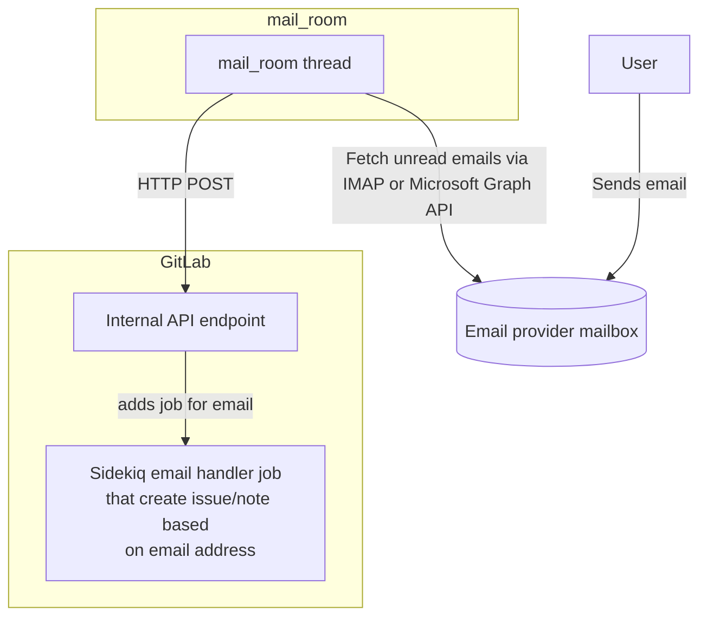
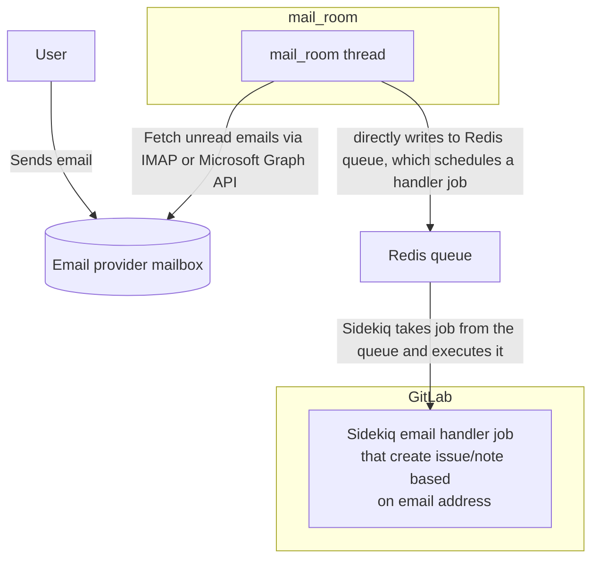
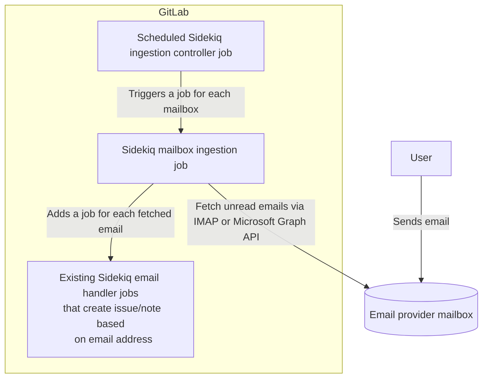

<!-- vale gitlab.FutureTense = NO -->
<!-- vale gitlab.CurrentStatus = NO -->

# Replace `mail_room` email ingestion with scheduled Sidekiq jobs

## Summary

GitLab users can submit new issues and comments via email. Administrators configure special mailboxes that GitLab polls on a regular basis and fetches new unread emails. Based on the slug and a hash in the sub-addressing part of the email address, we determine whether this email will file an issue, add a Service Desk issue, or a comment to an existing issue.

Right now emails are ingested by a separate process called `mail_room`. We would like to stop ingesting emails via `mail_room` and instead use scheduled Sidekiq jobs to do this directly inside GitLab.

This lays out the foundation for [custom email address ingestion for Service Desk](https://gitlab.com/gitlab-org/gitlab/-/issues/329990), detailed health logging and makes it easier to integrate other service provider adapters (for example Gmail via API). We will also reduce the infrastructure setup and maintenance costs for customers on self-managed and make it easier for team members to work with email ingestion in GDK.

## Glossary

- Email ingestion: Reading emails from a mailbox via IMAP or an API and forwarding it for processing (for example create an issue or add a comment)
- Sub-addressing: An email address consist of a local part (everything before `@`) and a domain part. With email sub-addressing you can create unique variations of an email address by adding a `+` symbol followed by any text to the local part. You can use these sub-addresses to filter, categorize or distinguish between them as all these emails will be delivered to the same mailbox. For example `user+subaddress@example.com` and `user+1@example.com` and sub-addresses for `user@example.com`.
- `mail_room`: [An executable script](https://gitlab.com/gitlab-org/ruby/gems/gitlab-mail_room) that spawns a new process for each configured mailbox, reads new emails on a regular basis and forwards the emails to a processing unit.
- [`incoming_email`](../../../administration/incoming_email.md): An email address that is used for adding comments and issues via email. When you reply on a GitLab notification of an issue comment, this response email will go to the configured `incoming_email` mailbox, read via `mail_room` and processed by GitLab. You can also use this address as a Service Desk email address. The configuration is per instance and needs full IMAP or Microsoft Graph API credentials to access the mailbox.
- [`service_desk_email`](../../../user/project/service_desk/configure.md#use-an-additional-service-desk-alias-email): Additional alias email address that is only used for Service Desk. You can also use an address generated from `incoming_email` to create Service Desk issues.
- `delivery_method`: Administrators can define how `mail_room` forwards fetched emails to GitLab. The legacy and now deprecated approach is called `sidekiq`, which directly adds a new job to the Redis queue. The current and recommended way is called `webhook`, which sends a POST request to an internal GitLab API endpoint. This endpoint then adds a new job using the full framework for compressing job data etc. The downside is, that `mail_room` and GitLab need a shared key file, which might be challenging to distribute in large setups.

## Motivation

The current implementation lacks scalability and requires significant infrastructure maintenance. Additionally, there is a lack of [proper observability for configuration errors](https://gitlab.com/gitlab-org/gitlab/-/issues/384530) and [overall system health](https://gitlab.com/groups/gitlab-org/-/epics/9407). Furthermore, [setting up and providing support for multi-node Linux package (Omnibus) installations](https://gitlab.com/gitlab-org/gitlab/-/issues/391859) is challenging, and periodic email ingestion issues necessitate reactive support.

Because we are using a fork of the `mail_room` gem ([`gitlab-mail_room`](https://gitlab.com/gitlab-org/ruby/gems/gitlab-mail_room)), which contains some GitLab specific features that won't be ported upstream, we have a noteable maintenance overhead.

The [Service Desk Single-Engineer-Group (SEG)](https://handbook.gitlab.com/handbook/engineering/development/incubation/service-desk/) started work on [customizable email addresses for Service Desk](https://gitlab.com/gitlab-org/gitlab/-/issues/329990) and [released the first iteration in beta in `16.4`](https://about.gitlab.com/releases/2023/09/22/gitlab-16-4-released/#custom-email-address-for-service-desk). As a [MVC we introduced a `Forwarding & SMTP` mode](https://gitlab.com/gitlab-org/gitlab/-/issues/329990#note_1201344150) where administrators set up email forwarding from their custom email address to the projects' `incoming_mail` email address. They also provide SMTP credentials so GitLab can send emails from the custom email address on their behalf. We don't need any additional email ingestion other than the existing mechanics for this approach to work.

As a second iteration we'd like to add Microsoft Graph support for custom email addresses for Service Desk as well. Therefore we need a way to ingest more than the system defined two addresses. We will explore a solution path for Microsoft Graph support where privileged users can connect a custom email account and we can [receive messages via a Microsoft Graph webhook (`Outlook message`)](https://learn.microsoft.com/en-us/graph/change-notifications-overview#supported-resources). GitLab would need a public endpoint to receive updates on emails. That might not work for Self-managed instances, so we'll need direct email ingestion for Microsoft customers as well. But using the webhook approach could improve performance and efficiency for GitLab SaaS where we potentially have thousands of mailboxes to poll.

### Goals

Our goals for this initiative are to enhance the scalability of email ingestion and slim down the infrastructure significantly.

1. This consolidation will eliminate the need for setup for the separate process and pave the way for future initiatives, including direct custom email address ingestion (IMAP & Microsoft Graph), [improved health monitoring](https://gitlab.com/groups/gitlab-org/-/epics/9407), [data retention (preserving originals)](https://gitlab.com/groups/gitlab-org/-/epics/10521), and [enhanced processing of attachments within email size limits](https://gitlab.com/gitlab-org/gitlab/-/issues/406668).
1. Make it easier for team members to develop features with email ingestion. [Right now it needs several manual steps.](https://gitlab.com/gitlab-org/gitlab-development-kit/-/blob/main/doc/howto/service_desk_mail_room.md)

### Non-Goals

This blueprint does not aim to lay out implementation details for all the listed future initiatives. But it will be the foundation for upcoming features (customizable Service Desk email address IMAP/Microsoft Graph, health checks etc.).

We don't include other ingestion methods. We focus on delivering the current set: IMAP and Microsoft Graph API for `incoming_email` and `service_desk_email`.

## Current setup

Administrators configure settings (credentials and delivery method) for email mailboxes (for [`incoming_email`](../../../administration/incoming_email.md) and [`service_desk_email`](../../../user/project/service_desk/configure.md#use-an-additional-service-desk-alias-email)) in `gitlab.rb` configuration file. After each change GitLab needs to be reconfigured and restarted to apply the new settings.

We use the separate process `mail_room` to ingest emails from those mailboxes. `mail_room` spawns a thread for each configured mailbox and polls those mailboxes every minute. In the meantime the threads are idle. `mail_room` reads a configuration file that is generated from the settings in `gitlab.rb`.

`mail_room` can connect via IMAP and Microsoft Graph, fetch unread emails, and mark them as read or deleted (based on settings). It takes an email and distributes it to its destination via one of the two delivery methods.

### `webhook` delivery method (recommended)

The `webhook` delivery method is the recommended way to move ingested emails from `mail_room` to GitLab. `mail_room` posts the email body and metadata to an internal API endpoint `/api/v4/internal/mail_room`, that selects the correct handler worker and schedules it for execution.

### `sidekiq` delivery method (deprecated since 16.0)

The `sidekiq` delivery method adds the email body and metadata directly to the Redis queue that Sidekiq uses to manage jobs. It has been [deprecated in 16.0](../../../update/deprecations.md#sidekiq-delivery-method-for-incoming_email-and-service_desk_email-is-deprecated) because there is a hard coupling between the delivery method and the Redis configuration. Moreover we cannot use Sidekiq framework optimizations such as job payload compression.

## Proposal

**Use Sidekiq jobs to poll mailboxes on a regular basis (every minute, maybe configurable in the future).
Remove all other legacy email ingestion infrastructure.**

1. Use a `controller` job that is scheduled every minute or every two minutes. This job adds one job for each configured mailbox (`incoming_email` and `service_desk_email`).
1. The concrete `ingestion` job polls a mailbox (IMAP or Microsoft Graph), downloads unread emails and adds one job for each email that processes the email. We decide based on the used `To` email address which email handler should be used.
1. The `existing email handler` jobs try to create an issue, a Service Desk issue or a note on an existing issue/merge request. These handlers are also used by the legacy email ingestion via `mail_room`.

### Sidekiq jobs and job payload size optimizations

We implemented a size limit for Sidekiq jobs and email job payloads (especially emails with attachments) are likely to pass that bar. We should experiment with the idea of handling email processing directly in the Sidekiq mailbox ingestion job. We could use an `ops` feature flag to switch between this mode and a Sidekiq job for each email.

We'd also like to explore a solution path where we only fetch the message ids and then download the complete messages in child jobs (filter by `UID` range for example). For example we poll a mailbox and fetch a list of message ids. Then we create a new job for every 25 (or n) emails that takes the message ids or the range as an argument. These jobs will then download the entire messages and synchronously add issues or replies. If the number of emails is below 25, we could even handle the emails directly in the current job to save resources. This will allow us to eliminate the job payload size as the limiting factor for the size of emails. The disadvantage is that we need to make two calls to the IMAP server instead of one (n+1).

## Execution plan

1. Add deprecation for `mail_room` email ingestion.
1. Strip out connection-specific logic from [`gitlab-mail_room` gem](https://gitlab.com/gitlab-org/ruby/gems/gitlab-mail_room), into a new separate gem. `mail_room` and other clients could use our work here. Right now we support IMAP and Microsoft Graph API connections.
1. Add new jobs (set idempotency and de-duplication flags to avoid a huge backlog of jobs if Sidekiq isn't running).
1. Add a setting (`gitlab.rb`) that enables email ingestion with Sidekiq jobs inside GitLab. We need to set `mailroom['enabled'] = false` in `gitlab.rb` to disable `mail_room` email ingestion. Maybe additionally add a feature flag.
1. Use on `gitlab.com` before general availability, but allow self-managed to try it out in `beta`.
1. Once rolled out in general availability and when removal has been scheduled, remove the dependency to `gitlab-mail_room` entirely, remove the internal API endpoint `api/internal/mail_room`, remove `mail_room.yml` dynamically generated static configuration file for `mail_room` and other configuration and binaries.

## Change management

We decided to [deprecate the `sidekiq` delivery method for `mail_room` in GitLab 16.0](../../../update/deprecations.md#sidekiq-delivery-method-for-incoming_email-and-service_desk_email-is-deprecated) and scheduled it for removal in GitLab 17.0.
We can only remove the `sidekiq` delivery method after this blueprint has been implemented and our customers can use the new email ingestion in general availability.

We should then schedule `mail_room` for removal (GitLab 17.0 or later). This will be a breaking change. We could make the new email ingestion the default beforehand, so self-managed customers wouldn't need to take action.

## Alternative Solutions

### Do nothing

The current setup limits us and only allows to fetch two email addresses. To publish Service Desk custom email addresses with IMAP or API integration we would need to deliver the same architecture as described above. Because of that we should act now and include general email ingestion for `incoming_email` and `service_desk_email` first and remove the infrastructure overhead.

## Additional resources

- [Meta issue for this design document](https://gitlab.com/gitlab-org/gitlab/-/issues/393157)

## Timeline

- 2023-09-26: The initial version of the blueprint has been merged.
